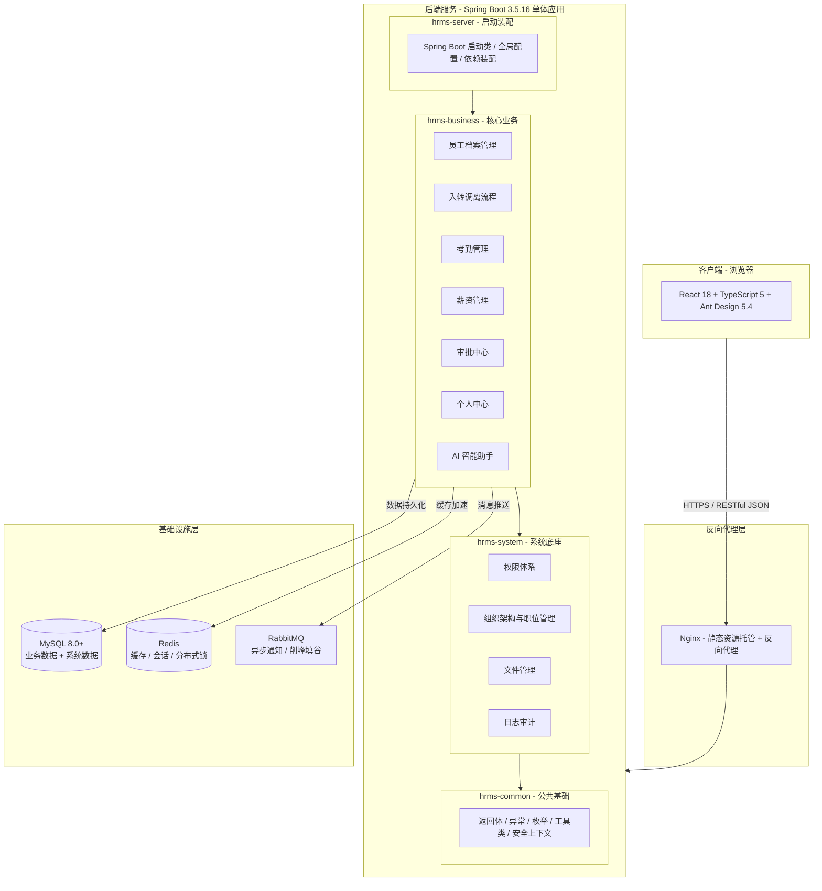
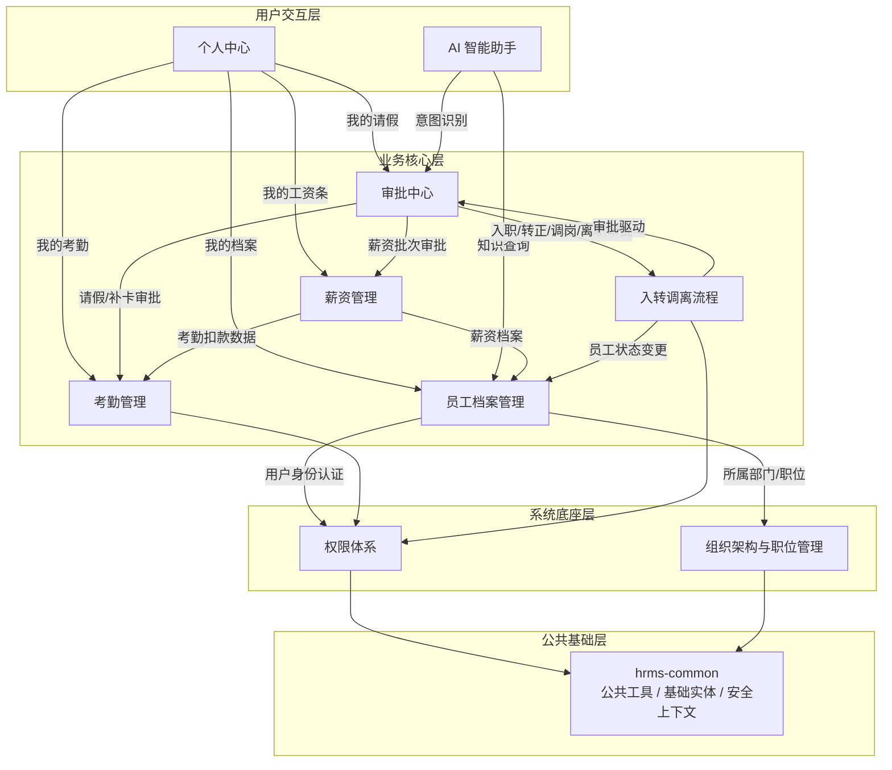

# HRMS 全局系统分析说明书
| 文档版本 | 修改日期 | 修改人 | 修改内容 |
| --- | --- | --- | --- |
| V1.0 | 2026-07-11 | 系统分析员 | 初稿创建 |


---

## 1. 文档概述
### 1.1 文档目的
本文档为 HRMS（人资管理系统）的全局系统分析说明书，从全局视角定义系统的总体架构、模块划分、公共技术设计和非功能性设计。本文档是后端总体系统分析说明书、前端总体系统分析说明书和测试分析说明书的上位指导文档，各专项文档需与本文档保持一致。

### 1.2 参考资料清单
本文档参考以下 21 份资料编写：

| 序号 | 文档类型 | 文档名称 | 负责人 | 是否必读 |
| :---: | --- | --- | --- | :---: |
| 1 | 产品需求文档 | 人资管理系统（HRMS）详细产品规格说明书.pdf | 产品经理 | 必读 |
| 2 | 总体系分 | 前端总体系统分析说明书 | 系统分析员 | 必读 |
| 3 | 总体系分 | 后端总体系统分析说明书 | 系统分析员 | 必读 |
| 4 | 模块系分 | 员工档案管理-前端系分文档 | 系统分析员 | 参考 |
| 5 | 模块系分 | 员工档案管理-后端系分文档 | 系统分析员 | 参考 |
| 6 | 模块系分 | 入转调离流程-前端系分文档 | 系统分析员 | 参考 |
| 7 | 模块系分 | 入转调离流程-后端系分文档 | 系统分析员 | 参考 |
| 8 | 模块系分 | 考勤管理-前端系分文档 | 系统分析员 | 参考 |
| 9 | 模块系分 | 考勤管理-后端系分文档 | 系统分析员 | 参考 |
| 10 | 模块系分 | 薪资管理-前端系分文档 | 系统分析员 | 参考 |
| 11 | 模块系分 | 薪资管理-后端系分文档 | 系统分析员 | 参考 |
| 12 | 模块系分 | 权限体系-前端系分文档 | 系统分析员 | 参考 |
| 13 | 模块系分 | 权限体系-后端系分文档 | 系统分析员 | 参考 |
| 14 | 模块系分 | 组织架构与职位管理-前端系分文档 | 系统分析员 | 参考 |
| 15 | 模块系分 | 组织架构与职位管理-后端系分文档 | 系统分析员 | 参考 |
| 16 | 模块系分 | 审批中心-前端系分文档 | 系统分析员 | 参考 |
| 17 | 模块系分 | 审批中心-后端系分文档 | 系统分析员 | 参考 |
| 18 | 模块系分 | 个人中心-前端系分文档 | 系统分析员 | 参考 |
| 19 | 模块系分 | 个人中心-后端系分文档 | 系统分析员 | 参考 |
| 20 | 模块系分 | AI 智能助手-前端系分文档 | 系统分析员 | 参考 |
| 21 | 模块系分 | AI 智能助手-后端系分文档 | 系统分析员 | 参考 |


### 1.3 参与人员
| 角色 | 姓名 | 职责 |
| --- | --- | --- |
| 产品经理(PD) | — | 需求定义与验收 |
| 后端技术 | — | 后端系分与开发 |
| 前端技术 | — | 前端开发 |
| 质量(QA) | — | 测试用例与质量保障 |


---

## 2. 项目背景与目标
### 2.1 业务背景
目前公司内部人力资源管理依赖 Excel 和纸质流程，存在以下痛点：

| 业务领域 | 现状问题 |
| --- | --- |
| 员工档案 | 数据分散在多个 Excel 中，更新不及时，权限控制粗放 |
| 入转调离 | 流程依赖纸质审批单，不透明、效率低、易出错 |
| 考勤管理 | 依赖纸质签到与 Excel 统计，请假审批不规范，数据难以追溯 |
| 薪资核算 | Excel 模板手工计算，效率低，考勤数据未自动打通 |
| 审批中心 | 各模块审批逻辑分散，审批人缺乏统一工作台 |
| 个人信息 | 员工查看工资条、修改个人信息均需依赖 HR 协助 |


本系统旨在建立统一的人力资源数字化管理平台，实现员工全生命周期管理线上化、流程化、规范化。

### 2.2 核心目标
| 目标 | 说明 |
| --- | --- |
| 统一员工主数据 | 建立员工核心实体定义，实现工号自动生成、系统账号自动创建，确保数据唯一性 |
| 流程线上化 | 实现入职、转正、调岗、离职、请假等流程的全程线上化，审批节点可追溯 |
| 统一审批引擎 | 建立模板驱动的统一审批流转机制，各业务模块复用审批能力 |
| 细粒度权限控制 | 提供基于角色的数据权限（四级范围）与字段级权限控制 |
| 自动化薪资核算 | 自动拉取考勤、请假数据，按账套公式计算薪资，异常自动预警 |
| 跨模块协同 | 各模块通过模块间服务接口紧密协作，确保数据一致性 |


### 2.3 系统用户角色
| 角色 | 数据范围 | 核心职责 | 使用频率 |
| --- | --- | --- | --- |
| 系统管理员 | 全平台 | 系统配置、角色管理、数据备份 | 低频 |
| HR 专员 | 全部员工 | 员工管理、薪资核算、考勤管理、审批管理 | 每日 |
| 部门主管 | 本部门及下属 | 团队人员查看、下属请假/转正/调岗/离职审批 | 每日 |
| 财务专员 | 薪资相关 | 薪资审核、成本报表查看 | 每月 |
| 普通员工 | 仅本人 | 个人信息查看、提交请假、查看工资条 | 每周 |


### 2.4 功能权限矩阵
| 功能模块 | 系统管理员 | HR 专员 | 部门主管 | 财务专员 | 普通员工 |
| --- | :---: | :---: | :---: | :---: | :---: |
| 员工档案（全量） | ✓ | ✓ | — | — | — |
| 员工档案（本部门） | ✓ | ✓ | ✓ | — | — |
| 员工档案（仅自己） | ✓ | ✓ | ✓ | ✓ | ✓ |
| 薪资信息（全量） | — | ✓ | — | ✓ | — |
| 薪资信息（仅自己） | — | — | — | — | ✓ |
| 组织架构管理 | ✓ | ✓ | — | — | — |
| 考勤管理 | ✓ | ✓ | 本部门 | — | 仅自己 |
| 审批管理 | ✓ | ✓ | 本部门 | — | 仅自己 |


---

## 3. 系统总体架构
### 3.1 系统架构总览
HRMS 采用 **前后端分离 + 单体后端部署** 的架构。后端通过 Maven 多模块组织代码，所有模块打包为一个 JAR 部署；前端按业务模块拆分页面，通过 API 与后端交互。



### 3.2 技术栈汇总
#### 3.2.1 后端技术栈
| 层级 | 技术 | 版本 | 用途说明 | 兼容性说明 |
| --- | --- | --- | --- | --- |
| 开发语言 | Java | 17 | 后端开发语言 | Spring Boot 3.x 最低要求 Java 17 |
| 后端框架 | Spring Boot | 3.5.16 | 单体应用框架 | 3.5.x 为 2026 年最新稳定版本，内置 Tomcat 10.2 + HikariCP 6.x |
| ORM | MyBatis-Plus | 3.5.12 | 数据持久化，简化 CRUD | 3.5.x 全面兼容 Spring Boot 3.x 和 JDK 17 |
| 数据库 | MySQL | 8.0+ | 主数据库，存储所有业务与系统数据 | MySQL Connector/J 8.4+ 已内置支持 |
| 缓存 | Redis | 7.x | 会话管理、数据缓存、分布式锁 | Spring Data Redis 3.x (Lettuce) 已内置 |
| 消息队列 | RabbitMQ | 3.13+ | 异步通知、削峰填谷 | Spring AMQP 3.x 已内置，支持 publisher-confirm |
| 数据库连接池 | HikariCP | — | 高性能连接池 | Spring Boot 3.x 默认集成，零配置 |
| JSON 处理 | Jackson | 2.17+ | 序列化/反序列化 | Spring Boot 3.x 默认集成 |
| 认证机制 | JWT (HS256) | jjwt 0.12+ | 无状态 Token 认证，有效期 2 小时 | 独立引入，与 Spring Security 配合使用 |
| 密码加密 | BCrypt | Cost=10 | 密码单向哈希存储 | Spring Security 内置 BCryptPasswordEncoder |
| 敏感数据加密 | AES-256/GCM | — | 身份证号、银行卡号等字段加密存储 | JDK 内置加密扩展（JCE），无需额外引入 |


#### 3.2.2 前端技术栈
| 类型 | 技术选型 | 版本 | 用途说明 | 兼容性说明 |
| --- | --- | --- | --- | --- |
| 前端框架 | React | 18 | 页面组件开发 | 长期支持版 (LTS)，兼容 TypeScript 5 类型定义 |
| 开发语言 | TypeScript | 5 | 类型约束、接口类型定义 | 兼容 React 18 类型声明 (@types/react) |
| 企业级框架 | Umi Max | 4.6 | 路由、权限、状态、构建等工程能力 | 基于 Webpack 5 / Rspack，兼容 React 18 |
| UI 组件库 | Ant Design | 5.4 | 表格、表单、弹窗、菜单、步骤条等 | 原生支持 React 18 + TypeScript，Token 主题定制 |
| 高级后台组件 | ProComponents | 2.4 | ProTable、ProForm 等后台复杂组件 | 依赖 Ant Design 5.x，版本对齐 |
| 图表库 | AntV G2 | 5.x | 考勤看板、薪资趋势等数据可视化 | 独立版本迭代，无框架绑定 |
| 状态管理 | Umi Model（@umijs/max 内置） | — | 模块级前端状态管理，Umi Max 内置 model 管理 | 与 useModel 配合，支持模块级别状态隔离和跨页面保持 |
| 请求库 | axios | 1.x | HTTP 请求封装 | 拦截器模式，统一 Token 注入和错误处理 |
| 包管理器 | pnpm | 11.10.0 | 依赖管理 | 兼容 Node.js 24.x，支持 monorepo 和依赖隔离 |
| E2E 测试 | Playwright | — | 端到端验收测试 | 支持多浏览器并行测试 |


#### 3.2.3 数据库约定
| 约定项 | 规则 |
| --- | --- |
| 字符集 | `utf8mb4`（支持完整 Unicode，含 emoji） |
| 存储引擎 | InnoDB（支持事务、行级锁） |
| 表前缀 | `sys_` 开头为系统模块表，`hr_` 开头为业务模块表 |
| 主键策略 | `BIGINT UNSIGNED` 自增主键 |
| 软删除 | 所有业务表包含 `is_deleted` 字段（TINYINT，0=正常 1=删除） |
| 时间字段 | 包含 `create_time` 和 `update_time`，使用 DATETIME 类型 |
| 索引命名 | `idx_表名_字段名` |


#### 3.2.4 技术选型说明
**版本兼容性总结：** 上述技术栈中，后端以 Spring Boot 3.5.16 为核心，各组件均存在已验证的兼容版本组合；前端以 React 18 为核心，所有 UI 库和工具链均已稳定支持。建议在实际搭建时统一通过 Maven BOM 和 pnpm lockfile 锁定版本，避免依赖冲突。

**关于 Umi Max 框架的选型分析：**

PRD 中将 Umi 列为"加分项"，并非强制要求。以下是客观评估：

| 维度 | 选用 Umi Max 4.6 | 替代方案（Vite 5 + React Router 6） |
| --- | --- | --- |
| 开发体验 | 约定式路由 + 插件体系，开箱即用，但框架较重 | Vite 冷启动 <1s，HMR 即时响应，开发体验更轻快 |
| 生态整合 | 与 Ant Design 生态同源（蚂蚁集团），插件覆盖权限/请求/国际化等企业场景 | 需自行组合 React Router + 权限组件 + 请求封装 |
| 学习成本 | 团队需掌握 Umi 特有约定（.umirc.ts、plugin、model 等），新人上手周期较长 | 标准 React 技术栈，知识可迁移性强 |
| 构建性能 | 4.0 起支持 Rspack 模式，构建速度有改善，但首次打包仍偏慢 | Vite 基于 esbuild + Rollup，构建速度显著优于 Webpack |
| 锁定风险 | 框架 API 变更（Umi 3→4 迁移成本较高） | 标准工具链，替换成本低 |
| 中文社区支持 | 文档完善，中文技术社区活跃 | 国际化社区更大，但中文资料相对较少 |
| 适用场景 | 中大型企业后台项目，需要开箱即用的完整工程化方案 | 追求轻量、灵活、构建速度的场景 |


**建议：** 鉴于 HRMS 是一个典型的中大型企业后台管理系统（9 个业务模块、复杂权限体系、多页面路由管理），且已有前端架构基于 Umi 搭建，**建议继续选用 Umi Max 4.6**。其内置的路由权限管理、插件化工程能力和 Ant Design 生态整合可显著降低团队协作成本。若未来出现性能瓶颈，Umi 4.x 已支持逐步迁移至 Rspack，无需更换框架即可获得接近 Vite 的构建速度。

### 3.3 九大功能模块总览
| 编号 | 模块名称 | 所属 Maven 模块 | 简要说明 |
| :---: | --- | :---: | --- |
| M1 | 员工档案管理 (employee) | hrms-business | 员工全字段管理、查询列表、字段级权限控制 |
| M2 | 入转调离流程 (personnel) | hrms-business | 入职/转正/调岗/离职四个流程的状态管理 |
| M3 | 考勤管理 (attendance) | hrms-business | 考勤规则、打卡、请假管理、考勤统计与可视化 |
| M4 | 薪资管理 (salary) | hrms-business | 薪资账套、月度核算、工资条、异常检测 |
| M5 | 权限体系 (auth) | hrms-system | 用户管理、角色管理、菜单管理、JWT 登录认证 |
| M6 | 组织架构与职位管理 (organization) | hrms-system | 部门树形管理（最大5级）、职位管理、字典管理 |
| M7 | 审批中心 (approval) | hrms-business | 统一审批工作台、模板驱动流程引擎、委托审批 |
| M8 | 个人中心 (mycenter) | hrms-business | 我的档案/考勤/请假/薪资/账号安全 |
| M9 | AI 智能助手 (ai) | hrms-business | 智能问答、意图识别、RAG 知识库（加分项） |
| — | 附件管理 (file) | hrms-system | 文件上传/下载/预览（全局基础能力） |
| — | 日志管理 (log) | hrms-system | 操作日志、登录日志（全局基础能力） |


### 3.4 模块间依赖关系


**依赖原则：**

| 方向 | 规则 |
| --- | --- |
| 上层依赖下层 | hrms-business 依赖 hrms-system，hrms-system 依赖 hrms-common |
| 禁止反向依赖 | system 模块禁止依赖 business 模块 |
| 模块间服务调用 | 通过 Interface + Impl 分离，业务模块之间通过模块间服务接口调用 |
| 数据一致性 | 跨模块数据变更通过事务 + 异步消息保障最终一致性 |


### 3.5 开发协作分工
| 开发者 | 负责模块 | 包路径 |
| --- | --- | --- |
| 地基搭建者 | hrms-common + file + log | com.hrms.common, com.hrms.system.file, com.hrms.system.log |
| 成员 A | M5 权限体系 + M6 组织架构与职位管理 | com.hrms.system.auth, com.hrms.system.organization |
| 成员 B | M1 员工档案管理 + M2 入转调离流程 | com.hrms.business.employee, com.hrms.business.personnel |
| 成员 C | M3 考勤管理 + M4 薪资管理 | com.hrms.business.attendance, com.hrms.business.salary |
| 成员 D | M7 审批中心 + M8 个人中心 | com.hrms.business.approval, com.hrms.business.mycenter |
| 成员 E | M9 AI 智能助手 | com.hrms.business.ai（加分项，可选） |


---

## 4. 公共技术设计
### 4.1 统一权限体系
#### 4.1.1 问题描述
HRMS 涉及五种角色、九大业务模块，每种角色在不同的模块上拥有不同的数据可见范围和字段可见级别。若在各模块中分散处理权限逻辑，将导致重复代码和权限漏洞。

#### 4.1.2 方案设计
采用 **JWT 认证 + RBAC 角色权限 + 数据权限拦截器 + 字段权限配置** 四层权限体系：

| 层级 | 机制 | 说明 |
| --- | --- | --- |
| 身份认证 | JWT (HS256) | 登录成功发放 Token，有效期为 2 小时，前端在 Authorization Header 中携带 |
| 角色权限 | RBAC | 用户→角色→菜单/按钮权限标识，控制「能否访问」 |
| 数据权限 | MyBatis 拦截器 | 根据角色数据范围配置，自动在 SQL 追加部门过滤条件 |
| 字段权限 | 独立 API | `/permissions/field` 返回当前用户对某业务类型的可见/可编辑字段列表 |


**数据权限四级范围：**

| 级别 | 说明 | 适用角色 |
| --- | --- | --- |
| 仅本人 | 只能查看自己的数据 | 普通员工 |
| 本部门 | 可查看本部门及下属部门数据 | 部门主管 |
| 全部 | 可查看全平台数据 | 系统管理员、HR 专员 |
| 自定义 | 按角色业务需求限定范围 | 财务专员（薪资相关） |


**密码策略：**

+ 加密算法：BCrypt（Cost Factor = 10）
+ 密码强度：8 位以上，大小写字母 + 数字 + 特殊字符中至少包含 3 种
+ 强制更换周期：90 天
+ 首次登录强制修改初始密码

#### 4.1.3 核心表结构
| 表名 | 说明 | 核心字段 |
| --- | --- | --- |
| `sys_user` | 用户表 | id, username, password, real_name, status, dept_id, phone |
| `sys_role` | 角色表 | id, role_name, role_key, data_scope, status |
| `sys_menu` | 菜单表 | id, menu_name, parent_id, permission, path, menu_type |
| `sys_user_role` | 用户角色关联 | user_id, role_id |
| `sys_role_menu` | 角色菜单关联 | role_id, menu_id |


### 4.2 统一审批引擎
#### 4.2.1 问题描述
HRMS 包含 7 种审批类型（入职/转正/调岗/离职/请假/补卡/薪资批次），每种类型的审批链不同。若在各业务模块硬编码审批逻辑，将导致代码散落、难以维护、新增审批类型成本高。

#### 4.2.2 方案设计
采用 **模板驱动的审批流程引擎**：

1. **审批模板配置化**：每种业务类型在 `approval_template` 表中配置审批节点链，JSON 格式存储
2. **审批单与节点分离**：审批单（`approval`）记录整体状态，审批节点（`approval_node`）记录每环节明细
3. **流程解析引擎**：提交审批时，引擎根据 businessType 加载模板配置，逐个创建审批节点，动态解析审批人
4. **委托解析**：分配审批人时，引擎检查该用户当前是否有生效的委托关系，若有则自动替换

**审批业务类型汇总：**

| 业务类型 | 申请者 | 审批流 | 备注 |
| --- | --- | --- | --- |
| 入职审批 | HR | 部门负责人 → [HR 负责人] | HR 负责人环节可配置开关 |
| 转正审批 | HR | 部门负责人 → HR 负责人 | — |
| 调岗审批 | HR | 原部门负责人 → 新部门负责人 → HR 负责人 | — |
| 离职审批 | HR | 部门负责人 → HR 负责人 | — |
| 请假审批 | 员工 | 按类型+天数规则动态确定 | 见审批规则表 |
| 补卡审批 | 员工 | 直接上级 | — |
| 薪资批次审批 | HR | 财务专员 → [老板] | 老板环节可配置 |


**核心引擎类设计：**

```plain
ApprovalEngine                    // 审批流程引擎入口
  ├── createApproval()            // 创建审批单并启动流程
  ├── processAction()             // 处理审批操作（通过/拒绝/转交）
  ├── advanceToNext()             // 流转到下一节点
  └── callbackBusiness()          // 审批通过回调业务模块

ApproverResolver                  // 审批人解析器（策略模式）
  ├── resolve(approverType, context)  // 根据类型解析具体审批人
  └── checkDelegation(approverId)     // 检查委托关系

ApprovalTemplateLoader            // 审批模板加载器
  └── loadTemplate(businessType)       // 加载模板配置
```

**并发安全：** 审批操作使用乐观锁 `update approval_node set status=1 where id=? and status=0`，影响行数为 0 说明已被他人操作。

### 4.3 数据字典机制
#### 4.3.1 问题描述
HRMS 中存在大量业务枚举值（请假类型、在职状态、职位序列、合同类型等），散落在各模块的代码中，维护困难。

#### 4.3.2 方案设计
建立统一的数据字典管理模块，包含字典类型和字典数据两级：

| 表名 | 说明 | 核心字段 |
| --- | --- | --- |
| `sys_dict_type` | 字典类型表 | dict_name, dict_type, status |
| `sys_dict_data` | 字典数据表 | dict_type, dict_label, dict_value, sort, css_class |


+ 字典类型通过 `dict_type` 与字典数据关联
+ 字典数据按 `sort` 字段排序，支持 `css_class` 自定义样式
+ 后端提供统一字典查询 API：`GET /api/v1/dict/data/{dictType}`
+ 前端在页面初始化时批量加载字典数据到缓存，减少重复请求

### 4.4 消息与通知机制
#### 4.4.1 问题描述
HRMS 中存在大量需要异步通知的场景（审批待办通知、审批结果通知、催办提醒、转正提醒等），若同步处理会影响接口响应速度，且失败后难以重试。

#### 4.4.2 方案设计
采用 **RabbitMQ 消息队列** 作为异步通信基础设施：

| 消息类型 | 触发时机 | 消费者 | 说明 |
| --- | --- | --- | --- |
| 审批待办通知 | 审批节点创建 | 站内信服务 | 通知审批人有新的待办任务 |
| 审批结果通知 | 审批通过/拒绝 | 站内信服务 | 通知发起人审批结果 |
| 审批撤回通知 | 申请人撤回 | 站内信服务 | 通知所有环节审批人 |
| 审批催办 | 超时 48h | 定时任务→MQ | 通知当前审批人处理 |
| 转正提醒 | 到期前 7 天 | 定时任务→MQ | 通知 HR 准备转正流程 |
| 离职生效提醒 | 离职日期到达 | 定时任务→MQ | 通知 HR 和部门负责人 |


+ 通知方式：站内信（系统消息中心，登录后首页铃铛图标查看）
+ 消息可靠性：生产者确认机制 + 消费者手动 ack
+ 消息幂等：消费端通过业务 ID 去重，防止重复通知

### 4.5 定时任务体系
#### 4.5.1 任务清单
| 任务名称 | 调度频率 | 业务逻辑 | 涉及模块 |
| --- | --- | --- | --- |
| 审批催办任务 | 每小时 | 扫描 `approval_node` 中 status=0 且超时 48h 的节点，发送催办通知 | 审批中心 |
| 委托过期处理 | 每日凌晨 | 扫描 `delegation` 中 status=1 且已过期的委托，自动置为过期 | 审批中心 |
| 转正提醒任务 | 每日 | 扫描 `hr_employee` 中试用期员工，到期前 7 天提醒 HR | 员工档案、入转调离 |
| 离职生效处理 | 每日 | 扫描 `hr_employee` 中待离职且离职日期已达的员工，状态变更为已离职 | 入转调离 |
| 合同到期提醒 | 每日 | 扫描合同到期前 30 天的员工，通知 HR | 员工档案 |
| 考勤状态结算 | 每日凌晨 | 对前一日打卡数据进行状态判定（正常/迟到/早退/旷工） | 考勤管理 |


### 4.6 日志审计体系
#### 4.6.1 设计目标
所有对敏感数据的操作、关键业务状态变更需记录操作日志，以便审计追溯。

#### 4.6.2 方案设计
| 日志类型 | 记录内容 | 存储表 | 保留期限 |
| --- | --- | --- | --- |
| 操作日志 | 操作人、IP、操作时间、操作类型、操作内容、请求参数、执行结果 | `sys_operate_log` | 1 年 |
| 登录日志 | 登录人、IP、登录时间、登录结果（成功/失败）、User-Agent | `sys_login_log` | 6 个月 |


**触发场景：**

+ 薪资查看、批量导出（强制记录）
+ 员工档案关键字段变更（部门、职位、职级、薪资等）
+ 入转调离流程状态变更
+ 审批操作（通过/拒绝/转交）
+ 权限配置变更（角色分配、菜单权限修改）
+ 字典、部门等基础配置变更

**日志收集方式：** 通过 Spring AOP 切面 + 自定义注解 `@OperateLog` 声明式记录操作日志。

### 4.7 文件管理
#### 4.7.1 功能覆盖
| 功能 | 说明 |
| --- | --- |
| 文件上传 | 支持图片、文档等附件上传 |
| 文件下载 | 按文件 ID 下载原始文件 |
| 文件预览 | 图片类支持在线预览 |


+ 文件统一存储，各业务模块通过模块间服务接口调用文件服务
+ 所有上传文件需登录认证，文件访问权限遵循业务模块权限控制
+ 存储方式：本地文件系统（初期）/ 可按需扩展为 OSS

### 4.8 敏感数据加密与脱敏
#### 4.8.1 问题描述
PRD 要求身份证号、银行卡号等敏感字段必须加密存储，且在不同角色视角下需要按规则脱敏显示。

#### 4.8.2 方案设计
| 维度 | 方案 |
| --- | --- |
| 存储加密 | AES-256 GCM 模式加密，密钥由系统配置管理，独立于数据库 |
| 加密字段 | 身份证号 (`id_card`)、银行卡号 (`bank_account`) |
| 查询解密 | 后端按字段权限配置决定是否解密返回，无权限用户直接返回密文/脱敏值 |
| 前端脱敏 | 手机号 (`138****1234`)、身份证号 (`110101****1234`)、银行卡号 (`**** **** **** 1234`) |
| 脱敏规则 | 通过 `/permissions/field` 接口返回字段可见级别，前端根据规则自动脱敏 |


---

## 5. 非功能性设计
### 5.1 性能要求
| 指标 | PRD 要求 | 技术实现方案 |
| --- | --- | --- |
| 页面加载时间 | < 2 秒 | 前端代码分割 + 路由懒加载 + 静态资源 CDN 缓存 |
| 员工列表查询（1000 条） | < 1 秒 | 数据库索引覆盖 + 分页查询 + 缓存常用查询 |
| 薪资核算（500 人） | < 30 秒 | 批量计算 + 异步处理 + 进度实时反馈 |
| 并发用户数 | 支持 200 并发 | 连接池合理配置 + Redis 缓存减轻数据库压力 |
| 审批待办查询 | P99 ≤ 1 秒 | 索引覆盖查询 `idx_approver_status`，超 10 万行考虑分表 |


### 5.2 安全要求
| 要求 | 说明 |
| --- | --- |
| 全站 HTTPS | 所有接口强制 HTTPS，禁止明文 HTTP 传输 |
| 密码策略 | 8 位以上，大小写+数字，90 天强制更换，BCrypt 加密存储 |
| 敏感数据加密 | 身份证号、银行卡号 AES-256 GCM 加密存储 |
| 字段级权限 | 薪资信息、身份证号等按角色控制可见性 |
| 操作审计 | 薪资查看、批量导出等敏感操作强制记录日志 |
| 会话超时 | 30 分钟无操作自动登出，Token 过期需重新登录 |
| 防暴力登录 | 连续 5 次登录失败，账号锁定 30 分钟 |
| 接口防重复提交 | 前端按钮 1 秒防抖 + 后端按业务 ID 去重 |
| XSS/CSRF 防护 | Spring Security 默认防护 + 前端输入过滤 |


### 5.3 浏览器兼容
| 浏览器 | 最低版本 |
| --- | --- |
| Chrome | 90+ |
| Firefox | 88+ |
| Edge | 90+ |
| Safari | 14+ |


**分辨率要求：** 最低支持 1366×768，以 1920×1080 为主要适配分辨率。

### 5.4 可用性设计
| 维度 | 方案 |
| --- | --- |
| 超时处理 | API 接口统一 30 秒超时，超时后返回友好提示 |
| 降级方案 | RabbitMQ 不可用时，通知降级为同步调用并记录日志 |
| 缓存降级 | Redis 不可用时，自动降级为直接查询数据库 |
| 错误提示 | 所有接口统一返回体 `{code, message, data}`，前端按 code 全局处理异常态 |
| 前端容错 | 骨架屏（Loading）、空状态引导、网络错误重试按钮、表单防重复提交 |


---

## 6. 整体排期与风险
### 6.1 里程碑计划
| 里程碑 | 目标日期 | 交付物/标准 |
| --- | --- | --- |
| 系分评审通过 | 2026-07-13 | 全局系分 + 后端系分 + 前端系分 + 测分文档定稿 |
| 接口设计完成 | 2026-07-16 | 各模块 API 接口定义评审通过 |
| 后端核心开发完成 | 2026-07-25 | 权限/组织/档案/入转调离/考勤/薪资核心接口完成 |
| 前后端联调完成 | 2026-07-31 | 全功能可演示 |
| 提测 | 2026-08-02 | 交付 QA 测试 |
| 上线 | 2026-08-10 | 生产环境发布 |


### 6.2 模块工作量评估
| 模块 | 后端(人天) | 前端(人天) | 联调(人天) | 优先级 |
| --- | :---: | :---: | :---: | :---: |
| M1 员工档案管理 | 5 | 3 | 1 | P0 |
| M2 入转调离流程 | 5 | 2 | 1 | P0 |
| M3 考勤管理 | 5 | 3 | 1 | P1 |
| M4 薪资管理 | 6 | 3 | 1 | P1 |
| M5 权限体系 | 4 | 2 | 0.5 | P0 |
| M6 组织架构与职位管理 | 3 | 2 | 0.5 | P0 |
| M7 审批中心 | 4 | 2 | 0.5 | P0 |
| M8 个人中心 | 2 | 3 | 1 | P1 |
| M9 AI 智能助手 | 4 | 2 | 0.5 | P2（加分项） |
| — 公共基础 (common/file/log) | 3 | — | — | P0 |


### 6.3 技术风险与缓解措施
| 风险描述 | 影响 | 概率 | 缓解措施 |
| --- | --- | :---: | --- |
| 审批并发冲突 | 同一审批单被多人同时操作 | 低 | 乐观锁 + 前端按钮灰阶控制 |
| 薪资核算性能不达标 | 500 人核算超过 30 秒 | 中 | 批量处理 + 异步核算 + 进度轮询 |
| 敏感数据加密影响查询效率 | 加密字段无法索引，模糊查询受限 | 中 | 加密字段仅支持精确匹配；必要时采用密文分词方案 |
| RabbitMQ 宕机 | 通知延迟或丢失 | 低 | 生产者确认 + 消息持久化 + 备用通知通道 |
| 跨模块数据一致性问题 | 审批通过但业务未生效 | 中 | 事务+补偿机制，异常记录错误日志人工补偿 |
| 浏览器兼容性 | 部分样式在 Safari/Firefox 异常 | 低 | 使用 Ant Design 标准组件 + 提前适配验证 |


### 6.4 依赖与前提条件
| 序号 | 依赖项 | 说明 | 状态 |
| :---: | --- | --- | :---: |
| 1 | MySQL 8.0+ 数据库环境 | 生产环境数据库部署 | 待确认 |
| 2 | Redis 缓存服务 | 会话管理和数据缓存 | 待确认 |
| 3 | RabbitMQ 消息队列 | 异步通知和消息通信 | 待确认 |
| 4 | 企业邮箱/短信网关 | 发送审批通知、验证码 | 待确认 |
| 5 | 前端 Node.js 24.18.0 | 构建环境 | 待确认 |


---

## 7. 待澄清问题
| 序号 | 问题 | 状态 | 答复 |
| :---: | --- | :---: | --- |
| 1 | 薪资批次审批的"老板"角色是否存在？如需则需配置具体用户 | **无需确认** | 审批模板中对应审批节点留空即可跳过，无需单独配置角色。编码不受影响。 |
| 2 | 工号部门编码变更后（部门合并/拆分），已生成的工号如何处理？是否影响追溯？ | **无需确认** | 工号生成后终身不变，不受后续部门编码变更影响。历史查询通过员工 ID 关联，不依赖工号变化。 |
| 3 | 附件存储使用本地文件系统还是对象存储（OSS）？ | **无需确认** | 一期使用本地文件系统（配置上传目录即可），不做 OSS 对接，不影响编码。 |
| 4 | 考勤打卡是否仅限网页端，还是需要对接硬件打卡设备？ | **已确认** | 仅限网页端打卡，不做硬件设备对接。IP 白名单 + GPS 定位防作弊即可。 |
| 5 | 假期余额的年假计算（入职满1年、10年、20年）的起始基准日期是入职日期还是社会工龄？ | **待确认** | 代码暂按**入职日期**实现。若需按社会工龄核算，需在 hr_employee 表增加"首次参加工作日期"字段。建议产品侧尽快确认。 |


---

## 附录A：数据库表前缀规范
| 前缀 | 所属模块 | 说明 | 示例表 |
| :---: | --- | --- | --- |
| `sys_` | M5 权限体系 | 用户、角色、菜单、权限关联 | sys_user, sys_role, sys_menu, sys_user_role, sys_role_menu |
| `sys_` | M6 组织架构与职位管理 | 部门、职位、字典 | sys_dept, sys_post, sys_dict_type, sys_dict_data |
| `sys_` | 附件管理 (file) | 文件存储 | sys_file |
| `sys_` | 日志管理 (log) | 操作和登录日志 | sys_operate_log, sys_login_log |
| `hr_` | M1 员工档案管理 | 员工基本信息与扩展信息 | hr_employee, hr_employee_family, hr_employee_education, hr_employee_work_history |
| `hr_` | M2 入转调离流程 | 入职/转正/调岗/离职申请 | hr_entry_application, hr_regularization_application, hr_transfer_record, hr_leave_application |
| `hr_` | M3 考勤管理 | 考勤组、考勤记录、请假 | hr_attendance_group, hr_attendance_record, hr_leave_record |
| `hr_` | M4 薪资管理 | 账套、薪资档案、核算明细 | hr_salary_account, hr_salary_employee, hr_salary_batch, hr_salary_detail |
| `hr_` | M7 审批中心 | 审批单、审批节点、委托 | hr_approval_instance, hr_approval_task, hr_delegation |


---

## 附录B：状态颜色标识规范
| 状态类型 | 颜色 | 使用场景 |
| --- | --- | --- |
| 草稿/待处理 | 灰色 | 草稿、待发起 |
| 进行中/审批中 | 蓝色/黄色 | 审批中、计算中 |
| 成功/已批准 | 绿色 | 已通过、已入职、已发放 |
| 警告/异常 | 橙色 | 异常数据、即将到期 |
| 拒绝/失败 | 红色 | 已拒绝、不通过 |
| 结束/归档 | 灰色（置灰） | 已离职、已放弃、已归档 |


---

## 附录C：术语表
| 术语 | 说明 |
| --- | --- |
| 账套 | 薪资计算模板，定义工资构成项目和计算规则 |
| 考勤组 | 适用相同考勤规则的员工集合 |
| 应发工资 | 税前应发 = 基本工资 + 津贴 + 绩效 + 加班费 |
| 实发工资 | 税后实发 = 应发 - 社保 - 公积金 - 个税 |
| 入转调离 | 入职、转正、调岗、离职四大人事异动流程的合称 |
| 模块间服务接口 | 业务模块之间通过 Interface + Impl 分离实现的内部调用契约 |
| 数据权限 | 基于角色的数据可见范围控制（四级：本人/部门/全部/自定义） |
| 字段级权限 | 基于角色的字段可见/可编辑控制，通过独立权限 API 查询 |


---

## 附录D：架构决策记录（ADR）
| ADR-ID | 标题 | 决策 | 上下文 | 影响 |
| :---: | --- | --- | --- | --- |
| ADR-001 | JWT Token 有效期 | 2 小时 / 7200 秒 | PRD 初版和全局文档初版描述为 7 天，后端实现为 2 小时并配有 Redis 会话。较长有效期存在令牌泄露后窗口过大风险。 | 用户每 2 小时需重新登录；前端 Token 刷新机制需对接。已统一全局文档描述与后端实现一致。 |
| ADR-002 | 统一业务返回码 | 成功码 = 20000 | §2.5.3 定义成功码为 20000，但 §3.1-§3.6 的 API 示例中误写为 200。前端错误码映射也以 20000 为成功判定标准。 | 统一为 20000，API 示例已全部修正。前端 request 拦截器以 `code !== 20000` 判定业务失败。 |
| ADR-003 | API 路径前缀统一 | 全部接口使用 `/api/v1/` 前缀 | 前端文档中 M5/M6/M1/M2 四个模块的 API 路径缺失 `/api/v1/` 前缀，与后端定义和后五个模块不一致。 | 统一路径风格，避免 Nginx 路由分流歧义。前端文档已全部补齐。 |


