# HRMS 项目前端总系分
| 文档版本 | 日期 | 说明 |
| --- | --- | --- |
| v1.2 | 2026-07-11 | 补充原型图页面元素-字段映射表；展开接口依赖为入参/出参详细定义 |


---

## 1. 文档说明
本文档用于整合 HRMS 人资管理系统 9 个业务模块的前端系统分析与设计内容，作为前端整体开发、联调、汇报和评审依据。

整合来源包括：

| 来源文档 | 覆盖模块 | 处理说明 |
| --- | --- | --- |
| HRMS-权限体系与组织架构管理-前端系分.md | 权限体系、组织架构 | 保留前端页面、交互、接口、权限与排期 |


不纳入本文档主体的内容：

+ 数据库表结构、索引、SQL 建表语句。
+ 后端领域模型、Service、Controller、流程引擎类设计。
+ 后端事务、乐观锁、定时任务、消息通知等实现细节。
+ 后端独立发布、数据库脚本执行等非前端交付项。

---

## 2. 项目前端总览
HRMS 前端是人资管理系统的统一交互入口，负责页面展示、业务操作、权限菜单、接口调用、表单校验、状态反馈和角色差异化视图。

项目按照 9 个核心业务模块进行前端拆分：

| 序号 | 模块 | 前端页面目录 | 前端接口目录 | 主要用户 |
| --- | --- | --- | --- | --- |
| 1 | 权限体系 auth | `src/pages/system`、`src/pages/login` | `src/services/auth` | 系统管理员 |
| 2 | 组织架构 organization | `src/pages/system` | `src/services/organization` | 系统管理员、HR |
| 3 | 员工档案 employee | `src/pages/employee` | `src/services/employee` | 系统管理员、HR、部门主管 |
| 4 | 入转调离 personnel | `src/pages/process` | `src/services/process` | 系统管理员、HR、部门主管 |
| 5 | 考勤管理 attendance | `src/pages/attendance` | `src/services/attendance` | 系统管理员、HR、部门主管、员工 |
| 6 | 薪资管理 salary | `src/pages/salary` | `src/services/salary` | 系统管理员、HR、财务、员工 |
| 7 | 审批中心 approval | `src/pages/approval` | `src/services/approval` | 系统管理员、HR、部门主管、财务 |
| 8 | 个人中心 mycenter/profile | `src/pages/profile` | `src/services/profile` | 全部登录用户，重点面向普通员工 |
| 9 | AI 智能助手 ai | `src/pages/ai` | `src/services/ai` | 全部登录用户、系统管理员 |


前端整体设计目标：

+ 按业务模块拆分页面，保持前后端模块边界一致。
+ 按角色权限控制菜单、页面、按钮和字段展示。
+ 统一接口调用、错误处理、分页结构和返回体处理。
+ 使用 Ant Design 与 Pro Components 提升后台页面开发效率。
+ 对列表、详情、表单、审批、图表等高频后台场景形成一致交互。

---

## 3. 前端技术栈与工程约定
| 类型 | 技术选型 | 说明 |
| --- | --- | --- |
| 前端框架 | React 18 | 页面组件开发 |
| 开发语言 | TypeScript 5 | 类型约束、接口类型、枚举定义 |
| 企业级框架 | Umi Max 4.6 | 路由、权限、状态、构建、请求等工程能力 |
| UI 组件库 | Ant Design 5.4 | 表格、表单、弹窗、菜单、步骤条、日历等基础组件 |
| 高级后台组件 | @ant-design/pro-components 2.4 | ProTable、ProForm、ProDescriptions 等后台复杂组件 |
| 图标库 | @ant-design/icons 5.0 | 菜单、按钮、状态图标 |
| 请求库 | axios / Umi request | 接口调用、拦截器、错误处理 |
| 图表 | AntV G2 / 业务图表封装 | 考勤看板、薪资趋势、薪资构成等可视化 |
| E2E 测试 | Playwright | 登录、菜单、审批、核心业务流程验收 |
| 包管理器 | pnpm 11.10.0 | 依赖管理 |
| 运行环境 | Node.js 24.18.0 | 本地开发与构建 |


统一约定：

+ 页面代码放在 `src/pages`。
+ 接口封装放在 `src/services`，页面禁止直接写 `fetch` 或裸 `axios`。
+ 跨页面共享状态放在 `src/models`。
+ 类型定义放在 `src/types`。
+ 菜单、权限、首页统计卡片、枚举放在 `src/constants`。
+ 请求拦截、Token 注入、错误码处理放在 `src/utils/request`。

---

## 4. 前端总体架构
### 4.1 目录职责
| 目录/文件 | 职责 |
| --- | --- |
| `src/pages` | 页面入口，按业务模块组织路由页面 |
| `src/services` | 后端 API 调用封装 |
| `src/models` | Umi Model，全局或模块级状态管理 |
| `src/constants` | 菜单、权限、枚举、首页卡片等配置 |
| `src/types` | TypeScript 类型定义，包括返回体、用户、菜单、业务类型 |
| `src/utils` | 通用工具函数 |
| `src/utils/request` | 请求实例、Token 注入、响应拦截、错误处理 |
| `src/access.ts` | 页面和菜单权限规则 |
| `src/app.ts` | Umi 运行时配置、initialState、布局与登录态初始化 |
| `mock` | Mock 数据，支持前端独立开发阶段 |
| `e2e` | 端到端验收测试 |


### 4.2 前端分层
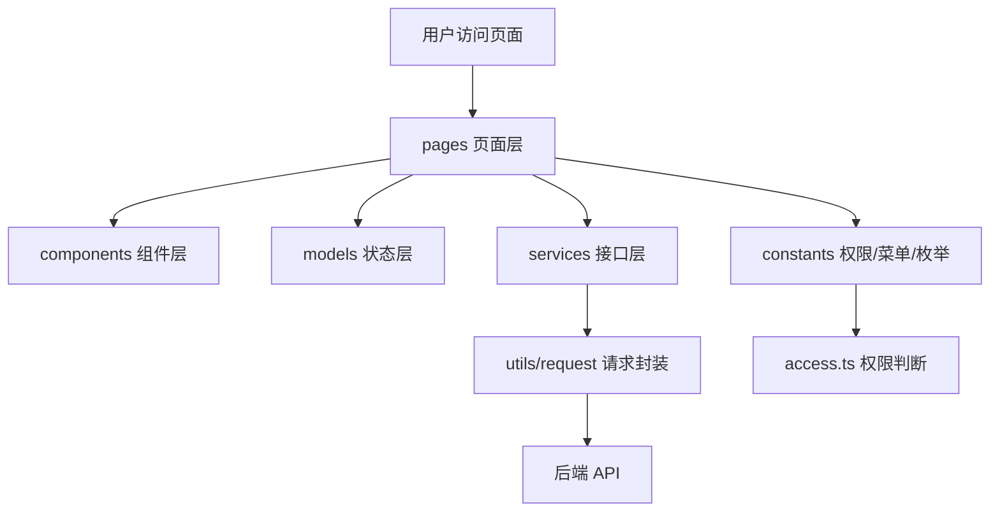

### 4.3 路由设计
#### 路由结构
前端采用 Umi Max 约定式路由 + 权限路由守卫，按业务模块组织页面目录。路由层级如下：

```plain
/login                          # 登录页（无权限拦截）
/                                # 布局级路由（需登录）
├── /system                      # 系统管理（仅系统管理员可见）
│   ├── /system/user             # 用户管理
│   ├── /system/user/create      # 新建用户
│   ├── /system/user/:id/edit    # 编辑用户
│   ├── /system/role             # 角色管理
│   ├── /system/menu             # 菜单管理
│   ├── /system/dept             # 部门管理
│   ├── /system/post             # 职位管理
│   └── /system/dict             # 字典管理
├── /employee                    # 员工档案
│   ├── /employee/list           # 员工列表
│   ├── /employee/detail/:id     # 员工详情
│   ├── /employee/:id/edit       # 编辑员工
│   └── /employee/contract       # 合同管理
├── /process                     # 入转调离
│   ├── /process/entry           # 入职管理
│   ├── /process/regular         # 转正管理
│   ├── /process/transfer        # 调岗管理
│   └── /process/leave           # 离职管理
├── /attendance                  # 考勤管理
│   ├── /attendance/groups       # 考勤组
│   ├── /attendance/clock        # 打卡
│   ├── /attendance/my-calendar  # 个人考勤
│   ├── /attendance/corrections  # 补卡
│   ├── /attendance/overtime    # 加班申请
│   ├── /attendance/leaves       # 请假
│   ├── /attendance/record       # 考勤记录
│   └── /attendance/summary      # 统计看板
├── /salary                      # 薪资管理
│   ├── /salary/templates        # 薪资账套
│   ├── /salary/employee-profiles # 员工薪资档案
│   ├── /salary/batches          # 薪资批次
│   └── /salary/dashboard        # 薪资看板
├── /approval                    # 审批中心
│   ├── /approval/workspace      # 审批工作台
│   ├── /approval/detail/:id     # 审批详情
│   └── /approval/delegation     # 委托审批
├── /profile                     # 个人中心
│   ├── /profile                 # 个人中心首页
│   ├── /profile/archive         # 我的档案
│   ├── /profile/attendance      # 我的考勤
│   ├── /profile/leave           # 我的请假
│   ├── /profile/salary          # 我的薪资
│   └── /profile/security        # 账号安全
└── /ai                          # AI 智能助手
    ├── /ai/chat                 # AI 对话
    └── /ai/knowledge            # 知识库管理（仅系统管理员）
```

#### 路由懒加载策略
| 路由分组 | 打包策略 | 拆分说明 |
| --- | --- | --- |
| 登录页 | 独立 chunk | `login.chunk.js`，首屏加载 |
| 系统管理 | 公共 chunk | `system.chunk.js`，管理员场景 |
| 员工档案 + 入转调离 | 合并 chunk | `employee.chunk.js`，HR 高频操作 |
| 考勤管理 | 独立 chunk | `attendance.chunk.js`，考勤高频页 |
| 薪资管理 | 独立 chunk | `salary.chunk.js`，涉敏单独拆分 |
| 审批中心 | 独立 chunk | `approval.chunk.js`，跨角色共用 |
| 个人中心 | 合并 chunk | `profile.chunk.js`，全量用户访问 |
| AI 智能助手 | 独立 chunk | `ai.chunk.js`，AI 对话页按需加载 |
| 首页 | 公共 chunk | 随 Layout 加载 |
| Ant Design 组件 | vendor | 缓存稳定 |
| ProComponents | vendor | 缓存稳定 |


#### 路由守卫与 403/404 兜底
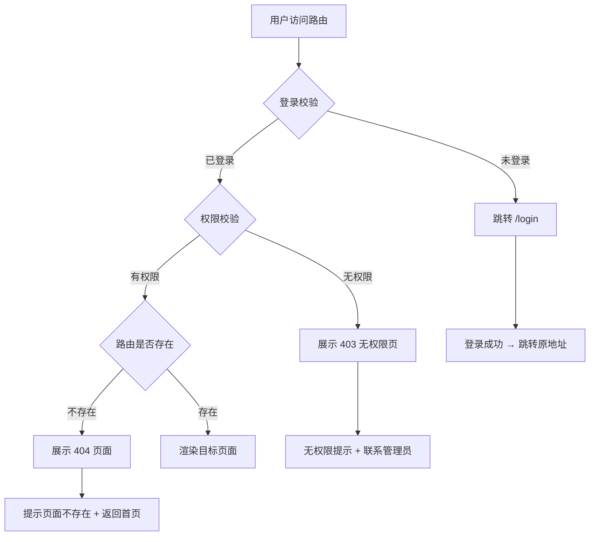

#### 路由实现要点
+ 登录页路由独立于 Layout 之外，不加载菜单和权限数据。
+ Layout 路由在 `app.ts` 的 `getInitialState` 中完成登录态和权限初始化。
+ 普通员工权限较少时，前端自动折叠无权限菜单但不阻断路由；直接访问 URL 时路由守卫拦截并跳转 403。
+ 404 页面作为路由配置的最后兜底，捕获所有未匹配路径。
+ 所有 `:id` 参数路由通过 `params` 获取 ID，页面组件内处理无效 ID 的错误态。

### 4.4 状态管理设计
#### 状态分层原则
前端状态按作用域划分为三层：

| 层级 | 存储位置 | 典型场景 | 生命周期 |
| --- | --- | --- | --- |
| 全局状态 | Umi `initialState` + `access` | 登录用户、权限码、菜单树 | 应用级别，刷新重新加载 |
| 模块状态 | Umi Model | 审批列表、考勤日历、AI 会话列表 | 模块级别，页面切换保留 |
| 本地状态 | React `useState` / `useReducer` | 表单输入、弹窗开关、选中行 | 组件级别，卸载即销毁 |


#### 全局状态
```typescript
// src/app.ts — initial state structure
interface InitialState {
  currentUser?: CurrentUser;         // 当前登录用户
  permissions?: string[];            // 权限码列表
  menus?: MenuItem[];                // 菜单树
  fieldPermissions?: FieldPermMap;   // 字段权限映射
  settings?: AppSettings;            // 系统配置
  fetchUserInfo: () => Promise<void>;// 刷新用户信息
}
```

初始化流程：`app.ts` → `getInitialState()` → 调用 `GET /api/v1/auth/current-user` → 写入 `initialState` → `access.ts` 生成权限规则 → 渲染菜单和路由。

#### 模块状态
| 模块 | Model 文件 | 主要状态 |
| --- | --- | --- |
| 考勤 | `src/models/attendance.ts` | 考勤组列表、当前考勤日历、打卡状态 |
| 薪资 | `src/models/salary.ts` | 批次列表、异常列表、工资条验证态 |
| 审批 | `src/models/approval.ts` | Tab 切换、筛选条件、分页位置 |
| AI 助手 | `src/models/ai.ts` | 会话列表、当前消息、streaming 状态 |


模块状态的跨页面保持原则：列表页的筛选条件、分页、Tab 在页面切换后保留，离开模块时清理。

#### 数据流方向
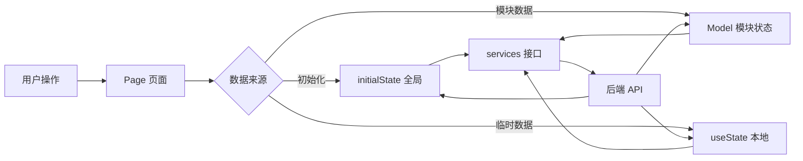

#### 缓存策略
| 数据 | 策略 | 说明 |
| --- | --- | --- |
| 用户信息/权限 | `initialState` 内存 | 刷新重新加载，不持久化 |
| 菜单树 | `initialState` 内存 | 由后端权限动态生成 |
| 字典数据 | `useModel` 缓存 | 首次加载后模块内复用 |
| 部门树 | 模块 Model 缓存 | 员工/考勤等模块间共享 |
| 列表数据 | 不缓存 | 每次进入页面重新请求 |
| AI 会话列表 | Model 内存 | 页面切换保留，关闭清理 |
| 工资条明细 | 不持久化 | 离开页面清理敏感数据 |


### 4.5 组件体系设计
#### 组件分层架构
前端组件按复用粒度分为四层：

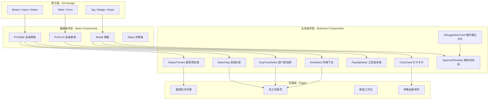

#### 通用组件清单
| 组件 | 组件层级 | 复用范围 | 输入接口 |
| --- | --- | --- | --- |
| `DeptTreeSelect` | 业务组件 | 员工、考勤、薪资、审批 | `value`, `onChange`, `excludeDeptId?` |
| `DictSelect` | 业务组件 | 全局（性别、状态、类型） | `dictType`, `value`, `onChange` |
| `StatusTag` | 业务组件 | 全局（状态展示） | `status`, `typeMap`, `size?` |
| `ApprovalTimeline` | 业务组件 | 审批详情 | `approvalNodes: Node[]` |
| `AmountDisplay` | 业务组件 | 薪资模块 | `value`, `precision=2`, `masked?` |
| `EmptyState` | 基础组件 | 全局（列表/图表空态） | `description`, `actionText?`, `onAction?` |
| `ErrorRetry` | 基础组件 | 全局（接口异常展示） | `message`, `onRetry` |
| `AiFloatingBall` | 业务组件 | 全局 Layout | `visible`, `onToggle` |
| `StreamRenderer` | 基础组件 | AI 对话 | `tokens: string[]`, `onComplete` |
| `ActionSuggestionCard` | 业务组件 | AI 对话 | `actions: Suggestion[]`, `onClick` |


#### 组件设计规范
+ 通用业务组件放在 `src/components/{ComponentName}`，使用 `index.tsx` 导出。
+ 业务组件接收明确的数据接口（TypeScript interface），不直接依赖 Model。
+ 组件内部状态变化通过 `onChange`/`onXxx` 回调通知父级。
+ 每个业务组件必须有加载态、空态、错误态处理。
+ 涉敏业务组件（薪资、身份证）通过 `masked?` 属性控制脱敏展示。

### 4.6 错误处理体系
#### 前端错误分类
| 错误类型 | 典型场景 | 处理策略 |
| --- | --- | --- |
| 接口异常 | 网络超时、500 错误 | 错误提示 + 重试入口 |
| 业务异常 | 400xx 业务错误码 | 展示后端 message |
| 权限异常 | 401xx 未登录、403xx 无权限 | 跳转登录/403 页 |
| 前端异常 | 组件渲染崩溃 | ErrorBoundary 兜底 |
| AI SSE 异常 | SSE 断连、服务超时 | 保留已接收内容 + 重试按钮 |


#### 统一请求拦截
`utils/request.ts` 拦截器处理层级：

```typescript
// 响应拦截伪代码
response => {
    if (response.status === 401) {
        // Token 过期或无效 → 清空登录态 → 跳转登录
        redirect('/login');
        return Promise.reject('未登录');
    }
    if (response.status === 403) {
        // 无权限 → 跳转 403 页面
        redirect('/403');
        return Promise.reject('无权限');
    }
    if (response.data.code !== 20000) {
        // 业务异常 → 统一提示后端 message
        message.error(response.data.message);
        return Promise.reject(response.data);
    }
    return response.data.data;  // 解包成功数据
}
```

#### 前端异常边界
+ 每个模块的页面组件外层包裹 ErrorBoundary，捕获渲染异常后展示降级页面。
+ 降级页面包含：错误说明、重试按钮、返回首页入口。
+ ErrorBoundary 不阻断菜单和路由导航，仅当前页面降级。

#### 错误码映射（前端侧）
后端统一异常码在前端的映射处理：

| 异常码范围 | 前端行为 | 用户提示 |
| --- | --- | --- |
| 20000 | 业务成功 | 无 |
| 40001-40099 | 参数校验 | `message.error(后端message)` |
| 40101-40103 | 认证异常 | 跳转登录页 |
| 40300-40302 | 权限不足 | 跳转 403 页 |
| 40401-40499 | 数据不存在 | 空态展示 |
| 50001-50002 | 服务端异常 | `message.error('系统繁忙，请稍后重试')` |


#### 降级与重试策略
| 场景 | 降级行为 | 重试方式 |
| --- | --- | --- |
| 列表页接口失败 | 展示 ErrorRetry 组件 | 点击重试按钮 |
| 详情页接口失败 | 展示 ErrorRetry 组件 | 点击重试按钮 |
| 提交/保存失败 | `message.error()` + 按钮恢复 | 用户重新提交 |
| AI SSE 断连 | AI 气泡展示错误提示 | 重试按钮重新发送 |
| 图表加载失败 | 图表区域展示空态 | 不影响页面其他内容 |
| 子组件崩溃 | ErrorBoundary 降级该区域 | 刷新页面恢复 |


---

## 5. 角色与权限设计
### 5.1 角色定义
| 角色 | 数据范围 | 核心职责 |
| --- | --- | --- |
| 系统管理员 | 全平台 | 系统配置、用户角色菜单、全部业务兜底管理 |
| HR 专员 | 全部员工 | 员工管理、入转调离、考勤管理、薪资核算、审批处理 |
| 部门主管 | 本部门及下属 | 本部门员工查看、调岗或流程审批、考勤审批 |
| 财务专员 | 薪资相关 | 薪资审核、薪资批次审批、成本报表 |
| 普通员工 | 仅本人 | 个人档案、打卡、请假、工资条、申请进度 |


### 5.2 菜单可见性
| 菜单 | 系统管理员 | HR | 部门主管 | 财务 | 普通员工 |
| --- | :---: | :---: | :---: | :---: | :---: |
| 首页 | 可见 | 可见 | 可见 | 可见 | 可见 |
| 系统管理 | 可见 | 不可见 | 不可见 | 不可见 | 不可见 |
| 员工档案 | 可见 | 可见 | 本部门可见 | 不可见 | 不可见 |
| 入转调离 | 可见 | 可见 | 部分可见 | 不可见 | 不可见 |
| 考勤管理 | 可见 | 可见 | 本部门可见 | 不可见 | 个人中心入口 |
| 薪资管理 | 可见 | 可见 | 不可见 | 可见 | 个人中心入口 |
| 审批中心 | 可见 | 可见 | 可见 | 可见 | 个人中心入口 |
| 个人中心 | 可见 | 可见 | 可见 | 可见 | 可见 |


### 5.3 前端权限实现
+ 登录成功后，前端保存 Token，并获取当前用户信息和权限列表。
+ `app.ts` 将用户信息写入 Umi `initialState`。
+ `access.ts` 根据权限列表生成菜单和路由访问规则。
+ `.umirc.ts` 路由配置通过 `access` 字段控制页面访问。
+ 页面内按钮、字段、操作入口根据权限码和字段权限接口动态渲染。

---

## 6. 模块 M1：权限体系 auth
### 6.1 用例分析
#### 用例图
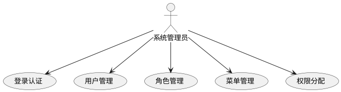

#### 用例描述
| 编号 | 用例名称 | 参与者 | 前置条件 | 后置条件 | 业务描述 |
| --- | --- | --- | --- | --- | --- |
| UC-06-01 | 登录认证 | 系统管理员 | 无 | 进入首页 | 系统管理员通过用户名密码登录系统，获取 Token 和权限信息 |
| UC-06-02 | 用户管理 | 系统管理员 | 已登录 | 用户数据变更 | 对系统用户进行增删改查和状态管理，分配角色 |
| UC-06-03 | 角色管理 | 系统管理员 | 已登录 | 角色数据变更 | 维护角色信息，配置角色的数据范围和菜单权限 |
| UC-06-04 | 菜单管理 | 系统管理员 | 已登录 | 菜单树变更 | 维护目录、菜单、按钮三级权限树 |
| UC-06-05 | 权限分配 | 系统管理员 | 已选择角色 | 角色权限变更 | 为角色分配菜单/按钮访问权限，支持树形勾选 |


### 6.2 模块目标
权限体系负责登录认证、用户管理、角色管理、菜单管理，是 HRMS 前端权限控制和菜单控制的基础。

### 6.3 页面范围
| 页面 | 路由 | 主要功能 |
| --- | --- | --- |
| 登录页 | `/login` | 用户名密码登录、开发阶段角色选择、Token 保存、跳转首页 |
| 用户列表页 | `/system/user` | 用户查询、新增、编辑、删除、状态展示、角色展示 |
| 用户表单页 | `/system/user/create`、`/system/user/:id/edit` | 用户基本信息、状态、角色分配 |
| 角色列表页 | `/system/role` | 角色查询、角色编辑、权限分配 |
| 菜单管理页 | `/system/menu` | 菜单树展示、目录/菜单/按钮权限维护 |


### 6.4 界面形态
权限体系采用典型后台管理界面形态：顶部为系统 Header，左侧为菜单导航，右侧为内容工作区。

| 页面 | 界面形态描述 |
| --- | --- |
| 登录页 | 居中登录卡片，包含系统名称、用户名输入框、密码输入框、开发阶段角色选择下拉框和登录按钮；背景保持简洁，突出登录动作。 |
| 用户列表页 | 顶部为查询筛选区，支持用户名、真实姓名、状态筛选；中部为 ProTable 表格；右上角工具栏放“新增用户”；表格操作列放“编辑”“删除”。 |
| 用户表单页 | 表单页或抽屉/弹窗形态，按“基本信息”“角色分配”分组；新增时展示密码字段，编辑时可隐藏或置为重置密码入口。 |
| 角色列表页 | 表格型页面，字段包括角色名称、角色编码、数据范围、状态、排序；“分配权限”打开菜单树弹窗，左侧树形勾选，底部保存/取消。 |
| 菜单管理页 | 树形表格页面，按目录、菜单、按钮层级缩进展示；菜单类型使用 Tag 区分；新增/编辑菜单使用弹窗表单，包含父级菜单、路由、权限标识、排序等字段。 |


#### 核心原型图
<!-- 这是一张图片，ocr 内容为： -->
  
图 6-1 登录页原型：展示 HRMS 登录入口、用户名密码输入和开发阶段角色选择。

##### 页面元素 → 字段映射
| 页面元素 | 对应字段 | 说明 |
| --- | --- | --- |
| 用户名输入框 | `username` | 用户账号，必填 |
| 密码输入框 | `password` | 登录密码，必填 |
| 角色选择下拉框 | `role` | 开发阶段允许手动切换角色，生产环境隐藏 |
| 登录按钮 | — | 触发 `POST /api/v1/auth/login`，需 loading 防重复提交 |


<!-- 这是一张图片，ocr 内容为： -->


图 6-2 用户管理页原型：展示筛选区、用户表格、新增用户和行内编辑/删除操作。

##### 页面元素 → 字段映射
| 页面元素 | 对应字段 | 说明 |
| --- | --- | --- |
| 用户名查询 | `username` | 搜索条件，模糊匹配 |
| 真实姓名查询 | `realName` | 搜索条件，模糊匹配 |
| 状态筛选 | `status` | 下拉单选：启用 / 禁用 |
| 用户名列 | `username` | 表格展示 |
| 真实姓名列 | `realName` | 表格展示 |
| 角色列 | `roleNames` | 表格展示，多角色用逗号分隔 |
| 状态列 | `status` | Tag 展示：启用(green) / 禁用(red) |
| 创建时间列 | `createdAt` | 表格展示 |
| 新增用户按钮 | — | 跳转用户表单页 `/system/user/create` |
| 编辑按钮 | — | 跳转用户表单页 `/system/user/:id/edit` |
| 删除按钮 | — | 二次确认后调 `DELETE /api/v1/users/{id}` |


<!-- 这是一张图片，ocr 内容为： -->


图 6-3 角色权限分配原型：展示角色列表和菜单权限树勾选弹窗。

##### 页面元素 → 字段映射
| 页面元素 | 对应字段 | 说明 |
| --- | --- | --- |
| 角色名称列 | `roleName` | 表格展示 |
| 角色编码列 | `roleCode` | 表格展示 |
| 数据范围列 | `dataScope` | 表格展示：全部/本部门/本部门及下属/本人 |
| 状态列 | `status` | Tag 展示 |
| 分配权限按钮 | — | 打开菜单树弹窗 |
| 菜单树 | `menuIds` | 树形勾选，回显当前角色已分配菜单 ID |
| 保存按钮 | — | 提交 `POST /api/v1/roles/{roleId}/menus` |


### 6.5 关键交互
#### 登录流程时序
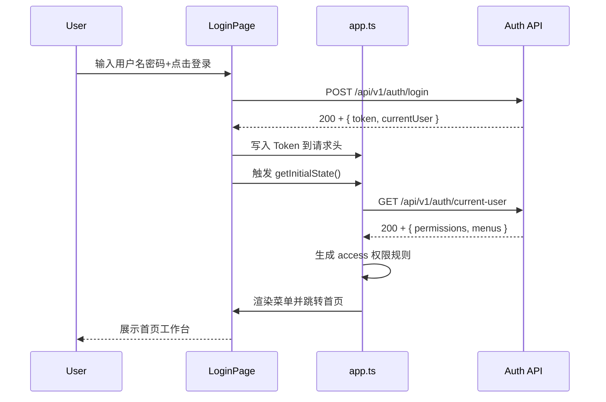

+ 登录页校验用户名和密码非空，登录成功后 Token 写入 localStorage 和请求头。
+ 用户管理使用 ProTable 支持搜索、分页、编辑和删除二次确认。
+ 角色权限分配使用菜单树勾选方式，支持回显已分配菜单。
+ 菜单管理使用树形表格维护菜单层级、路由和权限标识。

### 6.6 接口依赖
#### `POST /api/v1/auth/login` — 登录认证
**入参：**

| 字段 | 类型 | 说明 |
| --- | --- | --- |
| `username` | `string` | 用户名，必填 |
| `password` | `string` | 密码，必填 |


**出参：**

| 字段 | 类型 | 说明 |
| --- | --- | --- |
| `token` | `string` | JWT Token，前端写入 localStorage 和请求头 |
| `currentUser` | `CurrentUser` | 当前登录用户信息 |


`CurrentUser`**：**

| 字段 | 类型 | 说明 |
| --- | --- | --- |
| `id` | `number` | 用户 ID |
| `username` | `string` | 用户名 |
| `realName` | `string` | 真实姓名 |
| `role` | `string` | 当前角色编码 |


---

#### `GET /api/v1/auth/current-user` — 获取当前用户与权限
**出参：**

| 字段 | 类型 | 说明 |
| --- | --- | --- |
| `user` | `CurrentUser` | 当前用户信息 |
| `permissions` | `string[]` | 权限码列表，如 `["user:create", "role:assign"]` |
| `menus` | `MenuItem[]` | 菜单树 |
| `fieldPermissions` | `FieldPermMap` | 字段权限映射 |


`MenuItem`**：**

| 字段 | 类型 | 说明 |
| --- | --- | --- |
| `id` | `number` | 菜单 ID |
| `name` | `string` | 菜单名称 |
| `path` | `string` | 前端路由路径 |
| `icon` | `string` | 图标名称 |
| `type` | `string` | 类型：directory / menu / button |
| `children` | `MenuItem[]` | 子菜单 |


`FieldPermMap`**：**

| 字段 | 类型 | 说明 |
| --- | --- | --- |
| `editableFields` | `string[]` | 可编辑字段列表 |
| `flowFields` | `string[]` | 需走流程修改的字段 |
| `hiddenFields` | `string[]` | 隐藏字段列表 |


---

#### `GET /api/v1/users` — 用户列表
**入参：**

| 字段 | 类型 | 说明 |
| --- | --- | --- |
| `username` | `string` | 用户名模糊搜索 |
| `realName` | `string` | 真实姓名模糊搜索 |
| `status` | `string` | 状态筛选：active / disabled |
| `pageNum` | `number` | 页码，默认 1 |
| `pageSize` | `number` | 每页条数，默认 20 |


**出参：**

| 字段 | 类型 | 说明 |
| --- | --- | --- |
| `records` | `User[]` | 用户列表 |
| `total` | `number` | 总记录数 |


`User`**：**

| 字段 | 类型 | 说明 |
| --- | --- | --- |
| `id` | `number` | 用户 ID |
| `username` | `string` | 用户名 |
| `realName` | `string` | 真实姓名 |
| `roleIds` | `number[]` | 角色 ID 列表 |
| `roleNames` | `string[]` | 角色名称列表 |
| `status` | `string` | active / disabled |
| `createdAt` | `string` | 创建时间 |


---

#### `POST /api/v1/users` — 创建用户
**入参：**

| 字段 | 类型 | 说明 |
| --- | --- | --- |
| `username` | `string` | 用户名，必填 |
| `password` | `string` | 密码，必填 |
| `realName` | `string` | 真实姓名，必填 |
| `roleIds` | `number[]` | 角色 ID 列表 |


**出参：**

| 字段 | 类型 | 说明 |
| --- | --- | --- |
| `id` | `number` | 新用户 ID |


---

#### `PUT /api/v1/users/{id}` — 更新用户
**入参：**

| 字段 | 类型 | 说明 |
| --- | --- | --- |
| `realName` | `string` | 真实姓名 |
| `status` | `string` | active / disabled |
| `roleIds` | `number[]` | 角色 ID 列表 |
| `password` | `string` | 修改密码时传入 |


**出参：**

| 字段 | 类型 | 说明 |
| --- | --- | --- |
| `success` | `boolean` | 是否成功 |


---

#### `DELETE /api/v1/users/{id}` — 删除用户
**入参：** 路径参数 `id`（用户 ID）

**出参：**

| 字段 | 类型 | 说明 |
| --- | --- | --- |
| `success` | `boolean` | 是否成功 |


---

#### `GET /api/v1/roles` — 角色列表
**入参：**

| 字段 | 类型 | 说明 |
| --- | --- | --- |
| `roleName` | `string` | 角色名称搜索 |
| `status` | `string` | 状态筛选 |
| `pageNum` | `number` | 页码，默认 1 |
| `pageSize` | `number` | 每页条数，默认 20 |


**出参：**

| 字段 | 类型 | 说明 |
| --- | --- | --- |
| `records` | `Role[]` | 角色列表 |
| `total` | `number` | 总记录数 |


`Role`**：**

| 字段 | 类型 | 说明 |
| --- | --- | --- |
| `id` | `number` | 角色 ID |
| `roleName` | `string` | 角色名称 |
| `roleCode` | `string` | 角色编码 |
| `dataScope` | `string` | 数据范围：all / dept / dept_and_sub / self |
| `status` | `string` | active / disabled |
| `sort` | `number` | 排序号 |
| `menuIds` | `number[]` | 已分配菜单 ID 列表 |


---

#### `POST /api/v1/roles/{roleId}/menus` — 分配角色菜单
**入参：**

| 字段 | 类型 | 说明 |
| --- | --- | --- |
| `menuIds` | `number[]` | 菜单 ID 列表，必填 |


**出参：**

| 字段 | 类型 | 说明 |
| --- | --- | --- |
| `success` | `boolean` | 是否成功 |


---

#### `GET /api/v1/menus/tree` — 菜单树
**出参：**

| 字段 | 类型 | 说明 |
| --- | --- | --- |
| `menus` | `MenuItem[]` | 完整菜单树 |


---

## 7. 模块 M2：组织架构 organization
### 7.1 用例分析
#### 用例图
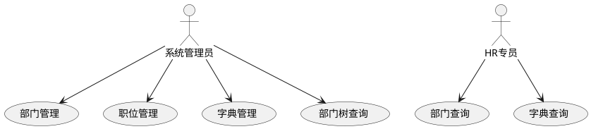

#### 用例描述
| 编号 | 用例名称 | 参与者 | 前置条件 | 后置条件 | 业务描述 |
| --- | --- | --- | --- | --- | --- |
| UC-07-01 | 部门管理 | 系统管理员 | 已登录 | 部门数据变更 | 对组织部门进行增删改查，配置部门负责人和上下级关系 |
| UC-07-02 | 部门树查询 | 系统管理员/HR | 已登录 | 展示部门树 | 以树形结构展示组织架构，供员工、考勤等模块引用选择 |
| UC-07-03 | 职位管理 | 系统管理员 | 已登录 | 职位数据变更 | 维护职位信息，配置职位序列、职级范围和所属部门 |
| UC-07-04 | 字典管理 | 系统管理员 | 已登录 | 字典数据变更 | 维护字典类型和字典项，提供下拉选项数据源 |


### 7.2 模块目标
组织架构负责部门、职位和字典等基础主数据维护，为员工档案、考勤、薪资、审批等模块提供基础选项和组织范围。

### 7.3 页面范围
| 页面 | 路由 | 主要功能 |
| --- | --- | --- |
| 部门管理页 | `/system/dept` | 部门树形展示、新增、编辑、删除、负责人配置 |
| 职位管理页 | `/system/post` | 职位列表、搜索、新增、编辑、删除 |
| 字典管理页 | `/system/dict` | 左侧字典类型、右侧字典数据维护 |


### 7.4 界面形态
产品说明书中组织架构模块原型强调“部门树形结构”和“职位列表维护”。前端界面补充如下：

| 页面 | 界面形态描述 |
| --- | --- |
| 部门管理页 | 采用树形表格或左树右详情布局。左侧展示公司组织树，支持展开/收起；右侧或主表格展示部门编码、层级、负责人、人数、状态、排序。点击部门后高亮当前节点，并可在右侧查看部门详情和下级部门。 |
| 部门表单弹窗 | 使用中等宽度 Modal，字段纵向排列，包括部门名称、部门编码、上级部门、负责人、排序号、状态、部门描述；上级部门使用 TreeSelect。 |
| 职位管理页 | 顶部为职位名称、职位编码、状态筛选；中间为职位表格，展示职位名称、职位序列、职级范围、所属部门、默认试用期、状态；右上角为“新增职位”。 |
| 职位表单弹窗 | 表单包含职位名称、职位序列、所属部门、职级范围、默认试用期、职位描述；职位序列和职级范围联动展示。 |
| 字典管理页 | 左右分栏，左侧为字典类型列表，右侧为当前类型下的字典数据表格；点击左侧类型后右侧刷新；右侧提供新增、编辑、删除字典项。 |


#### 核心原型图
<!-- 这是一张图片，ocr 内容为： -->
  
图 7-1 部门管理页原型：展示组织树、部门表格、部门详情与新增部门入口。

##### 页面元素 → 字段映射
| 页面元素 | 对应字段 | 说明 |
| --- | --- | --- |
| 部门树（左侧） | `departmentTree` | 树形展示组织层级，支持展开/收起 |
| 部门名称列 | `deptName` | 表格展示 |
| 部门编码列 | `deptCode` | 表格展示 |
| 负责人列 | `leaderName` | 表格展示 |
| 人数列 | `employeeCount` | 表格展示 |
| 状态列 | `status` | Tag 展示：启用(green)/禁用(red) |
| 排序列 | `sort` | 表格展示 |
| 新增部门按钮 | — | 打开部门表单弹窗 |
| 编辑按钮 | — | 打开部门表单弹窗（回显） |
| 删除按钮 | — | 二次确认后调 `DELETE /api/v1/departments/{id}` |
| 部门名称输入框 | `deptName` | 表单字段，必填 |
| 部门编码输入框 | `deptCode` | 表单字段，必填 |
| 上级部门选择器 | `parentId` | 使用 TreeSelect |
| 负责人选择器 | `leaderId` | 员工选择器 |
| 排序号输入框 | `sort` | 数字输入 |
| 状态下拉 | `status` | 启用/禁用 |


<!-- 这是一张图片，ocr 内容为： -->


图 7-2 职位管理页原型：展示职位筛选、职位表格和新增职位抽屉。

##### 页面元素 → 字段映射
| 页面元素 | 对应字段 | 说明 |
| --- | --- | --- |
| 职位名称查询 | `positionName` | 搜索条件 |
| 职位编码查询 | `positionCode` | 搜索条件 |
| 状态筛选 | `status` | 下拉单选 |
| 职位名称列 | `positionName` | 表格展示 |
| 职位编码列 | `positionCode` | 表格展示 |
| 职位序列列 | `sequenceName` | 表格展示 |
| 职级范围列 | `gradeRange` | 表格展示，如 `P1-P7` |
| 所属部门列 | `departmentName` | 表格展示 |
| 默认试用期(月)列 | `probationMonths` | 表格展示 |
| 状态列 | `status` | Tag 展示 |
| 新增职位按钮 | — | 打开职位表单弹窗 |
| 职位名称输入框 | `positionName` | 表单字段，必填 |
| 职位序列下拉 | `sequence` | 表单字段 |
| 所属部门选择 | `departmentId` | TreeSelect |
| 职级范围选择 | `gradeFrom` / `gradeTo` | 起始职级 ~ 结束职级 |
| 默认试用期输入 | `probationMonths` | 数字输入 |


<!-- 这是一张图片，ocr 内容为： -->


图 7-3 字典管理页原型：展示左侧字典类型和右侧字典数据维护区。

##### 页面元素 → 字段映射
| 页面元素 | 对应字段 | 说明 |
| --- | --- | --- |
| 字典类型列表（左侧） | `dictTypes` | 展示字典类型：字典名称、字典编码 |
| 字典类型名称列 | `dictName` | 左侧列表展示 |
| 字典类型编码列 | `dictType` | 左侧列表展示 |
| 字典数据表格（右侧） | `dictData` | 当前选中类型的字典项列表 |
| 字典标签列 | `label` | 展示名，如"男" |
| 字典值列 | `value` | 实际值，如 `male` |
| 排序列 | `sort` | 展示排序号 |
| 状态列 | `status` | Tag 展示 |
| 新增字典项按钮 | — | 打开字典项表单弹窗 |
| 字典标签输入框 | `label` | 表单字段，必填 |
| 字典值输入框 | `value` | 表单字段，必填 |
| 排序号输入框 | `sort` | 数字输入 |


### 7.5 公共组件
| 组件 | 用途 |
| --- | --- |
| `DeptTreeSelect` | 部门树选择，供员工、调岗、考勤、薪资等模块复用 |
| `DictSelect` | 按字典类型展示下拉选项，供性别、员工状态、职位、请假类型等场景复用 |


### 7.6 接口依赖
#### `GET /api/v1/departments/tree` — 部门树
**出参：**

| 字段 | 类型 | 说明 |
| --- | --- | --- |
| `id` | `number` | 部门 ID |
| `deptName` | `string` | 部门名称 |
| `deptCode` | `string` | 部门编码 |
| `parentId` | `number` | 上级部门 ID |
| `leaderName` | `string` | 负责人姓名 |
| `employeeCount` | `number` | 部门人数 |
| `sort` | `number` | 排序号 |
| `status` | `string` | active / disabled |
| `children` | `Department[]` | 子部门列表（递归） |


---

#### `POST /api/v1/departments` — 新增部门
**入参：**

| 字段 | 类型 | 说明 |
| --- | --- | --- |
| `deptName` | `string` | 部门名称，必填 |
| `deptCode` | `string` | 部门编码，必填 |
| `parentId` | `number` | 上级部门 ID，根节点传 null |
| `leaderId` | `number` | 负责人员工 ID |
| `sort` | `number` | 排序号 |
| `status` | `string` | active / disabled |
| `description` | `string` | 部门描述 |


**出参：**

| 字段 | 类型 | 说明 |
| --- | --- | --- |
| `id` | `number` | 新部门 ID |


---

#### `PUT /api/v1/departments/{id}` — 更新部门
**入参：** 同 `POST /api/v1/departments`

**出参：** `{ success: boolean }`

---

#### `DELETE /api/v1/departments/{id}` — 删除部门
**入参：** 路径参数 `id`（部门 ID）

**出参：** `{ success: boolean }`

---

#### `GET /api/v1/posts` — 职位列表
**入参：**

| 字段 | 类型 | 说明 |
| --- | --- | --- |
| `positionName` | `string` | 职位名称模糊搜索 |
| `positionCode` | `string` | 职位编码搜索 |
| `status` | `string` | 状态筛选 |
| `pageNum` | `number` | 页码，默认 1 |
| `pageSize` | `number` | 每页条数，默认 20 |


**出参：**

| 字段 | 类型 | 说明 |
| --- | --- | --- |
| `records` | `Post[]` | 职位列表 |
| `total` | `number` | 总记录数 |


`Post`**：**

| 字段 | 类型 | 说明 |
| --- | --- | --- |
| `id` | `number` | 职位 ID |
| `positionName` | `string` | 职位名称 |
| `positionCode` | `string` | 职位编码 |
| `sequence` | `string` | 职位序列 |
| `gradeFrom` | `string` | 起始职级 |
| `gradeTo` | `string` | 结束职级 |
| `departmentId` | `number` | 所属部门 ID |
| `departmentName` | `string` | 所属部门名称 |
| `probationMonths` | `number` | 默认试用期(月) |
| `status` | `string` | active / disabled |


---

#### `POST /api/v1/posts` — 新增职位
**入参：**

| 字段 | 类型 | 说明 |
| --- | --- | --- |
| `positionName` | `string` | 职位名称，必填 |
| `positionCode` | `string` | 职位编码，必填 |
| `sequence` | `string` | 职位序列 |
| `gradeFrom` | `string` | 起始职级 |
| `gradeTo` | `string` | 结束职级 |
| `departmentId` | `number` | 所属部门 ID |
| `probationMonths` | `number` | 默认试用期(月) |
| `status` | `string` | active / disabled |
| `description` | `string` | 职位描述 |


**出参：** `{ id: number }`

---

#### `PUT /api/v1/posts/{id}` — 更新职位
**入参：** 同 `POST /api/v1/posts`

**出参：** `{ success: boolean }`

---

#### `DELETE /api/v1/posts/{id}` — 删除职位
**入参：** 路径参数 `id`（职位 ID）

**出参：** `{ success: boolean }`

---

#### `GET /api/v1/dict-types` — 字典类型列表
**入参：** 无

**出参：**

| 字段 | 类型 | 说明 |
| --- | --- | --- |
| `dictName` | `string` | 字典类型名称 |
| `dictType` | `string` | 字典类型编码 |
| `status` | `string` | active / disabled |
| `remark` | `string` | 备注 |


---

#### `GET /api/v1/dict-data/type/{typeCode}` — 按类型查询字典数据
**入参：** 路径参数 `typeCode`（字典类型编码）

**出参：**

| 字段 | 类型 | 说明 |
| --- | --- | --- |
| `records` | `DictData[]` | 字典项列表 |


`DictData`**：**

| 字段 | 类型 | 说明 |
| --- | --- | --- |
| `id` | `number` | 字典数据 ID |
| `label` | `string` | 展示标签，如"男" |
| `value` | `string` | 实际值，如 `male` |
| `sort` | `number` | 排序号 |
| `status` | `string` | active / disabled |


---

## 8. 模块 M3：员工档案 employee
### 8.1 用例分析
#### 用例图
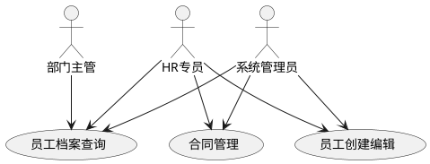

#### 用例描述
| 编号 | 用例名称 | 参与者 | 前置条件 | 后置条件 | 业务描述 |
| --- | --- | --- | --- | --- | --- |
| UC-08-01 | 员工档案查询 | 系统管理员/HR/部门主管 | 已登录 | 展示员工列表 | 按多条件高级搜索查询员工列表，查看员工完整档案信息 |
| UC-08-02 | 员工创建编辑 | 系统管理员/HR | 已登录 | 员工数据变更 | 新增或编辑员工完整档案信息，含字段权限校验 |
| UC-08-03 | 员工详情查看 | 系统管理员/HR/部门主管 | 已登录 | 展示分组档案 | 查看员工基础信息、个人信息、工作信息、合同薪资信息 |
| UC-08-04 | 合同管理 | 系统管理员/HR | 已登录 | 合同数据变更 | 维护员工合同信息，跟踪合同到期和续签状态 |


### 8.2 模块目标
员工档案是 HRMS 的核心主数据模块，负责员工基础信息、个人信息、工作信息、合同薪资信息、调岗记录等前端展示和维护。

### 8.3 页面范围
| 页面 | 路由 | 主要功能 |
| --- | --- | --- |
| 员工列表页 | `/employee/list` | 高级搜索、分页、状态标签、查看、编辑、调岗、离职 |
| 员工详情页 | `/employee/detail/:id` | 分组展示基础信息、个人信息、工作信息、合同薪资信息 |
| 员工编辑/创建页 | `/employee/:id/edit`、创建入口 | 复杂表单、字段权限、保存校验 |
| 合同管理页 | `/employee/contract` | 合同列表、合同状态、合同信息维护 |


### 8.4 界面形态
产品说明书中员工档案原型以“搜索区 + 员工列表 + 操作列”为核心，详情页强调完整档案分组展示。前端界面补充如下：

| 页面 | 界面形态描述 |
| --- | --- |
| 员工列表页 | 顶部为可折叠高级搜索区，包含关键词、部门树、职位、在职状态、职级、入职日期范围；中间为员工表格，默认展示姓名、工号、部门、职位、职级、在职状态、入职日期和操作；状态使用颜色 Tag；操作列包含查看、编辑、更多操作。 |
| 员工详情页 | 顶部为员工摘要区，展示姓名、工号、部门、职位、在职状态；下方使用 Tabs 或分组信息块展示基础信息、个人信息、工作信息、合同与薪资信息；敏感字段按权限脱敏，锁定字段有只读提示。 |
| 员工编辑/创建页 | 使用分步骤或分组表单形态，分为基础信息、个人信息、工作信息、合同薪资信息；字段较多时采用双列表单布局；底部固定保存、取消按钮。 |
| 合同管理页 | 表格型页面，展示员工、合同类型、合同起止日期、到期状态、续签状态；临近到期用橙色标识；合同详情可用弹窗或抽屉查看。 |


#### 核心原型图
<!-- 这是一张图片，ocr 内容为： -->


图 8-1 员工列表页原型：展示高级搜索、员工表格、状态标签和行内操作。

##### 页面元素 → 字段映射
| 页面元素 | 对应字段 | 说明 |
| --- | --- | --- |
| 关键词搜索 | `keyword` | 搜索条件，匹配姓名/工号/手机号 |
| 部门树筛选 | `departmentId` | TreeSelect |
| 职位筛选 | `positionId` | 下拉 |
| 在职状态筛选 | `employmentStatus` | 下拉：正式/试用/已离职 |
| 职级筛选 | `grade` | 下拉 |
| 入职日期范围 | `hireDateRange` | 日期范围选择器 |
| 姓名列 | `employeeName` | 表格展示 |
| 工号列 | `employeeNo` | 表格展示 |
| 部门列 | `departmentName` | 表格展示 |
| 职位列 | `positionName` | 表格展示 |
| 职级列 | `grade` | 表格展示 |
| 在职状态列 | `employmentStatus` | Tag 展示：正式(blue)/试用(orange)/已离职(red) |
| 入职日期列 | `hireDate` | 表格展示 |
| 查看按钮 | — | 跳转详情页 `/employee/detail/:id` |
| 编辑按钮 | — | 跳转编辑页 `/employee/:id/edit` |
| 更多操作按钮 | — | 下拉菜单：调岗/离职 |


<!-- 这是一张图片，ocr 内容为： -->


图 8-2 员工详情页原型：展示员工摘要、分组档案信息和敏感字段脱敏。

##### 页面元素 → 字段映射
| 页面元素 | 对应字段 | 说明 |
| --- | --- | --- |
| 员工摘要区（姓名/工号/部门/职位/状态） | `employeeName` / `employeeNo` / `departmentName` / `positionName` / `employmentStatus` | 页面顶部固定展示 |
| 基础信息分组 | — | Tab/分组：姓名、性别、出生日期、民族 |
| 个人信息分组 | — | Tab/分组：手机号、邮箱、身份证号、紧急联系人 |
| 工作信息分组 | — | Tab/分组：工号、部门、职位、职级、入职日期、试用期到期日 |
| 合同与薪资信息分组 | — | Tab/分组：合同类型、合同起止日期、到期提醒 |
| 敏感字段 | `phone` / `idCard` / `bankAccount` | 按权限脱敏展示，权限不足时显示 `****` |
| 锁定字段 | — | 显示"如需修改请联系 HR"提示 |


<!-- 这是一张图片，ocr 内容为： -->


图 8-3 员工编辑页原型：展示基础、个人、工作、合同薪资四类分组表单。

##### 页面元素 → 字段映射
| 页面元素 | 对应字段 | 说明 |
| --- | --- | --- |
| 基础信息分组 | — | 姓名、性别、出生日期、民族、婚姻状况等 |
| 姓名输入框 | `employeeName` | 必填 |
| 性别选择器 | `gender` | 字典下拉：male / female |
| 出生日期选择器 | `birthDate` | 日期选择器 |
| 手机号输入框 | `phone` | 敏感字段，按权限显示/编辑 |
| 邮箱输入框 | `email` |  |
| 身份证号输入框 | `idCard` | 敏感字段，按权限显示/编辑 |
| 紧急联系人输入框 | `emergencyContact` |  |
| 工号显示（只读） | `employeeNo` | 系统生成，不可编辑 |
| 部门选择器 | `departmentId` | TreeSelect |
| 职位选择器 | `positionId` | 下拉 |
| 职级选择器 | `grade` | 下拉 |
| 入职日期选择器 | `hireDate` |  |
| 合同类型选择器 | `contractType` | 下拉 |
| 合同开始日期 | `contractStartDate` |  |
| 合同结束日期 | `contractEndDate` |  |
| 保存按钮 | — | 提交 `POST` / `PUT` |
| 取消按钮 | — | 返回上一页 |


### 8.5 前端规则
#### 员工创建时序
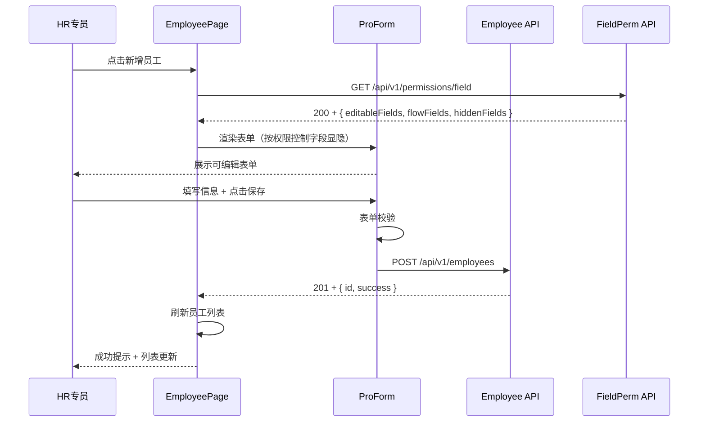

+ 员工列表默认分页，每页 20 条。
+ 支持按关键词、部门、职位、在职状态、职级、入职日期筛选。
+ 手机号、身份证号、银行账号、薪资信息等敏感字段根据字段权限决定完整展示或脱敏展示。
+ 编辑页通过字段权限接口控制字段可编辑、只读或提示走流程。
+ 调岗、离职操作根据员工状态和角色权限展示。

### 8.6 接口依赖
#### `GET /api/v1/employees` — 员工分页列表
**入参：**

| 字段 | 类型 | 说明 |
| --- | --- | --- |
| `keyword` | `string` | 关键词，匹配姓名/工号/手机号 |
| `departmentId` | `number` | 部门 ID |
| `positionId` | `number` | 职位 ID |
| `employmentStatus` | `string` | 在职状态：active / probation / resigned |
| `grade` | `string` | 职级 |
| `hireDateStart` | `string` | 入职日期起始 |
| `hireDateEnd` | `string` | 入职日期结束 |
| `pageNum` | `number` | 页码，默认 1 |
| `pageSize` | `number` | 每页条数，默认 20 |


**出参：**

| 字段 | 类型 | 说明 |
| --- | --- | --- |
| `records` | `EmployeeBrief[]` | 员工列表 |
| `total` | `number` | 总记录数 |


`EmployeeBrief`**：**

| 字段 | 类型 | 说明 |
| --- | --- | --- |
| `id` | `number` | 员工 ID |
| `employeeName` | `string` | 员工姓名 |
| `employeeNo` | `string` | 工号 |
| `departmentName` | `string` | 部门名称 |
| `positionName` | `string` | 职位名称 |
| `grade` | `string` | 职级 |
| `employmentStatus` | `string` | 在职状态 |
| `hireDate` | `string` | 入职日期 |


---

#### `GET /api/v1/employees/{id}` — 员工详情
**入参：** 路径参数 `id`（员工 ID）

**出参：**

| 字段 | 类型 | 说明 |
| --- | --- | --- |
| `employeeName` | `string` | 员工姓名 |
| `employeeNo` | `string` | 工号 |
| `gender` | `string` | 性别 |
| `birthDate` | `string` | 出生日期 |
| `phone` | `string` | 手机号（脱敏） |
| `email` | `string` | 邮箱 |
| `idCard` | `string` | 身份证号（脱敏） |
| `emergencyContact` | `string` | 紧急联系人 |
| `emergencyPhone` | `string` | 紧急联系人电话 |
| `departmentId` | `number` | 部门 ID |
| `departmentName` | `string` | 部门名称 |
| `positionId` | `number` | 职位 ID |
| `positionName` | `string` | 职位名称 |
| `grade` | `string` | 职级 |
| `hireDate` | `string` | 入职日期 |
| `probationEndDate` | `string` | 试用期结束日期 |
| `employmentStatus` | `string` | 在职状态 |
| `contractType` | `string` | 合同类型 |
| `contractStartDate` | `string` | 合同开始日期 |
| `contractEndDate` | `string` | 合同结束日期 |
| `bankAccount` | `string` | 银行账号（脱敏） |


---

#### `POST /api/v1/employees` — 新增员工
**入参：**

| 字段 | 类型 | 说明 |
| --- | --- | --- |
| `employeeName` | `string` | 员工姓名，必填 |
| `gender` | `string` | 性别，必填 |
| `birthDate` | `string` | 出生日期 |
| `phone` | `string` | 手机号 |
| `email` | `string` | 邮箱 |
| `idCard` | `string` | 身份证号 |
| `emergencyContact` | `string` | 紧急联系人 |
| `emergencyPhone` | `string` | 紧急联系人电话 |
| `departmentId` | `number` | 部门 ID，必填 |
| `positionId` | `number` | 职位 ID，必填 |
| `grade` | `string` | 职级 |
| `hireDate` | `string` | 入职日期，必填 |
| `probationMonths` | `number` | 试用期月数 |
| `contractType` | `string` | 合同类型 |
| `contractStartDate` | `string` | 合同开始日期 |
| `contractEndDate` | `string` | 合同结束日期 |


**出参：** `{ id: number }`

---

#### `PUT /api/v1/employees/{id}` — 更新员工
**入参：** 同 `POST /api/v1/employees`（只提交可编辑字段，由字段权限控制）

**出参：** `{ success: boolean }`

---

#### `GET /api/v1/employees/brief/{id}` — 员工简要信息
**入参：** 路径参数 `id`（员工 ID）

**出参：**

| 字段 | 类型 | 说明 |
| --- | --- | --- |
| `employeeName` | `string` | 员工姓名 |
| `employeeNo` | `string` | 工号 |
| `departmentName` | `string` | 部门名称 |
| `positionName` | `string` | 职位名称 |


---

#### `GET /api/v1/permissions/field` — 字段权限
**入参：** 无

**出参：**

| 字段 | 类型 | 说明 |
| --- | --- | --- |
| `editableFields` | `string[]` | 可编辑字段列表 |
| `flowFields` | `string[]` | 需走流程修改的字段 |
| `hiddenFields` | `string[]` | 隐藏字段列表 |


---

#### `GET /api/v1/departments/tree` — 部门树
**出参：** 同 §7.6 `/api/v1/departments/tree`


---

## 9. 模块 M4：入转调离 personnel
### 9.1 用例分析
#### 用例图
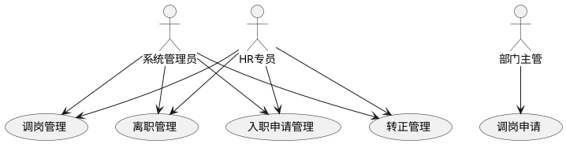

#### 用例描述
| 编号 | 用例名称 | 参与者 | 前置条件 | 后置条件 | 业务描述 |
| --- | --- | --- | --- | --- | --- |
| UC-09-01 | 入职申请管理 | 系统管理员/HR | 已登录 | 员工数据变更 | 创建候选人入职申请，提交审批并确认入职 |
| UC-09-02 | 转正管理 | 系统管理员/HR | 已登录 | 员工状态变更 | 发起转正评估，选择转正/延长试用/辞退 |
| UC-09-03 | 调岗管理 | 管理员/HR/主管 | 已登录 | 员工岗位变更 | 发起调岗申请，选择新部门/职位/生效日期 |
| UC-09-04 | 离职管理 | 系统管理员/HR | 已登录 | 员工状态变更 | 创建离职申请，配置离职类型/日期/交接人 |


### 9.2 模块目标
入转调离模块覆盖员工从入职、转正、调岗到离职的全生命周期流程，前端负责申请录入、流程状态展示、审批入口跳转和业务确认操作。

### 9.3 页面范围
| 页面 | 路由 | 主要功能 |
| --- | --- | --- |
| 入职申请列表页 | `/process/entry` | 候选人列表、草稿、提交审批、确认入职 |
| 入职申请表单页 | `/process/entry/create` | 候选人信息、入职部门、职位、试用期、汇报人 |
| 转正管理列表页 | `/process/regular` | 待转正、已评估、发起转正 |
| 转正评估表单页 | `/process/regular/:id/apply` | 评估意见、转正/延长试用/辞退、薪资调整 |
| 调岗申请列表页 | `/process/transfer` | 调岗申请查询、状态展示 |
| 调岗申请表单页 | `/process/transfer/create` | 原部门职位、新部门职位、生效日期、调岗原因 |
| 离职申请列表页 | `/process/leave` | 离职申请查询、状态展示 |
| 离职申请表单页 | `/process/leave/create` | 离职类型、离职日期、交接人、原因说明 |


### 9.4 界面形态
产品说明书对入转调离模块给出了入职、转正、调岗、离职的流程原型。前端界面应把“流程状态”和“表单录入”放在最明显的位置：

| 页面 | 界面形态描述 |
| --- | --- |
| 入职申请列表页 | 顶部为关键词、状态、部门、申请日期筛选；中间表格展示候选人姓名、手机号、入职部门、职位、预计入职日期、状态、申请时间；状态列显示草稿、审批中、已批准待入职、已拒绝、已入职；右上角为“新建入职申请”。 |
| 入职申请表单页 | 分组表单形态，包含候选人信息、入职信息、试用期与薪资信息、汇报关系；底部提供“保存草稿”“提交审批”“取消”；提交后展示审批流走向提示。 |
| 转正管理页 | 使用 Tab 分为“待转正”“已评估”；待转正表格突出试用期结束日期和剩余天数；行操作为“发起转正”。 |
| 转正评估表单页 | 顶部只读展示员工信息和试用期时间；中部为表现评价、评估结果、薪资调整；底部提交审批。 |
| 调岗申请页 | 列表页展示原部门/新部门、原职位/新职位、生效日期、状态；表单页采用左右对比布局，左侧只读展示原岗位信息，右侧填写新部门、新职位、新职级、汇报人和调岗原因。 |
| 离职申请页 | 列表页展示员工、部门、离职类型、离职日期、状态；表单页顶部展示员工信息，主体填写离职类型、离职原因、最后工作日、工作交接人，底部提交审批。 |


#### 核心原型图
<!-- 这是一张图片，ocr 内容为： -->


图 9-1 入职申请页原型：展示候选人列表、状态流转和入职申请抽屉。

##### 页面元素 → 字段映射
| 页面元素 | 对应字段 | 说明 |
| --- | --- | --- |
| 候选人姓名查询 | `candidateName` | 搜索条件 |
| 手机号查询 | `phone` | 搜索条件 |
| 部门筛选 | `departmentId` | 部门树选择 |
| 状态筛选 | `status` | 多选：草稿/审批中/已通过/已拒绝/已入职 |
| 申请日期范围 | `dateRange` | 日期范围选择器 |
| 候选人姓名列 | `candidateName` | 表格展示 |
| 手机号列 | `phone` | 表格展示 |
| 入职部门列 | `departmentName` | 表格展示 |
| 职位列 | `positionName` | 表格展示 |
| 预计入职日期列 | `expectedEntryDate` | 表格展示 |
| 状态列 | `status` | Tag 展示：草稿(gray)/审批中(blue)/已通过(green)/已拒绝(red)/已入职(cyan) |
| 申请时间列 | `createdAt` | 表格展示 |
| 编辑按钮 | — | 草稿状态可编辑 |
| 提交审批按钮 | — | 草稿→审批中 |
| 确认入职按钮 | — | 已通过→已入职 |
| 删除按钮 | — | 草稿状态可删除 |
| 新建入职申请按钮 | — | 打开入职申请抽屉/表单页 |


<!-- 这是一张图片，ocr 内容为： -->


图 9-2 转正管理页原型：展示待转正列表、试用期信息和转正评估表单。

##### 页面元素 → 字段映射
| 页面元素 | 对应字段 | 说明 |
| --- | --- | --- |
| 待转正 / 已评估 Tab | — | Tab 切换列表视图 |
| 员工姓名列 | `employeeName` | 表格展示 |
| 部门列 | `departmentName` | 表格展示 |
| 职位列 | `positionName` | 表格展示 |
| 入职日期列 | `hireDate` | 表格展示 |
| 试用期结束日期列 | `probationEndDate` | 表格展示，临近到期标黄 |
| 剩余天数列 | `remainingDays` | 表格展示，自动计算 |
| 发起转正按钮 | — | 打开转正评估表单 |
| 表现评价输入 | `evaluation` | 评估表单字段，必填 |
| 评估结果选择 | `result` | 单选：pass / extend / terminate |
| 转正后薪资输入 | `newSalary` | 评估表单字段 |
| 延长试用月数输入 | `extendMonths` | result=extend 时显示 |


<!-- 这是一张图片，ocr 内容为： -->


图 9-3 调岗申请页原型：展示调岗列表和原岗位/新岗位对比表单。

##### 页面元素 → 字段映射
| 页面元素 | 对应字段 | 说明 |
| --- | --- | --- |
| 员工选择器 | `employeeId` / `employeeName` | 选择调岗员工，展示姓名+工号 |
| 原部门（只读） | `originalDeptName` | 展示当前所属部门 |
| 原职位（只读） | `originalPositionName` | 展示当前职位 |
| 新部门 | `newDepartmentId` | 部门树选择器，必填 |
| 新职位 | `newPositionId` | 职位下拉，必填 |
| 新职级 | `newGrade` | 职级下拉 |
| 汇报人 | `newReporterId` | 员工选择器 |
| 调岗原因 | `reason` | 文本输入框 |
| 生效日期 | `effectiveDate` | 日期选择器 |


<!-- 这是一张图片，ocr 内容为： -->


图 9-4 离职申请页原型：展示离职申请列表和离职表单抽屉。

##### 页面元素 → 字段映射
| 页面元素 | 对应字段 | 说明 |
| --- | --- | --- |
| 员工姓名查询 | `employeeName` | 搜索条件 |
| 部门筛选 | `departmentId` | 部门树选择 |
| 离职类型筛选 | `leaveType` | 下拉：resign / terminate / mutual / contract_end |
| 状态筛选 | `status` | 状态筛选 |
| 员工姓名列 | `employeeName` | 表格展示 |
| 部门列 | `departmentName` | 表格展示 |
| 离职类型列 | `leaveTypeName` | 表格展示 |
| 最后工作日期列 | `lastWorkDate` | 表格展示 |
| 离职日期列 | `leaveDate` | 表格展示 |
| 状态列 | `status` | Tag 展示 |
| 离职原因输入 | `reason` | 表单字段，必填 |
| 离职类型选择 | `leaveType` | 表单下拉，必填 |
| 最后工作日选择 | `lastWorkDate` | 日期选择器，必填 |
| 工作交接人选择 | `handoverEmployeeId` | 员工选择器，必填 |


### 9.5 前端流程
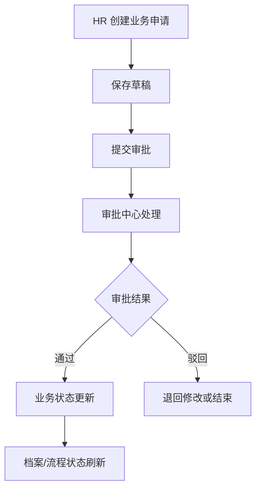

### 9.6 接口依赖
#### `GET /api/v1/entry-applications` — 入职申请列表
**入参：**

| 字段 | 类型 | 说明 |
| --- | --- | --- |
| `keyword` | `string` | 关键词，匹配候选人姓名/手机号 |
| `departmentId` | `number` | 部门 ID |
| `status` | `string` | 状态：draft / pending / approved / rejected / entered |
| `dateStart` | `string` | 申请日期起始 |
| `dateEnd` | `string` | 申请日期结束 |
| `pageNum` | `number` | 页码，默认 1 |
| `pageSize` | `number` | 每页条数，默认 20 |


**出参：**

| 字段 | 类型 | 说明 |
| --- | --- | --- |
| `records` | `EntryApplication[]` | 申请记录列表 |
| `total` | `number` | 总记录数 |


`EntryApplication`**：**

| 字段 | 类型 | 说明 |
| --- | --- | --- |
| `id` | `number` | 申请 ID |
| `candidateName` | `string` | 候选人姓名 |
| `phone` | `string` | 手机号 |
| `departmentId` | `number` | 入职部门 ID |
| `departmentName` | `string` | 入职部门名称 |
| `positionId` | `number` | 职位 ID |
| `positionName` | `string` | 职位名称 |
| `expectedEntryDate` | `string` | 预计入职日期 |
| `status` | `string` | 状态编码 |
| `statusName` | `string` | 状态中文名 |
| `createdAt` | `string` | 创建时间 |


---

#### `POST /api/v1/entry-applications` — 创建入职申请
**入参：**

| 字段 | 类型 | 说明 |
| --- | --- | --- |
| `candidateName` | `string` | 候选人姓名，必填 |
| `phone` | `string` | 手机号，必填 |
| `departmentId` | `number` | 入职部门 ID，必填 |
| `positionId` | `number` | 职位 ID，必填 |
| `expectedEntryDate` | `string` | 预计入职日期 |
| `probationMonths` | `number` | 试用期月数 |
| `salary` | `number` | 试用期/转正薪资 |
| `reporterId` | `number` | 汇报人 ID |
| `remark` | `string` | 备注 |


**出参：** `{ id: number }`

---

#### `PUT /api/v1/entry-applications/{id}` — 更新入职申请
**入参：** 同 `POST /api/v1/entry-applications`

**出参：** `{ success: boolean }`

---

#### `POST /api/v1/entry-applications/{id}/submit` — 提交入职审批
**入参：** 路径参数 `id`（申请 ID）

**出参：** `{ success: boolean, approvalId: number }`

---

#### `POST /api/v1/entry-applications/{id}/confirm` — 确认入职
**入参：** 路径参数 `id`（申请 ID）

**出参：** `{ employeeId: number, employeeNo: string }`

---

#### `GET /api/v1/regular-applications` — 转正列表
**入参：**

| 字段 | 类型 | 说明 |
| --- | --- | --- |
| `tab` | `string` | pending / evaluated |
| `keyword` | `string` | 关键词搜索 |
| `departmentId` | `number` | 部门筛选 |
| `pageNum` | `number` | 页码，默认 1 |
| `pageSize` | `number` | 每页条数，默认 20 |


**出参：**

| 字段 | 类型 | 说明 |
| --- | --- | --- |
| `records` | `RegularApplication[]` | 转正记录列表 |
| `total` | `number` | 总记录数 |


`RegularApplication`**：**

| 字段 | 类型 | 说明 |
| --- | --- | --- |
| `id` | `number` | 转正记录 ID |
| `employeeId` | `number` | 员工 ID |
| `employeeName` | `string` | 员工姓名 |
| `departmentName` | `string` | 部门名称 |
| `positionName` | `string` | 职位名称 |
| `hireDate` | `string` | 入职日期 |
| `probationEndDate` | `string` | 试用期结束日期 |
| `remainingDays` | `number` | 距试用期结束剩余天数 |
| `status` | `string` | 状态 |


---

#### `POST /api/v1/regular-applications/{id}/apply` — 发起转正
**入参：**

| 字段 | 类型 | 说明 |
| --- | --- | --- |
| `evaluation` | `string` | 表现评价，必填 |
| `result` | `string` | 评估结果：pass / extend / terminate |
| `newSalary` | `number` | 转正后薪资调整 |
| `extendMonths` | `number` | 延长试用月数（result=extend 时必填） |


**出参：** `{ success: boolean, approvalId: number }`

---

#### `GET /api/v1/transfer-applications` — 调岗申请列表
**入参：**

| 字段 | 类型 | 说明 |
| --- | --- | --- |
| `keyword` | `string` | 关键词，匹配员工姓名/工号 |
| `departmentId` | `number` | 原部门筛选 |
| `status` | `string` | 状态筛选 |
| `pageNum` | `number` | 页码，默认 1 |
| `pageSize` | `number` | 每页条数，默认 20 |


**出参：**

| 字段 | 类型 | 说明 |
| --- | --- | --- |
| `records` | `TransferApplication[]` | 调岗申请列表 |
| `total` | `number` | 总记录数 |


`TransferApplication`**：**

| 字段 | 类型 | 说明 |
| --- | --- | --- |
| `id` | `number` | 申请 ID |
| `employeeId` | `number` | 员工 ID |
| `employeeName` | `string` | 员工姓名 |
| `originalDeptName` | `string` | 原部门名称 |
| `originalPositionName` | `string` | 原职位名称 |
| `newDepartmentName` | `string` | 新部门名称 |
| `newPositionName` | `string` | 新职位名称 |
| `effectiveDate` | `string` | 生效日期 |
| `status` | `string` | 状态 |
| `createdAt` | `string` | 创建时间 |


---

#### `POST /api/v1/transfer-applications` — 创建调岗申请
**入参：**

| 字段 | 类型 | 说明 |
| --- | --- | --- |
| `employeeId` | `number` | 调岗员工 ID，必填 |
| `newDepartmentId` | `number` | 新部门 ID，必填 |
| `newPositionId` | `number` | 新职位 ID，必填 |
| `newGrade` | `string` | 新职级 |
| `newReporterId` | `number` | 新汇报人 ID |
| `effectiveDate` | `string` | 生效日期，必填 |
| `reason` | `string` | 调岗原因 |


**出参：** `{ id: number, status: string }`

---

#### `GET /api/v1/leave-applications` — 离职申请列表
**入参：**

| 字段 | 类型 | 说明 |
| --- | --- | --- |
| `keyword` | `string` | 关键词搜索 |
| `departmentId` | `number` | 部门筛选 |
| `leaveType` | `string` | 离职类型筛选 |
| `status` | `string` | 状态筛选 |
| `pageNum` | `number` | 页码，默认 1 |
| `pageSize` | `number` | 每页条数，默认 20 |


**出参：**

| 字段 | 类型 | 说明 |
| --- | --- | --- |
| `records` | `LeaveApplication[]` | 离职申请列表 |
| `total` | `number` | 总记录数 |


`LeaveApplication`**：**

| 字段 | 类型 | 说明 |
| --- | --- | --- |
| `id` | `number` | 申请 ID |
| `employeeId` | `number` | 员工 ID |
| `employeeName` | `string` | 员工姓名 |
| `departmentName` | `string` | 部门名称 |
| `leaveType` | `string` | 离职类型 |
| `leaveTypeName` | `string` | 离职类型中文名 |
| `lastWorkDate` | `string` | 最后工作日 |
| `leaveDate` | `string` | 离职日期 |
| `status` | `string` | 状态 |
| `createdAt` | `string` | 创建时间 |


---

#### `POST /api/v1/leave-applications` — 创建离职申请
**入参：**

| 字段 | 类型 | 说明 |
| --- | --- | --- |
| `employeeId` | `number` | 离职员工 ID，必填 |
| `leaveType` | `string` | 离职类型，必填：resign / terminate / mutual / contract_end |
| `reason` | `string` | 离职原因，必填 |
| `lastWorkDate` | `string` | 最后工作日，必填 |
| `handoverEmployeeId` | `number` | 工作交接人 ID，必填 |


**出参：** `{ id: number }`


---

## 10. 模块 M5：考勤管理 attendance
### 10.1 用例分析
#### 用例图
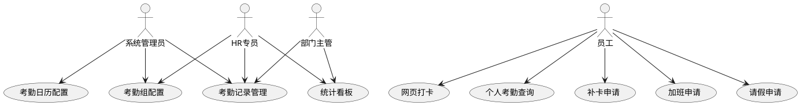

#### 用例描述
| 编号 | 用例名称 | 参与者 | 前置条件 | 后置条件 | 业务描述 |
| --- | --- | --- | --- | --- | --- |
| UC-10-01 | 考勤组配置 | 系统管理员/HR | 已登录 | 考勤规则生效 | 创建和管理考勤组，配置班次、打卡范围和成员 |
| UC-10-02 | 考勤日历配置 | 系统管理员/HR | 已选考勤组 | 工作日历生效 | 配置考勤组的工作日、休息日和节假日 |
| UC-10-03 | 网页打卡 | 员工 | 已登录 | 打卡记录生成 | 在考勤范围内进行上班/下班打卡操作 |
| UC-10-04 | 个人考勤查询 | 员工 | 已登录 | 展示考勤日历 | 以月日历展示考勤状态，查看每日打卡详情 |
| UC-10-05 | 补卡申请 | 员工 | 已登录 | 提交审批 | 对缺卡日期提交补卡申请，进入审批流程 |
| UC-10-06 | 请假申请 | 员工 | 已登录 | 提交审批 | 选择请假类型提交申请，支持附件上传 |
| UC-10-07 | 加班申请 | 员工 | 已登录 | 提交审批 | 提交加班申请，登记加班时长与原因，进入审批流程 |
| UC-10-08 | 考勤记录管理 | 管理员/HR/主管 | 已登录 | 展示考勤数据 | 按权限查询和管理员工考勤记录 |
| UC-10-09 | 统计看板 | HR/主管 | 已登录 | 展示图表 | 查看个人/部门月度考勤统计和异常汇总 |


### 10.2 模块目标
考勤管理模块面向员工、部门主管和 HR，覆盖考勤组维护、网页打卡、个人考勤、补卡申请、请假申请、考勤记录查询、统计看板等前端场景。

### 10.3 页面范围
| 页面 | 建议路由 | 主要功能 |
| --- | --- | --- |
| 考勤组列表页 | `/attendance/groups` | 考勤组查询、新增、编辑、启停、删除 |
| 考勤组表单页 | `/attendance/groups/new`、`/attendance/groups/:id/edit` | 班次、打卡范围、补卡限制、成员范围 |
| 工作日配置页 | `/attendance/groups/:id/calendar` | 月份日历、工作日/休息日/节假日配置 |
| 员工打卡页 | `/attendance/clock` | 当前时间、定位状态、上班/下班打卡 |
| 个人考勤日历页 | `/attendance/my-calendar` | 月视图、每日状态、缺卡补卡入口 |
| 补卡申请与记录页 | `/attendance/corrections` | 补卡提交、补卡记录、审批状态 |
| 请假申请与记录页 | `/attendance/leaves` | 请假申请、余额展示、附件上传、撤回 |
| 加班申请与记录页 | `/attendance/overtime` | 加班申请、加班时长填写、加班记录 |
| 考勤记录管理页 | `/attendance/record` | HR/主管按权限查询考勤记录 |
| 统计与可视化看板页 | `/attendance/summary` | 个人/部门月度统计、异常汇总、图表展示 |


### 10.4 界面形态
产品说明书中考勤模块包含考勤规则配置、网页打卡参考图、考勤统计可视化。前端界面补充如下：

| 页面 | 界面形态描述 |
| --- | --- |
| 考勤组列表页 | 顶部为考勤组名称和状态筛选；中间表格展示考勤组名称、班次类型、上下班时间、迟到/早退阈值、补卡上限、状态；操作列提供编辑、成员、工作日、启停、删除。 |
| 考勤组表单页 | 分区表单，分为基础规则、班次时间、打卡范围、补卡限制、成员范围；班次类型切换后动态展示弹性打卡字段；成员范围使用部门树和员工选择器。 |
| 工作日配置页 | 月历形态，日期格用颜色区分工作日、休息日、节假日；顶部选择月份和日期类型；支持批量选中日期后保存。 |
| 员工打卡页 | 以打卡卡片为中心，顶部显示当前日期和实时钟表；中间展示所属考勤组、上班打卡、下班打卡、定位状态；主按钮为“上班打卡/下班打卡”，已打卡后置灰。 |
| 个人考勤日历页 | 月视图日历，日期格内展示正常、迟到、早退、缺卡、请假、休息日等状态色块；点击日期展开当天打卡详情和补卡入口。 |
| 补卡/请假页面 | 上方为申请按钮和筛选 Tab，下方为记录表格；新增申请使用弹窗或独立表单页；审批状态用 Tag 展示。 |
| 统计看板页 | 顶部为统计卡片，展示应出勤、实际出勤、迟到、早退、旷工、请假等指标；下方使用 AntV 折线图、饼图、柱状图和日历图展示趋势、分布和排行。 |


#### 核心原型图
<!-- 这是一张图片，ocr 内容为： -->
  
图 10-1 考勤组配置页原型：展示考勤组列表、规则字段和配置抽屉。

##### 页面元素 → 字段映射
| 页面元素 | 对应字段 | 说明 |
| --- | --- | --- |
| 考勤组名称查询 | `groupName` | 搜索条件 |
| 状态筛选 | `status` | 下拉：启用/停用 |
| 考勤组名称列 | `groupName` | 表格展示 |
| 班次类型列 | `shiftType` | 表格展示：固定班/弹性班 |
| 上班时间列 | `clockInTime` | 表格展示 |
| 下班时间列 | `clockOutTime` | 表格展示 |
| 迟到/早退阈值列 | `lateThreshold` / `earlyLeaveThreshold` | 表格展示，单位分钟 |
| 补卡上限列 | `maxCorrectionCount` | 表格展示 |
| 状态列 | `status` | Tag 展示 |
| 编辑按钮 | — | 打开考勤组表单抽屉 |
| 成员按钮 | — | 配置考勤组成员 |
| 工作日按钮 | — | 配置工作日历 |
| 启停按钮 | — | 切换考勤组状态 |


<!-- 这是一张图片，ocr 内容为： -->


图 10-2 员工打卡页原型：展示当天打卡状态、定位校验和打卡主按钮。

##### 页面元素 → 字段映射
| 页面元素 | 对应字段 | 说明 |
| --- | --- | --- |
| 当前日期与实时钟表 | `currentDate` / `currentTime` | 页面顶部展示 |
| 所属考勤组 | `groupName` | 展示当前员工所属考勤组 |
| 定位状态 | `locationStatus` | 展示定位是否在打卡范围内 |
| 上班打卡按钮 | — | 触发 `POST /api/v1/attendance/clock`，已打卡后置灰 |
| 下班打卡按钮 | — | 触发下班打卡，已打卡后置灰 |


<!-- 这是一张图片，ocr 内容为： -->


图 10-3 个人考勤日历原型：展示月历状态、每日详情和补卡入口。

##### 页面元素 → 字段映射
| 页面元素 | 对应字段 | 说明 |
| --- | --- | --- |
| 月历视图 | `calendarData` | 按月展示每日考勤状态 |
| 日期状态色块 | `status` | normal(green)/late(orange)/early_leave(yellow)/miss(red)/absent(red)/leave(blue)/rest(gray) |
| 每日打卡详情 | `clockInTime` / `clockOutTime` | 点击日期后展开 |
| 补卡入口 | — | 缺卡/迟到日期显示"申请补卡"按钮 |


<!-- 这是一张图片，ocr 内容为： -->


图 10-4 考勤统计看板原型：展示考勤指标卡片、趋势图、分布图和排行图。

##### 页面元素 → 字段映射
| 页面元素 | 对应字段 | 说明 |
| --- | --- | --- |
| 应出勤指标卡 | `expectedDays` | 统计卡片 |
| 实际出勤指标卡 | `actualDays` | 统计卡片 |
| 迟到指标卡 | `lateCount` | 统计卡片 |
| 早退指标卡 | `earlyLeaveCount` | 统计卡片 |
| 旷工指标卡 | `absentCount` | 统计卡片 |
| 请假指标卡 | `leaveCount` | 统计卡片 |
| 考勤趋势折线图 | `dailyTrend` | AntV 折线图 |
| 部门分布柱状图 | `deptDistribution` | AntV 柱状图 |
| 异常类型饼图 | `exceptionPie` | AntV 饼图 |
| 个人排名 | `employeeRanking` | 排名列表 |


### 10.5 前端规则
+ 员工打卡前尝试获取浏览器定位，定位失败时提示但不直接阻断。
+ 考勤日历按状态映射颜色：正常、迟到、早退、缺卡、旷工、请假、休息日。
+ 请假表单根据请假类型动态控制附件是否必填。
+ 补卡和请假提交后进入审批流程，前端展示审批状态。
+ 管理端查询由后端处理数据范围，前端只负责角色入口和查询条件。

### 10.6 接口依赖
#### `GET /api/v1/attendance/groups` — 考勤组列表
**入参：**

| 字段 | 类型 | 说明 |
| --- | --- | --- |
| `groupName` | `string` | 考勤组名称搜索 |
| `status` | `string` | 状态筛选 |
| `pageNum` | `number` | 页码，默认 1 |
| `pageSize` | `number` | 每页条数，默认 20 |


**出参：**

| 字段 | 类型 | 说明 |
| --- | --- | --- |
| `records` | `AttendanceGroup[]` | 考勤组列表 |
| `total` | `number` | 总记录数 |


`AttendanceGroup`**：**

| 字段 | 类型 | 说明 |
| --- | --- | --- |
| `id` | `number` | 考勤组 ID |
| `groupName` | `string` | 考勤组名称 |
| `shiftType` | `string` | fixed / flexible |
| `clockInTime` | `string` | 上班时间，如 `09:00` |
| `clockOutTime` | `string` | 下班时间，如 `18:00` |
| `lateThreshold` | `number` | 迟到阈值(分钟) |
| `earlyLeaveThreshold` | `number` | 早退阈值(分钟) |
| `maxCorrectionCount` | `number` | 每月补卡上限 |
| `status` | `string` | active / disabled |


---

#### `POST /api/v1/attendance/groups` — 创建考勤组
**入参：**

| 字段 | 类型 | 说明 |
| --- | --- | --- |
| `groupName` | `string` | 考勤组名称，必填 |
| `shiftType` | `string` | 班次类型：fixed / flexible |
| `clockInTime` | `string` | 上班时间 |
| `clockOutTime` | `string` | 下班时间 |
| `lateThreshold` | `number` | 迟到阈值(分钟) |
| `earlyLeaveThreshold` | `number` | 早退阈值(分钟) |
| `maxCorrectionCount` | `number` | 每月补卡上限 |
| `locationRange` | `object` | 打卡定位范围 |
| `memberRange` | `object` | 成员范围（部门/员工） |


**出参：** `{ id: number }`

---

#### `PUT /api/v1/attendance/groups/{id}` — 更新考勤组
**入参：** 同 `POST /api/v1/attendance/groups`

**出参：** `{ success: boolean }`

---

#### `PATCH /api/v1/attendance/groups/{id}/status` — 启停考勤组
**入参：**

| 字段 | 类型 | 说明 |
| --- | --- | --- |
| `status` | `string` | active / disabled |


**出参：** `{ success: boolean }`

---

#### `PUT /api/v1/attendance/groups/{id}/calendar` — 保存工作日配置
**入参：**

| 字段 | 类型 | 说明 |
| --- | --- | --- |
| `yearMonth` | `string` | 年月，如 `2026-07` |
| `workDays` | `string[]` | 工作日日期列表 |
| `restDays` | `string[]` | 休息日日期列表 |
| `holidays` | `string[]` | 节假日日期列表 |


**出参：** `{ success: boolean }`

---

#### `POST /api/v1/attendance/clock` — 打卡
**入参：**

| 字段 | 类型 | 说明 |
| --- | --- | --- |
| `type` | `string` | clock_in / clock_out |
| `latitude` | `number` | 打卡时定位纬度 |
| `longitude` | `number` | 打卡时定位经度 |


**出参：**

| 字段 | 类型 | 说明 |
| --- | --- | --- |
| `recordId` | `number` | 打卡记录 ID |
| `time` | `string` | 打卡时间 |
| `status` | `string` | normal / late / early_leave |


---

#### `GET /api/v1/attendance/records/my-calendar` — 个人考勤日历
**入参：**

| 字段 | 类型 | 说明 |
| --- | --- | --- |
| `yearMonth` | `string` | 年月，如 `2026-07` |


**出参：**

| 字段 | 类型 | 说明 |
| --- | --- | --- |
| `calendarData` | `DayRecord[]` | 当月每日考勤记录 |


`DayRecord`**：**

| 字段 | 类型 | 说明 |
| --- | --- | --- |
| `date` | `string` | 日期 |
| `status` | `string` | normal / late / early_leave / miss / absent / leave / rest |
| `clockInTime` | `string` | 上班打卡时间 |
| `clockOutTime` | `string` | 下班打卡时间 |


---

#### `POST /api/v1/attendance/corrections` — 提交补卡
**入参：**

| 字段 | 类型 | 说明 |
| --- | --- | --- |
| `date` | `string` | 补卡日期，必填 |
| `reason` | `string` | 补卡原因，必填 |
| `clockType` | `string` | clock_in / clock_out / both |


**出参：** `{ id: number, status: string }`

---

#### `GET /api/v1/attendance/corrections` — 补卡记录
**入参：** `{ pageNum, pageSize }`

**出参：** `{ records: CorrectionRecord[], total: number }`

---

#### `POST /api/v1/leaves` — 提交请假
**入参：**

| 字段 | 类型 | 说明 |
| --- | --- | --- |
| `leaveType` | `string` | 请假类型：annual / sick / personal / marriage / maternity |
| `startDate` | `string` | 开始时间，必填 |
| `endDate` | `string` | 结束时间，必填 |
| `reason` | `string` | 事由 |
| `attachment` | `string` | 附件 URL（部分类型必填） |
| `handoverEmployeeId` | `number` | 工作交接人 |


**出参：** `{ id: number, status: string }`

---

#### `GET /api/v1/leaves` — 请假记录
**入参：** `{ status?, pageNum, pageSize }`

**出参：** `{ records: LeaveRecord[], total: number }`

---

#### `PATCH /api/v1/leaves/{id}/withdraw` — 撤回请假
**入参：** 路径参数 `id`

**出参：** `{ success: boolean }`

---

#### `GET /api/v1/leaves/balances` — 假期余额
**出参：**

| 字段 | 类型 | 说明 |
| --- | --- | --- |
| `annual` | `number` | 年假剩余天数 |
| `sick` | `number` | 病假剩余天数 |
| `personal` | `number` | 事假剩余天数 |
| `marriage` | `number` | 婚假剩余天数 |
| `maternity` | `number` | 产假剩余天数 |
| `compensatory` | `number` | 调休剩余天数 |


---

#### `POST /api/v1/attendance/overtime` — 提交加班申请
**入参：**

| 字段 | 类型 | 说明 |
| --- | --- | --- |
| `overtimeDate` | `string` | 加班日期，必填 |
| `startTime` | `string` | 加班开始时间，必填 |
| `endTime` | `string` | 加班结束时间，必填 |
| `reason` | `string` | 加班原因 |


**出参：** `{ id: number, status: string }`

---

#### `GET /api/v1/attendance/overtime` — 加班申请记录列表
**入参：** `{ pageNum, pageSize }`

**出参：** `{ records: OvertimeRecord[], total: number }`


---

## 11. 模块 M6：薪资管理 salary
### 11.1 用例分析
#### 用例图
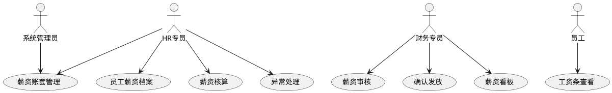

#### 用例描述
| 编号 | 用例名称 | 参与者 | 前置条件 | 后置条件 | 业务描述 |
| --- | --- | --- | --- | --- | --- |
| UC-11-01 | 薪资账套管理 | 系统管理员/HR | 已登录 | 账套数据变更 | 创建和维护薪资账套，配置工资项目和适用范围 |
| UC-11-02 | 员工薪资档案 | HR | 已登录 | 档案保存 | 查看和维护员工涉薪信息，包含脱敏展示 |
| UC-11-03 | 薪资核算 | HR | 已创建批次 | 核算结果生成 | 触发薪资批次计算，预览核算结果 |
| UC-11-04 | 异常处理 | HR | 核算完成 | 异常已处理 | 处理核算中的黄色/红色/阻断异常 |
| UC-11-05 | 薪资审核 | 财务专员 | 异常已处理 | 审核通过/驳回 | 审核薪资批次，进行财务审批操作 |
| UC-11-06 | 确认发放 | 财务专员 | 已审核 | 发放完成 | 确认薪资发放，生成发放记录 |
| UC-11-07 | 工资条查看 | 员工 | 已登录 | 展示工资条 | 二次验证后查看个人工资条明细 |
| UC-11-08 | 薪资看板 | HR/财务 | 已登录 | 展示图表 | 查看薪资趋势、部门分布、构成分析 |


### 11.2 模块目标
薪资管理模块覆盖薪资账套、员工薪资档案、薪资批次、核算预览、异常处理、审批提交、工资条和薪资看板。前端重点保障涉薪数据安全、状态流转清晰、金额展示准确。

### 11.3 页面范围
| 页面 | 建议路由 | 主要功能 |
| --- | --- | --- |
| 薪资账套列表页 | `/salary/templates` | 薪资模板查询、新增、编辑、启停、删除 |
| 薪资账套表单与工资项目页 | `/salary/templates/new`、`/salary/templates/:id/edit` | 工资项目、适用范围、计算项配置 |
| 员工薪资档案页 | `/salary/employee-profiles` | 员工涉薪档案、调薪历史、权限脱敏 |
| 薪资批次列表页 | `/salary/batches` | 批次创建、触发核算、提交审批、确认发放 |
| 薪资批次详情与预览页 | `/salary/batches/:id` | 批次摘要、员工级薪资预览、异常汇总 |
| 薪资异常处理页 | `/salary/batches/:id/exceptions` | 黄色/红色/阻断异常处理 |
| 薪资可视化看板页 | `/salary/dashboard` | 薪资趋势、部门分布、构成占比、异常统计 |
| 我的工资条页 | `/salary/my-payslip` | 二次验证、工资条详情、近 6 月趋势 |
| 工资条查看日志页 | `/salary/payslip-logs` | HR/审计查询工资条查看日志 |


### 11.4 界面形态
产品说明书中薪资模块给出了薪资账套、薪资核算预览、工资条等原型。前端界面应突出“金额安全”“状态流程”“异常识别”：

| 页面 | 界面形态描述 |
| --- | --- |
| 薪资账套列表页 | 表格型页面，顶部筛选账套名称、适用范围、状态；表格展示账套名称、适用范围、生效日期、工资项目数量、状态；操作列提供编辑、启停、删除。 |
| 薪资账套表单页 | 复杂配置页，左侧或上方为账套基本信息，下面为工资项目配置表；工资项目按固定收入、变动收入、考勤扣款、社保、公积金、个税分类展示。 |
| 员工薪资档案页 | 搜索区 + 员工薪资档案表格；金额字段按权限脱敏；点击员工打开抽屉，展示适用账套、基本工资、津贴基数、社保公积金基数、调薪历史。 |
| 薪资批次列表页 | 表格展示薪资月份、范围、人数、批次状态、异常数量、创建时间；状态包括草稿、计算中、待确认、审批中、已通过、已发放、已驳回；操作按钮随状态变化。 |
| 薪资批次详情页 | 顶部为批次摘要和状态步骤条；中间为异常汇总卡片；下方为员工级薪资预览表格，金额列较多时横向滚动；异常员工行用黄色/红色/阻断标识。 |
| 薪资异常处理页 | 异常列表聚焦员工、异常编码、级别、说明、处理状态；不同级别用颜色区分；处理异常使用弹窗填写确认原因或备注。 |
| 薪资看板页 | 看板式布局，包含薪资成本趋势折线图、部门薪资分布柱状图、薪资构成环形图、社保公积金对比柱状图、薪资变动分布直方图。 |
| 我的工资条页 | 上方选择薪资月份并展示近 6 月趋势；点击查看先弹出二次验证；通过后用工资条详情弹窗展示收入、扣除、应发、应扣、实发，版式接近纸质工资条。 |
| 工资条日志页 | 审计表格形态，展示员工、月份、验证方式、验证状态、查看 IP、查看时间；失败日志使用异常色提示。 |


#### 核心原型图
#### <!-- 这是一张图片，ocr 内容为： -->

图 11-1 薪资账套页原型：展示账套列表、工资项目标签和账套配置抽屉。

##### 页面元素 → 字段映射
| 页面元素 | 对应字段 | 说明 |
| --- | --- | --- |
| 账套名称查询 | `templateName` | 搜索条件 |
| 适用范围筛选 | `scope` | 部门树选择 |
| 状态筛选 | `status` | 下拉 |
| 账套名称列 | `templateName` | 表格展示 |
| 适用范围列 | `scopeName` | 表格展示 |
| 生效日期列 | `effectiveDate` | 表格展示 |
| 工资项目数量列 | `itemCount` | 表格展示 |
| 状态列 | `status` | Tag 展示 |
| 编辑按钮 | — | 打开账套配置抽屉 |
| 启停按钮 | — | 切换账套状态 |
| 工资项目标签 | `salaryItems` | Tag 展示各工资项目分类：固定收入/变动收入/社保/公积金/个税 |


<!-- 这是一张图片，ocr 内容为： -->


图 11-2 薪资批次详情原型：展示批次摘要、状态步骤条、异常汇总和薪资预览表。

##### 页面元素 → 字段映射
| 页面元素 | 对应字段 | 说明 |
| --- | --- | --- |
| 批次摘要信息 | `batchSummary` | 包含月份、人数、总额等摘要数据 |
| 状态步骤条 | `status` | 草稿→计算中→待确认→审批中→已通过→已发放 |
| 异常汇总卡片 | `exceptionSummary` | 黄色/红色/阻断异常数量汇总 |
| 员工薪酬预览表 | `previewRecords` | 员工级薪酬明细表格 |
| 异常标记 | `exceptionLevel` | 存在异常的行显示黄色/红色/阻断标记 |


<!-- 这是一张图片，ocr 内容为： -->


图 11-3 薪资异常处理原型：展示异常级别、处理状态和异常处理弹窗。

##### 页面元素 → 字段映射
| 页面元素 | 对应字段 | 说明 |
| --- | --- | --- |
| 员工姓名列 | `employeeName` | 表格展示 |
| 异常编码列 | `exceptionCode` | 表格展示 |
| 异常级别列 | `level` | Tag 展示：yellow / red / block |
| 异常说明列 | `message` | 表格展示 |
| 处理状态列 | `resolveStatus` | Tag 展示：待处理/已处理 |
| 处理按钮 | — | 打开异常处理弹窗 |
| 处理备注输入 | `remark` | 弹窗表单字段 |
| 确认处理按钮 | — | 提交 `PATCH /api/v1/salary/exceptions/{id}/resolve` |


<!-- 这是一张图片，ocr 内容为： -->


图 11-4 我的工资条原型：展示薪资趋势、工资条列表、二次验证和工资条详情。

##### 页面元素 → 字段映射
| 页面元素 | 对应字段 | 说明 |
| --- | --- | --- |
| 近 6 月薪资趋势图 | `trendData` | AntV 折线图 |
| 工资条月份列表 | `payslipList` | 按月展示 |
| 查看按钮 | — | 触发二次验证弹窗 |
| 二次验证弹窗 | — | 密码或短信验证码验证 |
| 工资条详情弹窗 | — | 展示收入项、扣除项、应发、应扣、实发 |


### 11.5 前端规则
#### 薪资核算与审核流转时序
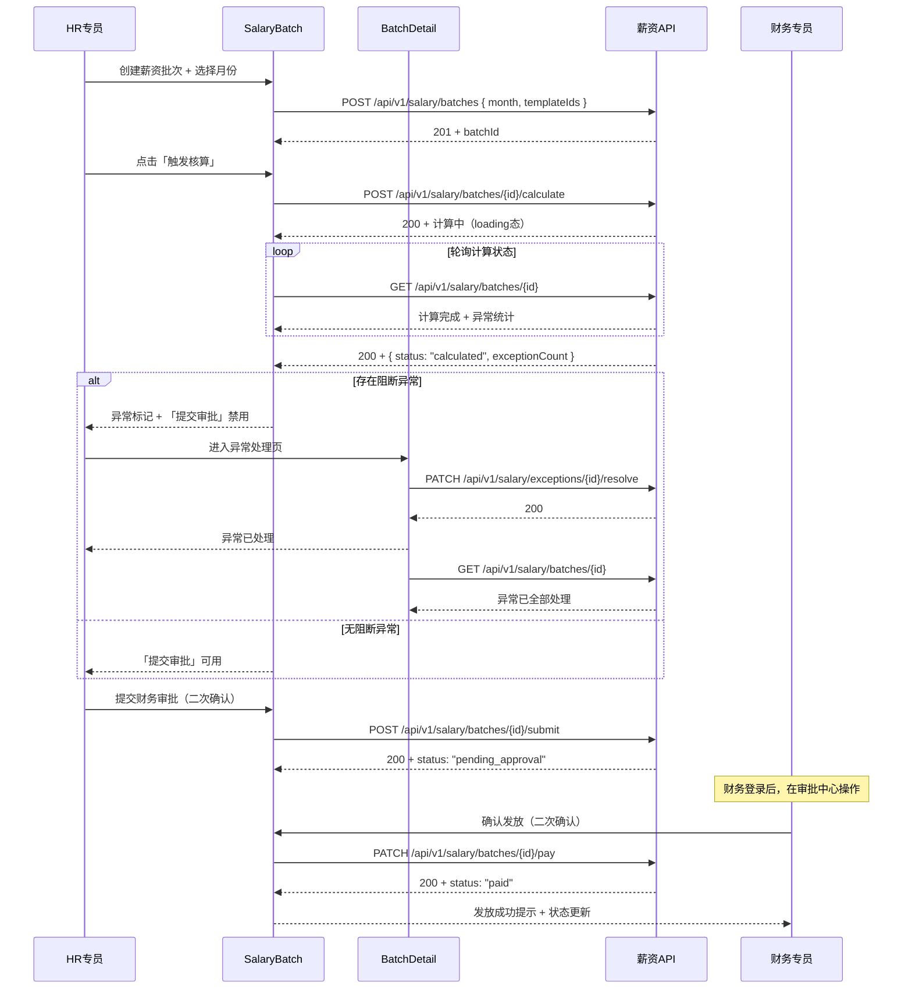

+ 涉薪金额统一格式化，保留 2 位小数。
+ 涉薪字段按权限脱敏，普通员工只能查看本人已开放工资条。
+ 工资条详情需二次验证，验证通过后再加载明细。
+ 工资条明细不写入本地持久化存储，离开页面清理敏感状态。
+ 薪资批次存在阻断异常时，提交审批按钮禁用。
+ 薪资批次计算、提交审批、确认发放等关键操作必须 loading、防重复提交、二次确认。

### 11.6 接口依赖
#### `GET /api/v1/salary/templates` — 薪资账套列表
**入参：**

| 字段 | 类型 | 说明 |
| --- | --- | --- |
| `templateName` | `string` | 账套名称搜索 |
| `status` | `string` | 状态筛选 |
| `pageNum` | `number` | 页码，默认 1 |
| `pageSize` | `number` | 每页条数，默认 20 |


**出参：**

| 字段 | 类型 | 说明 |
| --- | --- | --- |
| `records` | `SalaryTemplate[]` | 账套列表 |
| `total` | `number` | 总记录数 |


`SalaryTemplate`**：**

| 字段 | 类型 | 说明 |
| --- | --- | --- |
| `id` | `number` | 账套 ID |
| `templateName` | `string` | 账套名称 |
| `scopeDeptIds` | `number[]` | 适用范围部门 ID 列表 |
| `scopeDeptNames` | `string[]` | 适用范围部门名称 |
| `effectiveDate` | `string` | 生效日期 |
| `itemCount` | `number` | 工资项目数量 |
| `status` | `string` | active / disabled |


---

#### `POST /api/v1/salary/templates` — 创建薪资账套
**入参：**

| 字段 | 类型 | 说明 |
| --- | --- | --- |
| `templateName` | `string` | 账套名称，必填 |
| `scopeDeptIds` | `number[]` | 适用范围部门 ID 列表 |
| `effectiveDate` | `string` | 生效日期 |
| `salaryItems` | `SalaryItem[]` | 工资项目配置 |


**出参：** `{ id: number }`

---

#### `PUT /api/v1/salary/templates/{id}` — 更新薪资账套
**入参：** 同 `POST /api/v1/salary/templates`

**出参：** `{ success: boolean }`

---

#### `GET /api/v1/salary/employee-profiles` — 员工薪资档案
**入参：** `{ keyword?, departmentId?, pageNum, pageSize }`

**出参：**

| 字段 | 类型 | 说明 |
| --- | --- | --- |
| `records` | `EmployeeSalaryProfile[]` | 员工薪资档案列表 |
| `total` | `number` | 总记录数 |


`EmployeeSalaryProfile`**：**

| 字段 | 类型 | 说明 |
| --- | --- | --- |
| `employeeId` | `number` | 员工 ID |
| `employeeName` | `string` | 员工姓名 |
| `employeeNo` | `string` | 工号 |
| `templateId` | `number` | 适用账套 ID |
| `templateName` | `string` | 账套名称 |
| `baseSalary` | `number` | 基本工资（脱敏） |
| `allowanceBase` | `number` | 津贴基数（脱敏） |
| `socialSecurityBase` | `number` | 社保基数（脱敏） |
| `housingFundBase` | `number` | 公积金基数（脱敏） |
| `adjustHistory` | `AdjustRecord[]` | 调薪历史 |


---

#### `GET /api/v1/salary/batches` — 薪资批次列表
**入参：**

| 字段 | 类型 | 说明 |
| --- | --- | --- |
| `month` | `string` | 薪资月份筛选 |
| `status` | `string` | 状态筛选 |
| `pageNum` | `number` | 页码，默认 1 |
| `pageSize` | `number` | 每页条数，默认 20 |


**出参：**

| 字段 | 类型 | 说明 |
| --- | --- | --- |
| `records` | `SalaryBatch[]` | 批次列表 |
| `total` | `number` | 总记录数 |


`SalaryBatch`**：**

| 字段 | 类型 | 说明 |
| --- | --- | --- |
| `id` | `number` | 批次 ID |
| `month` | `string` | 薪资月份 |
| `scopeName` | `string` | 适用范围 |
| `employeeCount` | `number` | 人数 |
| `exceptionCount` | `number` | 异常数量 |
| `status` | `string` | draft / calculating / calculated / pending_approval / approved / paid / rejected |
| `createdAt` | `string` | 创建时间 |


---

#### `POST /api/v1/salary/batches` — 创建薪资批次
**入参：**

| 字段 | 类型 | 说明 |
| --- | --- | --- |
| `month` | `string` | 薪资月份，必填，如 `2026-07` |
| `templateIds` | `number[]` | 账套 ID 列表，必填 |


**出参：** `{ id: number }`

---

#### `POST /api/v1/salary/batches/{id}/calculate` — 触发薪资核算
**入参：** 路径参数 `id`

**出参：** `{ status: string }`（返回 `calculating`，前端轮询批次状态）

---

#### `GET /api/v1/salary/batches/{id}/preview` — 薪资预览
**入参：** 路径参数 `id`

**出参：**

| 字段 | 类型 | 说明 |
| --- | --- | --- |
| `batchSummary` | `object` | 批次摘要：总人数、总应发、总实发 |
| `previewRecords` | `PreviewRecord[]` | 员工级预览记录 |


`PreviewRecord`**：**

| 字段 | 类型 | 说明 |
| --- | --- | --- |
| `employeeId` | `number` | 员工 ID |
| `employeeName` | `string` | 员工姓名 |
| `grossPay` | `number` | 应发合计 |
| `deductions` | `number` | 应扣合计 |
| `netPay` | `number` | 实发合计 |
| `exceptionLevel` | `string` | none / yellow / red / block |


---

#### `GET /api/v1/salary/batches/{id}/exceptions` — 薪资异常列表
**入参：** 路径参数 `id`

**出参：**

| 字段 | 类型 | 说明 |
| --- | --- | --- |
| `records` | `SalaryException[]` | 异常记录列表 |
| `total` | `number` | 总记录数 |


`SalaryException`**：**

| 字段 | 类型 | 说明 |
| --- | --- | --- |
| `id` | `number` | 异常 ID |
| `employeeName` | `string` | 员工姓名 |
| `exceptionCode` | `string` | 异常编码 |
| `level` | `string` | yellow / red / block |
| `message` | `string` | 异常说明 |
| `resolveStatus` | `string` | pending / resolved |


---

#### `PATCH /api/v1/salary/exceptions/{id}/resolve` — 处理异常
**入参：**

| 字段 | 类型 | 说明 |
| --- | --- | --- |
| `remark` | `string` | 处理备注 |


**出参：** `{ success: boolean }`

---

#### `POST /api/v1/salary/batches/{id}/submit` — 提交财务审批
**入参：** 路径参数 `id`

**出参：** `{ status: string }`（返回 `pending_approval`）

---

#### `PATCH /api/v1/salary/batches/{id}/pay` — 确认发放
**入参：** 路径参数 `id`

**出参：** `{ status: string }`（返回 `paid`）

---

#### `POST /api/v1/salary/payslips/{month}/verify` — 工资条二次验证
**入参：** 路径参数 `month`

| 字段 | 类型 | 说明 |
| --- | --- | --- |
| `verifyType` | `string` | password / sms |
| `verifyValue` | `string` | 密码或短信验证码 |


**出参：** `{ token: string }`（工资条临时访问凭证）

---

#### `GET /api/v1/salary/payslips/{month}` — 查看工资条
**入参：**

| 字段 | 类型 | 说明 |
| --- | --- | --- |
| `verifyToken` | `string` | 二次验证获取的临时凭证 |


**出参：**

| 字段 | 类型 | 说明 |
| --- | --- | --- |
| `incomeItems` | `PayItem[]` | 收入项明细 |
| `deductionItems` | `PayItem[]` | 扣除项明细 |
| `grossPay` | `number` | 应发合计 |
| `grossDeduction` | `number` | 应扣合计 |
| `netPay` | `number` | 实发合计 |
| `baseSalary` | `number` | 基本工资 |


---

#### `GET /api/v1/salary/batches/{id}/visualization` — 薪资可视化
**入参：** 路径参数 `id`

**出参：**

| 字段 | 类型 | 说明 |
| --- | --- | --- |
| `costTrend` | `array` | 薪资成本趋势数据 |
| `deptDistribution` | `array` | 部门薪资分布 |
| `salaryComposition` | `array` | 薪资构成占比 |
| `exceptionStats` | `object` | 异常统计 |


---

## 12. 模块 M7：审批中心 approval
### 12.1 用例分析
#### 用例图
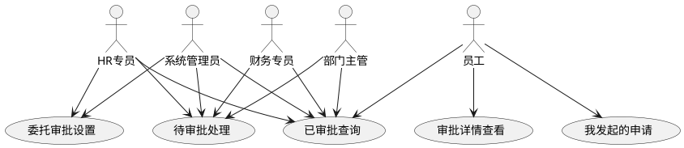

#### 用例描述
| 编号 | 用例名称 | 参与者 | 前置条件 | 后置条件 | 业务描述 |
| --- | --- | --- | --- | --- | --- |
| UC-12-01 | 待审批处理 | 管理员/HR/主管/财务 | 有审批权限 | 审批状态变更 | 查看和操作待审批任务，包含通过/拒绝/转交 |
| UC-12-02 | 已审批查询 | 全部登录用户 | 已登录 | 展示审批历史 | 按条件查询已审批的历史任务 |
| UC-12-03 | 我发起的申请 | 全部登录用户 | 已登录 | 展示申请列表 | 查看个人发起的审批申请及当前状态 |
| UC-12-04 | 审批详情查看 | 全部登录用户 | 已登录 | 展示审批详情 | 查看申请内容、审批进度、审批历史 |
| UC-12-05 | 委托审批设置 | 管理员/HR | 已登录 | 委托生效 | 配置委托审批规则，指定被委托人和有效期 |


### 12.2 模块目标
审批中心是所有流程类业务的统一前端入口，集中展示待审批、已审批、我发起的申请，并提供审批详情、审批操作和委托审批能力。

说明：原审批中心系分包含后端数据库、审批流程引擎、委托关系、并发安全等设计。本文档仅保留前端视角，即页面、交互、状态、权限、接口依赖和联调边界。

### 12.3 页面范围
| 页面 | 建议路由 | 主要功能 |
| --- | --- | --- |
| 审批工作台 | `/approval/workspace` 或 `/approval/pending` | 待审批、已审批、我发起的三个 Tab |
| 审批详情页 | `/approval/detail?id={id}` 或 `/approval/detail/:id` | 申请内容、审批进度、审批历史、审批操作 |
| 委托审批设置页 | `/approval/delegation` | 当前委托、新建委托、取消委托 |


### 12.4 界面形态
产品说明书中审批中心原型强调“审批人工作台、审批详情页、委托审批”。前端界面补充如下：

| 页面 | 界面形态描述 |
| --- | --- |
| 审批工作台 | 页面顶部为 Tab：待审批、已审批、我发起的；Tab 标题可显示数量角标。Tab 下方为搜索区，包含业务类型、关键词和时间范围。主体为审批任务表格，字段包括申请人、申请类型、申请时间、截止时间、当前节点、状态。 |
| 审批详情页 | 详情页采用上下结构：顶部为标题和状态摘要，中间为申请内容分组展示，随后是审批进度 Steps 和审批历史 Timeline，底部为审批操作区。当前审批人可见通过、拒绝、转交按钮。 |
| 委托审批设置页 | 上方为当前生效委托提示卡片，中间为新建委托表单，下方为委托记录表格；取消委托使用二次确认弹窗。 |


#### 核心原型图
<!-- 这是一张图片，ocr 内容为： -->


图 12-1 审批工作台原型：展示待审批、已审批、我发起的 Tab 和审批任务表格。

##### 页面元素 → 字段映射
| 页面元素 | 对应字段 | 说明 |
| --- | --- | --- |
| 待审批 Tab | — | 默认展示，显示待办数量角标 |
| 已审批 Tab | — | 展示已审批历史 |
| 我发起的 Tab | — | 展示当前用户发起的申请 |
| 业务类型筛选 | `businessType` | 下拉筛选 |
| 关键词搜索 | `keyword` | 搜索条件 |
| 时间范围筛选 | `dateRange` | 日期范围选择器 |
| 申请标题列 | `title` | 表格展示 |
| 申请人列 | `applicantName` | 表格展示 |
| 业务类型列 | `businessTypeName` | 表格展示 |
| 申请时间列 | `createdAt` | 表格展示 |
| 截止时间列 | `deadline` | 表格展示，<24h标黄，<6h标红 |
| 当前节点列 | `currentNodeName` | 表格展示 |
| 状态列 | `status` | Tag 展示：待审批/已通过/已拒绝 |


<!-- 这是一张图片，ocr 内容为： -->


图 12-2 审批详情页原型：展示申请内容、审批步骤、审批历史和审批操作区。

##### 页面元素 → 字段映射
| 页面元素 | 对应字段 | 说明 |
| --- | --- | --- |
| 标题 | `title` | 页面顶部展示 |
| 状态摘要 | `statusName` | 页面顶部状态展示 |
| 业务类型 | `businessTypeName` | 基础信息区 |
| 申请人 | `applicantName` | 基础信息区 |
| 申请时间 | `createdAt` | 基础信息区 |
| 申请内容区 | — | 根据 `businessType` 动态渲染 |
| 审批进度 Steps | `approvalNodes` | 已完成/当前/待处理节点 |
| 审批历史 Timeline | `approvalHistory` | 处理人、节点、意见、时间 |
| 通过按钮 | — | 可填写意见 |
| 拒绝按钮 | — | 意见必填 |
| 转交按钮 | — | 弹出选择用户弹窗 |


<!-- 这是一张图片，ocr 内容为： -->


图 12-3 委托审批设置原型：展示当前委托、新建委托表单和委托记录。

##### 页面元素 → 字段映射
| 页面元素 | 对应字段 | 说明 |
| --- | --- | --- |
| 当前生效委托提示卡片 | `activeDelegation` | 展示当前生效的委托信息 |
| 被委托人选择器 | `delegateeId` | 员工选择器，必填 |
| 生效时间 | `startTime` | 日期时间选择器，必填 |
| 结束时间 | `endTime` | 日期时间选择器，必填，晚于生效时间 |
| 委托原因 | `reason` | 文本输入框 |
| 委托记录表格 | `delegationRecords` | 历史委托列表 |
| 取消委托按钮 | — | 二次确认后调 `PUT /api/v1/approval/delegation/{id}/cancel` |


### 12.5 审批工作台设计
#### 审批操作时序
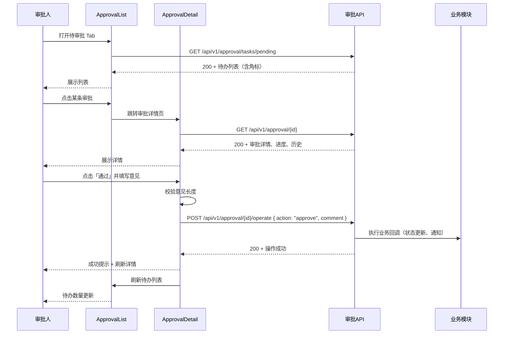

+ 默认展示待审批 Tab，数字角标显示待办数量。
+ 搜索区包含业务类型下拉、关键词输入、查询、重置。
+ 待审批列表显示申请标题、申请人、业务类型、申请时间、截止时间。
+ 截止时间小于 24 小时标黄，小于 6 小时标红。
+ 点击列表行进入审批详情页。
+ 支持空状态、加载态、错误态和重试。
+ Tab 切换时保留筛选条件、分页和滚动位置。

### 12.6 审批详情页设计
页面从上到下分为：

1. 基础信息区：标题、业务类型、状态、申请人、申请时间。
2. 申请内容区：根据 `businessType` 动态渲染业务字段。
3. 审批进度区：使用 Steps 展示已完成、当前、待处理节点。
4. 审批历史区：使用 Timeline 展示处理人、节点、意见和时间。
5. 审批操作区：仅当前审批人且节点待处理时展示。

审批操作：

| 操作 | 前端规则 |
| --- | --- |
| 通过 | 可填写意见，提交后刷新详情和列表 |
| 拒绝 | 审批意见必填，输入框校验提示 |
| 转交 | 弹出选择用户弹窗，选择目标审批人后提交 |


### 12.7 委托审批设计
+ 页面初始化加载我的委托记录。
+ 新建委托需选择被委托人、生效时间、结束时间和委托原因。
+ 前端校验结束时间必须晚于开始时间，且不能选择过去时间。
+ 取消委托需二次确认。
+ 操作成功后刷新委托列表。

### 12.8 接口依赖
#### `GET /api/v1/approval/tasks/pending` — 待审批列表
**入参：**

| 字段 | 类型 | 说明 |
| --- | --- | --- |
| `businessType` | `string` | 业务类型筛选 |
| `keyword` | `string` | 关键词搜索 |
| `dateRange` | `string[]` | 时间范围 |
| `pageNum` | `number` | 页码，默认 1 |
| `pageSize` | `number` | 每页条数，默认 20 |


**出参：**

| 字段 | 类型 | 说明 |
| --- | --- | --- |
| `records` | `ApprovalTask[]` | 待审批任务列表 |
| `total` | `number` | 总记录数 |
| `badgeCount` | `number` | 待办数量角标 |


`ApprovalTask`**：**

| 字段 | 类型 | 说明 |
| --- | --- | --- |
| `id` | `number` | 审批 ID |
| `title` | `string` | 申请标题 |
| `applicantName` | `string` | 申请人 |
| `businessType` | `string` | 业务类型 |
| `businessTypeName` | `string` | 业务类型名称 |
| `createdAt` | `string` | 申请时间 |
| `deadline` | `string` | 截止时间 |
| `currentNodeName` | `string` | 当前审批节点 |
| `status` | `string` | 状态 |


---

#### `GET /api/v1/approval/tasks/history` — 已审批列表
**入参：** 同待审批列表入参

**出参：** `{ records: ApprovalTask[], total: number }`

---

#### `GET /api/v1/approval/my-applications` — 我发起的申请
**入参：** `{ status?, pageNum, pageSize }`

**出参：** `{ records: ApprovalTask[], total: number }`

---

#### `GET /api/v1/approval/{id}` — 审批详情
**入参：** 路径参数 `id`

**出参：**

| 字段 | 类型 | 说明 |
| --- | --- | --- |
| `title` | `string` | 标题 |
| `businessType` | `string` | 业务类型 |
| `businessTypeName` | `string` | 业务类型名称 |
| `status` | `string` | 状态 |
| `statusName` | `string` | 状态中文名 |
| `applicantName` | `string` | 申请人 |
| `createdAt` | `string` | 申请时间 |
| `formData` | `object` | 申请内容（按业务类型动态） |
| `approvalNodes` | `ApprovalNode[]` | 审批节点列表（Steps 用） |
| `approvalHistory` | `ApprovalHistory[]` | 审批历史（Timeline 用） |
| `currentOperator` | `boolean` | 当前用户是否为当前审批人 |


`ApprovalNode`**：**

| 字段 | 类型 | 说明 |
| --- | --- | --- |
| `nodeName` | `string` | 节点名称 |
| `status` | `string` | completed / current / pending |
| `operatorName` | `string` | 处理人（completed 时有） |


`ApprovalHistory`**：**

| 字段 | 类型 | 说明 |
| --- | --- | --- |
| `operatorName` | `string` | 处理人 |
| `nodeName` | `string` | 节点名称 |
| `action` | `string` | approve / reject / transfer |
| `actionName` | `string` | 操作中文名 |
| `comment` | `string` | 审批意见 |
| `operatedAt` | `string` | 处理时间 |


---

#### `POST /api/v1/approval/{id}/operate` — 审批操作
**入参：**

| 字段 | 类型 | 说明 |
| --- | --- | --- |
| `action` | `string` | approve / reject / transfer |
| `comment` | `string` | 审批意见 |
| `targetUserId` | `number` | 转交目标用户 ID（action=transfer 时必填） |


**出参：** `{ success: boolean }`

---

#### `POST /api/v1/approval/{id}/withdraw` — 撤回申请
**入参：** 路径参数 `id`

**出参：** `{ success: boolean }`

---

#### `POST /api/v1/approval/delegation` — 新建委托
**入参：**

| 字段 | 类型 | 说明 |
| --- | --- | --- |
| `delegateeId` | `number` | 被委托人 ID，必填 |
| `startTime` | `string` | 生效时间，必填 |
| `endTime` | `string` | 结束时间，必填 |
| `reason` | `string` | 委托原因 |


**出参：** `{ id: number }`

---

#### `PUT /api/v1/approval/delegation/{id}/cancel` — 取消委托
**入参：** 路径参数 `id`

**出参：** `{ success: boolean }`

---

#### `GET /api/v1/approval/delegation/my` — 我的委托
**出参：**

| 字段 | 类型 | 说明 |
| --- | --- | --- |
| `activeDelegation` | `Delegation` | 当前生效的委托 |
| `records` | `Delegation[]` | 历史委托记录 |


`Delegation`**：**

| 字段 | 类型 | 说明 |
| --- | --- | --- |
| `id` | `number` | 委托 ID |
| `delegateeName` | `string` | 被委托人姓名 |
| `startTime` | `string` | 生效时间 |
| `endTime` | `string` | 结束时间 |
| `reason` | `string` | 委托原因 |
| `status` | `string` | active / expired / cancelled |


---

## 13. 模块 M8：个人中心 mycenter/profile
### 13.1 用例分析
#### 用例图


#### 用例描述
| 编号 | 用例名称 | 参与者 | 前置条件 | 后置条件 | 业务描述 |
| --- | --- | --- | --- | --- | --- |
| UC-13-01 | 个人档案查看 | 员工 | 已登录 | 展示分组档案 | 查看个人档案信息，敏感字段按权限脱敏展示 |
| UC-13-02 | 个人档案编辑 | 员工 | 已登录 | 档案数据变更 | 编辑允许自助维护的个人档案字段 |
| UC-13-03 | 考勤日历查询 | 员工 | 已登录 | 展示考勤月历 | 查看个人月度考勤状态和打卡详情 |
| UC-13-04 | 网页打卡 | 员工 | 已登录 | 打卡记录生成 | 通过快捷入口进行上班/下班打卡 |
| UC-13-05 | 提交请假 | 员工 | 已登录 | 提交审批 | 提交请假申请，查看假期余额 |
| UC-13-06 | 工资条查看 | 员工 | 已登录 | 展示工资明细 | 二次验证后查看个人工资条 |
| UC-13-07 | 修改密码 | 员工 | 已登录 | 密码变更 | 修改登录密码，校验旧密码和复杂度 |
| UC-13-08 | 绑定手机 | 员工 | 已登录 | 手机绑定 | 绑定或解绑手机号码，短信验证 |
| UC-13-09 | 加班申请 | 员工 | 已登录 | 提交审批 | 提交加班申请，选择加班日期和时长，进入审批流程 |
| 个人中心是面向所有登录用户，尤其是普通员工的一站式自助入口。前端提供我的档案、我的考勤、我的请假、我的薪资、账号安全等页面，使员工能够自助查看和发起个人相关业务。 |  |  |  |  |  |


说明：原个人中心系分包含数据库表、脱敏后端实现、假期余额计算、数据权限拦截等后端设计。本文档仅保留前端页面、交互、权限、接口依赖和安全展示规则。

### 13.3 页面范围
| 页面 | 路由 | 主要功能 |
| --- | --- | --- |
| 个人中心首页 | `/profile` 或 `/profile/index` | 个人信息摘要、快捷入口、待办提醒 |
| 我的档案 | `/profile/archive` | 档案查看、字段脱敏、可编辑字段维护 |
| 我的考勤 | `/profile/attendance` | 考勤日历、打卡状态、补卡申请、加班申请、月统计 |
| 我的请假 | `/profile/leave` | 请假记录、提交请假、余额展示、取消申请 |
| 我的薪资 | `/profile/salary` | 工资条列表、二次验证、工资条详情、薪资趋势 |
| 账号安全 | `/profile/security` | 修改密码、手机绑定/解绑、登录日志 |


### 13.4 界面形态
产品说明书中个人中心按“我的档案、我的考勤、我的请假、我的薪资、账号安全”划分。前端界面补充如下：

| 页面 | 界面形态描述 |
| --- | --- |
| 个人中心首页 | 顶部为个人信息摘要卡片，展示头像、姓名、工号、部门、职位；下方为快捷入口宫格或列表，包含我的档案、我的考勤、我的请假、我的薪资、账号安全；右侧或下方展示我的申请进度和待处理提醒。 |
| 我的档案 | 信息详情页形态，按基础信息、个人信息、工作信息、紧急联系人分组；可编辑字段旁显示编辑入口，锁定字段显示只读和“如需修改请联系 HR”提示。 |
| 我的考勤 | 上方为本月考勤统计卡片和打卡入口；主体为月历视图，使用颜色标记出勤、请假、迟到、缺卡；点击日期可查看详情并发起补卡。 |
| 我的请假 | 顶部为假期余额卡片；中部为请假记录 Tab 和列表；右上角为“提交请假”；请假表单用弹窗或抽屉展示，包含时间、类型、事由、附件、交接人。 |
| 我的薪资 | 顶部展示近 6 月薪资趋势折线图；下方是工资条月份列表；查看详情前弹出二次验证框，验证通过后展示工资条详情弹窗。 |
| 账号安全 | 设置列表形态，上半部分展示登录密码、绑定手机等安全项及操作按钮；下半部分展示登录日志表格；修改密码和绑定手机均使用弹窗表单。 |


#### 核心原型图
<!-- 这是一张图片，ocr 内容为： -->


图 13-1 个人中心首页原型：展示个人摘要、快捷入口、申请进度和个人提醒。

##### 页面元素 → 字段映射
| 页面元素 | 对应字段 | 说明 |
| --- | --- | --- |
| 个人摘要卡片 | `employeeName` / `employeeNo` / `departmentName` / `positionName` | 头像、姓名、工号、部门、职位 |
| 快捷入口宫格 | — | 我的档案、我的考勤、我的请假、我的薪资、账号安全 |
| 申请进度区域 | — | 展示待审批/进行中的申请列表 |
| 待办提醒 | — | 待审批数量、待处理事项 |


<!-- 这是一张图片，ocr 内容为： -->


图 13-2 我的档案原型：展示个人档案分组、可编辑字段和锁定字段提示。

##### 页面元素 → 字段映射
| 页面元素 | 对应字段 | 说明 |
| --- | --- | --- |
| 基础信息分组 | — | 姓名、性别、出生日期、民族 |
| 个人信息分组 | — | 手机号、邮箱、身份证号（脱敏）、紧急联系人 |
| 工作信息分组 | — | 工号、部门、职位、职级、入职日期 |
| 紧急联系人分组 | — | 姓名、关系、电话 |
| 可编辑字段 | `editableFields` | 显示编辑入口 |
| 锁定字段 | `flowFields` | 显示"如需修改请联系 HR"提示 |


<!-- 这是一张图片，ocr 内容为： -->


图 13-3 我的考勤原型：展示个人考勤统计、考勤日历和补卡入口。

##### 页面元素 → 字段映射
| 页面元素 | 对应字段 | 说明 |
| --- | --- | --- |
| 月度考勤统计卡片 | `statistics` | 出勤/迟到/早退/缺卡/请假 |
| 考勤月历 | `calendarData` | 月视图，颜色标记每日状态 |
| 打卡入口 | — | 上班/下班打卡按钮 |
| 补卡入口 | — | 缺卡日期上的补卡申请按钮 |


<!-- 这是一张图片，ocr 内容为： -->


图 13-4 我的薪资原型：展示薪资趋势、工资条列表和工资条详情。

##### 页面元素 → 字段映射
| 页面元素 | 对应字段 | 说明 |
| --- | --- | --- |
| 近 6 月薪资趋势图 | `trendData` | 折线图 |
| 工资条月份列表 | `payslipList` | 按月分页展示 |
| 查看按钮 | — | 触发二次验证弹窗 |
| 二次验证弹窗 | — | 密码或短信验证码 |
| 工资条详情 | — | 收入项、扣除项、应发、应扣、实发 |


<!-- 这是一张图片，ocr 内容为： -->


图 13-5 账号安全原型：展示安全设置、修改密码弹窗和登录日志。

##### 页面元素 → 字段映射
| 页面元素 | 对应字段 | 说明 |
| --- | --- | --- |
| 修改密码入口 | — | 打开修改密码弹窗 |
| 旧密码输入框 | `oldPassword` | 弹窗字段，必填 |
| 新密码输入框 | `newPassword` | 弹窗字段，必填，需满足复杂度 |
| 确认密码输入框 | `confirmPassword` | 弹窗字段，与新密码一致 |
| 绑定手机入口 | — | 打开绑定手机弹窗 |
| 手机号输入框 | `phone` | 弹窗字段 |
| 短信验证码输入 | `smsCode` | 弹窗字段，含倒计时 |
| 登录日志表格 | `loginLogs` | 时间倒序分页展示 |
| 登录时间列 | `loginTime` | 日志表格列 |
| IP 地址列 | `ipAddress` | 日志表格列 |
| 设备信息列 | `deviceInfo` | 日志表格列 |


### 13.5 个人中心首页
+ 展示员工姓名、部门、职位、头像或默认头像。
+ 展示我的档案、我的考勤、我的请假、我的薪资、账号安全快捷入口。
+ 普通员工的核心业务入口集中在个人中心。
+ 根据权限决定入口是否显示，例如薪资入口可见但详情需二次验证。

### 13.6 我的档案
+ 分组展示基本信息、个人信息、工作信息、紧急联系人。
+ 身份证号、银行卡号、薪资等敏感字段按后端返回结果展示，不在前端自行还原。
+ `editableFields` 中的字段显示编辑按钮。
+ `flowRequiredFields` 中的字段显示“如需修改请联系 HR/走流程”提示。
+ 保存时只提交可编辑字段。

### 13.7 我的考勤
+ 月视图日历展示每日考勤状态。
+ 使用不同颜色标识正常、迟到、早退、缺卡、请假、休息日。
+ 打卡按钮根据当天状态置灰或高亮。
+ 缺卡日期提供补卡申请入口。
+ 月度统计以卡片展示出勤、迟到、早退、缺卡、请假等数据。

### 13.8 我的请假
+ 顶部展示年假、调休等假期余额。
+ 支持全部、审批中、已通过、已拒绝等状态 Tab。
+ 新建请假表单包含请假类型、开始时间、结束时间、事由、附件、工作交接人。
+ 请假天数根据起止时间自动计算。
+ 病假、婚假、产假等类型可动态要求上传附件。
+ 审批中的申请可取消，取消需二次确认。

### 13.9 我的薪资
+ 展示近 6 个月实发工资趋势。
+ 工资条列表按月份分页。
+ 点击查看工资条时，如果未完成二次验证，则弹出密码或短信验证码验证弹窗。
+ 验证通过后展示工资条详情，包括收入项、扣除项、应发、应扣、实发。
+ 工资条明细不做本地持久化缓存。

### 13.10 账号安全
+ 修改密码弹窗需校验旧密码、新密码、确认密码。
+ 新密码需满足复杂度要求：8 位以上，大小写字母 + 数字 + 特殊字符中至少包含 3 种。
+ 绑定手机支持短信验证码倒计时。
+ 登录日志按时间倒序分页展示。

### 13.11 接口依赖
#### `GET /api/v1/profile` — 获取我的档案
**出参：**

| 字段 | 类型 | 说明 |
| --- | --- | --- |
| `employeeName` | `string` | 员工姓名 |
| `employeeNo` | `string` | 工号 |
| `gender` | `string` | 性别 |
| `birthDate` | `string` | 出生日期 |
| `phone` | `string` | 手机号（脱敏） |
| `email` | `string` | 邮箱 |
| `idCard` | `string` | 身份证号（脱敏） |
| `emergencyContact` | `string` | 紧急联系人 |
| `emergencyPhone` | `string` | 紧急联系人电话 |
| `departmentName` | `string` | 部门名称 |
| `positionName` | `string` | 职位名称 |
| `hireDate` | `string` | 入职日期 |
| `editableFields` | `string[]` | 可编辑字段列表 |
| `flowFields` | `string[]` | 需走流程字段 |


---

#### `PUT /api/v1/profile` — 更新我的档案
**入参：** 只提交 `editableFields` 中的字段

**出参：** `{ success: boolean }`

---

#### `GET /api/v1/attendance/calendar` — 我的考勤日历
**入参：** `{ yearMonth: string }`

**出参：** `{ calendarData: DayRecord[] }`（同 §10.6）

---

#### `POST /api/v1/attendance/clock` — 打卡（同 §10.6）
---

#### `POST /api/v1/attendance/makeup` — 申请补卡
**入参：** `{ date, reason, clockType }`（同 §10.6 补卡接口）

**出参：** `{ id: number }`

---

#### `GET /api/v1/attendance/makeup/list` — 补卡记录
**入参：** `{ pageNum, pageSize }`

**出参：** `{ records: CorrectionRecord[], total: number }`

---

#### `GET /api/v1/attendance/statistics` — 考勤统计
**入参：** `{ yearMonth: string }`

**出参：**

| 字段 | 类型 | 说明 |
| --- | --- | --- |
| `expectedDays` | `number` | 应出勤天数 |
| `actualDays` | `number` | 实际出勤 |
| `lateCount` | `number` | 迟到次数 |
| `earlyLeaveCount` | `number` | 早退次数 |
| `missCount` | `number` | 缺卡次数 |
| `leaveCount` | `number` | 请假天数 |


---

#### `POST /api/v1/leave` — 提交请假（同 §10.6）
---

#### `GET /api/v1/leave/list` — 请假记录
**入参：** `{ status?, pageNum, pageSize }`

**出参：** `{ records: LeaveRecord[], total: number }`

---

#### `PATCH /api/v1/leaves/{id}/withdraw` — 撤回请假（同 §10.6）
---

#### `GET /api/v1/leave/balance` — 假期余额（同 §10.6）
---

#### `GET /api/v1/salary/payslips` — 工资条列表
**入参：** `{ pageNum, pageSize }`

**出参：** `{ records: PayslipSummary[], total: number }`

`PayslipSummary`**：**

| 字段 | 类型 | 说明 |
| --- | --- | --- |
| `month` | `string` | 薪资月份 |
| `grossPay` | `number` | 应发合计 |
| `netPay` | `number` | 实发合计 |
| `verified` | `boolean` | 是否已验证 |


---

#### `POST /api/v1/salary/payslip/verify` — 工资条二次验证（同 §11.6）
---

#### `GET /api/v1/salary/payslip/{id}` — 工资条详情（同 §11.6）
---

#### `GET /api/v1/salary/trend` — 薪资趋势
**出参：**

| 字段 | 类型 | 说明 |
| --- | --- | --- |
| `trendData` | `array` | 近 6 月实发工资趋势 |


---

#### `POST /api/v1/attendance/overtime` — 提交加班申请（同 §10.6）
---

#### `GET /api/v1/attendance/overtime` — 加班申请记录（同 §10.6）
---

#### `PUT /api/v1/account/password` — 修改密码
**入参：**

| 字段 | 类型 | 说明 |
| --- | --- | --- |
| `oldPassword` | `string` | 旧密码，必填 |
| `newPassword` | `string` | 新密码，必填，8位以上含3种字符 |


**出参：** `{ success: boolean }`

---

#### `POST /api/v1/account/phone/bind` — 绑定手机
**入参：**

| 字段 | 类型 | 说明 |
| --- | --- | --- |
| `phone` | `string` | 手机号，必填 |
| `smsCode` | `string` | 短信验证码，必填 |


**出参：** `{ success: boolean }`

---

#### `POST /api/v1/account/phone/unbind` — 解绑手机
**入参：**

| 字段 | 类型 | 说明 |
| --- | --- | --- |
| `smsCode` | `string` | 短信验证码，必填 |


**出参：** `{ success: boolean }`

---

#### `GET /api/v1/account/login-logs` — 登录日志
**入参：** `{ pageNum, pageSize }`

**出参：**

| 字段 | 类型 | 说明 |
| --- | --- | --- |
| `records` | `LoginLog[]` | 登录日志 |
| `total` | `number` | 总记录数 |


`LoginLog`**：**

| 字段 | 类型 | 说明 |
| --- | --- | --- |
| `loginTime` | `string` | 登录时间 |
| `ipAddress` | `string` | IP 地址 |
| `deviceInfo` | `string` | 设备信息 |
| `status` | `string` | success / failed |


---

## 14. 模块 M9：AI智能助手
### 14.1 用例分析
#### 用例图
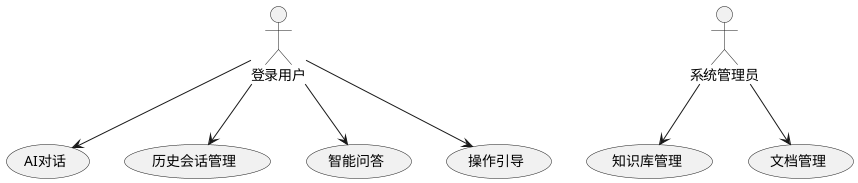

#### 用例描述
| 编号 | 用例名称 | 参与者 | 前置条件 | 后置条件 | 业务描述 |
| --- | --- | --- | --- | --- | --- |
| UC-14-01 | AI对话 | 登录用户 | 已登录 | AI回复展示 | 通过全局悬浮入口或对话页发起自然语言对话 |
| UC-14-02 | 历史会话管理 | 登录用户 | 已登录 | 会话变更 | 查看、切换、重命名、删除历史会话 |
| UC-14-03 | 智能问答 | 登录用户 | 已对话 | 检索结果展示 | 基于 RAG 检索制度和业务知识回答问题 |
| UC-14-04 | 操作引导 | 登录用户 | 已对话 | 路由跳转 | AI 返回操作建议卡片，点击跳转至对应业务页面 |
| UC-14-05 | 知识库管理 | 系统管理员 | 已登录 | 知识库变更 | 上传、编辑、删除文档，触发重新索引 |
| UC-14-06 | 文档管理 | 系统管理员 | 已登录 | 文档变更 | 查看文档列表、索引状态、分类筛选 |


### 14.2 模块目标
AI 智能助手作为 HRMS 第九个前端模块，提供自然语言问答、制度检索、操作引导和路由推荐能力。前端以全局悬浮入口为主，在大部分通用业务页面常驻；用户点击小球后展开聊天小窗，也可通过独立对话页查看历史会话。知识库管理作为后台能力，仅面向系统管理员开放。

后端系分中的 RAG 检索、LLM 调用、意图识别、权限过滤和知识库处理均作为前端接口依赖，不在本文档展开数据库、服务类或模型实现。

### 14.3 页面范围
| 页面/组件 | 路由/位置 | 主要功能 |
| --- | --- | --- |
| 全局悬浮小球 | 通用业务页面右侧边界 | 常驻 AI 入口，点击展开助手小窗 |
| AI 助手小窗 | 全局浮层 | 欢迎语、推荐问题、聊天输入、RAG 回答、路由建议 |
| AI 对话页 | `/ai/chat` | 历史会话、消息气泡、SSE 流式响应、多轮对话 |
| 知识库管理 | `/ai/knowledge` | 文档列表、上传、编辑、删除、重新索引 |


### 14.4 界面形态
| 页面/组件 | 界面形态描述 |
| --- | --- |
| 全局悬浮小球 | 在业务页面右侧边界半贴边展示，形态为圆形 AI 头像或机器人图标，旁边带蓝色收起/展开把手；不遮挡列表操作列、表单提交按钮等关键操作。登录页、工资条详情、敏感信息编辑页等隐私场景不显示。 |
| AI 助手小窗 | 点击小球后在右侧或右下展开，宽约 420-520px，高约 600-760px；顶部展示标题、收起、主题、关闭操作；主体包含欢迎语、推荐问题、消息气泡、操作建议卡片；底部为输入框、模式选择和发送按钮。 |
| AI 对话页 | 采用左侧历史会话侧栏 + 右侧对话区布局；左侧支持搜索、新建、切换、重命名、删除会话；右侧按用户消息、AI 消息、系统消息分气泡展示，底部固定输入区。 |
| 知识库管理 | 采用典型后台表格页，顶部为关键词、分类、状态、可见角色筛选区，右上角提供上传文档；主体为文档表格，展示标题、分类、文件类型、可见角色、索引状态、切片数、上传人、更新时间和操作。 |


#### 核心原型图
<!-- 这是一张图片，ocr 内容为： -->


图 14-1 AI 智能助手悬浮小球原型：展示通用业务页面右侧边界的小球入口与收起把手。

##### 页面元素 → 字段映射
| 页面元素 | 对应字段 | 说明 |
| --- | --- | --- |
| AI 悬浮小球 | — | 全局 Layout 控制，通用业务页面右侧边界展示 |
| 收起/展开把手 | — | 点击切换小窗显隐 |


<!-- 这是一张图片，ocr 内容为： -->


图 14-2 AI 智能助手聊天小窗原型：展示欢迎语、推荐问题、对话气泡、操作建议卡片和底部输入区。

##### 页面元素 → 字段映射
| 页面元素 | 对应字段 | 说明 |
| --- | --- | --- |
| 欢迎语 | `welcomeMessage` | 展开后默认展示 |
| 推荐问题列表 | `suggestedQuestions` | 展示常用问题，点击自动发送 |
| 用户消息气泡 | `message.content` | 用户发送的消息 |
| AI 消息气泡 | `message.content` | AI 回复，流式渲染 |
| 操作建议卡片 | `message.suggestions` | AI 回复完成后展示，可点击跳转路由 |
| 消息输入框 | — | 文本输入 |
| 发送按钮 | — | 发送消息，loading 态防重复 |


<!-- 这是一张图片，ocr 内容为： -->


图 14-3 知识库管理原型：展示知识库筛选区、文档表格、索引状态和上传文档入口。

##### 页面元素 → 字段映射
| 页面元素 | 对应字段 | 说明 |
| --- | --- | --- |
| 关键词搜索 | `keyword` | 搜索条件 |
| 分类筛选 | `category` | 下拉筛选 |
| 状态筛选 | `indexStatus` | 下拉：待索引/已索引/失败 |
| 可视角色筛选 | `visibleRoles` | 多选 |
| 文档标题列 | `title` | 表格展示 |
| 分类列 | `categoryName` | 表格展示 |
| 文件类型列 | `fileType` | 表格展示 |
| 可视角色列 | `visibleRoleNames` | 表格展示 |
| 索引状态列 | `indexStatus` | Tag 展示 |
| 切片数列 | `chunkCount` | 表格展示 |
| 上传人列 | `uploaderName` | 表格展示 |
| 更新时间列 | `updatedAt` | 表格展示 |
| 上传文档按钮 | — | 打开上传弹窗 |
| 编辑按钮 | — | 编辑文档信息 |
| 删除按钮 | — | 二次确认后删除 |
| 重新索引按钮 | — | 触发文档重新索引 |


### 14.5 前端规则
+ 悬浮小球由全局 Layout 控制显示，默认在登录后的通用业务页面展示。
+ 登录页、工资条详情、敏感信息编辑页、二次验证弹窗等隐私场景隐藏悬浮入口。
+ AI 对话响应采用 SSE 流式接收，前端逐 token 渲染，并在完成后展示操作建议卡片。
+ AI 回复支持 Markdown 展示，但渲染前必须进行 HTML 转义或安全过滤，禁止直接渲染危险标签。
+ 用户发送消息后立即生成本地用户气泡，AI 回复进入 streaming 状态，异常时展示重试入口。
+ 操作建议卡片仅做前端路由跳转，不自动执行请假、调岗、薪资查看等业务动作。

### 14.6 交互流程
#### AI 对话 SSE 流式交互时序
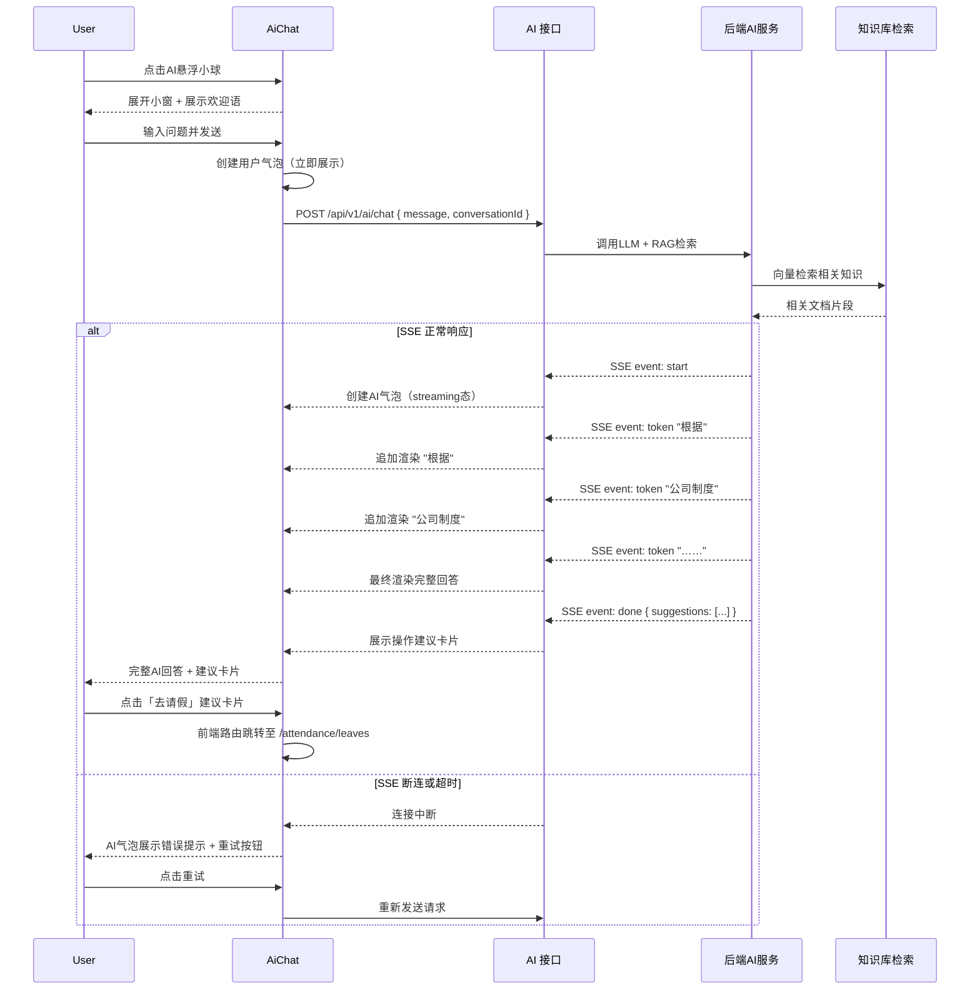

1. 用户在业务页面点击右侧 AI 小球。
2. 前端展开 AI 助手小窗，展示欢迎语、推荐问题和输入框。
3. 用户输入问题并发送，前端创建用户消息气泡并调用 `POST /api/v1/ai/chat`。
4. 前端通过 SSE 接收 `start`、`token`、`done` 等事件，逐步渲染 AI 回复。
5. 如果后端返回路由建议，前端在回复完成后展示”去请假””查看工资条”等建议卡片。
6. 用户点击建议卡片后，前端根据 path 跳转到对应业务页面。
7. 若 SSE 断连或服务超时，当前 AI 气泡展示错误提示和重试按钮。

### 14.7 接口依赖
#### `POST /api/v1/ai/chat` — 发送对话消息（SSE 流式）
**入参：**

| 字段 | 类型 | 说明 |
| --- | --- | --- |
| `message` | `string` | 用户消息文本，必填 |
| `conversationId` | `number` | 会话 ID，新会话传 null |
| `mode` | `string` | chat / query |


**出参（SSE Event Stream）：**

| Event | 数据 | 说明 |
| --- | --- | --- |
| `start` | `{ conversationId }` | 会话创建或继续 |
| `token` | `{ text: "内容" }` | 逐 token 增量返回 |
| `done` | `{ suggestions: Suggestion[] }` | 完成，返回操作建议 |
| `error` | `{ code, message }` | 异常 |


`Suggestion`**：**

| 字段 | 类型 | 说明 |
| --- | --- | --- |
| `label` | `string` | 按钮文案，如"去请假" |
| `path` | `string` | 跳转路由，如 `/attendance/leaves` |


---

#### `GET /api/v1/ai/conversations` — 获取历史会话
**出参：**

| 字段 | 类型 | 说明 |
| --- | --- | --- |
| `records` | `Conversation[]` | 会话列表 |


`Conversation`**：**

| 字段 | 类型 | 说明 |
| --- | --- | --- |
| `id` | `number` | 会话 ID |
| `title` | `string` | 会话标题，默认取首条消息 |
| `messageCount` | `number` | 消息数 |
| `createdAt` | `string` | 创建时间 |
| `updatedAt` | `string` | 最后更新时间 |


---

#### `GET /api/v1/ai/conversations/{id}/messages` — 获取指定会话消息
**入参：** 路径参数 `id`

**出参：**

| 字段 | 类型 | 说明 |
| --- | --- | --- |
| `messages` | `ChatMessage[]` | 消息列表 |


`ChatMessage`**：**

| 字段 | 类型 | 说明 |
| --- | --- | --- |
| `role` | `string` | user / assistant |
| `content` | `string` | 消息内容 |
| `suggestions` | `Suggestion[]` | 操作建议（assistant 消息可能有） |
| `createdAt` | `string` | 发送时间 |


---

#### `DELETE /api/v1/ai/conversations/{id}` — 删除历史会话
**入参：** 路径参数 `id`

**出参：** `{ success: boolean }`

---

#### `PUT /api/v1/ai/conversations/{id}/title` — 修改会话标题
**入参：**

| 字段 | 类型 | 说明 |
| --- | --- | --- |
| `title` | `string` | 新标题，必填 |


**出参：** `{ success: boolean }`

---

#### `POST /api/v1/ai/knowledge/docs` — 上传知识库文档
**入参（FormData）：**

| 字段 | 类型 | 说明 |
| --- | --- | --- |
| `file` | `File` | 文档文件 |
| `title` | `string` | 文档标题 |
| `category` | `string` | 分类 |
| `visibleRoles` | `string[]` | 可见角色列表 |


**出参：** `{ id: number }`

---

#### `GET /api/v1/ai/knowledge/docs` — 分页查询知识库文档
**入参：**

| 字段 | 类型 | 说明 |
| --- | --- | --- |
| `keyword` | `string` | 关键词搜索 |
| `category` | `string` | 分类筛选 |
| `indexStatus` | `string` | 索引状态：pending / indexed / failed |
| `visibleRoles` | `string[]` | 可见角色筛选 |
| `pageNum` | `number` | 页码，默认 1 |
| `pageSize` | `number` | 每页条数，默认 20 |


**出参：**

| 字段 | 类型 | 说明 |
| --- | --- | --- |
| `records` | `KnowledgeDoc[]` | 文档列表 |
| `total` | `number` | 总记录数 |


`KnowledgeDoc`**：**

| 字段 | 类型 | 说明 |
| --- | --- | --- |
| `id` | `number` | 文档 ID |
| `title` | `string` | 文档标题 |
| `category` | `string` | 分类 |
| `categoryName` | `string` | 分类中文名 |
| `fileType` | `string` | 文件类型 |
| `visibleRoles` | `string[]` | 可见角色 |
| `visibleRoleNames` | `string[]` | 可见角色中文名 |
| `indexStatus` | `string` | pending / indexed / failed |
| `chunkCount` | `number` | 切片数量 |
| `uploaderName` | `string` | 上传人 |
| `updatedAt` | `string` | 更新时间 |


---

#### `GET /api/v1/ai/knowledge/docs/{id}` — 查询知识库文档详情
**入参：** 路径参数 `id`

**出参：** `KnowledgeDoc`

---

#### `PUT /api/v1/ai/knowledge/docs/{id}` — 更新知识库文档信息
**入参：** `{ title?, category?, visibleRoles? }`

**出参：** `{ success: boolean }`

---

#### `DELETE /api/v1/ai/knowledge/docs/{id}` — 删除知识库文档
**入参：** 路径参数 `id`

**出参：** `{ success: boolean }`

---

#### `POST /api/v1/ai/knowledge/docs/{id}/reindex` — 重新索引知识库文档
**入参：** 路径参数 `id`

**出参：** `{ success: boolean }`


### 14.8 权限与显示规则
| 权限码 | 控制范围 | 说明 |
| --- | --- | --- |
| `ai:chat:view` | AI 对话页、悬浮助手入口 | 全部登录用户默认可用，游客或未登录用户不进入后台业务页面 |
| `ai:knowledge:manage` | 知识库管理页、上传/编辑/删除/重新索引操作 | 仅系统管理员可见 |


菜单设计上，`AI智能助手` 作为一级菜单放在个人中心之后；`知识库管理` 可放入 AI 模块下或系统管理下，最终以菜单初始化数据为准。前端需同时支持菜单权限和路由权限校验。

---

## 15. 首页工作台设计
首页作为登录后的统一入口，根据不同角色展示不同统计卡片和待办区域。

| 角色 | 首页重点展示 |
| --- | --- |
| 系统管理员 | 员工总数、本月入职、待审批、本月薪资、系统概览 |
| HR | 员工总数、本月入职、待审批、考勤异常、薪资批次 |
| 部门主管 | 本部门人数、本部门考勤、本部门待审批 |
| 财务 | 本月薪资总额、待审核薪资批次、薪资异常 |
| 普通员工 | 本月出勤、年假余额、我的申请进度、工资条入口 |


前端实现：

+ 首页统计卡片配置放在 `src/constants/home.ts`。
+ 待办列表调用审批中心相关接口。
+ 普通员工首页更偏个人工作台，管理角色首页更偏管理看板。

---

## 16. 公共前端能力
### 16.1 通用组件
| 组件 | 用途 |
| --- | --- |
| 部门树选择器 | 部门筛选、部门选择、组织范围选择 |
| 字典下拉框 | 性别、职位、员工状态、请假类型、审批状态等 |
| 状态标签 | 员工状态、审批状态、薪资批次状态、考勤状态 |
| 审批时间线 | 审批详情页展示节点历史 |
| 金额展示组件 | 薪资金额格式化和脱敏展示 |
| 页面空状态 | 列表无数据、图表无数据统一展示 |
| 错误重试组件 | 接口失败时统一展示重试入口 |
| 全局 AI 悬浮入口 | 通用业务页面常驻 AI 小球，支持展开、收起和隐私页面隐藏 |
| 流式文本渲染器 | 对 SSE token 进行批量渲染，减少高频刷新导致的页面卡顿 |
| 操作建议卡片 | 展示 AI 返回的业务路由建议，支持点击跳转到对应页面 |


### 16.2 请求封装
+ 请求头统一注入 Token。
+ 后端统一返回体按 `Result<T>` 处理。
+ 分页接口统一处理 `records`、`total`、`pageNum`、`pageSize`。
+ `401xx` 错误跳转登录页。
+ `403xx` 或无权限错误跳转 403 页或展示无权限提示。
+ 业务错误直接展示后端 message。
+ AI 对话接口需支持 SSE 响应解析、断连提示、重试和完成态回调。

### 16.3 状态管理
+ 登录用户、权限、菜单放在全局初始状态。
+ 列表筛选、分页、Tab 状态可在模块 model 或页面状态中维护。
+ 审批列表、工资条验证态等跨页面状态可放入模块 model。
+ 敏感数据不写入 localStorage。
+ AI 会话、当前消息列表和 streaming 状态可放入模块 model 或轻量状态仓库，切换会话时优先复用已加载数据。

---

## 17. 监控和埋点
### 17.1 性能监控
| 场景 | 阈值建议 |
| --- | --- |
| 登录接口响应 | 2s 内 |
| 列表页首屏加载 | 1.5s 内 |
| 员工详情/审批详情加载 | 2s 内 |
| 审批操作提交 | 2s 内 |
| 打卡操作 | 1s 内 |
| 工资条二次验证 | 2s 内 |
| 图表加载 | 2s 内 |
| AI 首 token 展示 | 5s 内 |
| 知识库文档列表加载 | 1.5s 内 |


### 17.2 业务埋点
| 模块 | 埋点事件 |
| --- | --- |
| 登录 | 登录成功、登录失败 |
| 权限体系 | 用户创建、用户编辑、角色权限分配 |
| 组织架构 | 部门创建、部门删除、职位创建、字典维护 |
| 员工档案 | 员工列表访问、员工详情访问、员工编辑 |
| 入转调离 | 创建入职、确认入职、发起转正、创建调岗、创建离职 |
| 考勤 | 打卡、补卡申请、请假提交、请假撤回 |
| 薪资 | 创建薪资批次、触发核算、处理异常、工资条验证、工资条查看 |
| 审批中心 | Tab 切换、审批通过、审批拒绝、审批转交、委托创建 |
| 个人中心 | 档案编辑、请假提交、工资条查看、修改密码 |
| AI智能助手 | 发送消息、建议卡片点击、新建会话、切换会话、删除会话、上传知识库文档、SSE 连接失败 |


---

## 18. 非功能性要求
| 维度 | 前端要求 |
| --- | --- |
| 可用性 | 所有列表和详情页覆盖加载态、空态、错误态 |
| 安全性 | Token 统一管理，涉薪和敏感数据不持久化 |
| 权限 | 菜单、页面、按钮、字段均需按权限控制 |
| 一致性 | 表单、表格、弹窗、状态标签采用统一设计规范 |
| 防重复提交 | 审批、打卡、薪资批次、确认发放等关键操作需 loading 和禁用 |
| 可维护性 | 页面按模块拆分，接口放 services，类型放 types |
| 兼容性 | 支持 Chrome、Edge、Firefox 最新两个大版本 |
| AI 安全 | AI 回复内容安全渲染，隐私数据查询需依赖后端权限过滤和脱敏结果 |


---

## 19. 前端工作量汇总
| 模块 | 主要页面/功能 | 前端开发估算 |
| --- | --- | --- |
| 权限体系 | 登录、用户、角色、菜单 | 约 6 天 |
| 组织架构 | 部门、职位、字典、公共选择器 | 约 5 天 |
| 员工档案 | 列表、详情、编辑、合同 | 约 6.5 天 |
| 入转调离 | 入职、转正、调岗、离职 | 约 7.5 天 |
| 考勤管理 | 考勤组、打卡、日历、补卡、请假、统计 | 约 10 天 |
| 薪资管理 | 账套、档案、批次、异常、工资条、看板 | 约 13.5 天 |
| 审批中心 | 工作台、详情、委托 | 约 5 天 |
| 个人中心 | 档案、考勤、请假、薪资、安全 | 约 8.5 天 |
| AI智能助手 | 悬浮入口、聊天小窗、对话页、知识库管理、SSE 渲染、建议卡片 | 约 8.5 天开发 / 3 天联调 / 2.5 天自测 |
| 公共能力 | 请求、权限、状态标签、字典、E2E | 约 4 天 |


说明：以上为前端开发粗估，不包含后端开发、数据库脚本、环境部署时间。具体排期需结合并行开发人数和接口就绪情况调整。

---

## 20. 联调边界
### 20.1 前端负责
+ 页面布局、表单、列表、图表、弹窗和交互状态。
+ 路由配置、菜单显示、前端权限判断。
+ 接口调用封装、请求参数组装、响应数据渲染。
+ 基础表单校验、二次确认、防重复提交。
+ 加载态、空态、错误态、无权限态。
+ 前端埋点、前端异常监控。
+ AI 悬浮入口、聊天小窗、流式文本渲染、建议卡片和知识库管理页面展示。

### 20.2 后端依赖
+ 登录、当前用户、菜单权限、字段权限接口。
+ 各业务模块的列表、详情、创建、更新、删除接口。
+ 审批流转、业务状态变更、数据权限过滤。
+ 敏感字段脱敏、薪资二次验证、数据越权校验。
+ 统一错误码和统一返回体。
+ AI 对话 SSE 流式响应、RAG 检索结果、知识库权限过滤、路由建议结构、LLM 异常降级提示。

### 20.3 需重点确认
| 问题 | 涉及模块 |
| --- | --- |
| 权限码是否完全按前端文档和菜单初始化数据返回 | 全部 |
| 字段权限接口返回结构是否稳定 | 员工档案、个人中心 |
| 审批详情中的 `businessType` 和 `formData` 是否可支持动态渲染 | 审批中心、入转调离、考勤、薪资 |
| 请假、补卡、薪资批次是否由业务接口自动触发审批 | 考勤、薪资、审批 |
| 工资条二次验证状态由前端会话保存还是后端会话判断 | 薪资、个人中心 |
| 普通员工入口是统一走个人中心，还是保留考勤/薪资独立菜单 | 考勤、薪资、个人中心 |
| AI SSE 事件结构、done 元数据和路由建议字段是否稳定 | AI智能助手 |
| 知识库文档分类、可见角色和索引状态枚举是否由后端统一返回 | AI智能助手 |


---

## 21. 风险与应对
| 风险 | 影响 | 前端应对 |
| --- | --- | --- |
| 接口路径和模块文档不一致 | 联调阻塞 | 在 services 层统一适配，联调前确认接口清单 |
| 权限码不统一 | 菜单或按钮显示异常 | 以总权限矩阵为准，前后端维护同一份权限码清单 |
| 审批 `formData` 字段不稳定 | 审批详情动态渲染困难 | 建立业务类型到字段配置的前端映射 |
| 涉薪数据泄露 | 严重安全风险 | 不持久化工资条明细，金额脱敏，离开页面清理状态 |
| 列表数据量大 | 页面卡顿 | 分页查询、必要时虚拟滚动、筛选条件服务端处理 |
| 图表数据异常 | 看板展示失败 | 图表错误降级为空状态，不阻断主流程 |
| 重复提交 | 业务状态错乱 | 关键按钮 loading、禁用、二次确认 |
| SSE 连接中断 | AI 回复不完整 | 展示断连提示和重试按钮，保留已接收内容 |
| AI 幻觉或错误回答 | 用户获取错误制度信息 | 前端展示“AI 生成仅供参考”提示，重要业务仍以系统页面和制度文档为准 |
| AI 隐私越界 | 敏感信息泄露 | 隐私查询依赖后端权限过滤，前端不缓存敏感回复并隐藏隐私页面入口 |
| Markdown/XSS 风险 | 恶意内容注入页面 | AI 回复安全渲染，禁用危险 HTML 标签和脚本 |


---

## 22. 总结
HRMS 前端总体系分以 9 个业务模块为核心，采用 React、TypeScript、Umi Max、Ant Design 的企业后台技术栈，按照页面、接口、状态、类型、常量、工具函数进行分层。

前端整体设计重点是：

+ 模块边界清晰：每个业务模块都有对应的页面目录和接口目录。
+ 权限控制完整：覆盖菜单、页面、按钮和字段。
+ 业务流程闭环：入转调离、考勤、薪资等流程最终统一进入审批中心。
+ 员工自助完善：普通员工通过个人中心完成档案、考勤、请假、薪资、安全相关操作。
+ 智能助手增强：通过全局悬浮入口和 AI 对话能力，补充制度问答、操作引导和知识库检索体验。
+ 安全和稳定优先：涉薪、敏感字段、审批操作、打卡操作均有明确的前端安全和交互约束。

本文档可作为前端汇报、系分评审、开发拆分、联调确认和测试验收的统一依据。

