# HRMS 后端总体系统分析说明书
| 文档版本 | 修改日期 | 修改人 | 修改内容 |
| --- | --- | --- | --- |
| V1.0 | 2026-07-11 | 系统分析员 | 初稿创建 |


---

## 1. 文档概述
### 1.1 文档目的
本文档为 HRMS（人资管理系统）的**后端总体系统分析说明书**，是《全局系统分析说明书》在后端技术视角的专项细化。本文档聚焦后端架构设计、各模块的数据库模型、API 接口、模块间服务契约及后端专项公共技术设计，为后端开发团队提供可执行的系分指导。

本文档与以下文档共同构成 HRMS 系分体系：

| 文档名称 | 定位 | 关系 |
| --- | --- | --- |
| 全局系统分析说明书 | 总体架构与公共设计 | 上位文档，本文档需与其保持一致 |
| 前端总体系统分析说明书 | 前端架构与页面设计 | 平行文档，前后端 API 对齐 |
| 测试分析说明书 | 测试策略与用例 | 下游文档，引用本文档的接口和逻辑 |


### 1.2 参考资料清单
| 序号 | 文档类型 | 文档名称 | 负责人 | 是否必读 |
| :---: | --- | --- | --- | :---: |
| 1 | 产品需求文档 | 人资管理系统（HRMS）详细产品规格说明书.pdf | 产品经理 | 必读 |
| 2 | 全局系分 | 全局系统分析说明书 | 系统分析员 | 必读 |
| 3 | 模块系分 | 员工档案管理-后端系分文档 | 系统分析员 | 参考 |
| 4 | 模块系分 | 入转调离流程-后端系分文档 | 系统分析员 | 参考 |
| 5 | 模块系分 | 考勤管理-后端系分文档 | 系统分析员 | 参考 |
| 6 | 模块系分 | 薪资管理-后端系分文档 | 系统分析员 | 参考 |
| 7 | 模块系分 | 权限体系-后端系分文档 | 系统分析员 | 参考 |
| 8 | 模块系分 | 组织架构与职位管理-后端系分文档 | 系统分析员 | 参考 |
| 9 | 模块系分 | 审批中心-后端系分文档 | 系统分析员 | 参考 |
| 10 | 模块系分 | 个人中心-后端系分文档 | 系统分析员 | 参考 |
| 11 | 模块系分 | AI 智能助手-后端系分文档 | 系统分析员 | 参考 |


### 1.3 参与人员
| 角色 | 姓名 | 职责 |
| --- | --- | --- |
| 产品经理(PD) | — | 需求定义与验收 |
| 后端技术负责人 | — | 后端架构设计、技术决策 |
| 后端开发 | — | 模块开发实现 |
| 质量(QA) | — | 测试用例与质量保障 |


---

## 附录A：文档导航索引
| 章节 | 内容 | 说明 |
| :---: | --- | --- |
| §2 | 后端系统架构设计 | 总体架构、Maven模块划分、模块间依赖、技术栈、包规范 |
| §3.1 | 权限体系模块（M5） | 用例图→功能列表→流程/时序图→DDL→API→服务接口→技术方案 |
| §3.2 | 组织架构与职位管理模块（M6） | 同上 |
| §3.3 | 员工档案管理模块（M1） | 同上 |
| §3.4 | 入转调离流程模块（M2） | 同上 |
| §3.5 | 考勤管理模块（M3） | 同上，含请假审批规则表 |
| §3.6 | 薪资管理模块（M4） | 同上，含异常检测规则表 |
| §3.7 | 审批中心模块（M7） | 同上，含审批类型定义 |
| §3.8 | 个人中心模块（M8） | 同上 |
| §3.9 | AI 智能助手模块（M9） | RAG对话、SSE流式、知识库管理 |
| §4 | 公共技术设计（后端专项） | 异常体系、数据权限过滤、操作日志AOP、参数校验、API文档 |
| §5 | 模块间服务契约汇总 | 内部服务接口、调用方式 |
| §6 | 非功能性设计（后端视角） | 性能、安全、缓存、日志、数据归档 |
| §7 | 排期与风险 | 开发里程碑、技术风险 |


> 本文档共约 5177 行，包含 53+ 张架构图/流程图/时序图。建议按需阅读对应模块小节，每个模块独立成节。
>

---

## 2. 后端系统架构设计
### 2.1 总体架构
HRMS 后端采用**单体分层架构**，通过 Maven 多模块组织代码。所有模块最终打包为一个 JAR 部署，运行时为单一 Spring Boot 应用进程。

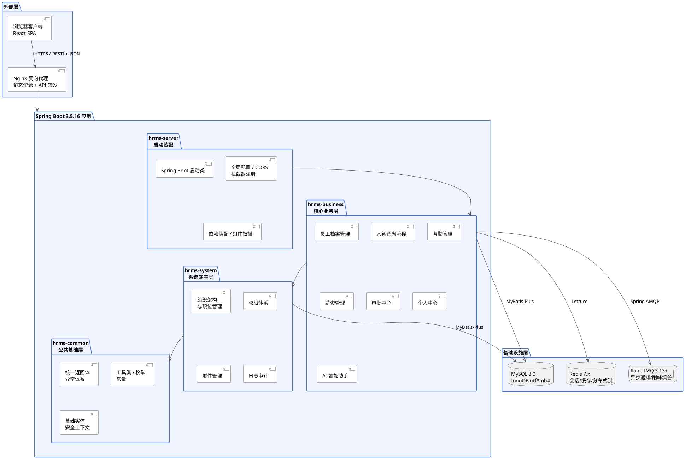

**架构原则：**

| 原则 | 说明 |
| --- | --- |
| 分层依赖 | Common ← System ← Business ← Server，禁止反向依赖 |
| 单体部署 | 所有模块打包为一个 JAR，单进程运行，非微服务架构 |
| 无状态设计 | 后端不存储用户会话状态，全部委托给 Redis |
| 模块间服务调用 | 通过 Spring 依赖注入 + Interface/Impl 分离实现 |
| 异常透传 | 统一异常处理，禁止将技术异常直接暴露给前端 |


### 2.2 Maven 模块划分
#### 2.2.1 模块结构
```plain
hrms-parent                          // 父 POM，统一版本管理
├── hrms-common                      // 公共基础能力
│   ├── src/main/java/com/hrms/common/
│   │   ├── result/                  // 统一返回体 R<T>
│   │   ├── exception/               // 全局异常体系
│   │   ├── enums/                   // 公共枚举
│   │   ├── util/                    // 工具类
│   │   ├── entity/                  // 基础实体基类
│   │   └── context/                 // 安全上下文（SecurityContextHolder）
│   └── pom.xml
│
├── hrms-system                      // 系统底座
│   ├── hrms-system-auth             // 权限体系
│   ├── hrms-system-organization     // 组织架构与职位管理
│   ├── hrms-system-file             // 附件管理
│   └── hrms-system-log              // 日志审计
│
├── hrms-business                    // 核心业务
│   ├── hrms-business-employee       // 员工档案管理（M1）
│   ├── hrms-business-personnel      // 入转调离流程（M2）
│   ├── hrms-business-attendance     // 考勤管理（M3）
│   ├── hrms-business-salary         // 薪资管理（M4）
│   ├── hrms-business-approval       // 审批中心（M7）
│   ├── hrms-business-mycenter       // 个人中心（M8）
│   └── hrms-business-ai             // AI 智能助手（M9，加分项）
│
└── hrms-server                      // 启动装配
    └── src/main/java/com/hrms/server/
        ├── HrmsApplication.java     // Spring Boot 启动类
        ├── config/                  // 全局配置（CORS、Jackson、拦截器）
        └── controller/              // （可选）聚合式 Controller 转发
```

#### 2.2.2 模块职责边界
| 模块 | 职责 | 禁止事项 |
| --- | --- | --- |
| hrms-common | 返回体、异常、枚举、工具类、基础实体、安全上下文 | 禁止反向依赖业务模块、禁止包含 Controller、禁止涉及数据表 |
| hrms-system | 系统底座（权限、组织、附件、日志） | 禁止依赖 hrms-business |
| hrms-business | 核心业务逻辑 | — |
| hrms-server | 启动装配、全局配置、依赖注入 | 禁止写业务 Controller/Service/Mapper |


### 2.3 模块间依赖关系
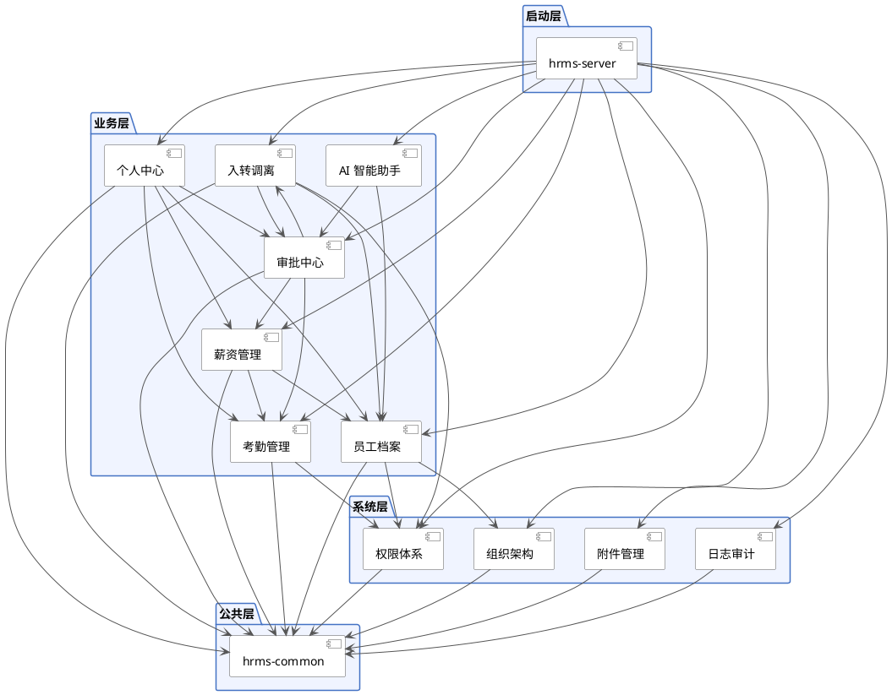

### 2.4 技术栈选型
#### 2.4.1 后端技术栈明细
| 层级 | 技术 | 版本 | 用途说明 | 兼容性说明 |
| --- | --- | --- | --- | --- |
| 开发语言 | Java | 17 LTS | 后端开发语言 | 长期支持版本，Spring Boot 3.x 最低要求 |
| 核心框架 | Spring Boot | 3.5.16 | 单体应用框架 | 2026 年最新稳定版，内置 Tomcat 10.2 + HikariCP 6.x |
| 依赖管理 | Maven | 3.9+ | 项目构建与依赖管理 | 与 Spring Boot BOM 配合锁定版本 |
| ORM | MyBatis-Plus | 3.5.12 | 数据持久化、自动 CRUD | 3.5.x 全面兼容 Spring Boot 3.x + JDK 17 |
| 数据库 | MySQL | 8.0+ | 主数据库 | InnoDB 引擎，Charset utf8mb4 |
| 连接池 | HikariCP | — | 数据库连接池 | Spring Boot 3.x 默认集成，零配置 |
| 缓存 | Redis | 7.x | 会话管理、数据缓存、分布式锁 | Spring Data Redis 3.x（Lettuce 客户端） |
| 消息队列 | RabbitMQ | 3.13+ | 异步通知、削峰填谷 | Spring AMQP 3.x，支持 publisher-confirm |
| JSON 处理 | Jackson | 2.17+ | 序列化/反序列化 | Spring Boot 3.x 默认集成 |
| 参数校验 | Hibernate Validator | 8.x | @Valid 注解式参数校验 | Jakarta Validation 3.0，Java 17 原生支持 |
| API 文档 | SpringDoc OpenAPI | 2.8+ | 自动生成 Swagger 接口文档 | 原生适配 Spring Boot 3.x + Jakarta API |
| 认证机制 | JWT（HS256） | jjwt 0.12+ | 无状态 Token 认证 | 独立引入，配合拦截器实现 |
| 密码加密 | BCrypt | Cost=10 | 密码单向哈希 | Spring Security 内置 BCryptPasswordEncoder |
| 敏感数据加密 | AES-256/GCM | — | 字段级加密存储 | JDK 内置 JCE，无需额外引入 |
| 单元测试 | JUnit 5 + Mockito | 5.11+ / 5.x | 单元测试 | Spring Boot Starter Test 默认集成 |
| 日志框架 | Logback | 1.5+ | 日志记录 | Spring Boot 默认集成，JSON 日志格式输出 |


#### 2.4.2 各组件版本兼容性矩阵
| 组件 | 依赖关系 | 版本要求 |
| --- | --- | --- |
| Java 17 | Spring Boot 3.x 编译与运行 | 最低 Java 17，推荐 Java 17 LTS |
| Spring Boot 3.5.16 | 所有 Spring 生态组件版本由其 BOM 统一管理 | 无需单独指定版本 |
| MyBatis-Plus 3.5.12 | 需引入 `mybatis-plus-spring-boot3-starter` | 兼容 Spring Boot 3.x 和 JDK 17 |
| MySQL Connector/J | Spring Boot 3.x 默认引入 8.4+ | 需使用 `com.mysql.cj.jdbc.Driver` |
| Lettuce（Redis 客户端） | Spring Data Redis 3.x 默认集成 | 支持 Redis 6.x/7.x 集群 |
| Spring AMQP | Spring Boot 3.x Starter 集成 | 支持 RabbitMQ 3.12+ |
| jjwt 0.12+ | 需独立引入 `io.jsonwebtoken:jjwt-api` | 支持 HS256/HS384/HS512 签名 |
| SpringDoc 2.8+ | 需引入 `springdoc-openapi-starter-webmvc-ui` | 原生支持 Spring Boot 3.x |


#### 2.4.3 开发工具与环境
| 工具 | 版本 | 说明 |
| --- | --- | --- |
| IntelliJ IDEA | 2024+ | 推荐开发 IDE |
| Maven | 3.9.7+ | 构建工具 |
| Git | 2.40+ | 版本控制 |
| Docker | 24+ | 本地开发环境（MySQL/Redis/RabbitMQ） |


### 2.5 包命名规范与分层约定
#### 2.5.1 包命名规范
```plain
com.hrms.{模块}.{子模块}.{分层}
                    │        └── controller / service / mapper / entity / dto / config
                    └── system / business
```

**各模块包路径示例：**

| 模块 | 包根路径 |
| --- | --- |
| 权限体系 | com.hrms.system.auth |
| 组织架构 | com.hrms.system.organization |
| 员工档案 | com.hrms.business.employee |
| 审批中心 | com.hrms.business.approval |
| 公共基础 | com.hrms.common |


#### 2.5.2 分层约定
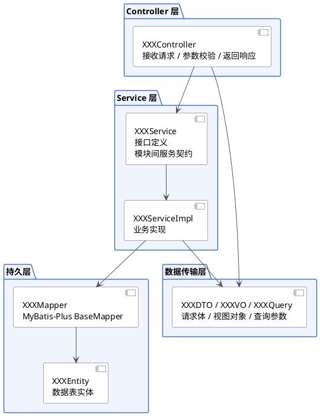

**各层职责与约束：**

| 分层 | 命名后缀 | 职责 | 约束 |
| --- | --- | --- | --- |
| Controller | `*Controller` | 接收 HTTP 请求、参数校验、调用 Service、返回 R | 不包含业务逻辑；方法签名参数必须使用 @Valid 注解 |
| Service 接口 | `*Service` | 定义业务方法签名，作为模块间服务契约 | 放于独立接口文件中，供其他模块依赖 |
| Service 实现 | `*ServiceImpl` | 业务逻辑实现 | 标注 @Service，事务管理 @Transactional |
| Mapper | `*Mapper` | 继承 MyBatis-Plus BaseMapper | 标注 @Mapper，复杂查询使用 XML 或 @Select |
| Entity | `*Entity` | 数据表实体映射 | 继承 BaseEntity（含 id, createTime, updateTime, isDeleted, version） |
| DTO | `*DTO / *VO / *Query` | 请求体 / 视图对象 / 查询参数 | 区分对内/对外；DTO 用于接收请求，VO 用于返回前端 |


#### 2.5.3 统一返回体规范
所有 REST API 统一返回 `R<T>` 结构：

```java
public class R<T> implements Serializable {
    private Integer code;      // 状态码：20000=成功，其余见异常码表
    private String message;    // 提示信息
    private T data;            // 数据体
    private Long timestamp;    // 服务器时间戳
}
```

**状态码设计：**

| 码段 | 说明 |
| :---: | --- |
| 20000 | 成功 |
| 400xx | 客户端错误（参数校验失败、数据不存在等） |
| 401xx | 未认证 / Token 失效 |
| 403xx | 无权限（角色/数据/字段级） |
| 409xx | 冲突（乐观锁、数据重复等） |
| 500xx | 服务端错误 |


**完整异常码对照表：**

| 异常码 | 枚举常量 | HTTP 状态码 | 说明 | 触发场景 |
| :---: | --- | :---: | --- | --- |
| 20000 | SUCCESS | 200 | 成功 | 请求正常处理 |
| 40000 | BAD_REQUEST | 400 | 请求参数错误 | 通用参数错误 |
| 40001 | PARAM_VALIDATION_FAILED | 400 | 参数校验失败 | `@Valid` 校验不通过 |
| 40002 | MISSING_REQUIRED_PARAM | 400 | 缺少必填参数 | 请求缺少必填字段 |
| 40100 | UNAUTHORIZED | 401 | 未认证 | 未携带 Token 请求需认证接口 |
| 40101 | TOKEN_EXPIRED | 401 | Token 已过期 | Token 超过有效期 |
| 40102 | TOKEN_INVALID | 401 | Token 无效 | Token 签名校验失败 |
| 40103 | ACCOUNT_LOCKED | 401 | 账号已锁定 | 登录失败超过 5 次，锁定 30 分钟 |
| 40300 | FORBIDDEN | 403 | 无角色/菜单权限 | 用户不拥有所需权限标识 |
| 40301 | DATA_SCOPE_DENIED | 403 | 数据权限范围外 | 访问非本人/非本部门数据 |
| 40302 | FIELD_PERMISSION_DENIED | 403 | 字段级无权限 | 访问无权限字段 |
| 40400 | NOT_FOUND | 404 | 资源不存在 | 数据 ID 查询无结果 |
| 40401 | USER_NOT_FOUND | 404 | 用户不存在 | 用户名查询无结果 |
| 40900 | CONFLICT | 409 | 数据冲突（乐观锁） | `version` 不匹配，数据已被修改 |
| 40901 | DATA_DUPLICATE | 409 | 数据重复 | 唯一索引冲突 |
| 50000 | SYSTEM_ERROR | 500 | 系统内部错误 | 未预期异常 |
| 50001 | REMOTE_SERVICE_ERROR | 500 | 远程服务调用失败 | RabbitMQ/外部服务异常 |
| 50002 | DATABASE_ERROR | 500 | 数据库操作异常 | SQL 执行失败、死锁 |


#### 2.5.4 数据库表设计约定
| 约定项 | 规则 |
| --- | --- |
| 字符集 | `utf8mb4`，collation `utf8mb4_0900_ai_ci` |
| 存储引擎 | InnoDB |
| 表前缀 | `sys_` 系统表、`hr_` 业务表 |
| 主键 | `BIGINT UNSIGNED` 自增 |
| 公共字段 | `create_by`, `create_time`, `update_by`, `update_time`, `is_deleted`, `version` |
| 软删除 | `is_deleted TINYINT(1)`，0=正常，1=删除 |
| 索引命名 | 主键 `PRIMARY`，唯一 `uk_表名_字段`，普通 `idx_表名_字段` |
| 时间类型 | 使用 `DATETIME`，精度到秒 |


### 2.5.5 API 版本管理规范
| 规范项 | 规则 |
| --- | --- |
| 版本格式 | 路径前缀 `/api/v{major}/`，如 `/api/v1/` |
| 当前版本 | v1（初始版本） |
| 版本升级条件 | 向后不兼容的变更（字段删除/重命名、响应结构变更、请求方式变更）才升级 major 版本 |
| 兼容性保证 | 新增字段/可选参数不升级版本；同一版本内禁止删除或重命名字段 |
| 废弃策略 | 旧版本发布废弃公告后保留 6 个月，期间返回 `Warning` 响应头 |
| 版本号传递 | 通过 URL 路径传递，不放在 Header 或 Query String 中 |


---

## 3. 各模块后端详细设计
> **说明**：以下按 9 个业务模块 + 2 个基础设施模块逐一展开。每个模块包含：
>
> + 功能清单（对照 PRD）
> + 核心流程与时序（Mermaid 流程图 + 时序图）
> + 领域模型与数据库核心表（DDL）
> + REST API 接口清单（对外，供前端调用）
> + 模块间服务接口（对内，供其他模块调用）
> + 关键技术方案
>

### 3.1 权限体系模块（M1）
权限体系是 HRMS 的系统底座，为所有业务模块提供统一的用户、角色、菜单、认证授权能力。归属 `hrms-system-auth` 子模块。

#### 3.1.1 用例分析
##### 用例图
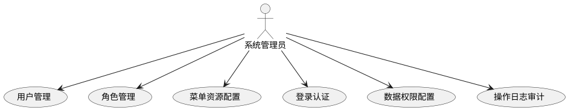

##### 用例详细说明
| 编号 | 用例名称 | 参与者 | 前置条件 | 后置条件 | 业务描述 |
| :---: | --- | --- | --- | --- | --- |
| UC-01 | 用户管理 | 系统管理员 | 已登录系统 | 用户数据变更生效 | 对系统用户进行新增、编辑、启用/禁用、重置密码操作 |
| UC-02 | 角色管理 | 系统管理员 | 已登录系统 | 角色配置生效 | 创建、编辑角色，并为角色分配菜单权限与数据权限范围 |
| UC-03 | 菜单资源配置 | 系统管理员 | 已登录系统 | 菜单树更新 | 管理系统菜单、按钮、API 资源的层级结构与元数据 |
| UC-04 | 登录认证 | 系统管理员 | 用户未登录 | 登录成功/失败 | 通过用户名密码 + 验证码完成身份认证，签发 JWT Token |
| UC-05 | 数据权限配置 | 系统管理员 | 已登录系统 | 权限范围生效 | 设置角色/用户的数据可见范围（全部/本部门/本人） |
| UC-06 | 操作日志审计 | 系统管理员 | 已登录系统 | 展示查询结果 | 按时间/用户/操作类型查询系统操作日志记录 |


#### 3.1.2 功能清单
| 编号 | 功能名称 | PRD 章节 | 说明 |
| :---: | --- | :---: | --- |
| F-AUTH-01 | 用户管理（增删改查、状态控制） | §2 | 系统用户 CRUD，含启用/禁用、密码重置 |
| F-AUTH-02 | 角色管理（CRUD、权限分配、数据范围） | §2.1 | 定义角色及其数据权限范围（四级） |
| F-AUTH-03 | 菜单管理（树形结构、权限标识） | §2.1 | 管理前端路由与按钮权限标识 |
| F-AUTH-04 | 登录认证（JWT Token 发放与校验） | — | 用户名密码登录，返回 JWT Token |
| F-AUTH-05 | 字段级权限查询 | §2.3 | 返回当前用户对业务类型的可见/可编辑字段列表 |
| F-AUTH-06 | 数据权限范围查询 | §2.2 | 返回当前用户的数据可见范围（部门 ID 列表） |
| F-AUTH-07 | 登录日志记录 | §12.2 | 每次登录成功/失败写入 sys_login_log |
| F-AUTH-08 | 操作日志记录 | §12.2 | 通过 AOP 自动记录敏感操作 |


#### 3.1.3 核心流程与时序
##### 用户登录流程
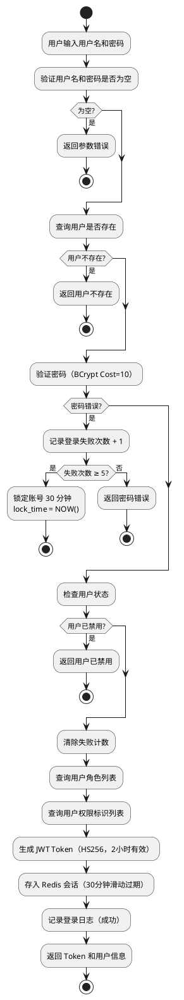

##### 用户登录时序
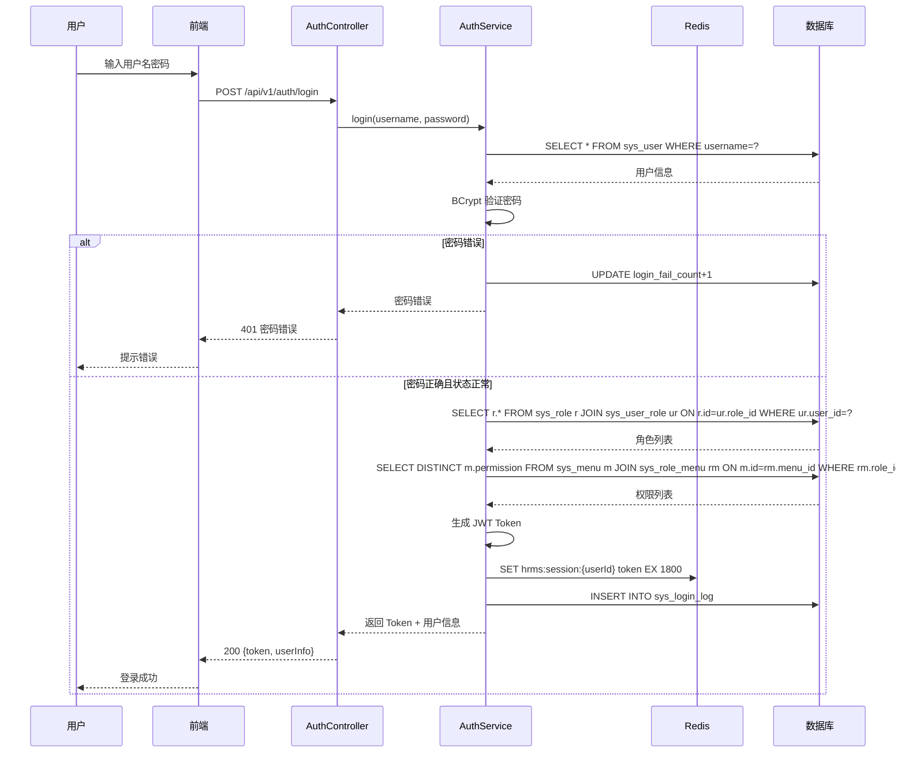

#### 3.1.4 领域模型与数据库核心表
##### ER 图
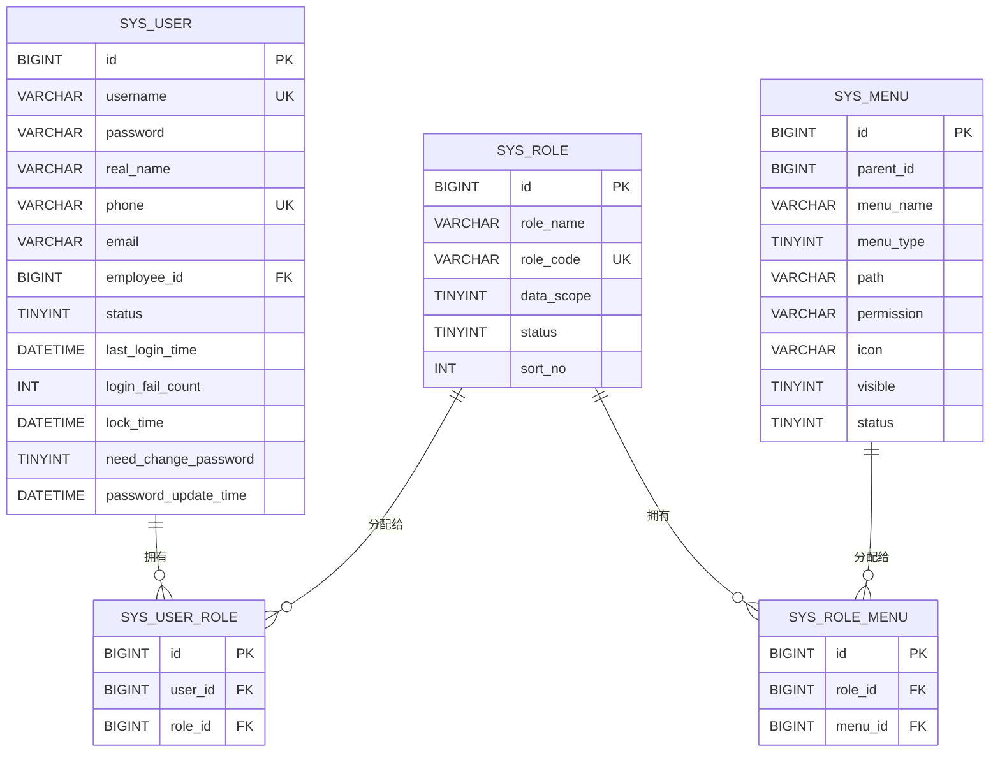

##### 核心 DDL
```sql
CREATE TABLE `sys_user` (
  `id` BIGINT UNSIGNED NOT NULL AUTO_INCREMENT COMMENT '主键ID',
  `username` VARCHAR(64) NOT NULL COMMENT '登录账号',
  `password` VARCHAR(255) NOT NULL COMMENT '登录密码（BCrypt 加密，Cost=10）',
  `nickname` VARCHAR(64) DEFAULT NULL COMMENT '用户昵称',
  `real_name` VARCHAR(64) DEFAULT NULL COMMENT '真实姓名',
  `phone` VARCHAR(20) NOT NULL COMMENT '手机号',
  `email` VARCHAR(128) DEFAULT NULL COMMENT '邮箱',
  `avatar_url` VARCHAR(255) DEFAULT NULL COMMENT '头像地址',
  `employee_id` BIGINT UNSIGNED DEFAULT NULL COMMENT '关联员工 ID',
  `status` TINYINT NOT NULL DEFAULT 1 COMMENT '状态：1-启用 0-禁用',
  `last_login_time` DATETIME DEFAULT NULL COMMENT '最后登录时间',
  `last_login_ip` VARCHAR(64) DEFAULT NULL COMMENT '最后登录 IP',
  `need_change_password` TINYINT(1) NOT NULL DEFAULT 1 COMMENT '首次登录强制修改密码',
  `password_update_time` DATETIME DEFAULT NULL COMMENT '密码最后更新时间',
  `login_fail_count` INT NOT NULL DEFAULT 0 COMMENT '连续登录失败次数',
  `lock_time` DATETIME DEFAULT NULL COMMENT '账号锁定时间',
  `create_by` BIGINT UNSIGNED DEFAULT NULL COMMENT '创建人',
  `create_time` DATETIME NOT NULL DEFAULT CURRENT_TIMESTAMP COMMENT '创建时间',
  `update_by` BIGINT UNSIGNED DEFAULT NULL COMMENT '更新人',
  `update_time` DATETIME NOT NULL DEFAULT CURRENT_TIMESTAMP ON UPDATE CURRENT_TIMESTAMP COMMENT '更新时间',
  `is_deleted` TINYINT(1) NOT NULL DEFAULT 0 COMMENT '逻辑删除',
  `version` INT NOT NULL DEFAULT 0 COMMENT '版本号（乐观锁）',
  `remark` VARCHAR(500) DEFAULT NULL COMMENT '备注',
  PRIMARY KEY (`id`),
  UNIQUE KEY `uk_sys_user_username` (`username`),
  UNIQUE KEY `uk_sys_user_phone` (`phone`),
  KEY `idx_sys_user_employee_id` (`employee_id`),
  KEY `idx_sys_user_status` (`status`)
) ENGINE=InnoDB DEFAULT CHARSET=utf8mb4 COLLATE=utf8mb4_0900_ai_ci COMMENT='系统用户表';
```

```sql
CREATE TABLE `sys_role` (
  `id` BIGINT UNSIGNED NOT NULL AUTO_INCREMENT COMMENT '主键ID',
  `role_name` VARCHAR(64) NOT NULL COMMENT '角色名称',
  `role_code` VARCHAR(64) NOT NULL COMMENT '角色编码',
  `data_scope` TINYINT NOT NULL DEFAULT 1 COMMENT '数据权限范围：1-仅本人 2-本部门 3-本部门及子部门 4-全部',
  `status` TINYINT NOT NULL DEFAULT 1 COMMENT '状态：1-启用 0-禁用',
  `sort_no` INT NOT NULL DEFAULT 0 COMMENT '排序号',
  `create_by` BIGINT UNSIGNED DEFAULT NULL COMMENT '创建人',
  `create_time` DATETIME NOT NULL DEFAULT CURRENT_TIMESTAMP COMMENT '创建时间',
  `update_by` BIGINT UNSIGNED DEFAULT NULL COMMENT '更新人',
  `update_time` DATETIME NOT NULL DEFAULT CURRENT_TIMESTAMP ON UPDATE CURRENT_TIMESTAMP COMMENT '更新时间',
  `is_deleted` TINYINT(1) NOT NULL DEFAULT 0 COMMENT '逻辑删除',
  `version` INT NOT NULL DEFAULT 0 COMMENT '版本号',
  `remark` VARCHAR(500) DEFAULT NULL COMMENT '备注',
  PRIMARY KEY (`id`),
  UNIQUE KEY `uk_sys_role_role_code` (`role_code`),
  KEY `idx_sys_role_status` (`status`)
) ENGINE=InnoDB DEFAULT CHARSET=utf8mb4 COLLATE=utf8mb4_0900_ai_ci COMMENT='角色表';
```

```sql
CREATE TABLE `sys_menu` (
  `id` BIGINT UNSIGNED NOT NULL AUTO_INCREMENT COMMENT '主键ID',
  `parent_id` BIGINT UNSIGNED NOT NULL DEFAULT 0 COMMENT '父级菜单 ID',
  `menu_name` VARCHAR(64) NOT NULL COMMENT '菜单名称',
  `menu_type` TINYINT NOT NULL COMMENT '菜单类型：1-目录 2-菜单 3-按钮',
  `path` VARCHAR(255) DEFAULT NULL COMMENT '路由路径',
  `component` VARCHAR(255) DEFAULT NULL COMMENT '前端组件路径',
  `permission` VARCHAR(128) DEFAULT NULL COMMENT '权限标识',
  `icon` VARCHAR(64) DEFAULT NULL COMMENT '图标',
  `sort_no` INT NOT NULL DEFAULT 0 COMMENT '排序号',
  `visible` TINYINT(1) NOT NULL DEFAULT 1 COMMENT '是否可见',
  `status` TINYINT NOT NULL DEFAULT 1 COMMENT '状态',
  `create_by` BIGINT UNSIGNED DEFAULT NULL COMMENT '创建人',
  `create_time` DATETIME NOT NULL DEFAULT CURRENT_TIMESTAMP COMMENT '创建时间',
  `update_by` BIGINT UNSIGNED DEFAULT NULL COMMENT '更新人',
  `update_time` DATETIME NOT NULL DEFAULT CURRENT_TIMESTAMP ON UPDATE CURRENT_TIMESTAMP COMMENT '更新时间',
  `is_deleted` TINYINT(1) NOT NULL DEFAULT 0 COMMENT '逻辑删除',
  `version` INT NOT NULL DEFAULT 0 COMMENT '版本号',
  `remark` VARCHAR(500) DEFAULT NULL COMMENT '备注',
  PRIMARY KEY (`id`),
  KEY `idx_sys_menu_parent_id` (`parent_id`),
  KEY `idx_sys_menu_status` (`status`)
) ENGINE=InnoDB DEFAULT CHARSET=utf8mb4 COLLATE=utf8mb4_0900_ai_ci COMMENT='菜单表';
```

```sql
CREATE TABLE `sys_user_role` (
  `id` BIGINT UNSIGNED NOT NULL AUTO_INCREMENT COMMENT '主键ID',
  `user_id` BIGINT UNSIGNED NOT NULL COMMENT '用户 ID',
  `role_id` BIGINT UNSIGNED NOT NULL COMMENT '角色 ID',
  `create_by` BIGINT UNSIGNED DEFAULT NULL COMMENT '创建人',
  `create_time` DATETIME NOT NULL DEFAULT CURRENT_TIMESTAMP COMMENT '创建时间',
  `update_by` BIGINT UNSIGNED DEFAULT NULL COMMENT '更新人',
  `update_time` DATETIME NOT NULL DEFAULT CURRENT_TIMESTAMP ON UPDATE CURRENT_TIMESTAMP COMMENT '更新时间',
  `is_deleted` TINYINT(1) NOT NULL DEFAULT 0 COMMENT '逻辑删除',
  `version` INT NOT NULL DEFAULT 0 COMMENT '版本号',
  PRIMARY KEY (`id`),
  UNIQUE KEY `uk_sys_user_role_user_role` (`user_id`, `role_id`),
  KEY `idx_sys_user_role_role_id` (`role_id`)
) ENGINE=InnoDB DEFAULT CHARSET=utf8mb4 COLLATE=utf8mb4_0900_ai_ci COMMENT='用户角色关联表';
```

```sql
CREATE TABLE `sys_role_menu` (
  `id` BIGINT UNSIGNED NOT NULL AUTO_INCREMENT COMMENT '主键ID',
  `role_id` BIGINT UNSIGNED NOT NULL COMMENT '角色 ID',
  `menu_id` BIGINT UNSIGNED NOT NULL COMMENT '菜单 ID',
  `create_by` BIGINT UNSIGNED DEFAULT NULL COMMENT '创建人',
  `create_time` DATETIME NOT NULL DEFAULT CURRENT_TIMESTAMP COMMENT '创建时间',
  `update_by` BIGINT UNSIGNED DEFAULT NULL COMMENT '更新人',
  `update_time` DATETIME NOT NULL DEFAULT CURRENT_TIMESTAMP ON UPDATE CURRENT_TIMESTAMP COMMENT '更新时间',
  `is_deleted` TINYINT(1) NOT NULL DEFAULT 0 COMMENT '逻辑删除',
  `version` INT NOT NULL DEFAULT 0 COMMENT '版本号',
  PRIMARY KEY (`id`),
  UNIQUE KEY `uk_sys_role_menu_role_menu` (`role_id`, `menu_id`),
  KEY `idx_sys_role_menu_menu_id` (`menu_id`)
) ENGINE=InnoDB DEFAULT CHARSET=utf8mb4 COLLATE=utf8mb4_0900_ai_ci COMMENT='角色菜单关联表';
```

#### 3.1.5 REST API 接口清单
##### 接口总览
| 编号 | 接口名称 | 方法 | 路径 | 说明 |
| :---: | --- | :---: | --- | --- |
| **认证** |  |  |  |  |
| API-AUTH-01 | 用户登录 | POST | /api/v1/auth/login | 用户名密码登录，返回 JWT Token |
| API-AUTH-02 | 获取当前用户信息 | GET | /api/v1/auth/current-user | 返回用户信息、角色、权限 |
| API-AUTH-03 | 退出登录 | POST | /api/v1/auth/logout | 清除 Redis 会话 |
| **用户管理** |  |  |  |  |
| API-AUTH-04 | 用户列表 | GET | /api/v1/users | 分页查询用户列表 |
| API-AUTH-05 | 用户详情 | GET | /api/v1/users/{id} | 获取用户详情 |
| API-AUTH-06 | 创建用户 | POST | /api/v1/users | 创建新用户 |
| API-AUTH-07 | 更新用户 | PUT | /api/v1/users/{id} | 更新用户信息 |
| API-AUTH-08 | 删除用户 | DELETE | /api/v1/users/{id} | 逻辑删除用户 |
| API-AUTH-09 | 重置用户密码 | PUT | /api/v1/users/{id}/reset-pwd | 重置为随机密码并强制修改 |
| **角色管理** |  |  |  |  |
| API-AUTH-10 | 角色列表 | GET | /api/v1/roles | 查询所有角色（含菜单权限） |
| API-AUTH-11 | 创建角色 | POST | /api/v1/roles | 创建新角色 |
| API-AUTH-12 | 更新角色 | PUT | /api/v1/roles/{id} | 更新角色信息 |
| API-AUTH-13 | 删除角色 | DELETE | /api/v1/roles/{id} | 逻辑删除（有用户关联时不可删） |
| API-AUTH-14 | 分配角色菜单权限 | POST | /api/v1/roles/{roleId}/menus | 全量覆盖角色菜单关联 |
| **菜单管理** |  |  |  |  |
| API-AUTH-15 | 菜单树 | GET | /api/v1/menus/tree | 查询完整菜单树（含按钮） |
| API-AUTH-16 | 创建菜单 | POST | /api/v1/menus | 创建目录/菜单/按钮 |
| API-AUTH-17 | 更新菜单 | PUT | /api/v1/menus/{id} | 更新菜单信息 |
| API-AUTH-18 | 删除菜单 | DELETE | /api/v1/menus/{id} | 逻辑删除（含子菜单） |
| **权限查询** |  |  |  |  |
| API-AUTH-19 | 获取字段权限 | GET | /api/v1/permissions/field | 返回 viewableFields/editableFields |
| API-AUTH-20 | 获取数据权限范围 | GET | /api/v1/permissions/data-scope | 返回 scopeType 和 departmentIds |


##### 接口详细设计
**API-AUTH-01：用户登录**

| 项目 | 内容 |
| --- | --- |
| 请求方式 | POST |
| 请求路径 | /api/v1/auth/login |
| 权限控制 | 匿名（无需登录） |


**请求参数：**

```json
{
  "username": "admin",
  "password": "Admin@123"
}
```

**参数说明：**

| 参数名 | 类型 | 必填 | 说明 |
| --- | --- | :---: | --- |
| username | String | 是 | 登录用户名 |
| password | String | 是 | 登录密码（明文，服务端 BCrypt 校验） |


**响应格式：**

```json
{
  "code": 20000,
  "message": "success",
  "data": {
    "token": "eyJhbGciOiJIUzI1NiJ9.eyJ1c2VySWQiOjF9...",
    "tokenType": "Bearer",
    "expiresIn": 7200,
    "userInfo": {
      "id": 1,
      "username": "admin",
      "realName": "系统管理员",
      "roles": [
        {
          "roleId": 1,
          "roleName": "系统管理员",
          "roleCode": "admin",
          "dataScope": 4
        }
      ],
      "permissions": [
        "system:user:list",
        "system:user:create",
        "system:dept:list"
      ]
    }
  },
  "timestamp": 1720684800000
}
```

**字段说明：**

+ `token`：JWT 令牌，有效期 2 小时
+ `tokenType`：Token 类型，固定为 Bearer
+ `expiresIn`：过期时间（秒）
+ `userInfo.roles`：用户角色列表，含数据权限范围
+ `userInfo.permissions`：用户拥有的全部菜单/按钮权限标识

**异常码：**

| 异常码 | 说明 |
| :---: | --- |
| 40001 | 参数校验失败（用户名或密码为空） |
| 40101 | 用户不存在 |
| 40102 | 密码错误（剩余尝试次数：N） |
| 40103 | 账号已被锁定，请 30 分钟后重试 |
| 40104 | 账号已被禁用，请联系管理员 |


---

**API-AUTH-02：获取当前用户信息**

| 项目 | 内容 |
| --- | --- |
| 请求方式 | GET |
| 请求路径 | /api/v1/auth/current-user |
| 权限控制 | 登录（需在 Header 携带 `Authorization: Bearer {token}`） |


**请求参数：** 无

**响应格式：**

```json
{
  "code": 20000,
  "message": "success",
  "data": {
    "id": 1,
    "username": "admin",
    "realName": "系统管理员",
    "phone": "13800138000",
    "email": "admin@hrms.com",
    "avatarUrl": null,
    "roles": [
      {
        "roleId": 1,
        "roleName": "系统管理员",
        "roleCode": "admin",
        "dataScope": 4
      }
    ],
    "permissions": [
      "system:user:list",
      "system:dept:list",
      "hr:employee:list"
    ],
    "employeeId": null,
    "employeeName": null,
    "deptId": null,
    "deptName": null
  },
  "timestamp": 1720684800000
}
```

**字段说明：**

+ `roles.dataScope`：数据权限范围（1=仅本人 2=本部门 3=本部门及子部门 4=全部）
+ `permissions`：权限标识列表，前端用于按钮级显隐控制
+ `employeeId`：关联员工 ID，null 表示该用户尚未关联员工档案

**异常码：**

| 异常码 | 说明 |
| :---: | --- |
| 40100 | Token 无效或已过期 |
| 40106 | 会话已过期，请重新登录 |


---

**API-AUTH-03：退出登录**

| 项目 | 内容 |
| --- | --- |
| 请求方式 | POST |
| 请求路径 | /api/v1/auth/logout |
| 权限控制 | 登录 |


**请求参数：** 无

**响应格式：**

```json
{
  "code": 20000,
  "message": "success",
  "data": null,
  "timestamp": 1720684800000
}
```

---

**API-AUTH-04：用户列表（分页查询）**

| 项目 | 内容 |
| --- | --- |
| 请求方式 | GET |
| 请求路径 | /api/v1/users |
| 权限控制 | admin（系统管理员） |


**请求参数（Query String）：**

| 参数名 | 类型 | 必填 | 说明 | 示例值 |
| --- | --- | :---: | --- | --- |
| pageNum | Integer | 是 | 当前页码，从 1 开始 | 1 |
| pageSize | Integer | 是 | 每页条数，最大 100 | 20 |
| keyword | String | 否 | 关键词搜索（匹配用户名/姓名/手机号） | 张三 |
| status | Integer | 否 | 状态筛选：1-启用 0-禁用 | 1 |
| deptId | Long | 否 | 按所属部门筛选 | 1001 |


**响应格式：**

```json
{
  "code": 20000,
  "message": "success",
  "data": {
    "total": 50,
    "pageNum": 1,
    "pageSize": 20,
    "pages": 3,
    "list": [
      {
        "id": 1,
        "username": "admin",
        "realName": "系统管理员",
        "phone": "13800138000",
        "email": "admin@hrms.com",
        "status": 1,
        "employeeId": null,
        "employeeNo": null,
        "deptName": null,
        "roleNames": ["系统管理员"],
        "lastLoginTime": "2026-07-10 14:30:00",
        "createTime": "2026-07-01 00:00:00"
      }
    ]
  },
  "timestamp": 1720684800000
}
```

**字段说明：**

+ `status`：1-启用，0-禁用
+ `employeeNo`：关联的员工工号（系统账号与员工一一对应）
+ `roleNames`：用户所属的所有角色名称
+ `lastLoginTime`：最后一次登录成功时间

**异常码：**

| 异常码 | 说明 |
| :---: | --- |
| 40001 | 参数校验失败 |
| 40300 | 无权限访问（非 admin 角色） |


---

**API-AUTH-05：用户详情**

| 项目 | 内容 |
| --- | --- |
| 请求方式 | GET |
| 请求路径 | /api/v1/users/{id} |
| 权限控制 | admin（系统管理员） |


**请求参数（Path Variable）：**

| 参数名 | 类型 | 必填 | 说明 | 示例值 |
| --- | --- | :---: | --- | --- |
| id | Long | 是 | 用户 ID | 1 |


**响应格式：**

```json
{
  "code": 20000,
  "message": "success",
  "data": {
    "id": 1,
    "username": "admin",
    "realName": "系统管理员",
    "phone": "13800138000",
    "email": "admin@hrms.com",
    "status": 1,
    "roleIds": [1],
    "employeeId": null,
    "employeeNo": null,
    "deptId": null,
    "createTime": "2026-07-01 00:00:00",
    "lastLoginTime": "2026-07-10 14:30:00",
    "remark": "超级管理员账号"
  },
  "timestamp": 1720684800000
}
```

---

**API-AUTH-06：创建用户**

| 项目 | 内容 |
| --- | --- |
| 请求方式 | POST |
| 请求路径 | /api/v1/users |
| 权限控制 | admin（系统管理员） |


**请求参数：**

```json
{
  "username": "zhangsan",
  "password": "Zs@123456",
  "realName": "张三",
  "phone": "13912345678",
  "email": "zhangsan@hrms.com",
  "roleIds": [2, 3],
  "employeeId": null
}
```

**参数说明：**

| 参数名 | 类型 | 必填 | 说明 |
| --- | --- | :---: | --- |
| username | String | 是 | 登录账号，全局唯一 |
| password | String | 是 | 初始密码（需符合密码策略：8位以上，大小写+数字+特殊字符至少3种） |
| realName | String | 是 | 真实姓名 |
| phone | String | 是 | 手机号，全局唯一，可作为登录账号 |
| email | String | 否 | 邮箱 |
| roleIds | Long[] | 是 | 角色 ID 列表，至少分配一个角色 |
| employeeId | Long | 否 | 关联员工 ID（入职流程自动关联时使用） |


**响应格式：**

```json
{
  "code": 20000,
  "message": "success",
  "data": {
    "id": 52,
    "username": "zhangsan",
    "realName": "张三",
    "phone": "13912345678",
    "needChangePassword": true
  },
  "timestamp": 1720684800000
}
```

**字段说明：**

+ `needChangePassword`：true 表示该用户首次登录时会被强制跳转到修改密码页面

**异常码：**

| 异常码 | 说明 |
| :---: | --- |
| 40001 | 参数校验失败（如密码不符合复杂度要求） |
| 40011 | 用户名已存在 |
| 40012 | 手机号已存在 |
| 40013 | 角色 ID 不存在：{id} |


---

**API-AUTH-07：更新用户**

| 项目 | 内容 |
| --- | --- |
| 请求方式 | PUT |
| 请求路径 | /api/v1/users/{id} |
| 权限控制 | admin（系统管理员） |


**请求参数（Path Variable）：**

| 参数名 | 类型 | 必填 | 说明 | 示例值 |
| --- | --- | :---: | --- | --- |
| id | Long | 是 | 用户 ID | 52 |


**请求体：**

```json
{
  "realName": "张三（已转正）",
  "phone": "13912345679",
  "email": "zhangsan_new@hrms.com",
  "status": 1,
  "roleIds": [2, 3, 4]
}
```

**响应格式：**

```json
{
  "code": 20000,
  "message": "success",
  "data": null,
  "timestamp": 1720684800000
}
```

---

**API-AUTH-08：删除用户**

| 项目 | 内容 |
| --- | --- |
| 请求方式 | DELETE |
| 请求路径 | /api/v1/users/{id} |
| 权限控制 | admin（系统管理员） |


**请求参数（Path Variable）：**

| 参数名 | 类型 | 必填 | 说明 | 示例值 |
| --- | --- | :---: | --- | --- |
| id | Long | 是 | 用户 ID | 52 |


**响应格式：**

```json
{
  "code": 20000,
  "message": "success",
  "data": null,
  "timestamp": 1720684800000
}
```

---

**API-AUTH-09：重置用户密码**

| 项目 | 内容 |
| --- | --- |
| 请求方式 | PUT |
| 请求路径 | /api/v1/users/{id}/reset-pwd |
| 权限控制 | admin（系统管理员） |


**请求参数（Path Variable）：**

| 参数名 | 类型 | 必填 | 说明 | 示例值 |
| --- | --- | :---: | --- | --- |
| id | Long | 是 | 用户 ID | 52 |


**响应格式：**

```json
{
  "code": 20000,
  "message": "success",
  "data": {
    "newPassword": "Rdm@8k2p",
    "needChangePassword": true
  },
  "timestamp": 1720684800000
}
```

**字段说明：**

+ `newPassword`：新生成的随机密码，系统返回给管理员，由管理员转交用户
+ `needChangePassword`：用户下次登录时必须修改密码

---

**API-AUTH-10：角色列表**

| 项目 | 内容 |
| --- | --- |
| 请求方式 | GET |
| 请求路径 | /api/v1/roles |
| 权限控制 | admin（系统管理员） |


**请求参数：** 无（返回全量活跃角色）

**响应格式：**

```json
{
  "code": 20000,
  "message": "success",
  "data": [
    {
      "id": 1,
      "roleName": "系统管理员",
      "roleCode": "admin",
      "dataScope": 4,
      "status": 1,
      "sortNo": 1,
      "menuIds": [1, 2, 3, 10, 11, 20, 21, 30],
      "remark": "拥有全平台最高权限"
    },
    {
      "id": 2,
      "roleName": "HR专员",
      "roleCode": "hr",
      "dataScope": 4,
      "status": 1,
      "sortNo": 2,
      "menuIds": [10, 11, 20, 21, 30],
      "remark": "人力资源管理"
    }
  ],
  "timestamp": 1720684800000
}
```

---

**API-AUTH-11：创建角色**

| 项目 | 内容 |
| --- | --- |
| 请求方式 | POST |
| 请求路径 | /api/v1/roles |
| 权限控制 | admin（系统管理员） |


**请求参数：**

```json
{
  "roleName": "考勤专员",
  "roleCode": "attendance_mgr",
  "dataScope": 3,
  "sortNo": 5,
  "menuIds": [30, 31, 32],
  "remark": "仅管理考勤相关功能"
}
```

**参数说明：**

| 参数名 | 类型 | 必填 | 说明 |
| --- | --- | :---: | --- |
| roleName | String | 是 | 角色名称 |
| roleCode | String | 是 | 角色编码，全局唯一 |
| dataScope | Integer | 是 | 数据权限范围：1-仅本人 2-本部门 3-本部门及子部门 4-全部 |
| sortNo | Integer | 否 | 排序号，默认 0 |
| menuIds | Long[] | 是 | 菜单/按钮权限 ID 列表 |
| remark | String | 否 | 备注 |


**响应格式：**

```json
{
  "code": 20000,
  "message": "success",
  "data": {
    "id": 8,
    "roleName": "考勤专员",
    "roleCode": "attendance_mgr"
  },
  "timestamp": 1720684800000
}
```

---

**API-AUTH-12：更新角色 / API-AUTH-13：删除角色**

遵循 RESTful 规约，请求格式与创建角色一致，不再重复展开。

---

**API-AUTH-14：分配角色菜单权限**

| 项目 | 内容 |
| --- | --- |
| 请求方式 | POST |
| 请求路径 | /api/v1/roles/{roleId}/menus |
| 权限控制 | admin（系统管理员） |


**请求参数：**

```json
{
  "menuIds": [1, 2, 3, 10, 11, 20]
}
```

**实现说明：** 全量覆盖策略——先删除该角色所有旧菜单关联，再批量插入新关联。

---

**API-AUTH-15：菜单树**

| 项目 | 内容 |
| --- | --- |
| 请求方式 | GET |
| 请求路径 | /api/v1/menus/tree |
| 权限控制 | admin（系统管理员） |


**请求参数：** 无

**响应格式：**

```json
{
  "code": 20000,
  "message": "success",
  "data": [
    {
      "id": 1,
      "menuName": "系统管理",
      "menuType": 1,
      "icon": "setting",
      "sortNo": 1,
      "children": [
        {
          "id": 10,
          "menuName": "用户管理",
          "menuType": 2,
          "path": "/system/user",
          "component": "./system/user/index",
          "permission": "system:user:list",
          "sortNo": 1,
          "children": [
            {
              "id": 11,
              "menuName": "新增用户",
              "menuType": 3,
              "permission": "system:user:create",
              "sortNo": 1,
              "children": []
            }
          ]
        }
      ]
    }
  ],
  "timestamp": 1720684800000
}
```

**字段说明：**

+ `menuType`：1-目录 2-菜单 3-按钮
+ `path`：前端路由路径（menuType=2 时有效）
+ `component`：前端组件路径（menuType=2 时有效）
+ `permission`：权限标识（menuType=3 时用于按钮级权限控制）

---

**API-AUTH-16：创建菜单 / API-AUTH-17：更新菜单 / API-AUTH-18：删除菜单**

标准 CRUD，路径规约遵循 RESTful 风格，不再展开。

---

**API-AUTH-19：获取字段权限**

| 项目 | 内容 |
| --- | --- |
| 请求方式 | GET |
| 请求路径 | /api/v1/permissions/field |
| 权限控制 | 登录 |


**请求参数（Query String）：**

| 参数名 | 类型 | 必填 | 说明 | 示例值 |
| --- | --- | :---: | --- | --- |
| bizType | String | 是 | 业务类型编码 | employee |


**响应格式：**

```json
{
  "code": 20000,
  "message": "success",
  "data": {
    "bizType": "employee",
    "viewableFields": ["name", "gender", "phone", "email", "deptName", "postName"],
    "editableFields": ["email", "currentAddress"],
    "flowRequiredFields": ["deptId", "postId"]
  },
  "timestamp": 1720684800000
}
```

**字段说明：**

+ `viewableFields`：当前用户可见的字段列表
+ `editableFields`：当前用户可直接编辑的字段列表
+ `flowRequiredFields`：需要走审批流程才能变更的字段（如调岗）

---

**API-AUTH-20：获取数据权限范围**

| 项目 | 内容 |
| --- | --- |
| 请求方式 | GET |
| 请求路径 | /api/v1/permissions/data-scope |
| 权限控制 | 登录 |


**请求参数：** 无

**响应格式：**

```json
{
  "code": 20000,
  "message": "success",
  "data": {
    "scopeType": 3,
    "departmentIds": [1001, 1003, 1005, 1008],
    "scopeDesc": "本部门及子部门"
  },
  "timestamp": 1720684800000
}
```

**字段说明：**

+ `scopeType`：1-仅本人 2-本部门 3-本部门及子部门 4-全部
+ `departmentIds`：用户有权查看的部门 ID 列表（数据权限拦截器使用）
+ `scopeDesc`：范围描述，供前端展示

#### 3.1.6 模块间服务接口
| 服务方法 | 用途说明 | 调用方 |
| --- | --- | --- |
| `AuthService.getFieldPermissions(bizType)` | 获取某业务类型的字段权限配置 | 所有业务模块 |
| `AuthService.getDataScope(userId)` | 获取用户的数据权限范围 | 数据权限拦截器（内部） |
| `AuthService.getCurrentUser()` | 获取当前登录用户信息（安全上下文） | 所有业务模块 |
| `AuthService.validatePermission(userId, permission)` | 校验用户是否拥有某权限标识 | 审批中心等 |


#### 3.1.7 关键技术方案
##### JWT + Redis 双重视认认证
参见本文档 **§4.1 统一认证与授权方案**。

##### 数据权限拦截器
参见本文档 **§4.2 数据权限过滤方案**。

##### 密码安全策略
| 策略项 | 要求 | 实现方式 |
| --- | --- | --- |
| 加密算法 | BCrypt，Cost Factor = 10 | Spring Security BCryptPasswordEncoder |
| 密码强度 | 8 位以上，大小写字母 + 数字 + 特殊字符中至少 3 种 | Hibernate Validator @Pattern 正则校验 |
| 更换周期 | 90 天强制更换 | `password_update_time` 字段 + 登录时判断 |
| 历史限制 | 最近 3 次密码不可复用 | `sys_user_password_history` 表 |
| 首次登录 | 必须修改初始密码 | `need_change_password` 字段拦截 |
| 连续失败锁定 | 5 次失败锁定 30 分钟 | `login_fail_count` + `lock_time` 字段控制 |


### 3.2 组织架构与职位管理模块（M2）
组织架构管理是 HRMS 的组织底座，为员工档案、入转调离、薪资等模块提供部门、职位、字典等核心主数据支撑。归属 `hrms-system-organization` 子模块。

#### 3.2.1 用例分析
##### 用例图
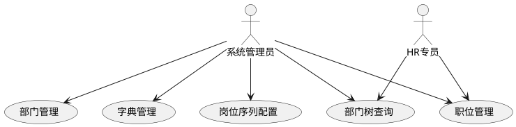

##### 用例详细说明
| 编号 | 用例名称 | 参与者 | 前置条件 | 后置条件 | 业务描述 |
| :---: | --- | --- | --- | --- | --- |
| UC-01 | 部门管理 | 系统管理员 | 已登录系统 | 部门树更新 | 对部门进行新增、编辑、删除、排序，维护部门层级关系 |
| UC-02 | 职位管理 | 系统管理员、HR专员 | 已登录系统 | 职位数据变更 | 创建、编辑职位，关联部门与岗位序列 |
| UC-03 | 字典管理 | 系统管理员 | 已登录系统 | 字典数据更新 | 管理系统字典类型与字典项（民族、学历、婚姻状况等） |
| UC-04 | 部门树查询 | 系统管理员、HR专员 | 已登录系统 | 展示组织架构 | 按层级树形结构查询全公司部门组织架构 |
| UC-05 | 岗位序列配置 | 系统管理员 | 已登录系统 | 序列范围生效 | 设置管理序列(M1-M5)、专业序列(P1-P10)、支持序列(S1-S5)职级范围 |


#### 3.2.2 功能清单
| 编号 | 功能名称 | PRD 章节 | 说明 |
| :---: | --- | :---: | --- |
| F-ORG-01 | 部门管理（增删改查、树形结构） | §3.1 | 部门 CRUD，支持 5 级层级 |
| F-ORG-02 | 职位管理（增删改查、职级范围） | §3.2 | 职位 CRUD，M/P/S 序列管理 |
| F-ORG-03 | 字典类型管理 | — | 字典类型 CRUD |
| F-ORG-04 | 字典数据管理 | — | 字典数据 CRUD，支持标签样式 |


#### 3.2.3 核心流程与时序
##### 部门创建流程
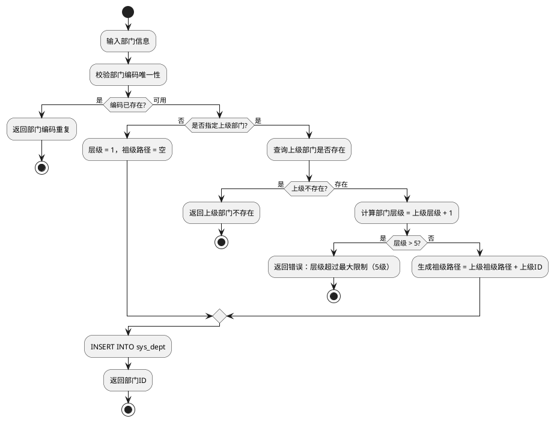

##### 部门创建时序
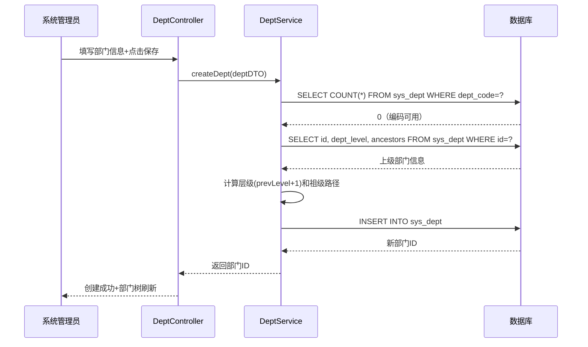

#### 3.2.4 数据库核心表
##### ER 图
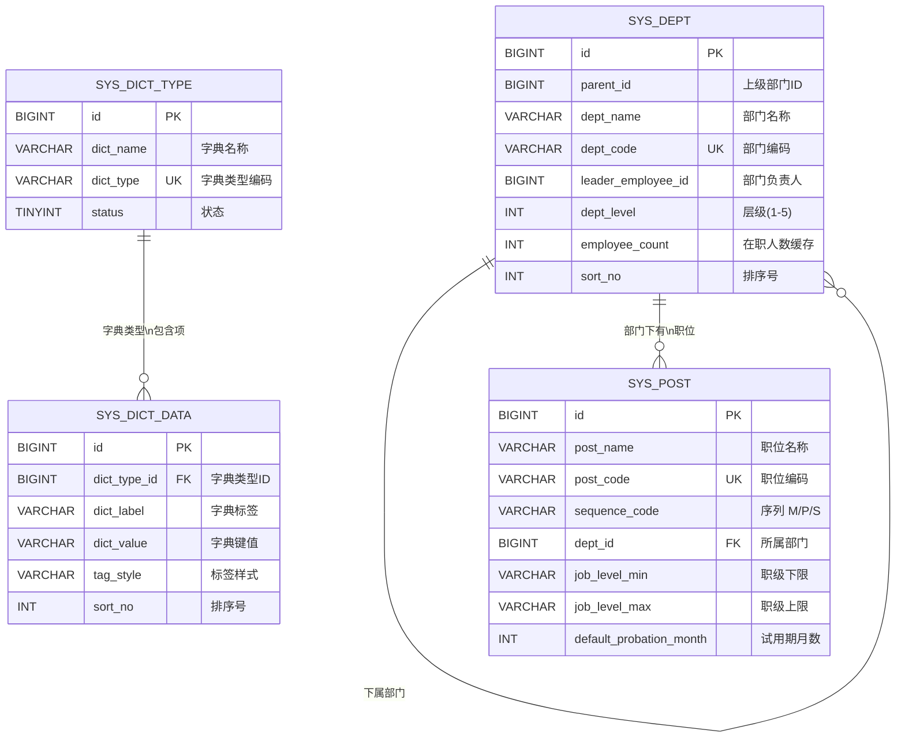

##### sys_dept（部门表）
```sql
CREATE TABLE `sys_dept` (
  `id` BIGINT UNSIGNED NOT NULL AUTO_INCREMENT COMMENT '主键ID',
  `parent_id` BIGINT UNSIGNED NOT NULL DEFAULT 0 COMMENT '上级部门 ID，0=根部门',
  `dept_name` VARCHAR(64) NOT NULL COMMENT '部门名称',
  `dept_code` VARCHAR(16) NOT NULL COMMENT '部门编码（用于工号生成）',
  `leader_user_id` BIGINT UNSIGNED DEFAULT NULL COMMENT '部门负责人用户 ID',
  `leader_employee_id` BIGINT UNSIGNED DEFAULT NULL COMMENT '部门负责人员工 ID',
  `ancestors` VARCHAR(500) DEFAULT NULL COMMENT '祖级路径（逗号分隔的祖先部门ID链）',
  `dept_level` INT NOT NULL DEFAULT 1 COMMENT '部门层级（根=1，最大=5）',
  `sort_no` INT NOT NULL DEFAULT 0 COMMENT '排序号',
  `employee_count` INT NOT NULL DEFAULT 0 COMMENT '在职员工数缓存（含本部门及所有下属部门）',
  `status` TINYINT NOT NULL DEFAULT 1 COMMENT '状态：1-启用 0-禁用',
  `create_by` BIGINT UNSIGNED DEFAULT NULL COMMENT '创建人',
  `create_time` DATETIME NOT NULL DEFAULT CURRENT_TIMESTAMP COMMENT '创建时间',
  `update_by` BIGINT UNSIGNED DEFAULT NULL COMMENT '更新人',
  `update_time` DATETIME NOT NULL DEFAULT CURRENT_TIMESTAMP ON UPDATE CURRENT_TIMESTAMP COMMENT '更新时间',
  `is_deleted` TINYINT(1) NOT NULL DEFAULT 0 COMMENT '逻辑删除',
  `version` INT NOT NULL DEFAULT 0 COMMENT '版本号',
  `remark` VARCHAR(500) DEFAULT NULL COMMENT '备注',
  PRIMARY KEY (`id`),
  UNIQUE KEY `uk_sys_dept_dept_code` (`dept_code`),
  KEY `idx_sys_dept_parent_id` (`parent_id`),
  KEY `idx_sys_dept_status` (`status`)
) ENGINE=InnoDB DEFAULT CHARSET=utf8mb4 COLLATE=utf8mb4_0900_ai_ci COMMENT='部门表';
```

##### sys_post（职位表）
```sql
CREATE TABLE `sys_post` (
  `id` BIGINT UNSIGNED NOT NULL AUTO_INCREMENT COMMENT '主键ID',
  `post_name` VARCHAR(64) NOT NULL COMMENT '职位名称',
  `post_code` VARCHAR(64) NOT NULL COMMENT '职位编码',
  `sequence_code` VARCHAR(16) NOT NULL COMMENT '职位序列：M-管理序列 P-专业序列 S-支持序列',
  `dept_id` BIGINT UNSIGNED DEFAULT NULL COMMENT '所属部门 ID，NULL=全公司通用',
  `job_level_min` VARCHAR(16) DEFAULT NULL COMMENT '职级下限（如 P3）',
  `job_level_max` VARCHAR(16) DEFAULT NULL COMMENT '职级上限（如 P7）',
  `default_probation_month` INT NOT NULL DEFAULT 3 COMMENT '默认试用期（月）',
  `description` VARCHAR(500) DEFAULT NULL COMMENT '职位描述',
  `status` TINYINT NOT NULL DEFAULT 1 COMMENT '状态：1-启用 0-禁用',
  `sort_no` INT NOT NULL DEFAULT 0 COMMENT '排序号',
  `create_by` BIGINT UNSIGNED DEFAULT NULL COMMENT '创建人',
  `create_time` DATETIME NOT NULL DEFAULT CURRENT_TIMESTAMP COMMENT '创建时间',
  `update_by` BIGINT UNSIGNED DEFAULT NULL COMMENT '更新人',
  `update_time` DATETIME NOT NULL DEFAULT CURRENT_TIMESTAMP ON UPDATE CURRENT_TIMESTAMP COMMENT '更新时间',
  `is_deleted` TINYINT(1) NOT NULL DEFAULT 0 COMMENT '逻辑删除',
  `version` INT NOT NULL DEFAULT 0 COMMENT '版本号',
  `remark` VARCHAR(500) DEFAULT NULL COMMENT '备注',
  PRIMARY KEY (`id`),
  UNIQUE KEY `uk_sys_post_post_code` (`post_code`),
  KEY `idx_sys_post_dept_id` (`dept_id`),
  KEY `idx_sys_post_status` (`status`)
) ENGINE=InnoDB DEFAULT CHARSET=utf8mb4 COLLATE=utf8mb4_0900_ai_ci COMMENT='职位表';
```

##### sys_dict_type（字典类型表）和 sys_dict_data（字典数据表）
DDL 详见全局系统分析说明书 §4.3。

#### 3.2.5 REST API 接口清单
##### 接口总览
| 编号 | 接口名称 | 方法 | 路径 | 说明 |
| :---: | --- | :---: | --- | --- |
| **部门管理** |  |  |  |  |
| API-ORG-01 | 部门树 | GET | /api/v1/departments/tree | 返回完整部门树结构 |
| API-ORG-02 | 部门列表（平铺） | GET | /api/v1/departments/list | 返回部门平铺列表，不含嵌套 |
| API-ORG-03 | 部门详情 | GET | /api/v1/departments/{id} | 获取单个部门详情 |
| API-ORG-04 | 创建部门 | POST | /api/v1/departments | 创建新部门 |
| API-ORG-05 | 更新部门 | PUT | /api/v1/departments/{id} | 更新部门信息 |
| API-ORG-06 | 删除部门 | DELETE | /api/v1/departments/{id} | 逻辑删除（约束：无子部门 + 无员工） |
| **职位管理** |  |  |  |  |
| API-ORG-07 | 职位列表 | GET | /api/v1/posts | 分页查询职位列表 |
| API-ORG-08 | 职位详情 | GET | /api/v1/posts/{id} | 获取单个职位详情 |
| API-ORG-09 | 创建职位 | POST | /api/v1/posts | 创建新职位 |
| API-ORG-10 | 更新职位 | PUT | /api/v1/posts/{id} | 更新职位信息 |
| API-ORG-11 | 删除职位 | DELETE | /api/v1/posts/{id} | 逻辑删除职位 |
| **字典管理** |  |  |  |  |
| API-ORG-12 | 字典类型列表 | GET | /api/v1/dict-types | 分页查询字典类型 |
| API-ORG-13 | 创建字典类型 | POST | /api/v1/dict-types | 创建字典类型 |
| API-ORG-14 | 字典数据列表 | GET | /api/v1/dict-data/type/{typeCode} | 按类型编码查询字典数据 |
| API-ORG-15 | 创建字典数据 | POST | /api/v1/dict-data | 创建字典数据项 |


##### 接口详细设计
**API-ORG-01：部门树**

| 项目 | 内容 |
| --- | --- |
| 请求方式 | GET |
| 请求路径 | /api/v1/departments/tree |
| 权限控制 | 登录（所有角色均可访问） |


**请求参数：** 无（返回全量状态为启用的部门，前端按需过滤）

**响应格式：**

```json
{
  "code": 20000,
  "message": "success",
  "data": [
    {
      "id": 1,
      "deptName": "总公司",
      "deptCode": "HQ",
      "parentId": 0,
      "deptLevel": 1,
      "leaderEmployeeId": null,
      "employeeCount": 120,
      "sortNo": 1,
      "status": 1,
      "children": [
        {
          "id": 10,
          "deptName": "技术部",
          "deptCode": "JS",
          "parentId": 1,
          "deptLevel": 2,
          "leaderEmployeeId": 5,
          "employeeCount": 45,
          "sortNo": 1,
          "status": 1,
          "children": [
            {
              "id": 101,
              "deptName": "前端组",
              "deptCode": "FE",
              "parentId": 10,
              "deptLevel": 3,
              "leaderEmployeeId": 20,
              "employeeCount": 15,
              "sortNo": 1,
              "status": 1,
              "children": []
            },
            {
              "id": 102,
              "deptName": "后端组",
              "deptCode": "BE",
              "parentId": 10,
              "deptLevel": 3,
              "leaderEmployeeId": 22,
              "employeeCount": 20,
              "sortNo": 2,
              "status": 1,
              "children": []
            }
          ]
        }
      ]
    }
  ],
  "timestamp": 1720684800000
}
```

**字段说明：**

+ `deptLevel`：部门层级，根部门=1，最大层级=5
+ `employeeCount`：部门在职员工数（含本部门及所有下属部门）
+ `leaderEmployeeId`：部门负责人的员工 ID
+ `children`：子部门数组，递归嵌套，叶子节点为 `[]`

**异常码：**

| 异常码 | 说明 |
| :---: | --- |
| 50000 | 部门树构建异常（数据异常导致递归错误） |


---

**API-ORG-02：部门列表（平铺）**

| 项目 | 内容 |
| --- | --- |
| 请求方式 | GET |
| 请求路径 | /api/v1/departments/list |
| 权限控制 | 登录 |


**请求参数：** 无

**响应格式：**

```json
{
  "code": 20000,
  "message": "success",
  "data": [
    {
      "id": 1,
      "deptName": "总公司",
      "parentId": 0,
      "deptLevel": 1
    },
    {
      "id": 10,
      "deptName": "技术部",
      "parentId": 1,
      "deptLevel": 2
    },
    {
      "id": 101,
      "deptName": "前端组",
      "parentId": 10,
      "deptLevel": 3
    }
  ],
  "timestamp": 1720684800000
}
```

**说明：** 平铺列表不构建树结构，所有部门在同一层级展开，由前端根据需要自行构建树。

---

**API-ORG-03：部门详情**

| 项目 | 内容 |
| --- | --- |
| 请求方式 | GET |
| 请求路径 | /api/v1/departments/{id} |
| 权限控制 | 登录 |


**请求参数（Path Variable）：**

| 参数名 | 类型 | 必填 | 说明 | 示例值 |
| --- | --- | :---: | --- | --- |
| id | Long | 是 | 部门 ID | 10 |


**响应格式：**

```json
{
  "code": 20000,
  "message": "success",
  "data": {
    "id": 10,
    "deptName": "技术部",
    "deptCode": "JS",
    "parentId": 1,
    "parentName": "总公司",
    "deptLevel": 2,
    "ancestors": "1",
    "leaderUserId": 5,
    "leaderEmployeeId": 5,
    "leaderName": "李四",
    "employeeCount": 45,
    "sortNo": 1,
    "status": 1,
    "description": "负责公司所有技术研发工作",
    "createTime": "2024-01-01 00:00:00"
  },
  "timestamp": 1720684800000
}
```

---

**API-ORG-04：创建部门**

| 项目 | 内容 |
| --- | --- |
| 请求方式 | POST |
| 请求路径 | /api/v1/departments |
| 权限控制 | admin（系统管理员 / HR 专员） |


**请求参数：**

```json
{
  "deptName": "数据组",
  "deptCode": "DS",
  "parentId": 10,
  "leaderUserId": 30,
  "sortNo": 3,
  "description": "负责数据分析和数据工程"
}
```

**参数说明：**

| 参数名 | 类型 | 必填 | 说明 |
| --- | --- | :---: | --- |
| deptName | String | 是 | 部门名称 |
| deptCode | String | 是 | 部门编码，全局唯一（用于工号生成） |
| parentId | Long | 否 | 上级部门 ID，不传或 0 表示根部门 |
| leaderUserId | Long | 否 | 部门负责人用户 ID |
| sortNo | Integer | 否 | 排序号，越小越靠前，默认 0 |
| description | String | 否 | 部门描述 |


**响应格式：**

```json
{
  "code": 20000,
  "message": "success",
  "data": {
    "id": 108,
    "deptName": "数据组",
    "deptCode": "DS",
    "parentId": 10,
    "deptLevel": 3,
    "ancestors": "1,10"
  },
  "timestamp": 1720684800000
}
```

**异常码：**

| 异常码 | 说明 |
| :---: | --- |
| 40001 | 参数校验失败 |
| 40021 | 部门编码已存在 |
| 40022 | 上级部门不存在 |
| 40023 | 部门层级超过最大限制（5级） |


---

**API-ORG-05：更新部门**

| 项目 | 内容 |
| --- | --- |
| 请求方式 | PUT |
| 请求路径 | /api/v1/departments/{id} |
| 权限控制 | admin |


**请求参数：**

```json
{
  "deptName": "数据与AI组",
  "leaderUserId": 35,
  "sortNo": 2,
  "description": "负责数据分析和AI能力建设"
}
```

**注意：** `deptCode` 不可修改（创建后锁定，因已有员工工号引用了该编码）。

**响应格式：**

```json
{
  "code": 20000,
  "message": "success",
  "data": null,
  "timestamp": 1720684800000
}
```

---

**API-ORG-06：删除部门**

| 项目 | 内容 |
| --- | --- |
| 请求方式 | DELETE |
| 请求路径 | /api/v1/departments/{id} |
| 权限控制 | admin |


**请求参数（Path Variable）：**

| 参数名 | 类型 | 必填 | 说明 | 示例值 |
| --- | --- | :---: | --- | --- |
| id | Long | 是 | 部门 ID | 108 |


**响应格式：**

```json
{
  "code": 20000,
  "message": "success",
  "data": null,
  "timestamp": 1720684800000
}
```

**删除约束：**

| 约束 | 检查条件 | 不满足时的异常码 |
| --- | --- | :---: |
| 无子部门 | parent_id = 待删除部门 ID 的记录数为 0 | 40024：存在子部门，无法删除 |
| 无在职员工 | 该部门下存在在职状态（试用期/正式）的员工 | 40025：存在在职员工，无法删除 |


---

**API-ORG-07：职位列表**

| 项目 | 内容 |
| --- | --- |
| 请求方式 | GET |
| 请求路径 | /api/v1/posts |
| 权限控制 | 登录 |


**请求参数（Query String）：**

| 参数名 | 类型 | 必填 | 说明 | 示例值 |
| --- | --- | :---: | --- | --- |
| deptId | Long | 否 | 按所属部门过滤 | 10 |
| sequenceCode | String | 否 | 按序列过滤：M/P/S | P |
| keyword | String | 否 | 关键词搜索 | Java |
| pageNum | Integer | 是 | 当前页码 | 1 |
| pageSize | Integer | 是 | 每页条数 | 20 |


**响应格式：**

```json
{
  "code": 20000,
  "message": "success",
  "data": {
    "total": 15,
    "pageNum": 1,
    "pageSize": 20,
    "pages": 1,
    "list": [
      {
        "id": 101,
        "postName": "Java开发工程师",
        "postCode": "JAVA_DEV",
        "sequenceCode": "P",
        "sequenceName": "专业序列",
        "deptId": 10,
        "deptName": "技术部",
        "jobLevelMin": "P3",
        "jobLevelMax": "P7",
        "defaultProbationMonth": 6,
        "status": 1,
        "sortNo": 1
      }
    ]
  },
  "timestamp": 1720684800000
}
```

---

**API-ORG-08：职位详情 / API-ORG-09：创建职位 / API-ORG-10：更新职位 / API-ORG-11：删除职位**

遵循 RESTful 规约，与部门 CRUD 格式一致，不再重复展开。

---

**API-ORG-12：字典类型列表**

| 项目 | 内容 |
| --- | --- |
| 请求方式 | GET |
| 请求路径 | /api/v1/dict-types |
| 权限控制 | 登录 |


**请求参数（Query String）：**

| 参数名 | 类型 | 必填 | 说明 | 示例值 |
| --- | --- | :---: | --- | --- |
| pageNum | Integer | 是 | 当前页码 | 1 |
| pageSize | Integer | 是 | 每页条数 | 20 |


**响应格式：**

```json
{
  "code": 20000,
  "message": "success",
  "data": {
    "total": 8,
    "pageNum": 1,
    "pageSize": 20,
    "pages": 1,
    "list": [
      {
        "id": 1,
        "dictName": "在职状态",
        "dictType": "sys_employment_status",
        "status": 1,
        "remark": "员工当前在职状态"
      },
      {
        "id": 2,
        "dictName": "请假类型",
        "dictType": "hr_leave_type",
        "status": 1,
        "remark": "员工请假类型定义"
      }
    ]
  },
  "timestamp": 1720684800000
}
```

---

**API-ORG-13：创建字典类型**

| 项目 | 内容 |
| --- | --- |
| 请求方式 | POST |
| 请求路径 | /api/v1/dict-types |
| 权限控制 | admin |


**请求参数：**

```json
{
  "dictName": "招聘渠道",
  "dictType": "hr_recruitment_channel",
  "remark": "员工招聘来源渠道"
}
```

**参数说明：**

| 参数名 | 类型 | 必填 | 说明 |
| --- | --- | :---: | --- |
| dictName | String | 是 | 字典名称（展示用） |
| dictType | String | 是 | 字典类型编码，全局唯一 |
| status | Integer | 否 | 状态：1-启用 0-禁用，默认 1 |
| remark | String | 否 | 备注 |


---

**API-ORG-14：字典数据列表（按类型查询）**

| 项目 | 内容 |
| --- | --- |
| 请求方式 | GET |
| 请求路径 | /api/v1/dict-data/type/{typeCode} |
| 权限控制 | 登录（所有角色，前端下拉框常用接口） |


**请求参数（Path Variable）：**

| 参数名 | 类型 | 必填 | 说明 | 示例值 |
| --- | --- | :---: | --- | --- |
| typeCode | String | 是 | 字典类型编码 | sys_employment_status |


**响应格式：**

```json
{
  "code": 20000,
  "message": "success",
  "data": [
    {
      "dictType": "sys_employment_status",
      "dictLabel": "试用期",
      "dictValue": "1",
      "tagType": "processing",
      "sortNo": 1,
      "isDefault": true,
      "status": 1
    },
    {
      "dictType": "sys_employment_status",
      "dictLabel": "正式",
      "dictValue": "2",
      "tagType": "success",
      "sortNo": 2,
      "isDefault": false,
      "status": 1
    },
    {
      "dictType": "sys_employment_status",
      "dictLabel": "待离职",
      "dictValue": "3",
      "tagType": "warning",
      "sortNo": 3,
      "isDefault": false,
      "status": 1
    },
    {
      "dictType": "sys_employment_status",
      "dictLabel": "已离职",
      "dictValue": "4",
      "tagType": "default",
      "sortNo": 4,
      "isDefault": false,
      "status": 1
    }
  ],
  "timestamp": 1720684800000
}
```

**字段说明：**

+ `tagType`：前端标签样式（processing=蓝色，success=绿色，warning=橙色，default=灰色）
+ `isDefault`：是否为该类型的默认值（新记录创建时自动填充）
+ `sortNo`：排序号，下拉框按此字段升序排列

**异常码：**

| 异常码 | 说明 |
| :---: | --- |
| 40030 | 字典类型编码不存在 |


---

**API-ORG-15：创建字典数据**

| 项目 | 内容 |
| --- | --- |
| 请求方式 | POST |
| 请求路径 | /api/v1/dict-data |
| 权限控制 | admin |


**请求参数：**

```json
{
  "dictType": "hr_recruitment_channel",
  "dictLabel": "猎聘",
  "dictValue": "liepin",
  "sortNo": 1,
  "tagType": "default",
  "isDefault": false
}
```

#### 3.2.6 模块间服务接口
| 服务方法 | 用途说明 | 调用方 |
| --- | --- | --- |
| `DeptService.getDeptTree()` | 获取完整部门树 | 前端 + 员工档案、入转调离、薪资 |
| `DeptService.getDeptById(id)` | 查询部门详情 | 员工档案、入转调离 |
| `DeptService.getSubDeptIds(parentId)` | 递归获取所有子部门 ID 列表 | 数据权限拦截器 |
| `PostService.getPostById(id)` | 查询职位详情 | 员工档案 |
| `DictService.getDictDataByType(typeCode)` | 按类型查询字典数据 | 所有业务模块 |


#### 3.2.7 关键技术方案
##### 部门树维护
| 技术点 | 方案 |
| --- | --- |
| 层级控制 | `dept_level` 字段，创建时 = 父级别 + 1，超过 5 级拒绝 |
| 祖级路径 | `ancestors` 字段存储逗号分隔的祖先 ID 链，方便递归子部门查询 |
| 树构建 | 查询全量部门列表后在内存中构建树，避免递归查库 |
| 人数缓存 | 定时任务（每日）或事件驱动更新 `employee_count`，口径为**包含本部门及所有下属部门**中状态为试用期/正式的员工总数 |


##### 职位序列与职级范围
| 序列 | 职级范围 | 典型职位 |
| --- | --- | --- |
| 管理序列 M | M1～M5 | M1 主管、M2 经理、M3 总监、M4 高级总监、M5 VP |
| 专业序列 P | P1～P10 | P3 初级工程师、P5 中级工程师、P7 高级工程师、P9 专家 |
| 支持序列 S | S1～S5 | S1 助理、S2 专员、S3 高级专员、S4 资深专员、S5 首席专员 |


##### 字典缓存
+ 本地缓存：Caffeine 缓存字典数据，TTL = 30 分钟
+ 失效策略：字典数据变更时主动清除对应类型的缓存 key
+ 批量加载：前端页面初始化时批量请求常用字典（请假类型、在职状态等），减少单次请求

---

### 3.3 员工档案管理模块（M3）
员工档案管理是 HRMS 的基础数据底座，维护所有员工的核心主数据。归属 `hrms-business-employee` 子模块，依赖权限体系和组织架构模块提供的内部服务。

#### 3.3.1 用例分析
##### 用例图
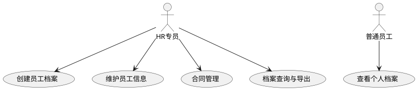

##### 用例详细说明
| 编号 | 用例名称 | 参与者 | 前置条件 | 后置条件 | 业务描述 |
| :---: | --- | --- | --- | --- | --- |
| UC-01 | 创建员工档案 | HR专员 | 已登录系统 | 档案创建成功，生成工号 | 录入新员工完整档案信息，系统自动生成唯一工号 |
| UC-02 | 维护员工信息 | HR专员 | 已登录系统 | 信息保存生效 | 对在职员工基本信息、联系方式、学历、家庭等进行编辑 |
| UC-03 | 合同管理 | HR专员 | 已登录系统 | 合同信息更新 | 管理员工劳动合同的新签、续签、变更、终止操作 |
| UC-04 | 档案查询与导出 | HR专员 | 已登录系统 | 展示/导出结果 | 按多条件组合查询员工档案，支持 Excel 导出 |
| UC-05 | 查看个人档案 | 普通员工 | 已登录系统（本人） | 展示档案信息 | 查看个人基本信息及档案字段，受字段级权限控制 |


#### 3.3.2 功能清单
| 编号 | 功能名称 | PRD 章节 | 说明 |
| :---: | --- | :---: | --- |
| F-EMP-01 | 档案字段定义 | §4.1 | 基础信息/个人信息/工作信息/合同与薪资信息 |
| F-EMP-02 | 工号自动生成 | §4.1.1 | 格式：4位年份+2位部门编码+3位序号 |
| F-EMP-03 | 系统账号自动创建 | §5.1.5 | 入职时自动创建，登录账号=手机号 |
| F-EMP-04 | 员工查询与列表 | §4.2 | 分页、关键词/部门/状态/职级筛选 |
| F-EMP-05 | 字段级权限控制 | §2.3 | 按角色控制字段可见性与可编辑性 |
| F-EMP-06 | 员工合同管理 | §4.1.4 | 合同类型/到期日/附件管理 |
| F-EMP-07 | 敏感数据加密与脱敏 | §12.2 | 身份证号、银行卡号加密存储 |


#### 3.3.3 核心流程与时序
##### 员工档案创建流程
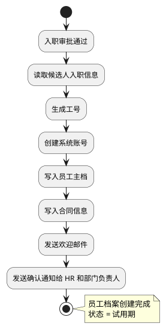

##### 创建员工档案时序
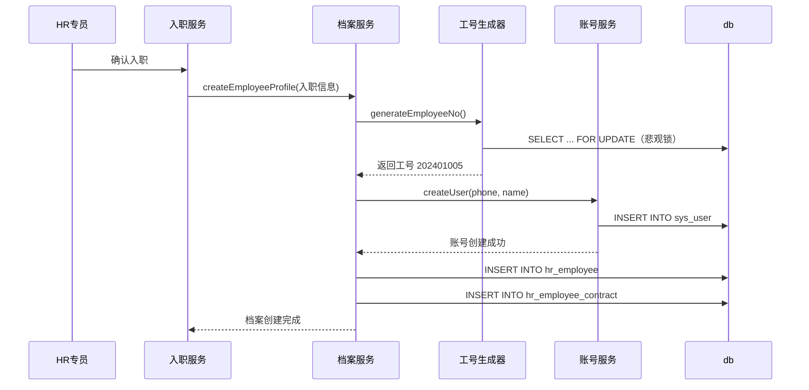

#### 3.3.4 数据库核心表
##### ER 图
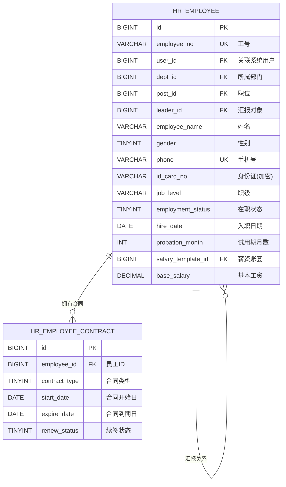

##### hr_employee（员工主档表）
```sql
CREATE TABLE `hr_employee` (
  `id` BIGINT UNSIGNED NOT NULL AUTO_INCREMENT COMMENT '主键ID',
  `employee_no` VARCHAR(32) NOT NULL COMMENT '工号',
  `user_id` BIGINT UNSIGNED DEFAULT NULL COMMENT '关联系统用户ID',
  `dept_id` BIGINT UNSIGNED NOT NULL COMMENT '所属部门ID',
  `post_id` BIGINT UNSIGNED DEFAULT NULL COMMENT '职位ID',
  `leader_id` BIGINT UNSIGNED DEFAULT NULL COMMENT '直接汇报人员工ID',
  `employee_name` VARCHAR(64) NOT NULL COMMENT '员工姓名',
  `gender` TINYINT DEFAULT NULL COMMENT '性别：1-男 2-女',
  `phone` VARCHAR(20) NOT NULL COMMENT '手机号',
  `email` VARCHAR(128) DEFAULT NULL COMMENT '邮箱',
  `id_card_no` VARCHAR(255) DEFAULT NULL COMMENT '身份证号（AES-256 GCM 加密存储）',
  `birthday` DATE DEFAULT NULL COMMENT '生日',
  `domicile_address` VARCHAR(255) DEFAULT NULL COMMENT '户籍地址',
  `current_address` VARCHAR(255) DEFAULT NULL COMMENT '现居住地址',
  `job_level` VARCHAR(16) DEFAULT NULL COMMENT '职级',
  `work_location` VARCHAR(128) DEFAULT NULL COMMENT '工作地点',
  `hire_type` TINYINT DEFAULT NULL COMMENT '入职类型：1-全职 2-兼职 3-实习',
  `employment_status` TINYINT NOT NULL COMMENT '在职状态：1-试用期 2-正式 3-待离职 4-已离职',
  `hire_date` DATE NOT NULL COMMENT '入职日期',
  `probation_month` INT DEFAULT 3 COMMENT '试用期（月）',
  `probation_salary_ratio` DECIMAL(5,2) DEFAULT 100.00 COMMENT '试用期薪资比例（%）',
  `contract_type` TINYINT DEFAULT NULL COMMENT '合同类型：1-固定期限 2-无固定期限 3-劳务合同',
  `contract_expire_date` DATE DEFAULT NULL COMMENT '合同到期日',
  `salary_template_id` BIGINT UNSIGNED DEFAULT NULL COMMENT '薪资账套ID',
  `base_salary` DECIMAL(12,2) DEFAULT NULL COMMENT '基本工资',
  `bank_account` VARCHAR(255) DEFAULT NULL COMMENT '银行账号（AES-256 GCM 加密存储）',
  `bank_name` VARCHAR(128) DEFAULT NULL COMMENT '开户行',
  `emergency_contact` VARCHAR(64) DEFAULT NULL COMMENT '紧急联系人',
  `emergency_phone` VARCHAR(20) DEFAULT NULL COMMENT '紧急联系人电话',
  `create_by` BIGINT UNSIGNED DEFAULT NULL COMMENT '创建人',
  `create_time` DATETIME NOT NULL DEFAULT CURRENT_TIMESTAMP COMMENT '创建时间',
  `update_by` BIGINT UNSIGNED DEFAULT NULL COMMENT '更新人',
  `update_time` DATETIME NOT NULL DEFAULT CURRENT_TIMESTAMP ON UPDATE CURRENT_TIMESTAMP COMMENT '更新时间',
  `is_deleted` TINYINT(1) NOT NULL DEFAULT 0 COMMENT '逻辑删除',
  `version` INT NOT NULL DEFAULT 0 COMMENT '版本号',
  `remark` VARCHAR(500) DEFAULT NULL COMMENT '备注',
  PRIMARY KEY (`id`),
  UNIQUE KEY `uk_hr_employee_no` (`employee_no`),
  UNIQUE KEY `uk_hr_employee_phone` (`phone`),
  UNIQUE KEY `uk_hr_employee_user_id` (`user_id`),
  KEY `idx_hr_employee_dept_id` (`dept_id`),
  KEY `idx_hr_employee_post_id` (`post_id`),
  KEY `idx_hr_employee_leader_id` (`leader_id`),
  KEY `idx_hr_employee_employment_status` (`employment_status`),
  KEY `idx_hr_employee_hire_date` (`hire_date`),
  KEY `idx_hr_employee_contract_expire` (`contract_expire_date`)
) ENGINE=InnoDB DEFAULT CHARSET=utf8mb4 COLLATE=utf8mb4_0900_ai_ci COMMENT='员工主档表';
```

##### hr_employee_contract（员工合同表）
```sql
CREATE TABLE `hr_employee_contract` (
  `id` BIGINT UNSIGNED NOT NULL AUTO_INCREMENT COMMENT '主键ID',
  `employee_id` BIGINT UNSIGNED NOT NULL COMMENT '员工ID',
  `contract_no` VARCHAR(64) DEFAULT NULL COMMENT '合同编号',
  `contract_type` TINYINT NOT NULL COMMENT '合同类型：1-固定期限 2-无固定期限 3-劳务合同',
  `start_date` DATE DEFAULT NULL COMMENT '合同开始日期',
  `end_date` DATE DEFAULT NULL COMMENT '合同结束日期',
  `probation_month` INT DEFAULT NULL COMMENT '试用期（月）',
  `probation_salary_ratio` DECIMAL(5,2) DEFAULT NULL COMMENT '试用期薪资比例（%）',
  `attachment_file_id` BIGINT UNSIGNED DEFAULT NULL COMMENT '附件文件ID',
  `signing_count` INT NOT NULL DEFAULT 1 COMMENT '续签次数',
  `create_by` BIGINT UNSIGNED DEFAULT NULL COMMENT '创建人',
  `create_time` DATETIME NOT NULL DEFAULT CURRENT_TIMESTAMP COMMENT '创建时间',
  `update_by` BIGINT UNSIGNED DEFAULT NULL COMMENT '更新人',
  `update_time` DATETIME NOT NULL DEFAULT CURRENT_TIMESTAMP ON UPDATE CURRENT_TIMESTAMP COMMENT '更新时间',
  `is_deleted` TINYINT(1) NOT NULL DEFAULT 0 COMMENT '逻辑删除',
  `version` INT NOT NULL DEFAULT 0 COMMENT '版本号',
  `remark` VARCHAR(500) DEFAULT NULL COMMENT '备注',
  PRIMARY KEY (`id`),
  KEY `idx_hr_emp_contract_employee_id` (`employee_id`),
  KEY `idx_hr_emp_contract_end_date` (`end_date`)
) ENGINE=InnoDB DEFAULT CHARSET=utf8mb4 COLLATE=utf8mb4_0900_ai_ci COMMENT='员工合同表';
```

#### 3.3.5 REST API 接口清单
##### 接口总览
| 编号 | 接口名称 | 方法 | 路径 | 说明 |
| :---: | --- | :---: | --- | --- |
| **档案管理** |  |  |  |  |
| API-EMP-01 | 员工列表（分页） | GET | /api/v1/employees | 分页查询员工列表（支持高级搜索） |
| API-EMP-02 | 员工详情 | GET | /api/v1/employees/{id} | 获取员工完整档案 |
| API-EMP-03 | 新增员工 | POST | /api/v1/employees | 新增员工（直接录入） |
| API-EMP-04 | 更新员工 | PUT | /api/v1/employees/{id} | 全量更新员工主档 |
| API-EMP-05 | 部分更新员工 | PATCH | /api/v1/employees/{id} | 部分字段更新/状态变更 |
| API-EMP-06 | 删除员工 | DELETE | /api/v1/employees/{id} | 逻辑删除（is_deleted=1） |
| **工号与数据服务** |  |  |  |  |
| API-EMP-07 | 生成工号 | GET | /api/v1/employees/gen-no | 生成新的员工工号 |


##### 接口详细设计
**API-EMP-01：员工列表（分页查询）**

| 项目 | 内容 |
| --- | --- |
| 请求方式 | GET |
| 请求路径 | /api/v1/employees |
| 权限控制 | 按数据权限范围过滤（系统管理员/HR 全量，部门主管本部门及下属，普通员工仅本人） |


**请求参数（Query String）：**

| 参数名 | 类型 | 必填 | 说明 | 示例值 |
| --- | --- | :---: | --- | --- |
| pageNum | Integer | 是 | 当前页码 | 1 |
| pageSize | Integer | 是 | 每页条数，最大 100 | 20 |
| keyword | String | 否 | 关键词搜索（姓名/工号/手机号，模糊匹配） | 张三 |
| deptIds | Long[] | 否 | 部门 ID 列表（多选） | [10, 101] |
| employmentStatus | Integer[] | 否 | 在职状态多选：1-试用期 2-正式 3-待离职 4-已离职 | [1, 2] |
| jobLevel | String | 否 | 职级筛选 | P5 |
| hireDateStart | String | 否 | 入职日期范围-开始（yyyy-MM-dd） | 2024-01-01 |
| hireDateEnd | String | 否 | 入职日期范围-结束（yyyy-MM-dd） | 2026-07-11 |


**响应格式：**

```json
{
  "code": 20000,
  "message": "success",
  "data": {
    "total": 128,
    "pageNum": 1,
    "pageSize": 20,
    "pages": 7,
    "list": [
      {
        "id": 5,
        "employeeNo": "202401005",
        "employeeName": "张三",
        "gender": 1,
        "genderDesc": "男",
        "phone": "13800001234",
        "deptId": 10,
        "deptName": "技术部",
        "postName": "Java开发工程师",
        "jobLevel": "P5",
        "employmentStatus": 2,
        "employmentStatusDesc": "正式",
        "hireDate": "2024-01-15",
        "leaderName": "李四",
        "createTime": "2024-01-15 09:00:00"
      }
    ]
  },
  "timestamp": 1720684800000
}
```

**字段说明：**

+ 响应字段做了脱敏处理（手机号中间4位*号）
+ 数据权限拦截器自动注入：HR 全量、部门主管仅本部门及下属、员工仅本人
+ 前端通过 `/api/v1/permissions/field?bizType=employee` 获取当前用户的字段权限，控制列表列显隐

**异常码：**

| 异常码 | 说明 |
| :---: | --- |
| 40001 | 参数校验失败（pageSize 超过 100） |


---

**API-EMP-02：员工详情**

| 项目 | 内容 |
| --- | --- |
| 请求方式 | GET |
| 请求路径 | /api/v1/employees/{id} |
| 权限控制 | 按数据权限范围 + 字段权限双重控制 |


**请求参数（Path Variable）：**

| 参数名 | 类型 | 必填 | 说明 | 示例值 |
| --- | --- | :---: | --- | --- |
| id | Long | 是 | 员工 ID | 5 |


**响应格式：**

```json
{
  "code": 20000,
  "message": "success",
  "data": {
    "id": 5,
    "employeeNo": "202401005",
    "userId": 10,
    "employeeName": "张三",
    "gender": 1,
    "genderDesc": "男",
    "phone": "138****1234",
    "email": "zhangsan@hrms.com",
    "idCardNo": "330***********1234",
    "birthday": "1995-06-15",
    "domicileAddress": "浙江省杭州市西湖区文三路XX号",
    "currentAddress": "浙江省杭州市滨江区XX小区",
    "deptId": 10,
    "deptName": "技术部",
    "postId": 101,
    "postName": "Java开发工程师",
    "jobLevel": "P5",
    "leaderId": 3,
    "leaderName": "李四",
    "workLocation": "杭州",
    "hireType": 1,
    "hireTypeDesc": "全职",
    "employmentStatus": 2,
    "employmentStatusDesc": "正式",
    "hireDate": "2024-01-15",
    "probationMonth": 6,
    "probationSalaryRatio": 100.00,
    "contractType": 1,
    "contractTypeDesc": "固定期限",
    "contractExpireDate": "2027-01-14",
    "bankAccount": "**** **** **** 1234",
    "emergencyContact": "王五",
    "emergencyPhone": "139****5678",
    "fieldPermissions": {
      "editableFields": ["email", "currentAddress", "emergencyContact", "emergencyPhone"],
      "flowRequiredFields": ["phone", "deptId", "postId", "jobLevel"],
      "lockedFields": ["idCardNo", "bankAccount"]
    },
    "createTime": "2024-01-15 09:00:00"
  },
  "timestamp": 1720684800000
}
```

**字段说明：**

+ 敏感字段（身份证号、手机号、银行账号）根据字段权限自动脱敏
+ `fieldPermissions` 告知前端哪些字段可编辑、哪些需走流程、哪些锁定

**异常码：**

| 异常码 | 说明 |
| :---: | --- |
| 40301 | 无权限查看该员工档案（数据权限范围外） |
| 40401 | 员工不存在 |


---

**API-EMP-03：新增员工**

| 项目 | 内容 |
| --- | --- |
| 请求方式 | POST |
| 请求路径 | /api/v1/employees |
| 权限控制 | admin（HR 专员） |


**请求参数：**

```json
{
  "employeeName": "赵六",
  "gender": 1,
  "phone": "13900001111",
  "email": "zhaoliu@hrms.com",
  "deptId": 10,
  "postId": 102,
  "jobLevel": "P4",
  "leaderId": 5,
  "workLocation": "杭州",
  "hireType": 1,
  "hireDate": "2026-07-15",
  "probationMonth": 6,
  "probationSalaryRatio": 80.00,
  "contractType": 1,
  "contractExpireDate": "2029-07-14",
  "salaryTemplateId": 2,
  "baseSalary": 12000.00
}
```

**响应格式：**

```json
{
  "code": 20000,
  "message": "success",
  "data": {
    "id": 52,
    "employeeNo": "202601052",
    "userId": 55,
    "employeeName": "赵六"
  },
  "timestamp": 1720684800000
}
```

**字段说明：**

+ `employeeNo`：系统自动生成，格式为 4位年份+2位部门编码+3位序号
+ `userId`：系统自动创建的关联账号 ID
+ 新增时生成工号并自动创建系统账号（登录账号=手机号，初始密码随机）

**异常码：**

| 异常码 | 说明 |
| :---: | --- |
| 40001 | 参数校验失败（如手机号格式错误） |
| 40031 | 手机号已被占用 |
| 40032 | 所属部门不存在 |
| 40033 | 职位不存在 |


---

**API-EMP-04：更新员工 / API-EMP-05：部分更新员工**

遵循 RESTful 规约，`PUT` 为全量覆盖，`PATCH` 为部分更新。更新字段受字段权限控制（不可编辑字段传入时被忽略）。

---

**API-EMP-06：删除员工**

| 项目 | 内容 |
| --- | --- |
| 请求方式 | DELETE |
| 请求路径 | /api/v1/employees/{id} |
| 权限控制 | admin（HR 专员） |


**说明：** 逻辑删除（`is_deleted=1`），仅限在职状态为"试用期"且从未发生过业务的员工。

---

**API-EMP-07：生成工号**

| 项目 | 内容 |
| --- | --- |
| 请求方式 | GET |
| 请求路径 | /api/v1/employees/gen-no |
| 权限控制 | 内部服务（入转调离模块调用） |


**请求参数（Query String）：**

| 参数名 | 类型 | 必填 | 说明 | 示例值 |
| --- | --- | :---: | --- | --- |
| deptCode | String | 是 | 部门编码（作为工号组成部分） | BE |


**响应格式：**

```json
{
  "code": 20000,
  "message": "success",
  "data": {
    "employeeNo": "2026BE005"
  },
  "timestamp": 1720684800000
}
```

**安全说明：** 采用数据库悲观锁 `SELECT ... FOR UPDATE`，保证同一时刻不生成重复工号。

#### 3.3.6 模块间服务接口
| 服务方法 | 用途说明 | 调用方 |
| --- | --- | --- |
| `EmployeeService.getEmployeeBrief(id)` | 获取员工简要信息（姓名+部门+职位） | 考勤、薪资、审批中心、个人中心 |
| `EmployeeService.getEmployeeFull(id)` | 获取员工完整档案 | 入转调离、薪资、个人中心 |
| `EmployeeService.generateEmployeeNo()` | 生成工号（悲观锁） | 入转调离（入职确认时调用） |
| `EmployeeService.getEmployeesByDept(deptId)` | 按部门获取员工列表 | 考勤、薪资 |
| `EmployeeService.validateFieldPermission(employeeId, fieldName)` | 校验字段权限 | 个人中心（编辑时调用） |


#### 3.3.7 关键技术方案
##### 工号生成并发安全
| 技术点 | 方案 |
| --- | --- |
| 格式规则 | `{4位年份}{2位部门编码}{3位流水序号}`，如 `2026BE005` |
| 并发保障 | 数据库悲观锁 `SELECT ... FOR UPDATE` + 唯一索引双重保障 |
| 回收复用 | 离职后工号标记释放，本年度内优先重用释放工号 |
| 兜底保护 | `uk_hr_employee_no` 唯一索引防止极端并发重复 |


##### 敏感数据加密与脱敏
| 技术点 | 方案 |
| --- | --- |
| 加密算法 | AES-256 GCM 模式 |
| 密钥管理 | 环境变量 `HRMS_AES_KEY` 配置，禁止硬编码 |
| 加密字段 | `id_card_no`（身份证号）、`bank_account`（银行账号） |
| 脱敏规则 | 身份证号保留前4后4（`330****1234`），手机号保留前3后4（`138****1234`），银行卡仅显示后4位 |
| 脱敏层 | 后端统一处理，`DesensitizationUtil` 工具类，按字段权限配置决定返回明文/脱敏值/不可见 |


##### 字段级权限控制
+ 接口 `/api/v1/permissions/field?bizType=employee` 返回当前用户对员工档案字段的可见/可编辑列表
+ 后端在查询和更新时校验字段权限，禁止越权操作
+ 前端根据返回的 `editableFields` 控制编辑按钮显隐
+ 详细规则见全局系统分析说明书 §4.1.2 字段权限说明

---

### 3.4 入转调离流程模块（M4）
入转调离模块负责员工全生命周期的四大流程管理，依赖员工档案模块提供的基础数据与内部服务。归属 `hrms-business-personnel` 子模块。

#### 3.4.1 用例分析
##### 用例图
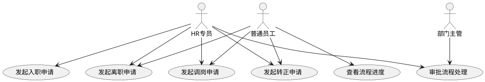

##### 用例详细说明
| 编号 | 用例名称 | 参与者 | 前置条件 | 后置条件 | 业务描述 |
| :---: | --- | --- | --- | --- | --- |
| UC-01 | 发起入职申请 | HR专员 | 已登录系统 | 申请提交成功 | 为待入职员工发起入职申请，填写入职信息与岗位 |
| UC-02 | 发起离职申请 | 普通员工、HR专员 | 已登录系统 | 申请提交成功 | 员工主动离职或公司辞退时发起离职流程 |
| UC-03 | 发起调岗申请 | 普通员工、HR专员 | 已登录系统 | 申请提交成功 | 员工部门/岗位变动时发起调岗流程 |
| UC-04 | 发起转正申请 | 普通员工、HR专员 | 已登录系统 | 申请提交成功 | 试用期到期前发起转正评估流程 |
| UC-05 | 审批流程处理 | 部门主管、HR专员 | 有待办审批任务 | 审批通过/驳回 | 对入职/离职/调岗/转正申请进行审批操作 |
| UC-06 | 查看流程进度 | 普通员工 | 已登录系统（本人） | 展示审批进度 | 查看本人发起的申请的当前审批节点与状态 |


#### 3.4.2 功能清单
| 编号 | 功能名称 | PRD 章节 | 说明 |
| :---: | --- | :---: | --- |
| F-PER-01 | 入职管理 | §5.1 | 候选人录入→审批→工号生成→档案创建→账号创建 |
| F-PER-02 | 转正管理 | §5.2 | 试用期扫描→评估→审批→状态变更 |
| F-PER-03 | 调岗管理 | §5.3 | 调岗申请→三级审批→档案更新 |
| F-PER-04 | 离职管理 | §5.4 | 离职申请→审批→待离职→生效处理 |
| F-PER-05 | 合同到期提醒 | — | 扫描近30天到期合同，通知 HR |


#### 3.4.3 核心流程与时序
##### 入职状态流转
<!-- 这是一个文本绘图，源码为：@startuml
start
:新建候选人;
:信息录入;

if (保存草稿?) then (是)
  :草稿\napproval_status = 0;
  :编辑后提交;
  :信息录入;
  note left: 编辑循环
else (提交审批)
  :审批中\napproval_status = 1;
  if (审批结果?) then (通过)
    :已批准待入职\napproval_status = 2;
    :HR 确认入职;
    :系统自动处理：\n生成工号 → 创建账号 →\n创建档案 → 发通知;
    stop
    note right
      已入职
      approval_status = 5
      员工状态 = 试用期
    end note
  elseif (拒绝) then
    :已拒绝\napproval_status = 3;
    :重新发起;
    :信息录入;
    note left: 重新发起循环
  else (转交)
    :新审批人处理;
    :审批中;
  endif
endif
@enduml -->


**审批流：** 部门负责人 → [HR 负责人]（可选，非标准职位或薪资超范围时开启二审）

##### 调岗流程时序
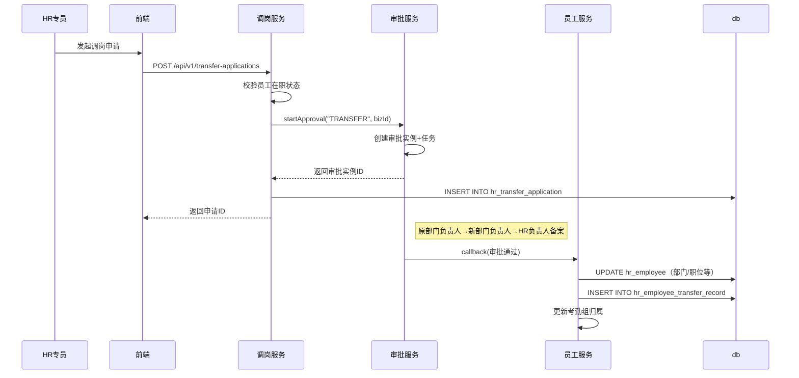

#### 3.4.4 数据库核心表
##### ER 图
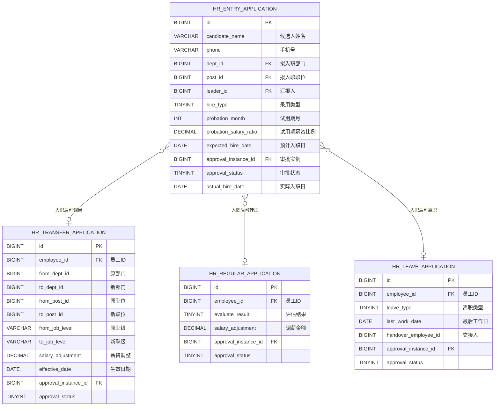

##### hr_entry_application（入职申请表）
```sql
CREATE TABLE `hr_entry_application` (
  `id` BIGINT UNSIGNED NOT NULL AUTO_INCREMENT COMMENT '主键ID',
  `candidate_name` VARCHAR(64) NOT NULL COMMENT '候选人姓名',
  `gender` TINYINT DEFAULT NULL COMMENT '性别',
  `phone` VARCHAR(20) NOT NULL COMMENT '手机号',
  `email` VARCHAR(128) DEFAULT NULL COMMENT '邮箱',
  `id_card_no` VARCHAR(255) DEFAULT NULL COMMENT '身份证号',
  `dept_id` BIGINT UNSIGNED NOT NULL COMMENT '拟入职部门ID',
  `post_id` BIGINT UNSIGNED NOT NULL COMMENT '拟入职职位ID',
  `hire_type` TINYINT NOT NULL COMMENT '录用类型：1-全职 2-兼职 3-实习',
  `probation_month` INT NOT NULL COMMENT '试用期（月）',
  `probation_salary_ratio` DECIMAL(5,2) NOT NULL DEFAULT 80.00 COMMENT '试用期薪资比例（%）',
  `expected_hire_date` DATE NOT NULL COMMENT '预计入职日期',
  `leader_id` BIGINT UNSIGNED DEFAULT NULL COMMENT '直接汇报人',
  `approval_instance_id` BIGINT UNSIGNED DEFAULT NULL COMMENT '审批实例ID',
  `approval_status` TINYINT NOT NULL DEFAULT 0 COMMENT '审批状态：0-草稿 1-审批中 2-已通过 3-已拒绝 5-已入职',
  `actual_hire_date` DATE DEFAULT NULL COMMENT '实际入职日期（HR确认时填写）',
  `create_by` BIGINT UNSIGNED DEFAULT NULL COMMENT '创建人',
  `create_time` DATETIME NOT NULL DEFAULT CURRENT_TIMESTAMP COMMENT '创建时间',
  `update_by` BIGINT UNSIGNED DEFAULT NULL COMMENT '更新人',
  `update_time` DATETIME NOT NULL DEFAULT CURRENT_TIMESTAMP ON UPDATE CURRENT_TIMESTAMP COMMENT '更新时间',
  `is_deleted` TINYINT(1) NOT NULL DEFAULT 0 COMMENT '逻辑删除',
  `version` INT NOT NULL DEFAULT 0 COMMENT '版本号',
  PRIMARY KEY (`id`),
  UNIQUE KEY `uk_hr_entry_app_phone` (`phone`),
  KEY `idx_hr_entry_app_status` (`approval_status`),
  KEY `idx_hr_entry_app_dept` (`dept_id`)
) ENGINE=InnoDB DEFAULT CHARSET=utf8mb4 COLLATE=utf8mb4_0900_ai_ci COMMENT='入职申请表';
```

##### hr_transfer_application（调岗申请表）
```sql
CREATE TABLE `hr_transfer_application` (
  `id` BIGINT UNSIGNED NOT NULL AUTO_INCREMENT COMMENT '主键ID',
  `employee_id` BIGINT UNSIGNED NOT NULL COMMENT '员工ID',
  `from_dept_id` BIGINT UNSIGNED NOT NULL COMMENT '原部门ID',
  `to_dept_id` BIGINT UNSIGNED NOT NULL COMMENT '新部门ID',
  `from_post_id` BIGINT UNSIGNED DEFAULT NULL COMMENT '原职位ID',
  `to_post_id` BIGINT UNSIGNED DEFAULT NULL COMMENT '新职位ID',
  `from_job_level` VARCHAR(16) DEFAULT NULL COMMENT '原职级',
  `to_job_level` VARCHAR(16) DEFAULT NULL COMMENT '新职级',
  `from_leader_id` BIGINT UNSIGNED DEFAULT NULL COMMENT '原汇报人ID',
  `to_leader_id` BIGINT UNSIGNED DEFAULT NULL COMMENT '新汇报人ID',
  `salary_adjustment` DECIMAL(12,2) DEFAULT NULL COMMENT '薪资调整金额（正=调增 负=调减）',
  `effective_date` DATE NOT NULL COMMENT '生效日期',
  `reason` VARCHAR(500) DEFAULT NULL COMMENT '调岗原因',
  `approval_instance_id` BIGINT UNSIGNED DEFAULT NULL COMMENT '审批实例ID',
  `approval_status` TINYINT NOT NULL DEFAULT 0 COMMENT '审批状态',
  `create_by` BIGINT UNSIGNED DEFAULT NULL COMMENT '创建人',
  `create_time` DATETIME NOT NULL DEFAULT CURRENT_TIMESTAMP COMMENT '创建时间',
  `update_by` BIGINT UNSIGNED DEFAULT NULL COMMENT '更新人',
  `update_time` DATETIME NOT NULL DEFAULT CURRENT_TIMESTAMP ON UPDATE CURRENT_TIMESTAMP COMMENT '更新时间',
  `is_deleted` TINYINT(1) NOT NULL DEFAULT 0 COMMENT '逻辑删除',
  `version` INT NOT NULL DEFAULT 0 COMMENT '版本号',
  PRIMARY KEY (`id`),
  KEY `idx_hr_transfer_app_employee` (`employee_id`),
  KEY `idx_hr_transfer_app_status` (`approval_status`)
) ENGINE=InnoDB DEFAULT CHARSET=utf8mb4 COLLATE=utf8mb4_0900_ai_ci COMMENT='调岗申请表';
```

#### 3.4.5 REST API 接口清单
##### 接口总览
| 编号 | 接口名称 | 方法 | 路径 | 说明 |
| :---: | --- | :---: | --- | --- |
| **入职** |  |  |  |  |
| API-PER-01 | 入职申请列表 | GET | /api/v1/entry-applications | 分页查询 |
| API-PER-02 | 创建入职申请 | POST | /api/v1/entry-applications | 保存为草稿 |
| API-PER-03 | 更新入职申请 | PUT | /api/v1/entry-applications/{id} | 更新草稿 |
| API-PER-04 | 提交审批 | POST | /api/v1/entry-applications/{id}/submit | 提交入职审批 |
| API-PER-05 | 确认入职 | POST | /api/v1/entry-applications/{id}/confirm | 触发档案创建 |
| **转正** |  |  |  |  |
| API-PER-06 | 待转正列表 | GET | /api/v1/regular-applications | 查询待转正员工 |
| API-PER-07 | 发起转正 | POST | /api/v1/regular-applications/{id}/apply | 发起转正评估 |
| **调岗** |  |  |  |  |
| API-PER-08 | 调岗申请列表 | GET | /api/v1/transfer-applications | 分页查询 |
| API-PER-09 | 创建调岗申请 | POST | /api/v1/transfer-applications | 发起调岗 |
| **离职** |  |  |  |  |
| API-PER-10 | 离职申请列表 | GET | /api/v1/leave-applications | 分页查询 |
| API-PER-11 | 创建离职申请 | POST | /api/v1/leave-applications | 发起离职 |


##### 接口详细设计
**API-PER-01：入职申请列表**

| 项目 | 内容 |
| --- | --- |
| 请求方式 | GET |
| 请求路径 | /api/v1/entry-applications |
| 权限控制 | admin（HR 专员） |


**请求参数（Query String）：**

| 参数名 | 类型 | 必填 | 说明 | 示例值 |
| --- | --- | :---: | --- | --- |
| pageNum | Integer | 是 | 当前页码 | 1 |
| pageSize | Integer | 是 | 每页条数 | 20 |
| keyword | String | 否 | 关键词（候选人姓名/手机号） | 张三 |
| approvalStatus | Integer | 否 | 审批状态筛选 | 0 |


**响应格式：**

```json
{
  "code": 20000,
  "message": "success",
  "data": {
    "total": 12,
    "pageNum": 1,
    "pageSize": 20,
    "pages": 1,
    "list": [
      {
        "id": 1001,
        "candidateName": "张三",
        "phone": "13800001111",
        "deptName": "技术部",
        "postName": "Java开发工程师",
        "expectedHireDate": "2026-08-01",
        "approvalStatus": 0,
        "approvalStatusDesc": "草稿",
        "createTime": "2026-07-10 14:00:00"
      }
    ]
  },
  "timestamp": 1720684800000
}
```

**状态枚举：**

| approvalStatus | 说明 |
| :---: | --- |
| 0 | 草稿（可编辑） |
| 1 | 审批中 |
| 2 | 已通过（待入职） |
| 3 | 已拒绝 |
| 5 | 已入职（已完成） |


---

**API-PER-04：提交审批**

| 项目 | 内容 |
| --- | --- |
| 请求方式 | POST |
| 请求路径 | /api/v1/entry-applications/{id}/submit |
| 权限控制 | admin（HR 专员，仅本人创建的草稿可提交） |


**请求参数：** 无（服务端自动获取审批流配置）

**响应格式：**

```json
{
  "code": 20000,
  "message": "success",
  "data": {
    "approvalInstanceId": 501,
    "approvalStatus": 1
  },
  "timestamp": 1720684800000
}
```

**异常码：**

| 异常码 | 说明 |
| :---: | --- |
| 40041 | 入职申请不存在 |
| 40042 | 非草稿状态无法提交审批 |
| 40043 | 审批引擎调用失败 |


---

**API-PER-05：确认入职**

| 项目 | 内容 |
| --- | --- |
| 请求方式 | POST |
| 请求路径 | /api/v1/entry-applications/{id}/confirm |
| 权限控制 | admin（HR 专员） |


**请求参数：**

```json
{
  "actualHireDate": "2026-08-01"
}
```

**业务处理（原子性事务）：**

1. 更新入职申请状态为"已入职"（approval_status=5）
2. 调用 `EmployeeService.generateEmployeeNo()` 生成工号
3. 调用账号服务创建系统账号（登录账号=手机号，随机密码）
4. 调用 `EmployeeService.createEmployee()` 创建员工档案
5. 发送欢迎邮件和确认通知

**异常码：**

| 异常码 | 说明 |
| :---: | --- |
| 40041 | 入职申请不存在 |
| 40044 | 审批未通过，无法确认入职 |


---

**API-PER-09：创建调岗申请**

| 项目 | 内容 |
| --- | --- |
| 请求方式 | POST |
| 请求路径 | /api/v1/transfer-applications |
| 权限控制 | admin（HR 专员） |


**请求参数：**

```json
{
  "employeeId": 5,
  "toDeptId": 20,
  "toPostId": 105,
  "toJobLevel": "P6",
  "toLeaderId": 8,
  "effectiveDate": "2026-08-01",
  "salaryAdjustment": 2000.00,
  "reason": "技术能力突出，晋升为高级工程师"
}
```

#### 3.4.6 模块间服务接口
| 服务方法 | 用途说明 | 调用方 |
| --- | --- | --- |
| `EmployeeService.generateEmployeeNo()` | 生成工号 | 入职确认时调用 |
| `EmployeeService.createEmployee(dto)` | 创建员工档案 | 入职确认时调用 |
| `ApprovalService.startApproval(type, bizId)` | 发起审批 | 入职/转正/调岗/离职提交时调用 |
| 实现 `ApprovalCallbackHandler` | 审批结果回调 | 审批通过/拒绝时触发业务逻辑 |


#### 3.4.7 关键技术方案
##### 审批状态机
所有流程共享统一的状态流转：

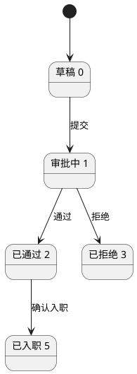

##### 定时任务
| 任务 | 频率 | 处理逻辑 |
| --- | --- | --- |
| 待转正提醒 | 每日 02:00 | 扫描试用期员工，到期前 7 天提醒 HR |
| 离职生效处理 | 每日 02:00 | 到达离职日期自动执行（禁用账号、脱敏数据） |
| 合同到期提醒 | 每日 02:00 | 扫描近 30 天到期合同，通知 HR |
| 审批超时催办与升级 | 每小时 | 超时 48h 催办，超时 72h 自动升级至上级审批人 |


##### 员工状态变更原子性
入转调离涉及 `hr_employee` 状态变更的操作（入职确认、调岗生效、离职生效）使用 Spring `@Transactional` 保证事务一致。跨模块操作（创建账号、更新考勤组）通过同步调用 + 事务管理保证，不引入分布式事务。

---

### 3.5 考勤管理模块（M5）
考勤管理模块实现考勤规则配置、网页打卡、请假管理、月度统计与可视化，为薪资核算提供准确的考勤数据支撑。归属 `hrms-business-attendance` 子模块。

#### 3.5.1 用例分析
##### 用例图
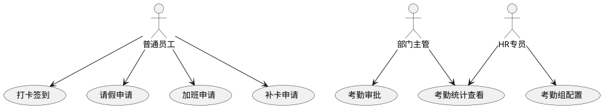

##### 用例详细说明
| 编号 | 用例名称 | 参与者 | 前置条件 | 后置条件 | 业务描述 |
| :---: | --- | --- | --- | --- | --- |
| UC-01 | 打卡签到 | 普通员工 | 已登录系统，已在考勤组 | 打卡记录生成 | 每日上下班网页打卡，记录打卡时间与地点 |
| UC-02 | 请假申请 | 普通员工 | 已登录系统 | 申请提交成功 | 提交年假、事假、病假等请假申请 |
| UC-03 | 加班申请 | 普通员工 | 已登录系统 | 申请提交成功 | 提交加班申请，登记加班时长与原因 |
| UC-04 | 补卡申请 | 普通员工 | 已登录系统 | 申请提交成功 | 提交因漏打卡的补卡申请 |
| UC-05 | 考勤审批 | 部门主管 | 有待办审批任务 | 审批通过/驳回 | 审批下属的请假、加班、补卡申请 |
| UC-06 | 考勤组配置 | HR专员 | 已登录系统 | 配置生效 | 设置考勤组规则、打卡时间、节假日等 |
| UC-07 | 考勤统计查看 | HR专员、部门主管 | 已登录系统 | 展示统计报表 | 按部门/月度查看出勤、迟到、缺卡等统计数据 |


#### 3.5.2 功能清单
| 编号 | 功能名称 | PRD 章节 | 说明 |
| :---: | --- | :---: | --- |
| F-ATT-01 | 考勤规则配置 | §6.1 | 考勤组定义、工作日设置、班次类型 |
| F-ATT-02 | 网页打卡 | §6.2 | IP 白名单 / GPS 定位校验、状态判定 |
| F-ATT-03 | 请假管理 | §6.3 | 请假类型、余额计算、申请与审批 |
| F-ATT-04 | 考勤统计 | §6.4 | 个人/部门维度统计、AntV 图表 |
| F-ATT-05 | 补卡管理 | §6.2.3 | 补卡申请（每月最多 2 次） |


#### 3.5.3 核心流程与时序
##### 打卡流程
```puml
@startuml
start
:员工进入打卡页面;
:读取所属考勤组;

if (未配置?) then (是)
  :提示未配置考勤组;
  stop
else (已配置)
  :校验是否为工作日;
endif

if (休息日/法定节假日?) then (是)
  :提示非工作日;
  stop
else (工作日)
  :校验打卡位置;
endif

if (IP/GPS不匹配?) then (是)
  :提示不在打卡范围;
  stop
else (匹配)
  :记录打卡时间;
  :判定状态：正常/迟到/早退;
  :写入打卡记录;
  stop
endif
@enduml
```

##### 请假申请流程
```puml
@startuml
start
:员工发起请假申请;
:校验请假类型与余额;

if (余额不足?) then (是)
  :提示余额不足;
  stop
else (校验通过)
  :按规则计算请假天数;
  :按类型+天数路由审批流;
  if (审批结果?) then (通过)
    :扣减余额\n写入考勤统计;
    stop
  else (拒绝)
    :释放预扣减余额;
    stop
  endif
endif
@enduml
```

**请假审批规则：**

| 请假类型+天数 | 审批人 |
| --- | --- |
| 年假/调休 ≤ 3天 | 直接上级 |
| 年假/调休 > 3天 | 直接上级 → 部门负责人 |
| 病假/事假 ≤ 1天 | 直接上级 |
| 病假/事假 > 1天 | 直接上级 → 部门负责人 |
| 婚假/产假/丧假 | 直接上级 → HR备案 |


##### 请假申请时序
```mermaid
sequenceDiagram
    participant Emp as 员工
    participant LeaveCtrl as LeaveController
    participant LeaveSvc as LeaveService
    participant AttSvc as AttendanceService
    participant AprSvc as ApprovalService
    participant DB as 数据库

    Emp->>LeaveCtrl: 提交请假申请
    LeaveCtrl->>LeaveSvc: applyLeave(leaveDTO)
    LeaveSvc->>DB: 查询假期余额
    DB-->>LeaveSvc: 余额充足
    LeaveSvc->>LeaveSvc: 计算请假天数
    LeaveSvc->>LeaveSvc: 路由审批流（按类型+天数）
    LeaveSvc->>AprSvc: startApproval(leaveId, routeConfig)
    AprSvc->>DB: INSERT INTO hr_approval_instance
    AprSvc->>DB: INSERT INTO hr_approval_task（审批人）
    AprSvc-->>LeaveSvc: 审批实例ID
    LeaveSvc->>AttSvc: preDeductLeaveBalance(employeeId, days)
    AttSvc->>DB: UPDATE 假期余额（预扣）
    LeaveSvc-->>LeaveCtrl: 提交成功+审批单号
    LeaveCtrl-->>Emp: 展示"已提交，等待审批"
```

#### 3.5.4 数据库核心表
##### ER 图
```mermaid
erDiagram
    HR_ATTENDANCE_GROUP {
        BIGINT id PK
        VARCHAR group_name "考勤组名称"
        VARCHAR shift_type "班次类型"
        TIME work_start_time "上班时间"
        TIME work_end_time "下班时间"
        INT late_threshold_minutes "迟到阈值"
        INT early_leave_threshold_minutes "早退阈值"
        VARCHAR clock_ip_whitelist "IP白名单"
        VARCHAR clock_gps_scope "GPS范围"
        INT monthly_correction_limit "月补卡上限"
    }
    HR_ATTENDANCE_RECORD {
        BIGINT id PK
        BIGINT employee_id FK "员工ID"
        BIGINT group_id FK "考勤组ID"
        DATE record_date "打卡日期"
        DATETIME clock_in_time "上班打卡"
        DATETIME clock_out_time "下班打卡"
        VARCHAR clock_in_status "上班状态"
        VARCHAR clock_out_status "下班状态"
        VARCHAR correction_status "补卡状态"
    }
    HR_LEAVE_REQUEST {
        BIGINT id PK
        BIGINT employee_id FK "员工ID"
        VARCHAR leave_type "请假类型"
        DATETIME start_time "开始时间"
        DATETIME end_time "结束时间"
        DECIMAL total_days "请假天数"
        VARCHAR attachment_url "附件"
        BIGINT approval_instance_id FK
        TINYINT approval_status
    }
    HR_ATTENDANCE_CORRECTION {
        BIGINT id PK
        BIGINT employee_id FK "员工ID"
        BIGINT record_id FK "打卡记录ID"
        DATE correction_date "补卡日期"
        VARCHAR correction_reason "补卡原因"
        TINYINT approval_status "审批状态"
    }

    HR_ATTENDANCE_GROUP ||--o{ HR_ATTENDANCE_RECORD : "考勤组\n打卡记录"
    HR_ATTENDANCE_RECORD ||--o| HR_ATTENDANCE_CORRECTION : "打卡记录\n可补卡"
```

##### hr_attendance_group（考勤组表）
```sql
CREATE TABLE `hr_attendance_group` (
  `id` BIGINT UNSIGNED NOT NULL AUTO_INCREMENT COMMENT '主键ID',
  `group_name` VARCHAR(64) NOT NULL COMMENT '考勤组名称',
  `shift_type` VARCHAR(32) NOT NULL COMMENT '班次类型：FIXED/FLEXIBLE/SCHEDULED',
  `work_start_time` TIME NOT NULL COMMENT '上班时间',
  `work_end_time` TIME NOT NULL COMMENT '下班时间',
  `rest_start_time` TIME DEFAULT NULL COMMENT '午休开始',
  `rest_end_time` TIME DEFAULT NULL COMMENT '午休结束',
  `flexible_start_time` TIME DEFAULT NULL COMMENT '弹性最早打卡',
  `flexible_end_time` TIME DEFAULT NULL COMMENT '弹性最晚打卡',
  `late_threshold_minutes` INT NOT NULL DEFAULT 15 COMMENT '迟到阈值（分钟）',
  `early_leave_threshold_minutes` INT NOT NULL DEFAULT 15 COMMENT '早退阈值（分钟）',
  `clock_ip_whitelist` VARCHAR(500) DEFAULT NULL COMMENT 'IP白名单，逗号分隔',
  `clock_gps_scope` VARCHAR(500) DEFAULT NULL COMMENT 'GPS范围配置（中心点+半径）',
  `monthly_correction_limit` INT NOT NULL DEFAULT 2 COMMENT '月补卡次数上限',
  `status` TINYINT NOT NULL DEFAULT 1 COMMENT '状态：1-启用 0-禁用',
  `create_by` BIGINT UNSIGNED DEFAULT NULL COMMENT '创建人',
  `create_time` DATETIME NOT NULL DEFAULT CURRENT_TIMESTAMP COMMENT '创建时间',
  `update_by` BIGINT UNSIGNED DEFAULT NULL COMMENT '更新人',
  `update_time` DATETIME NOT NULL DEFAULT CURRENT_TIMESTAMP ON UPDATE CURRENT_TIMESTAMP COMMENT '更新时间',
  `is_deleted` TINYINT(1) NOT NULL DEFAULT 0 COMMENT '逻辑删除',
  `version` INT NOT NULL DEFAULT 0 COMMENT '版本号',
  PRIMARY KEY (`id`),
  KEY `idx_hr_att_group_status` (`status`)
) ENGINE=InnoDB DEFAULT CHARSET=utf8mb4 COLLATE=utf8mb4_0900_ai_ci COMMENT='考勤组表';
```

##### hr_attendance_record（打卡记录表）
```sql
CREATE TABLE `hr_attendance_record` (
  `id` BIGINT UNSIGNED NOT NULL AUTO_INCREMENT COMMENT '主键ID',
  `employee_id` BIGINT UNSIGNED NOT NULL COMMENT '员工ID',
  `group_id` BIGINT UNSIGNED NOT NULL COMMENT '考勤组ID',
  `record_date` DATE NOT NULL COMMENT '打卡日期',
  `clock_in_time` DATETIME DEFAULT NULL COMMENT '上班打卡时间',
  `clock_out_time` DATETIME DEFAULT NULL COMMENT '下班打卡时间',
  `clock_in_status` VARCHAR(32) DEFAULT NULL COMMENT '上班状态：NORMAL/LATE/MISSING/ABSENCE',
  `clock_out_status` VARCHAR(32) DEFAULT NULL COMMENT '下班状态：NORMAL/EARLY_LEAVE/MISSING/ABSENCE',
  `clock_in_ip` VARCHAR(64) DEFAULT NULL COMMENT '上班打卡IP',
  `clock_out_ip` VARCHAR(64) DEFAULT NULL COMMENT '下班打卡IP',
  `clock_in_gps` VARCHAR(128) DEFAULT NULL COMMENT '上班打卡GPS',
  `clock_out_gps` VARCHAR(128) DEFAULT NULL COMMENT '下班打卡GPS',
  `device_info` VARCHAR(255) DEFAULT NULL COMMENT '设备信息',
  `correction_status` VARCHAR(32) NOT NULL DEFAULT 'NONE' COMMENT '补卡状态：NONE/PENDING/APPROVED',
  `create_time` DATETIME NOT NULL DEFAULT CURRENT_TIMESTAMP COMMENT '创建时间',
  `update_time` DATETIME NOT NULL DEFAULT CURRENT_TIMESTAMP ON UPDATE CURRENT_TIMESTAMP COMMENT '更新时间',
  PRIMARY KEY (`id`),
  UNIQUE KEY `uk_hr_att_rec_emp_date` (`employee_id`, `record_date`),
  KEY `idx_hr_att_rec_group_date` (`group_id`, `record_date`),
  KEY `idx_hr_att_rec_date` (`record_date`)
) ENGINE=InnoDB DEFAULT CHARSET=utf8mb4 COLLATE=utf8mb4_0900_ai_ci COMMENT='打卡记录表';
```

#### 3.5.5 REST API 接口清单
##### 接口总览
| 编号 | 接口名称 | 方法 | 路径 | 说明 |
| :---: | --- | :---: | --- | --- |
| **考勤规则** |  |  |  |  |
| API-ATT-01 | 考勤组分页 | GET | /api/v1/attendance/groups | 分页查询考勤组 |
| API-ATT-02 | 创建考勤组 | POST | /api/v1/attendance/groups | 新增考勤规则 |
| API-ATT-03 | 更新考勤组 | PUT | /api/v1/attendance/groups/{id} | 更新考勤规则 |
| **打卡** |  |  |  |  |
| API-ATT-04 | 员工打卡 | POST | /api/v1/attendance/clock | 当前登录员工打卡 |
| API-ATT-05 | 个人打卡日历 | GET | /api/v1/attendance/records/my-calendar | 个人月度打卡日历 |
| API-ATT-06 | 申请补卡 | POST | /api/v1/attendance/corrections | 提交补卡申请 |
| **请假** |  |  |  |  |
| API-ATT-07 | 查询请假类型 | GET | /api/v1/leaves/types | 获取启用的请假类型 |
| API-ATT-08 | 查询假期余额 | GET | /api/v1/leaves/balances | 当前员工假期余额 |
| API-ATT-09 | 提交请假申请 | POST | /api/v1/leaves | 创建请假并发起审批 |
| **统计** |  |  |  |  |
| API-ATT-10 | 生成月度统计 | POST | /api/v1/attendance/stats/monthly/generate | 定时任务或HR手动触发 |
| API-ATT-11 | 薪资-考勤数据接口 | GET | /api/v1/attendance/stats/monthly/payroll-source | 按月份和员工返回锁定后的考勤汇总 |


##### 接口详细设计
**API-ATT-04：员工打卡**

| 项目 | 内容 |
| --- | --- |
| 请求方式 | POST |
| 请求路径 | /api/v1/attendance/clock |
| 权限控制 | 登录（仅本人） |


**请求参数：**

```json
{
  "latitude": 30.2741,
  "longitude": 120.1551,
  "deviceInfo": "Chrome 126 Windows 10"
}
```

**参数说明：**

| 参数名 | 类型 | 必填 | 说明 |
| --- | --- | :---: | --- |
| latitude | BigDecimal | 否 | GPS 纬度（打卡范围校验） |
| longitude | BigDecimal | 否 | GPS 经度 |
| deviceInfo | String | 否 | 设备指纹信息 |


**响应格式：**

```json
{
  "code": 20000,
  "message": "success",
  "data": {
    "clockTime": "09:00",
    "period": "IN",
    "status": "NORMAL",
    "statusDesc": "正常",
    "recordDate": "2026-07-11"
  }
}
```

**状态枚举：**

| 场景 | status | 说明 |
| --- | --- | --- |
| 打卡时间 ≤ 规定时间 | NORMAL | 正常 |
| 规定时间 < 打卡时间 ≤ 规定时间+阈值 | LATE | 迟到 |
| 打卡时间 > 规定时间+阈值 | ABSENCE | 旷工半天 |
| 无打卡记录 | MISSING | 缺卡 |


**异常码：**

| 异常码 | 说明 |
| :---: | --- |
| 40050 | 未配置考勤组 |
| 40051 | 今日非工作日 |
| 40052 | 不在打卡范围（IP/GPS校验不通过） |
| 40053 | 已达当日打卡次数上限 |


---

**API-ATT-09：提交请假申请**

| 项目 | 内容 |
| --- | --- |
| 请求方式 | POST |
| 请求路径 | /api/v1/leaves |
| 权限控制 | 登录（仅本人） |


**请求参数：**

```json
{
  "leaveTypeId": 1,
  "startDate": "2026-07-15",
  "startPeriod": "AM",
  "endDate": "2026-07-16",
  "endPeriod": "PM",
  "reason": "参加技术峰会",
  "handoverEmployeeId": 8,
  "attachmentFileId": null
}
```

**参数说明：**

| 参数名 | 类型 | 必填 | 说明 |
| --- | --- | :---: | --- |
| leaveTypeId | Long | 是 | 请假类型 ID |
| startDate | String | 是 | 开始日期 yyyy-MM-dd |
| startPeriod | String | 是 | 开始时段：AM（上午）/ PM（下午） |
| endDate | String | 是 | 结束日期 |
| endPeriod | String | 是 | 结束时段 |
| reason | String | 是 | 请假事由 |
| handoverEmployeeId | Long | 否 | 工作交接人员工ID |
| attachmentFileId | Long | 否 | 证明附件文件ID |


**响应格式：**

```json
{
  "code": 20000,
  "message": "success",
  "data": {
    "id": 2001,
    "requestNo": "LV20260711001",
    "leaveDays": 1.5,
    "approvalStatus": "PENDING",
    "approvalStatusDesc": "审批中"
  }
}
```

**异常码：**

| 异常码 | 说明 |
| :---: | --- |
| 40060 | 该请假类型需管理余额，余额不足 |
| 40061 | 请假天数不能为0 |
| 40062 | 超过单次请假最大天数限制（30天） |


---

**API-ATT-11：薪资-考勤数据接口**

| 项目 | 内容 |
| --- | --- |
| 请求方式 | GET |
| 请求路径 | /api/v1/attendance/stats/monthly/payroll-source |
| 权限控制 | 内部服务（薪资模块调用） |


**请求参数（Query String）：**

| 参数名 | 类型 | 必填 | 说明 | 示例值 |
| --- | --- | :---: | --- | --- |
| month | String | 是 | 统计月份 yyyy-MM | 2026-07 |
| employeeIds | Long[] | 否 | 指定员工 ID 列表（不传=全量） | [1,2,3] |


**响应格式：**

```json
{
  "code": 20000,
  "message": "success",
  "data": [
    {
      "employeeId": 5,
      "employeeNo": "202401005",
      "employeeName": "张三",
      "shouldAttendDays": 22,
      "actualAttendDays": 20,
      "lateCount": 1,
      "earlyLeaveCount": 0,
      "absenceDays": 0,
      "leaveDays": 1.5,
      "overtimeHours": 4
    }
  ]
}
```

#### 3.5.6 模块间服务接口
| 服务方法 | 用途说明 | 调用方 |
| --- | --- | --- |
| `AttendanceService.getMonthlySummary(empId, month)` | 获取员工月度考勤汇总 | 薪资模块（核算时调用） |
| `AttendanceService.getEmployeeGroup(empId)` | 获取员工所属考勤组 | 打卡时调用 |


#### 3.5.7 关键技术方案
##### 假期余额并发扣减
| 技术点 | 方案 |
| --- | --- |
| 扣减策略 | 乐观锁：`UPDATE SET used_days=used_days+?, remaining=remaining-?, version+1 WHERE id=? AND version=?` |
| 状态机制 | 提交→**预扣减**（PENDING）→ 审批通过→**确认扣减**（CONFIRMED）/ 拒绝→**回滚**（ROLLED_BACK） |
| 冲突处理 | 乐观锁失败返回 `409 CONFLICT`，前端提示刷新 |


##### 打卡防作弊
+ IP 白名单 + GPS 定位范围双重校验（满足一项即通过）
+ 设备指纹辅助检测代打卡风险（UA + IP + 时序特征）
+ 后端获取客户端真实 IP，禁止前端伪造

##### 月度统计定时任务
+ 每月 1 日 02:00 自动触发，Redis 分布式锁防止多实例并发
+ 分片处理：按 employeeId 取模分 200 人一批，避免长事务
+ 幂等：唯一索引 + UPSERT，支持重跑

---

### 3.6 薪资管理模块（M6）
薪资管理模块实现薪资账套定义、员工薪资档案维护、月度薪资自动核算、异常检测与审批分发。归属 `hrms-business-salary` 子模块。

#### 3.6.1 用例分析
##### 用例图
```puml
@startuml
    actor "HR专员" as HR
    actor "财务专员" as Fin
    actor "普通员工" as Emp
    HR --> (薪资核算)
    Fin --> (薪资审核)
    Fin --> (薪资发放)
    HR --> (薪资报表)
    Fin --> (薪资报表)
    Emp --> (工资条查看)
    HR --> (薪资配置)
@enduml
```

##### 用例详细说明
| 编号 | 用例名称 | 参与者 | 前置条件 | 后置条件 | 业务描述 |
| :---: | --- | --- | --- | --- | --- |
| UC-01 | 薪资核算 | HR专员 | 考勤数据已确认 | 核算生成薪资明细 | 按批次自动计算员工薪资，整合考勤、社保、个税等数据 |
| UC-02 | 薪资审核 | 财务专员 | 薪资核算已完成 | 审核通过/驳回 | 对核算结果进行审核确认 |
| UC-03 | 薪资发放 | 财务专员 | 审核已通过 | 发放完成 | 执行薪资发放操作，更新发放状态 |
| UC-04 | 薪资报表 | HR专员、财务专员 | 已登录系统 | 展示统计报表 | 查看部门/全公司薪资汇总与统计分析 |
| UC-05 | 工资条查看 | 普通员工 | 薪资已发放 | 展示工资明细 | 查看个人月度工资条明细 |
| UC-06 | 薪资配置 | HR专员 | 已登录系统 | 配置生效 | 设置薪资项、计算公式、社保比例、个税规则等 |


#### 3.6.2 功能清单
| 编号 | 功能名称 | PRD 章节 | 说明 |
| :---: | --- | :---: | --- |
| F-SAL-01 | 薪资账套管理 | §7.1 | 账套定义、工资项目配置、生效日期管理 |
| F-SAL-02 | 员工薪资档案 | §7.2 | 薪资档案设置、试用期薪资比例、调薪历史 |
| F-SAL-03 | 月度薪资核算 | §7.3 | 批次管理、自动计算、异常检测 |
| F-SAL-04 | 工资条管理 | §7.4 | 工资条生成、二次验证、员工查看 |
| F-SAL-05 | 薪资可视化 | §7.3.4 | AntV 图表展示薪资趋势、部门分布 |


#### 3.6.3 核心流程与时序
##### 薪资核算批次状态机
```puml
@startuml
state "草稿 DRAFT" as DRAFT
state "计算中\nCALCULATING" as CALC
state "待确认\nPENDING_REVIEW" as REVIEW
state "审批中\nAPPROVING" as APPROVING
state "已通过\nAPPROVED" as APPROVED
state "已发放\nRELEASED" as RELEASED
state "已归档\nARCHIVED" as ARCHIVED

[*] --> DRAFT
DRAFT --> CALC : 开始计算
CALC --> REVIEW : 计算完成
REVIEW --> APPROVING : 确认无误
REVIEW --> DRAFT : 需要调整
APPROVING --> APPROVED : 财务审核通过
APPROVING --> REVIEW : 驳回
APPROVED --> RELEASED : 实际发放
RELEASED --> ARCHIVED : 归档
@enduml
```

##### 月度核算流程
```mermaid
sequenceDiagram
    participant HR as HR专员
    participant SAL as 薪资服务
    participant ATT as 考勤服务
    participant EMP as 员工服务
    participant APR as 审批服务
    participant DB as db

    HR->>SAL: 创建薪资批次（选择月份/范围）
    SAL->>DB: INSERT INTO hr_salary_batch（状态=草稿）
    SAL-->>HR: 批次创建成功

    HR->>SAL: 开始计算
    SAL->>SAL: 分片遍历员工
    SAL->>ATT: getMonthlySummary(empId, month)
    ATT-->>SAL: 考勤汇总
    SAL->>EMP: getSalaryProfile(empId)
    EMP-->>SAL: 薪资档案
    SAL->>SAL: 按账套公式逐项计算
    SAL->>SAL: 异常检测
    SAL->>DB: 写入薪资明细
    SAL-->>HR: 计算完成（返回异常统计）

    HR->>SAL: 提交审批
    SAL->>APR: startApproval("SALARY", batchId)
    APR-->>SAL: 审批中
    Note right of APR: 财务审核 → [老板审批]（金额超阈值时）
```

#### 3.6.4 数据库核心表
##### ER 图
```mermaid
erDiagram
    HR_SALARY_TEMPLATE {
        BIGINT id PK
        VARCHAR template_name "账套名称"
        VARCHAR scope_type "适用范围"
        TINYINT status "状态"
    }
    HR_SALARY_TEMPLATE_ITEM {
        BIGINT id PK
        BIGINT template_id FK "账套ID"
        VARCHAR item_code "工资项目编码"
        VARCHAR item_name "工资项目名称"
        VARCHAR category "分类"
        VARCHAR calc_rule "计算规则"
        INT sort_no "排序号"
    }
    HR_EMPLOYEE_SALARY_PROFILE {
        BIGINT id PK
        BIGINT employee_id FK "员工ID"
        BIGINT template_id FK "适用账套"
        DECIMAL base_salary "基本工资"
        DECIMAL allowance "岗位津贴"
        DECIMAL social_insurance_base "社保基数"
        DECIMAL housing_fund_base "公积金基数"
    }
    HR_SALARY_BATCH {
        BIGINT id PK
        VARCHAR batch_no UK "批次编号"
        CHAR salary_month "薪资月份"
        VARCHAR batch_status "批次状态"
        INT total_count "员工总数"
        DECIMAL total_gross_salary "应发总额"
        DECIMAL total_net_salary "实发总额"
        BIGINT approval_instance_id FK
    }
    HR_SALARY_BATCH_ITEM {
        BIGINT id PK
        BIGINT batch_id FK "批次ID"
        BIGINT employee_id FK "员工ID"
        DECIMAL base_salary "基本工资"
        DECIMAL gross_salary "应发合计"
        DECIMAL deduction_total "应扣合计"
        DECIMAL net_salary "实发工资"
        VARCHAR warning_level "预警级别"
    }

    HR_SALARY_TEMPLATE ||--o{ HR_SALARY_TEMPLATE_ITEM : "包含工资项目"
    HR_SALARY_TEMPLATE ||--o{ HR_EMPLOYEE_SALARY_PROFILE : "适用于\n员工档案"
    HR_EMPLOYEE_SALARY_PROFILE ||--o{ HR_SALARY_BATCH_ITEM : "核算生成\n明细"
    HR_SALARY_BATCH ||--o{ HR_SALARY_BATCH_ITEM : "包含明细"
```

##### hr_salary_batch（薪资批次表）
```sql
CREATE TABLE `hr_salary_batch` (
  `id` BIGINT UNSIGNED NOT NULL AUTO_INCREMENT COMMENT '主键ID',
  `batch_no` VARCHAR(64) NOT NULL COMMENT '薪资批次编号',
  `salary_month` CHAR(7) NOT NULL COMMENT '薪资月份 yyyy-MM',
  `scope_type` VARCHAR(32) NOT NULL DEFAULT 'ALL' COMMENT '核算范围：ALL/DEPT/EMPLOYEE',
  `scope_value` VARCHAR(500) DEFAULT NULL COMMENT '核算范围值',
  `batch_status` VARCHAR(32) NOT NULL DEFAULT 'DRAFT' COMMENT '批次状态',
  `approval_instance_id` BIGINT UNSIGNED DEFAULT NULL COMMENT '审批实例ID',
  `total_count` INT NOT NULL DEFAULT 0 COMMENT '核算员工总数',
  `total_gross_salary` DECIMAL(15,2) NOT NULL DEFAULT 0 COMMENT '应发总额',
  `total_net_salary` DECIMAL(15,2) NOT NULL DEFAULT 0 COMMENT '实发总额',
  `yellow_warning_count` INT NOT NULL DEFAULT 0 COMMENT '黄色预警数',
  `red_warning_count` INT NOT NULL DEFAULT 0 COMMENT '红色预警数',
  `block_count` INT NOT NULL DEFAULT 0 COMMENT '阻断异常数',
  `create_by` BIGINT UNSIGNED DEFAULT NULL COMMENT '创建人',
  `create_time` DATETIME NOT NULL DEFAULT CURRENT_TIMESTAMP COMMENT '创建时间',
  `update_by` BIGINT UNSIGNED DEFAULT NULL COMMENT '更新人',
  `update_time` DATETIME NOT NULL DEFAULT CURRENT_TIMESTAMP ON UPDATE CURRENT_TIMESTAMP COMMENT '更新时间',
  `is_deleted` TINYINT(1) NOT NULL DEFAULT 0 COMMENT '逻辑删除',
  `version` INT NOT NULL DEFAULT 0 COMMENT '版本号',
  PRIMARY KEY (`id`),
  UNIQUE KEY `uk_hr_salary_batch_no` (`batch_no`),
  KEY `idx_hr_salary_batch_status` (`batch_status`),
  KEY `idx_hr_salary_batch_month` (`salary_month`)
) ENGINE=InnoDB DEFAULT CHARSET=utf8mb4 COLLATE=utf8mb4_0900_ai_ci COMMENT='薪资批次表';
```

##### hr_salary_batch_item（薪资明细表）
```sql
CREATE TABLE `hr_salary_batch_item` (
  `id` BIGINT UNSIGNED NOT NULL AUTO_INCREMENT COMMENT '主键ID',
  `batch_id` BIGINT UNSIGNED NOT NULL COMMENT '批次ID',
  `employee_id` BIGINT UNSIGNED NOT NULL COMMENT '员工ID',
  `base_salary` DECIMAL(12,2) NOT NULL DEFAULT 0 COMMENT '基本工资',
  `allowance` DECIMAL(12,2) NOT NULL DEFAULT 0 COMMENT '岗位津贴',
  `performance_bonus` DECIMAL(12,2) DEFAULT 0 COMMENT '绩效奖金',
  `overtime_pay` DECIMAL(12,2) DEFAULT 0 COMMENT '加班费',
  `late_deduction` DECIMAL(10,2) DEFAULT 0 COMMENT '迟到扣款',
  `leave_deduction` DECIMAL(10,2) DEFAULT 0 COMMENT '请假扣款',
  `social_insurance` DECIMAL(10,2) DEFAULT 0 COMMENT '社保（个人部分）',
  `housing_fund` DECIMAL(10,2) DEFAULT 0 COMMENT '公积金（个人部分）',
  `income_tax` DECIMAL(10,2) DEFAULT 0 COMMENT '个人所得税',
  `gross_salary` DECIMAL(12,2) NOT NULL DEFAULT 0 COMMENT '应发合计',
  `deduction_total` DECIMAL(12,2) NOT NULL DEFAULT 0 COMMENT '应扣合计',
  `net_salary` DECIMAL(12,2) NOT NULL DEFAULT 0 COMMENT '实发工资',
  `warning_level` VARCHAR(32) DEFAULT NULL COMMENT '预警级别：NONE/YELLOW/RED/BLOCK',
  `warning_reason` VARCHAR(500) DEFAULT NULL COMMENT '预警原因',
  `create_time` DATETIME NOT NULL DEFAULT CURRENT_TIMESTAMP COMMENT '创建时间',
  `update_time` DATETIME NOT NULL DEFAULT CURRENT_TIMESTAMP ON UPDATE CURRENT_TIMESTAMP COMMENT '更新时间',
  PRIMARY KEY (`id`),
  KEY `idx_hr_sal_item_batch` (`batch_id`),
  KEY `idx_hr_sal_item_employee` (`employee_id`),
  KEY `idx_hr_sal_item_warning` (`warning_level`)
) ENGINE=InnoDB DEFAULT CHARSET=utf8mb4 COLLATE=utf8mb4_0900_ai_ci COMMENT='薪资明细表';
```

#### 3.6.5 REST API 接口清单
##### 接口总览
| 编号 | 接口名称 | 方法 | 路径 | 说明 |
| :---: | --- | :---: | --- | --- |
| **账套管理** |  |  |  |  |
| API-SAL-01 | 薪资账套列表 | GET | /api/v1/salary/templates | 分页查询 |
| API-SAL-02 | 创建薪资账套 | POST | /api/v1/salary/templates | 新增账套 |
| API-SAL-03 | 更新薪资账套 | PUT | /api/v1/salary/templates/{id} | 更新账套配置 |
| **薪资档案** |  |  |  |  |
| API-SAL-04 | 查询员工薪资档案 | GET | /api/v1/salary/employees/{empId}/profile | HR/财务查看 |
| API-SAL-05 | 设置薪资档案 | PUT | /api/v1/salary/employees/{empId}/profile | 新增或更新 |
| **核算批次** |  |  |  |  |
| API-SAL-06 | 创建薪资批次 | POST | /api/v1/salary/batches | 选择月份和范围 |
| API-SAL-07 | 触发核算 | POST | /api/v1/salary/batches/{id}/calculate | 启动自动计算 |
| API-SAL-08 | 预览薪资 | GET | /api/v1/salary/batches/{id}/preview | 返回明细+异常标记 |
| API-SAL-09 | 提交审批 | POST | /api/v1/salary/batches/{id}/submit | 发起审批 |
| **工资条** |  |  |  |  |
| API-SAL-10 | 工资条列表 | GET | /api/v1/salary/payslips | 按月列表 |
| API-SAL-11 | 工资条验证 | POST | /api/v1/salary/payslip/verify | 二次验证 |
| API-SAL-12 | 工资条详情 | GET | /api/v1/salary/payslip/{id} | 需已验证 |
| API-SAL-13 | 薪资趋势 | GET | /api/v1/salary/trend | 近6个月趋势 |


##### 接口详细设计
**API-SAL-06：创建薪资批次**

| 项目 | 内容 |
| --- | --- |
| 请求方式 | POST |
| 请求路径 | /api/v1/salary/batches |
| 权限控制 | admin（HR 专员） |


**请求参数：**

```json
{
  "salaryMonth": "2026-07",
  "scopeType": "ALL",
  "scopeValue": null
}
```

**参数说明：**

| 参数名 | 类型 | 必填 | 说明 | 示例值 |
| --- | --- | :---: | --- | --- |
| salaryMonth | String | 是 | 薪资月份 yyyy-MM | 2026-07 |
| scopeType | String | 否 | 核算范围：ALL/DEPT/EMPLOYEE，默认 ALL | ALL |
| scopeValue | String | 否 | 范围值（DEPT=部门ID，EMPLOYEE=员工ID列表逗号分隔） | null |


**响应格式：**

```json
{
  "code": 20000,
  "message": "success",
  "data": {
    "id": 301,
    "batchNo": "SAL202607001",
    "salaryMonth": "2026-07",
    "batchStatus": "DRAFT",
    "totalCount": 0,
    "createTime": "2026-07-11 10:00:00"
  }
}
```

**异常码：**

| 异常码 | 说明 |
| :---: | --- |
| 40070 | 该月份薪资批次已存在，不能重复创建 |
| 40071 | 指定的核算月份已有考勤统计未锁定 |


---

**API-SAL-07：触发核算**

| 项目 | 内容 |
| --- | --- |
| 请求方式 | POST |
| 请求路径 | /api/v1/salary/batches/{id}/calculate |
| 权限控制 | admin（HR 专员） |


**请求参数：** 无

**说明：** 触发异步核算任务。核算逻辑：

1. 分片遍历员工（每批 100 人）
2. 拉取考勤汇总（调用考勤模块服务接口）
3. 按账套公式逐项计算
4. 执行异常检测规则
5. 写入薪资明细表

**响应格式：**

```json
{
  "code": 20000,
  "message": "success",
  "data": {
    "batchStatus": "CALCULATING",
    "totalCount": 128,
    "estimatedTime": "约15秒"
  }
}
```

**异常检测规则：**

| 规则 | 级别 | 处理方式 |
| --- | :---: | --- |
| 请假天数 > 15 天 | YELLOW | HR 确认后可继续 |
| 加班时长 > 50 小时 | YELLOW | HR确认后可继续 |
| 较上月变动 > 30% | RED | 需确认原因 |
| 未设置薪资档案 | BLOCK（红色阻断） | 补齐后重算 |
| 实发工资 ≤ 0 | BLOCK | 数据异常，跳过 |


---

**API-SAL-11：工资条验证**

| 项目 | 内容 |
| --- | --- |
| 请求方式 | POST |
| 请求路径 | /api/v1/salary/payslip/verify |
| 权限控制 | 登录（仅本人） |


**请求参数：**

```json
{
  "salaryMonth": "2026-07",
  "verifyType": "password",
  "verifyValue": "MyPwd@123"
}
```

**参数说明：**

| 参数名 | 类型 | 必填 | 说明 |
| --- | --- | :---: | --- |
| salaryMonth | String | 是 | 薪资月份 |
| verifyType | String | 是 | 验证方式：password（登录密码）/ sms（短信验证码） |
| verifyValue | String | 是 | 验证值 |


**响应格式（成功）：**

```json
{
  "code": 20000,
  "message": "success",
  "data": {
    "verified": true,
    "token": "verify_token_xxx",
    "expiresIn": 1800
  }
}
```

**异常码：**

| 异常码 | 说明 |
| :---: | --- |
| 40080 | 验证失败 |
| 40081 | 验证失败超过5次，已锁定30分钟 |


---

**API-SAL-12：工资条详情**

| 项目 | 内容 |
| --- | --- |
| 请求方式 | GET |
| 请求路径 | /api/v1/salary/payslip/{id} |
| 权限控制 | 登录 + 二次验证（需携带 verify token） |


**响应格式：**

```json
{
  "code": 20000,
  "message": "success",
  "data": {
    "employeeName": "张三",
    "employeeNo": "202401005",
    "deptName": "技术部",
    "salaryMonth": "2026-07",
    "income": {
      "baseSalary": 10000.00,
      "allowance": 2000.00,
      "performanceBonus": 3600.00,
      "overtimePay": 800.00,
      "grossSalary": 16400.00
    },
    "deduction": {
      "lateDeduction": 0,
      "leaveDeduction": 500.00,
      "socialInsurance": 840.00,
      "housingFund": 1200.00,
      "incomeTax": 420.00,
      "deductionTotal": 2960.00
    },
    "netSalary": 13440.00
  }
}
```

#### 3.6.6 模块间服务接口
| 服务方法 | 用途说明 | 调用方 |
| --- | --- | --- |
| `AttendanceService.getMonthlySummary(empId, month)` | 获取月度考勤汇总 | 薪资核算时调用 |
| `EmployeeService.getSalaryProfile(empId)` | 获取员工薪资档案 | 薪资核算时调用 |
| `ApprovalService.startApproval(type, bizId)` | 发起薪资审批 | 提交审批时调用 |


#### 3.6.7 关键技术方案
##### 薪资计算引擎
| 项目类型 | 计算方式 | 说明 |
| --- | --- | --- |
| 固定收入 | 直接取值 | 从 `hr_employee_salary_profile` 取对应字段 |
| 变动收入 | 公式计算 | 绩效基数×绩效系数、小时工资×倍数×时长 |
| 考勤扣款 | 规则计算 | 50元×迟到次数、日工资×请假天数 |
| 社保扣除 | 基数×比例 | 养老8%、医疗2%、失业0.5% |
| 公积金扣除 | 基数×12% | — |
| 个税 | 累计预扣法 | 按年累计应纳税额查找税率区间 |


##### 薪资数据安全
+ 薪资档案访问全程审计日志（操作人、时间、IP）
+ 工资条查看需二次验证（密码/短信），会话有效期 30 分钟
+ 薪资导出需审批，导出文件加水印（操作人+时间）
+ 接口角色控制：HR 全量、财务汇总、员工仅本人

---

### 3.7 审批中心模块（M7）
审批中心是 HRMS 的核心枢纽，统一处理全系统所有类型的审批任务，提供模板驱动的审批流程引擎。归属 `hrms-business-approval` 子模块。

#### 3.7.1 用例分析
##### 用例图
```puml
@startuml
    actor "部门主管" as Mgr
    actor "HR专员" as HR
    actor "财务专员" as Fin
    actor "普通员工" as Emp
    actor "系统管理员" as Admin
    Mgr --> (审批任务处理)
    HR --> (审批任务处理)
    Fin --> (审批任务处理)
    Admin --> (审批模板配置)
    Mgr --> (委托审批设置)
    HR --> (委托审批设置)
    Emp --> (代理审批)
    Mgr --> (审批历史查询)
    HR --> (审批历史查询)
    Emp --> (审批历史查询)
    Fin --> (审批历史查询)
    Emp --> (催办审批)
@enduml
```

##### 用例详细说明
| 编号 | 用例名称 | 参与者 | 前置条件 | 后置条件 | 业务描述 |
| :---: | --- | --- | --- | --- | --- |
| UC-01 | 审批任务处理 | 部门主管、HR专员、财务专员 | 有待办审批任务 | 审批通过/驳回/转审 | 对分配的审批任务进行通过、驳回或转审操作 |
| UC-02 | 审批模板配置 | 系统管理员 | 已登录系统 | 模板生效 | 定义审批流程模板，设置审批节点、审批人规则 |
| UC-03 | 委托审批设置 | 有审批权限的角色 | 已登录系统 | 委托生效 | 将本人审批任务委托给指定用户代为处理 |
| UC-04 | 代理审批 | 被委托人 | 有待办审批任务 | 审批完成 | 以委托人身份代为处理审批任务，记录"XXX 代 YYY 审批"日志 |
| UC-05 | 审批历史查询 | 全部角色 | 已登录系统 | 展示审批记录 | 按条件查询已完成的审批实例与任务记录 |
| UC-06 | 催办审批 | 审批发起人 | 有进行中的审批 | 通知已发送 | 对超时未处理的审批节点发送催办通知 |


#### 3.7.2 功能清单
| 编号 | 功能名称 | PRD 章节 | 说明 |
| :---: | --- | :---: | --- |
| F-APR-01 | 审批人工作台 | §8.2 | 待办列表、已审批列表、我发起的申请 |
| F-APR-02 | 审批详情 | §8.2.2 | 完整申请信息 + 审批历史 |
| F-APR-03 | 审批操作 | §8.2.1 | 通过/拒绝/转交 |
| F-APR-04 | 委托审批 | §8.3 | 设置/取消委托，自动替换审批人 |
| F-APR-05 | 审批超时升级 | §5.1.4 | 48h 催办，72h 自动升级 |


#### 3.7.3 核心流程与时序
##### 审批流定义
| 业务类型 | 编码 | 申请者 | 审批节点 |
| --- | :---: | --- | --- |
| 入职审批 | ENTRY | HR | 部门负责人 → [HR负责人] |
| 转正审批 | REGULAR | HR | 部门负责人 → HR负责人 |
| 调岗审批 | TRANSFER | HR | 原部门负责人 → 新部门负责人 → HR负责人 |
| 离职审批 | LEAVE | HR | 部门负责人 → HR负责人 |
| 请假审批 | LEAVE_REQUEST | 员工 | 按类型+天数规则动态确定 |
| 补卡审批 | CORRECTION | 员工 | 直接上级 |
| 薪资批次审批 | SALARY | HR | 财务专员 → [老板] |


##### 审批处理时序
<!-- 这是一个文本绘图，源码为：sequenceDiagram
    participant BIZ as 业务模块
    participant APR as 审批引擎
    participant TPL as 模板加载器
    participant RES as 审批人解析器
    participant MQ as 消息队列
    participant DB as 数据库

    BIZ->>APR: startApproval(businessType, bizId)
    APR->>TPL: loadTemplate("ENTRY")
    TPL-->>APR: 模板配置(节点链)
    APR->>RES: resolve("dept_leader", context)
    RES->>RES: checkDelegation(approverId)
    RES-->>APR: 实际审批人ID
    APR->>DB: INSERT INTO hr_approval_instance
    APR->>DB: INSERT INTO hr_approval_task（第1节点）
    APR-->>BIZ: 返回审批实例ID
    APR->>MQ: 发送待办通知

    Note right of DB: 审批人操作
    BIZ->>APR: processAction(taskId, "APPROVE", comment)
    APR->>DB: UPDATE task SET status=1 WHERE id=? AND status=0
    alt 下一步存在
        APR->>RES: resolveNext()
        APR->>DB: INSERT next task
        APR->>MQ: 通知下一审批人
    else 最终节点
        APR->>DB: UPDATE instance SET status=APPROVED
        APR->>BIZ: callback(APPROVED, bizId)
        BIZ->>BIZ: 执行业务回调逻辑
    end -->


#### 3.7.4 数据库核心表
##### ER 图
```mermaid
erDiagram
    HR_APPROVAL_INSTANCE {
        BIGINT id PK
        VARCHAR approval_no UK "审批单号"
        VARCHAR approval_type "审批类型编码"
        BIGINT biz_id "业务主键ID"
        VARCHAR title "审批标题"
        BIGINT applicant_user_id FK "申请人"
        BIGINT applicant_employee_id "申请人员工"
        VARCHAR current_node_name "当前节点"
        TINYINT approval_status "审批状态"
        JSON form_json "表单快照"
        DATETIME apply_time "申请时间"
        DATETIME finish_time "完成时间"
    }
    HR_APPROVAL_TASK {
        BIGINT id PK
        BIGINT instance_id FK "审批实例ID"
        VARCHAR node_code "节点编码"
        VARCHAR node_name "节点名称"
        BIGINT approver_user_id FK "审批人"
        BIGINT original_approver_id "原审批人(委托)"
        TINYINT delegate_flag "是否代审"
        TINYINT task_status "任务状态"
        TINYINT approve_result "审批结果"
        VARCHAR approve_comment "审批意见"
        DATETIME deadline_time "截止时间"
        INT sort_no "节点顺序"
    }
    HR_APPROVAL_DELEGATION {
        BIGINT id PK
        BIGINT delegator_id FK "委托人"
        BIGINT delegate_to_id FK "被委托人"
        DATETIME start_date "生效时间"
        DATETIME end_date "结束时间"
        VARCHAR reason "委托原因"
        TINYINT status "状态"
    }

    HR_APPROVAL_INSTANCE ||--o{ HR_APPROVAL_TASK : "包含审批\n任务链"
```

##### hr_approval_instance（审批实例表）
```sql
CREATE TABLE `hr_approval_instance` (
  `id` BIGINT UNSIGNED NOT NULL AUTO_INCREMENT COMMENT '主键ID',
  `approval_no` VARCHAR(64) NOT NULL COMMENT '审批单号',
  `approval_type` VARCHAR(32) NOT NULL COMMENT '审批类型编码',
  `biz_id` BIGINT UNSIGNED DEFAULT NULL COMMENT '业务主键ID',
  `title` VARCHAR(255) NOT NULL COMMENT '审批标题',
  `applicant_user_id` BIGINT UNSIGNED NOT NULL COMMENT '申请人用户ID',
  `applicant_employee_id` BIGINT UNSIGNED DEFAULT NULL COMMENT '申请人员工ID',
  `current_node_name` VARCHAR(64) DEFAULT NULL COMMENT '当前节点名称',
  `approval_status` TINYINT NOT NULL COMMENT '状态：0-草稿 1-审批中 2-已通过 3-已驳回 4-已撤回',
  `form_json` JSON DEFAULT NULL COMMENT '表单快照（审批时的业务数据副本）',
  `apply_time` DATETIME NOT NULL DEFAULT CURRENT_TIMESTAMP COMMENT '申请时间',
  `finish_time` DATETIME DEFAULT NULL COMMENT '完成时间',
  `create_time` DATETIME NOT NULL DEFAULT CURRENT_TIMESTAMP COMMENT '创建时间',
  `update_time` DATETIME NOT NULL DEFAULT CURRENT_TIMESTAMP ON UPDATE CURRENT_TIMESTAMP COMMENT '更新时间',
  `is_deleted` TINYINT(1) NOT NULL DEFAULT 0 COMMENT '逻辑删除',
  `version` INT NOT NULL DEFAULT 0 COMMENT '版本号',
  PRIMARY KEY (`id`),
  UNIQUE KEY `uk_hr_apr_inst_no` (`approval_no`),
  KEY `idx_hr_apr_inst_type` (`approval_type`),
  KEY `idx_hr_apr_inst_status` (`approval_status`),
  KEY `idx_hr_apr_inst_applicant` (`applicant_user_id`),
  KEY `idx_hr_apr_inst_biz` (`approval_type`, `biz_id`)
) ENGINE=InnoDB DEFAULT CHARSET=utf8mb4 COLLATE=utf8mb4_0900_ai_ci COMMENT='审批实例表';
```

##### hr_approval_task（审批任务表）
```sql
CREATE TABLE `hr_approval_task` (
  `id` BIGINT UNSIGNED NOT NULL AUTO_INCREMENT COMMENT '主键ID',
  `instance_id` BIGINT UNSIGNED NOT NULL COMMENT '审批实例ID',
  `node_code` VARCHAR(64) NOT NULL COMMENT '节点编码',
  `node_name` VARCHAR(64) NOT NULL COMMENT '节点名称',
  `approver_user_id` BIGINT UNSIGNED DEFAULT NULL COMMENT '实际审批人用户ID',
  `original_approver_id` BIGINT UNSIGNED DEFAULT NULL COMMENT '原审批人（委托场景）',
  `delegate_flag` TINYINT(1) NOT NULL DEFAULT 0 COMMENT '是否代审：0-本人 1-代审',
  `task_status` TINYINT NOT NULL COMMENT '任务状态：0-待处理 1-已处理 2-已转交',
  `approve_result` TINYINT DEFAULT NULL COMMENT '结果：1-通过 2-驳回 3-转交',
  `approve_comment` VARCHAR(500) DEFAULT NULL COMMENT '审批意见',
  `receive_time` DATETIME DEFAULT NULL COMMENT '接收时间',
  `approve_time` DATETIME DEFAULT NULL COMMENT '审批时间',
  `deadline_time` DATETIME DEFAULT NULL COMMENT '截止时间（超时升级依据）',
  `sort_no` INT NOT NULL DEFAULT 1 COMMENT '节点顺序',
  `create_time` DATETIME NOT NULL DEFAULT CURRENT_TIMESTAMP COMMENT '创建时间',
  `update_time` DATETIME NOT NULL DEFAULT CURRENT_TIMESTAMP ON UPDATE CURRENT_TIMESTAMP COMMENT '更新时间',
  PRIMARY KEY (`id`),
  KEY `idx_hr_apr_task_instance` (`instance_id`),
  KEY `idx_hr_apr_task_approver` (`approver_user_id`, `task_status`),
  KEY `idx_hr_apr_task_deadline` (`deadline_time`, `task_status`),
  KEY `idx_hr_apr_task_sort` (`instance_id`, `sort_no`)
) ENGINE=InnoDB DEFAULT CHARSET=utf8mb4 COLLATE=utf8mb4_0900_ai_ci COMMENT='审批任务表';
```

##### hr_approval_delegation（委托审批表）
```sql
CREATE TABLE `hr_approval_delegation` (
  `id` BIGINT UNSIGNED NOT NULL AUTO_INCREMENT COMMENT '主键ID',
  `delegator_id` BIGINT UNSIGNED NOT NULL COMMENT '委托人用户ID',
  `delegator_name` VARCHAR(32) NOT NULL COMMENT '委托人姓名',
  `delegate_to_id` BIGINT UNSIGNED NOT NULL COMMENT '被委托人用户ID',
  `delegate_to_name` VARCHAR(32) NOT NULL COMMENT '被委托人姓名',
  `start_date` DATETIME NOT NULL COMMENT '委托生效时间',
  `end_date` DATETIME NOT NULL COMMENT '委托结束时间',
  `reason` VARCHAR(256) DEFAULT NULL COMMENT '委托原因',
  `status` TINYINT NOT NULL DEFAULT 1 COMMENT '状态：0-已取消 1-生效中 2-已过期',
  `create_time` DATETIME NOT NULL DEFAULT CURRENT_TIMESTAMP COMMENT '创建时间',
  `update_time` DATETIME NOT NULL DEFAULT CURRENT_TIMESTAMP ON UPDATE CURRENT_TIMESTAMP COMMENT '更新时间',
  PRIMARY KEY (`id`),
  KEY `idx_hr_apr_del_delg` (`delegator_id`),
  KEY `idx_hr_apr_del_delt` (`delegate_to_id`),
  KEY `idx_hr_apr_del_status` (`status`)
) ENGINE=InnoDB DEFAULT CHARSET=utf8mb4 COLLATE=utf8mb4_0900_ai_ci COMMENT='委托审批表';
```

#### 3.7.5 REST API 接口清单
##### 接口总览
| 编号 | 接口名称 | 方法 | 路径 | 说明 |
| :---: | --- | :---: | --- | --- |
| **工作台** |  |  |  |  |
| API-APR-01 | 待办列表 | GET | /api/v1/approval/tasks/pending | 当前用户待审批 |
| API-APR-02 | 已审批列表 | GET | /api/v1/approval/tasks/history | 已处理历史 |
| API-APR-03 | 我发起的申请 | GET | /api/v1/approval/my-applications | 本人发起 |
| API-APR-04 | 审批详情 | GET | /api/v1/approval/{id} | 完整信息+审批历史 |
| **操作** |  |  |  |  |
| API-APR-05 | 提交审批操作 | POST | /api/v1/approval/{id}/operate | 通过/拒绝/转交 |
| API-APR-06 | 撤回申请 | POST | /api/v1/approval/{id}/withdraw | 仅审批中可撤回 |
| **委托** |  |  |  |  |
| API-APR-07 | 设置委托 | POST | /api/v1/approval/delegation | 创建委托关系 |
| API-APR-08 | 取消委托 | PUT | /api/v1/approval/delegation/{id}/cancel | 取消委托 |
| API-APR-09 | 查询我的委托 | GET | /api/v1/approval/delegation/my | 委托记录 |


##### 接口详细设计
**API-APR-01：待办列表**

| 项目 | 内容 |
| --- | --- |
| 请求方式 | GET |
| 请求路径 | /api/v1/approval/tasks/pending |
| 权限控制 | 部门主管、HR专员、财务专员（需有审批权限的角色） |


**请求参数（Query String）：**

| 参数名 | 类型 | 必填 | 说明 | 示例值 |
| --- | --- | :---: | --- | --- |
| businessType | String | 否 | 业务类型筛选 | ENTRY |
| keyword | String | 否 | 关键词（标题搜索） | 张三 |
| pageNum | Integer | 是 | 当前页码 | 1 |
| pageSize | Integer | 是 | 每页条数 | 20 |


**响应格式：**

```json
{
  "code": 20000,
  "message": "success",
  "data": {
    "total": 5,
    "pageNum": 1,
    "pageSize": 20,
    "pages": 1,
    "list": [
      {
        "id": 1001,
        "taskId": 2001,
        "businessType": "ENTRY",
        "businessTypeDesc": "入职审批",
        "title": "张三的入职申请",
        "applicantName": "李四",
        "nodeName": "部门负责人审批",
        "delegateFlag": false,
        "delegateMark": "",
        "createTime": "2026-07-10 14:00",
        "deadline": "2026-07-12 14:00"
      }
    ]
  },
  "timestamp": 1720684800000
}
```

**字段说明：**

+ `taskId`：审批任务 ID（操作时使用）
+ `delegateFlag` + `delegateMark`：委托代审标记，如 `true` + "张三 代 李四 审批"

---

**API-APR-05：提交审批操作**

| 项目 | 内容 |
| --- | --- |
| 请求方式 | POST |
| 请求路径 | /api/v1/approval/{id}/operate |
| 权限控制 | 当前任务审批人 |


**请求参数（Path Variable）：**

| 参数名 | 类型 | 必填 | 说明 | 示例值 |
| --- | --- | :---: | --- | --- |
| id | Long | 是 | 审批任务 ID | 2001 |


**请求体：**

```json
{
  "action": "APPROVE",
  "comment": "同意入职",
  "transferToUserId": null
}
```

**参数说明：**

| 参数名 | 类型 | 必填 | 说明 |
| --- | --- | :---: | --- |
| action | String | 是 | 操作类型：APPROVE（通过）/ REJECT（驳回）/ TRANSFER（转交） |
| comment | String | 否 | 审批意见 |
| transferToUserId | Long | 否 | 转交目标用户 ID（action=TRANSFER 时必填） |


**响应格式：**

```json
{
  "code": 20000,
  "message": "success",
  "data": {
    "taskStatus": "PROCESSED",
    "instanceStatus": "PENDING",
    "nextNodeName": "HR负责人审批"
  }
}
```

**字段说明：**

+ `instanceStatus`：当前审批实例整体状态
+ `nextNodeName`：下一节点名称（null 表示已结束）

**并发安全：** 使用乐观锁 `UPDATE hr_approval_task SET status=1 WHERE id=? AND status=0`，影响行数为 0 说明已被他人操作，返回 409 冲突。

**异常码：**

| 异常码 | 说明 |
| :---: | --- |
| 40090 | 审批任务不存在 |
| 40091 | 审批任务已被处理 |
| 40900 | 操作冲突（已被他人处理） |


---

**API-APR-07：设置委托**

| 项目 | 内容 |
| --- | --- |
| 请求方式 | POST |
| 请求路径 | /api/v1/approval/delegation |
| 权限控制 | 登录 |


**请求参数：**

```json
{
  "delegateToId": 15,
  "startDate": "2026-07-15 00:00",
  "endDate": "2026-07-31 23:59",
  "reason": "出差期间委托处理"
}
```

**委托日志格式：** 被委托人审批时，系统在 `hr_approval_task` 的 `remark` 字段记录：`被委托人姓名 代 委托人姓名 审批`（示例：李四 代 张三 审批），委托关系在审批历史中清晰可追溯。

#### 3.7.6 模块间服务接口（供其他模块调用）
| 服务方法 | 用途说明 | 调用方 |
| --- | --- | --- |
| `ApprovalService.startApproval(type, bizId, formData)` | 发起审批 | 入转调离、考勤、薪资 |
| `ApprovalService.getPendingCount(userId)` | 获取待审批数量 | 个人中心（首页展示） |


#### 3.7.7 关键技术方案
##### 审批流程引擎架构
```puml
@startuml
skinparam packageBorderColor #4472C4
skinparam packageBackgroundColor #F0F4FF
skinparam componentBorderColor #555555
skinparam componentBackgroundColor #FFFFFF
skinparam arrowColor #555555

package "审批引擎核心" as ENGINE {
  component ApprovalEngine as AE
  component ApproverResolver as AR
  component ApprovalTemplateLoader as AT
  component ApprovalCallbackHandler as AC
}

package "存储" as STO {
  database "hr_approval_instance" as AI
  database "hr_approval_template" as AT2
}

package "业务模块" as BIZ {
  component "入转调离" as BP
  component "考勤请假" as BA
  component "薪资核算" as BS
}

BP --> AE : startApproval
BA --> AE : startApproval
BS --> AE : startApproval
AE --> AT : loadTemplate
AE --> AR : resolveApprover
AR --> AR : checkDelegation
AE --> AI : save
AE --> AC : callback
AC --> BP : onApproved
AC --> BA : onApproved
AC --> BS : onRejected
@enduml
```

##### 超时升级机制
| 超时时间 | 动作 |
| --- | --- |
| 超时 48 小时 | 发送催办通知（站内信/邮件） |
| 超时 72 小时 | 自动将审批任务升级至当前审批人的上级（部门负责人或更高层级），通知原审批人和新审批人 |


##### 乐观锁并发控制
+ 审批操作：`UPDATE hr_approval_task SET status=1 WHERE id=? AND status=0`
+ 实例状态和业务回调在同一数据库事务内执行

---

### 3.8 个人中心模块（M8）
个人中心是面向普通员工的一站式自助服务入口，复用在其他模块中已有的数据，不新增独立业务表。归属 `hrms-business-mycenter` 子模块。

#### 3.8.1 用例分析
##### 用例图
```puml
@startuml
    actor "普通员工" as Emp
    actor "HR专员" as HR
    Emp --> (查看/编辑我的档案)
    Emp --> (查看工资条)
    Emp --> (查看个人考勤)
    Emp --> (查看我的申请)
    Emp --> (消息通知)
    HR --> (维护个人信息)
@enduml
```

##### 用例详细说明
| 编号 | 用例名称 | 参与者 | 前置条件 | 后置条件 | 业务描述 |
| :---: | --- | --- | --- | --- | --- |
| UC-01 | 查看/编辑我的档案 | 普通员工 | 已登录系统 | 档案展示/修改生效 | 查看个人基本信息，编辑允许员工自行修改的字段 |
| UC-02 | 查看工资条 | 普通员工 | 薪资已发放 | 展示工资明细 | 查看本人历史各月工资条明细数据 |
| UC-03 | 查看个人考勤 | 普通员工 | 已登录系统 | 展示考勤记录 | 查看本人打卡记录与月度考勤统计 |
| UC-04 | 查看我的申请 | 普通员工 | 已登录系统 | 展示申请列表 | 查看本人发起的各类审批申请及当前进度 |
| UC-05 | 消息通知 | 普通员工 | 已登录系统 | 展示通知列表 | 查看系统待办提醒、审批结果通知等消息 |
| UC-06 | 维护个人信息 | HR专员 | 已登录系统 | 信息保存成功 | 维护员工的合同、证件、紧急联系人等扩展信息 |


#### 3.8.2 功能清单
| 编号 | 功能名称 | PRD 章节 | 说明 |
| :---: | --- | :---: | --- |
| F-MYC-01 | 我的档案 | §9.1 | 查看/编辑个人档案（字段权限控制） |
| F-MYC-02 | 我的考勤 | §9.2 | 考勤日历、打卡、补卡申请 |
| F-MYC-03 | 我的请假 | §9.3 | 请假列表、提交申请、取消 |
| F-MYC-04 | 我的薪资 | §9.4 | 工资条列表、二次验证、趋势图 |
| F-MYC-05 | 账号安全 | §9.5 | 修改密码、绑定手机、登录日志 |


#### 3.8.3 核心流程与时序
##### 工资条查看流程
```puml
@startuml
start
:员工点击查看工资条;

if (session中\n有已验证标记?) then (有)
  :直接返回工资条详情;
  stop
else (无)
  :提示需要验证;
  :前端弹出验证对话框;
  repeat
    :用户输入验证信息;
    if (验证通过?) then (是)
      :写入 verified 标记;
      :返回工资条详情;
      stop
    else (否)
      if (失败次数 >= 5?) then (是)
        :锁定 30 分钟;
        stop
      endif
    endif
  repeat while (重试)
endif
@enduml
```

##### 工资条查看时序
```mermaid
sequenceDiagram
    participant Emp as 员工
    participant SalaryCtrl as SalaryController
    participant SalarySvc as SalaryService
    participant DB as 数据库

    Emp->>SalaryCtrl: 点击查看某月工资条
    SalaryCtrl->>SalarySvc: getPayslip(employeeId, month)
    SalarySvc->>DB: SELECT payslip FROM hr_salary_batch_item WHERE employee_id=? AND batch_month=?
    DB-->>SalarySvc: 工资明细（含加密字段）
    SalarySvc->>SalarySvc: 检查session已验证标记
    alt 已验证
        SalarySvc-->>SalaryCtrl: 返回完整工资条
        SalaryCtrl-->>Emp: 展示工资条详情
    else 未验证
        SalaryCtrl-->>Emp: 弹出二次验证对话框
        Emp->>SalaryCtrl: 输入验证密码
        SalaryCtrl->>SalarySvc: verifyIdentity(employeeId, password)
        SalarySvc-->>SalaryCtrl: 验证通过
        SalaryCtrl->>SalarySvc: 写入verified标记
        SalaryCtrl-->>Emp: 展示工资条详情
    end
```

#### 3.8.4 数据库核心表
个人中心不新增独立数据表，所有数据复用于：

+ 员工档案 → `hr_employee`（§3.3.3）
+ 考勤记录 → `hr_attendance_record`（§3.5.3）
+ 请假申请 → `hr_leave_request`（§3.5.3）
+ 薪资明细 → `hr_salary_batch_item`（§3.6.3）
+ 登录日志 → `sys_login_log`（§3.1.3）

#### 3.8.5 REST API 接口清单
##### 接口总览
| 编号 | 接口名称 | 方法 | 路径 | 说明 |
| :---: | --- | :---: | --- | --- |
| **档案** |  |  |  |  |
| API-MYC-01 | 获取我的档案 | GET | /api/v1/profile | 当前员工档案（脱敏） |
| API-MYC-02 | 更新我的档案 | PUT | /api/v1/profile | 更新可编辑字段 |
| **考勤** |  |  |  |  |
| API-MYC-03 | 获取考勤日历 | GET | /api/v1/attendance/calendar | 个人月度考勤日历 |
| API-MYC-04 | 打卡 | POST | /api/v1/attendance/clock-in | 网页端打卡 |
| API-MYC-05 | 申请补卡 | POST | /api/v1/attendance/makeup | 提交补卡申请 |
| API-MYC-06 | 补卡记录 | GET | /api/v1/attendance/makeup/list | 补卡申请列表 |
| **请假** |  |  |  |  |
| API-MYC-07 | 提交请假申请 | POST | /api/v1/leave | 创建请假+审批 |
| API-MYC-08 | 查询请假记录 | GET | /api/v1/leave/list | 请假记录列表 |
| API-MYC-09 | 取消请假 | POST | /api/v1/leave/{id}/cancel | 仅审批中可取消 |
| API-MYC-10 | 查询假期余额 | GET | /api/v1/leave/balance | 年假/调休余额 |
| **薪资** |  |  |  |  |
| API-MYC-11 | 工资条列表 | GET | /api/v1/salary/payslips | 按月列表 |
| API-MYC-12 | 工资条验证 | POST | /api/v1/salary/payslip/verify | 二次验证 |
| API-MYC-13 | 工资条详情 | GET | /api/v1/salary/payslip/{id} | 已验证后查看 |
| API-MYC-14 | 薪资趋势 | GET | /api/v1/salary/trend | 近6个月趋势 |
| **账号** |  |  |  |  |
| API-MYC-15 | 修改密码 | PUT | /api/v1/account/password | 旧密码→新密码 |
| API-MYC-16 | 绑定手机 | POST | /api/v1/account/phone/bind | 绑定新手机 |
| API-MYC-17 | 登录日志 | GET | /api/v1/account/login-logs | 登录历史记录 |


##### 接口详细设计
**API-MYC-01：获取我的档案**

| 项目 | 内容 |
| --- | --- |
| 请求方式 | GET |
| 请求路径 | /api/v1/profile |
| 权限控制 | 仅本人（自动带出当前登录用户） |


**响应格式：**

```json
{
  "code": 20000,
  "message": "success",
  "data": {
    "employeeNo": "202401005",
    "employeeName": "张三",
    "gender": 1,
    "genderDesc": "男",
    "phone": "138****1234",
    "email": "zhangsan@hrms.com",
    "idCard": "330***********1234",
    "birthday": "1995-06-15",
    "deptName": "技术部",
    "postName": "Java开发工程师",
    "jobLevel": "P5",
    "leaderName": "李四",
    "hireDate": "2024-01-15",
    "emergencyContact": "王五",
    "emergencyPhone": "139****5678",
    "fieldPermissions": {
      "editableFields": ["email", "currentAddress", "emergencyContact"],
      "flowRequiredFields": ["phone", "deptName", "postName"],
      "lockedFields": ["idCard", "bankAccount"]
    }
  },
  "timestamp": 1720684800000
}
```

**字段说明：**

+ `editableFields`：可直接编辑的字段（前端展示编辑按钮）
+ `flowRequiredFields`：需走流程的字段（提示"如需修改请联系HR"）
+ `lockedFields`：锁定字段（不可编辑、不可查看完整值）

---

**API-MYC-03：获取考勤日历**

| 项目 | 内容 |
| --- | --- |
| 请求方式 | GET |
| 请求路径 | /api/v1/attendance/calendar |
| 权限控制 | 仅本人 |


**请求参数（Query String）：**

| 参数名 | 类型 | 必填 | 说明 | 示例值 |
| --- | --- | :---: | --- | --- |
| yearMonth | String | 是 | 年月 yyyy-MM | 2026-07 |


**响应格式：**

```json
{
  "code": 20000,
  "message": "success",
  "data": {
    "yearMonth": "2026-07",
    "days": [
      { "date": "2026-07-01", "status": "NORMAL", "statusDesc": "正常", "clockInTime": "09:00", "clockOutTime": "18:02" },
      { "date": "2026-07-04", "status": "LATE", "statusDesc": "迟到", "clockInTime": "09:15", "clockOutTime": "18:05" },
      { "date": "2026-07-07", "status": "MISSED", "statusDesc": "缺卡", "clockInTime": null, "clockOutTime": null },
      { "date": "2026-07-12", "status": "HOLIDAY", "statusDesc": "休息日", "clockInTime": null, "clockOutTime": null }
    ]
  },
  "timestamp": 1720684800000
}
```

**状态枚举：** NORMAL（正常）| LATE（迟到）| EARLY_LEAVE（早退）| ABSENT（旷工）| MISSED（缺卡）| LEAVE（请假）| HOLIDAY（节假日）

---

**API-MYC-15：修改密码**

| 项目 | 内容 |
| --- | --- |
| 请求方式 | PUT |
| 请求路径 | /api/v1/account/password |
| 权限控制 | 登录（仅本人） |


**请求参数：**

```json
{
  "oldPassword": "OldPwd@123",
  "newPassword": "NewPwd@456"
}
```

**参数说明：**

| 参数名 | 类型 | 必填 | 说明 |
| --- | --- | :---: | --- |
| oldPassword | String | 是 | 旧密码（服务端 BCrypt 校验） |
| newPassword | String | 是 | 新密码（须符合密码策略：8位以上，大小写+数字+特殊字符至少3种） |


**异常码：**

| 异常码 | 说明 |
| :---: | --- |
| 40001 | 新密码不符合密码复杂度要求 |
| 40110 | 旧密码错误 |
| 40111 | 新密码不能与最近3次使用过的密码相同 |


#### 3.8.6 模块间服务接口
个人中心作为数据消费方，调用其他模块的服务接口获取数据，不提供独立的内部服务。

---

### 3.9 AI 智能助手模块（M9，加分项）
AI 智能助手是 HRMS 的智能服务入口，为员工提供知识问答与操作引导能力。本模块为加分项，核心功能不受影响。归属 `hrms-business-ai` 子模块。

#### 3.9.1 用例分析
##### 用例图
```puml
@startuml
    actor "普通员工" as Emp
    actor "HR专员" as HR
    actor "部门主管" as Mgr
    Emp --> (智能问答)
    HR --> (智能问答)
    Mgr --> (智能问答)
    Emp --> (政策/制度查询)
    HR --> (政策/制度查询)
    Emp --> (数据洞察)
    HR --> (数据洞察)
    Mgr --> (数据洞察)
    Emp --> (操作引导)
    HR --> (操作引导)
@enduml
```

##### 用例详细说明
| 编号 | 用例名称 | 参与者 | 前置条件 | 后置条件 | 业务描述 |
| :---: | --- | --- | --- | --- | --- |
| UC-01 | 智能问答 | 全部角色 | 已登录系统 | 展示回答 | 通过自然语言提问，AI 基于知识库返回准确回答 |
| UC-02 | 政策/制度查询 | 全部角色 | 已登录系统 | 展示查询结果 | 查询公司内部政策、规章制度、流程说明 |
| UC-03 | 数据洞察 | 全部角色 | 已登录系统 | 展示数据分析 | 查询人力资源数据指标，如部门人数、考勤率等 |
| UC-04 | 操作引导 | 全部角色 | 已登录系统 | 展示操作步骤 | 获取系统功能的使用说明与分步操作引导 |
| UC-05 | 权限过滤对话 | 全部角色 | 已登录系统 | 展示权限内数据 | AI 回答严格遵守用户角色权限，仅展示有权限的数据 |


#### 3.9.2 功能清单
| 编号 | 功能名称 | PRD 章节 | 说明 |
| :---: | --- | :---: | --- |
| F-AI-01 | 智能问答 | §10 | 多轮对话、RAG 知识库检索 |
| F-AI-02 | 意图识别 | §10 | 制度查询/操作引导闲聊分类 |
| F-AI-03 | 身份过滤 | §10 | 游客/员工/HR 三层权限隔离 |
| F-AI-04 | 知识库管理 | §10 | 文档上传、切片、向量化索引 |


#### 3.9.3 核心流程
##### 对话处理流程
```puml
@startuml
start
:用户输入;
:身份识别;
:意图识别;

if (意图类型?) then (制度查询)
  :RAG 知识库检索;
elseif (操作引导) then
  :RAG 知识库检索;
elseif (闲聊) then
  :LLM 直接回复;
  :后处理脱敏;
  :返回前端;
  stop
else (越界查询)
  :拒绝回答;
  stop
endif

:构建 Prompt;
:调用 LLM（流式输出）;
:后处理脱敏;
:返回前端;
stop
@enduml
```

##### 对话处理时序
```mermaid
sequenceDiagram
    participant User as 用户
    participant AICtrl as AIController
    participant AISvc as AIService
    participant RAG as 知识库检索
    participant LLM as LLM 服务
    participant DB as 数据库

    User->>AICtrl: 发送消息
    AICtrl->>AISvc: chat(conversationId, message)
    AISvc->>DB: 查询/创建会话记录
    AISvc->>AISvc: 身份识别（用户角色）
    AISvc->>AISvc: 意图分类
    alt 制度查询/操作引导
        AISvc->>RAG: 向量检索相关知识
        RAG-->>AISvc: 相关文档片段
        AISvc->>AISvc: 构建 Prompt（含上下文+知识片段）
    else 闲聊
        AISvc->>AISvc: 直接构建 Prompt
    else 越界查询
        AISvc-->>AICtrl: 返回拒绝回答
        AICtrl-->>User: 展示"无权访问"
    end
    AISvc->>LLM: 调用 LLM（SSE 流式）
    LLM-->>AISvc: 流式返回 token
    AISvc->>AISvc: 后处理脱敏
    AISvc-->>AICtrl: SSE event-stream
    AICtrl-->>User: 逐 token 渲染回答
    AISvc->>DB: INSERT INTO message（保存对话记录）
```

#### 3.9.4 数据库核心表
##### ER 图
```mermaid
erDiagram
    CONVERSATION {
        BIGINT id PK
        BIGINT user_id FK "用户ID"
        VARCHAR session_token "游客标识"
        VARCHAR title "对话标题"
        TINYINT status "状态"
        INT message_count "消息总数"
    }
    MESSAGE {
        BIGINT id PK
        BIGINT conversation_id FK "会话ID"
        VARCHAR role "角色(user/assistant)"
        TEXT content "消息内容"
        JSON metadata "元数据(意图/建议)"
        DATETIME create_time "发送时间"
    }
    KNOWLEDGE_DOC {
        BIGINT id PK
        VARCHAR title "文档标题"
        VARCHAR category "分类"
        VARCHAR file_type "文件类型"
        VARCHAR visible_roles "可见角色"
        VARCHAR index_status "索引状态"
        INT chunk_count "切片数"
    }

    CONVERSATION ||--o{ MESSAGE : "包含消息"
```

##### conversation（对话记录表）
```sql
CREATE TABLE `conversation` (
  `id` BIGINT UNSIGNED NOT NULL AUTO_INCREMENT COMMENT '主键ID',
  `user_id` BIGINT UNSIGNED DEFAULT NULL COMMENT '用户ID（游客为NULL）',
  `session_token` VARCHAR(64) DEFAULT NULL COMMENT '游客会话标识',
  `title` VARCHAR(200) NOT NULL DEFAULT '新对话' COMMENT '对话标题',
  `status` TINYINT NOT NULL DEFAULT 1 COMMENT '状态：1-活跃 2-已归档',
  `message_count` INT UNSIGNED NOT NULL DEFAULT 0 COMMENT '消息总数',
  `version` INT NOT NULL DEFAULT 0 COMMENT '版本号（乐观锁）',
  `create_time` DATETIME NOT NULL DEFAULT CURRENT_TIMESTAMP COMMENT '创建时间',
  `update_time` DATETIME NOT NULL DEFAULT CURRENT_TIMESTAMP ON UPDATE CURRENT_TIMESTAMP COMMENT '最后消息时间',
  `is_deleted` TINYINT(1) NOT NULL DEFAULT 0 COMMENT '逻辑删除',
  PRIMARY KEY (`id`),
  KEY `idx_user_id` (`user_id`),
  KEY `idx_update_time` (`update_time`)
) ENGINE=InnoDB DEFAULT CHARSET=utf8mb4 COLLATE=utf8mb4_0900_ai_ci COMMENT='对话记录表';
```

#### 3.9.5 REST API 接口清单
| 编号 | 接口名称 | 方法 | 路径 | 说明 |
| :---: | --- | :---: | --- | --- |
| API-AI-01 | 发送消息 | POST | /api/v1/ai/chat | 发送消息，SSE 流式返回 |
| API-AI-02 | 会话列表 | GET | /api/v1/ai/conversations | 当前用户会话列表 |
| API-AI-03 | 消息记录 | GET | /api/v1/ai/conversations/{id}/messages | 某会话消息历史 |
| API-AI-04 | 删除会话 | DELETE | /api/v1/ai/conversations/{id} | 逻辑删除 |
| API-AI-05 | 文档上传 | POST | /api/v1/ai/knowledge/docs | 上传知识库文档（管理员） |
| API-AI-06 | 文档列表 | GET | /api/v1/ai/knowledge/docs | 分页查询（管理员） |
| API-AI-07 | 重新索引 | POST | /api/v1/ai/knowledge/docs/{id}/reindex | 重新切片向量化 |


##### 接口详细设计
**API-AI-01：发送消息**

| 项目 | 内容 |
| --- | --- |
| 请求方式 | POST |
| 请求路径 | /api/v1/ai/chat |
| 权限控制 | 所有已登录角色（普通员工、HR专员、部门主管） |


**请求参数：**

```json
{
  "conversationId": 1001,
  "content": "请问今年的年假政策是什么？"
}
```

**参数说明：**

| 参数名 | 类型 | 必填 | 说明 | 示例值 |
| --- | --- | :---: | --- | --- |
| conversationId | Long | 否 | 会话ID（空则创建新会话） | 1001 |
| content | String | 是 | 用户输入消息文本 | 请问今年的年假政策是什么？ |


**响应格式（SSE 流式）：**

```plain
data: {"type":"start","conversationId":1001}
data: {"type":"content","text":"根据公司制度，"}
data: {"type":"content","text":"入职满1年的员工享有5天年假，"}
data: {"type":"content","text":"满10年享有10天年假。"}
data: {"type":"end","reason":"stop"}
```

**字段说明：**

+ SSE（Server-Sent Events）协议，`Content-Type: text/event-stream`
+ `type=start`：会话开始，携带 `conversationId`
+ `type=content`：流式文本片段，前端逐段追加渲染
+ `type=end`：回答结束，`reason` 为结束原因（stop/limit/error）
+ `type=error`：异常消息，携带 `code` 和 `message`

**异常码：**

| 异常码 | 说明 |
| :---: | --- |
| 40001 | 消息内容不能为空 |
| 50000 | AI 服务调用失败（LLM 接口超时/不可用） |
| 50001 | 知识库检索异常 |


---

**API-AI-02：会话列表**

| 项目 | 内容 |
| --- | --- |
| 请求方式 | GET |
| 请求路径 | /api/v1/ai/conversations |
| 权限控制 | 仅本人（自动带出当前用户） |


**请求参数（Query String）：**

| 参数名 | 类型 | 必填 | 说明 | 示例值 |
| --- | --- | :---: | --- | --- |
| pageNum | Integer | 是 | 当前页码 | 1 |
| pageSize | Integer | 是 | 每页条数 | 20 |


**响应格式：**

```json
{
  "code": 20000,
  "message": "success",
  "data": {
    "total": 5,
    "pageNum": 1,
    "pageSize": 20,
    "pages": 1,
    "list": [
      {
        "id": 1001,
        "title": "年假政策咨询",
        "messageCount": 3,
        "lastMessage": "请问今年的年假政策是什么？",
        "status": 1,
        "createTime": "2026-07-11 09:30:00",
        "updateTime": "2026-07-11 09:35:00"
      },
      {
        "id": 1000,
        "title": "加班申请流程",
        "messageCount": 5,
        "lastMessage": "好的，谢谢！",
        "status": 1,
        "createTime": "2026-07-10 14:00:00",
        "updateTime": "2026-07-10 14:05:00"
      }
    ]
  },
  "timestamp": 1720684800000
}
```

**字段说明：**

+ `list[].title`：对话标题，默认为用户第一条消息截取前 20 字
+ `list[].lastMessage`：最后一条消息的文本摘要（截取前 50 字）
+ `list[].status`：1-活跃（可继续对话），2-已归档（仅查看历史）

---

**API-AI-03：消息记录**

| 项目 | 内容 |
| --- | --- |
| 请求方式 | GET |
| 请求路径 | /api/v1/ai/conversations/{id}/messages |
| 权限控制 | 仅本人（会话创建者） |


**请求参数（Path）：**

| 参数名 | 类型 | 必填 | 说明 | 示例值 |
| --- | --- | :---: | --- | --- |
| id | Long | 是 | 会话ID（路径参数） | 1001 |


**响应格式：**

```json
{
  "code": 20000,
  "message": "success",
  "data": {
    "conversationId": 1001,
    "title": "年假政策咨询",
    "messages": [
      {
        "id": 5001,
        "role": "user",
        "content": "请问今年的年假政策是什么？",
        "createTime": "2026-07-11 09:30:00"
      },
      {
        "id": 5002,
        "role": "assistant",
        "content": "根据公司制度，入职满1年的员工享有5天年假，满10年享有10天年假，满20年享有15天年假。当年未休完的年假可顺延至次年3月底。",
        "metadata": {
          "citations": ["《员工考勤与休假管理制度》第三章第五条"],
          "confidence": 0.95
        },
        "createTime": "2026-07-11 09:30:03"
      }
    ]
  },
  "timestamp": 1720684800000
}
```

**字段说明：**

+ `messages[].role`：`user`（用户）/ `assistant`（AI）
+ `messages[].metadata.citations`：回答引用的知识库文档来源
+ `messages[].metadata.confidence`：回答置信度（0~1）

**异常码：**

| 异常码 | 说明 |
| :---: | --- |
| 40400 | 会话不存在或不属于当前用户 |


---

**API-AI-04：删除会话**

| 项目 | 内容 |
| --- | --- |
| 请求方式 | DELETE |
| 请求路径 | /api/v1/ai/conversations/{id} |
| 权限控制 | 仅本人（会话创建者） |


**请求参数（Path）：**

| 参数名 | 类型 | 必填 | 说明 | 示例值 |
| --- | --- | :---: | --- | --- |
| id | Long | 是 | 会话ID | 1001 |


**响应格式：**

```json
{
  "code": 20000,
  "message": "success",
  "data": null,
  "timestamp": 1720684800000
}
```

**异常码：**

| 异常码 | 说明 |
| :---: | --- |
| 40400 | 会话不存在 |


---

**API-AI-05：文档上传**

| 项目 | 内容 |
| --- | --- |
| 请求方式 | POST |
| 请求路径 | /api/v1/ai/knowledge/docs |
| 权限控制 | 系统管理员（管理员权限） |


**请求参数（Multipart）：**

| 参数名 | 类型 | 必填 | 说明 | 示例值 |
| --- | --- | :---: | --- | --- |
| file | MultipartFile | 是 | 上传文件（PDF/Word/TXT/MD），最大 10MB | — |
| title | String | 否 | 文档标题（默认取文件名） | 2026年考勤制度 |
| visibleRoles | String | 否 | 可见角色编码（逗号分隔，空=全员可见） | admin,hr |


**响应格式：**

```json
{
  "code": 20000,
  "message": "success",
  "data": {
    "id": 201,
    "fileName": "2026年考勤制度.pdf",
    "fileSize": 245000,
    "fileType": "pdf",
    "pageCount": 12,
    "chunkCount": 48,
    "status": 1,
    "createTime": "2026-07-11 10:00:00"
  },
  "timestamp": 1720684800000
}
```

**字段说明：**

+ `chunkCount`：文档切片数量（512 tokens/片）
+ `status`：1-处理中（异步切片向量化），2-已完成，3-处理失败
+ 上传完成后通过 RabbitMQ 异步触发切片和向量化流程

**异常码：**

| 异常码 | 说明 |
| :---: | --- |
| 40001 | 文件类型不支持（仅支持 PDF/Word/TXT/MD） |
| 40002 | 文件大小超过 10MB 限制 |
| 40300 | 无管理员权限 |


---

**API-AI-06：文档列表**

| 项目 | 内容 |
| --- | --- |
| 请求方式 | GET |
| 请求路径 | /api/v1/ai/knowledge/docs |
| 权限控制 | 系统管理员（管理员权限） |


**请求参数（Query String）：**

| 参数名 | 类型 | 必填 | 说明 | 示例值 |
| --- | --- | :---: | --- | --- |
| keyword | String | 否 | 文档名关键词 | 考勤 |
| status | Integer | 否 | 处理状态筛选 | 2 |
| pageNum | Integer | 是 | 当前页码 | 1 |
| pageSize | Integer | 是 | 每页条数 | 20 |


**响应格式：**

```json
{
  "code": 20000,
  "message": "success",
  "data": {
    "total": 8,
    "pageNum": 1,
    "pageSize": 20,
    "pages": 1,
    "list": [
      {
        "id": 201,
        "fileName": "2026年考勤制度.pdf",
        "fileSize": 245000,
        "fileType": "pdf",
        "status": 2,
        "visibleRoles": "admin,hr",
        "createTime": "2026-07-11 10:00:00",
        "updateTime": "2026-07-11 10:01:30"
      }
    ]
  },
  "timestamp": 1720684800000
}
```

**异常码：**

| 异常码 | 说明 |
| :---: | --- |
| 40300 | 无管理员权限 |


---

**API-AI-07：重新索引**

| 项目 | 内容 |
| --- | --- |
| 请求方式 | POST |
| 请求路径 | /api/v1/ai/knowledge/docs/{id}/reindex |
| 权限控制 | 系统管理员 |


**请求参数（Path）：**

| 参数名 | 类型 | 必填 | 说明 | 示例值 |
| --- | --- | :---: | --- | --- |
| id | Long | 是 | 文档 ID | 201 |


**响应格式：**

```json
{
  "code": 20000,
  "message": "success",
  "data": {
    "id": 201,
    "status": 1,
    "previousChunkCount": 48,
    "message": "重新索引任务已提交，系统将异步处理"
  },
  "timestamp": 1720684800000
}
```

**字段说明：**

+ `status`：1-处理中（异步执行）
+ 触发流程：重新提取文本 → 重新切片 → 重新向量化 → 覆盖旧索引

**异常码：**

| 异常码 | 说明 |
| :---: | --- |
| 40400 | 文档不存在 |
| 40300 | 无管理员权限 |


#### 3.9.6 关键技术方案
##### RAG 检索架构
| 阶段 | 说明 |
| --- | --- |
| 入库 | 文档上传 → 文本提取 → 切片（512 tokens，64 overlap）→ 向量化 → 存入向量库 |
| 检索 | 用户提问 → 问题向量化 → 混合检索（向量+BM25）→ 身份过滤 → 拼接 Prompt |
| 生成 | LLM 流式输出 → 后处理脱敏 → SSE 推送前端 |


##### 权限过滤
三层过滤：知识库可见性（文档 `visible_roles` 字段）→ 隐私越界拦截（拒绝查询他人薪资等）→ 输出脱敏（正则匹配手机号/身份证号替换）

---

## 4. 公共技术设计（后端专项）
### 4.1 统一异常处理体系
#### 4.1.1 异常类层次
```plain
RuntimeException
├── BusinessException          // 业务异常（对应 400xx/401xx/403xx）
│   ├── BadRequestException    // 参数校验失败（40001）
│   ├── NotFoundException      // 数据不存在（40401）
│   ├── ConflictException      // 并发冲突（40900）
│   └── PermissionException    // 权限不足（40300）
└── SystemException            // 系统异常（对应 500xx）
```

#### 4.1.2 全局异常处理器
```java
@RestControllerAdvice
public class GlobalExceptionHandler {
    
    @ExceptionHandler(BusinessException.class)
    public R<Void> handleBusiness(BusinessException e) {
        return R.error(e.getCode(), e.getMessage());
    }
    
    @ExceptionHandler(MethodArgumentNotValidException.class)
    public R<Void> handleValidation(MethodArgumentNotValidException e) {
        String msg = e.getBindingResult().getFieldErrors().stream()
            .map(f -> f.getField() + ": " + f.getDefaultMessage())
            .collect(Collectors.joining("; "));
        return R.error(40001, msg);
    }
    
    @ExceptionHandler(Exception.class)
    public R<Void> handleUnknown(Exception e) {
        log.error("Unhandled exception", e);
        return R.error(50000, "系统内部错误，请联系管理员");
    }
}
```

### 4.2 数据权限过滤方案
数据权限是 HRMS 企业级权限体系的核心能力之一，基于用户角色绑定的数据权限范围，在 MyBatis 执行 SQL 前动态注入数据过滤条件，实现行级数据隔离。

#### 4.2.1 四层数据权限模型
| 级别 | 权限范围 | 说明 | 适用角色 |
| :---: | --- | --- | --- |
| 1 | 仅本人 | 只能查看自己产生的数据 | 普通员工 |
| 2 | 本部门 | 查看本部门所有数据 | 部门主管 |
| 3 | 本部门及下属部门 | 查看本部门及所有下级部门数据 | 部门主管（含子部门管理范围） |
| 4 | 全部 | 查看全公司所有数据 | 系统管理员、HR专员、财务专员 |


#### 4.2.2 数据权限过滤拦截器
通过 MyBatis 拦截器 `DataScopeInterceptor` 实现，拦截 `BaseMapper` 的查询方法，在 SQL 执行前注入权限过滤条件。

```java
@Component
@Intercepts({@Signature(type = Executor.class, method = "query", args = {MappedStatement.class, Object.class, RowBounds.class, ResultHandler.class})})
public class DataScopeInterceptor implements Interceptor {

    @Override
    public Object intercept(Invocation invocation) throws Throwable {
        // 1. 从 SecurityContextHolder 获取当前用户
        // 2. 查询用户角色的 dataScope 级别
        // 3. 根据级别构建权限过滤 SQL 片段
        //    - 级别1: AND creator = #{userId}
        //    - 级别2: AND dept_id = #{deptId}
        //    - 级别3: AND dept_id IN (getSubDeptIds(deptId))
        //    - 级别4: 不追加过滤条件
        // 4. 通过 MappedStatement 重新解析 SQL，注入 WHERE 条件
        return invocation.proceed();
    }
}
```

**关键实现要点：**

+ 仅在配置了 `@DataScope` 注解的 Mapper 方法上生效
+ 每次请求独立解析，无缓存问题
+ 超级管理员（admin 角色）忽略所有数据权限过滤
+ 部门递归查询通过 `ancestors` 字段实现一次查询

#### 4.2.3 字段级权限
每个模块的业务类型各自定义字段可见性，前端通过 `GET /api/v1/permissions/field?bizType=employee` 获取当前用户对目标业务对象的字段访问权限：

| 权限级别 | 说明 |
| --- | --- |
| viewable | 可见字段，前端正常渲染 |
| editable | 可编辑字段，前端显示编辑控件 |
| locked | 锁定字段（需审批流程才能修改） |
| hidden | 隐藏字段（完全不可见，如身份证号部分脱敏） |


### 4.3 操作日志 AOP 切面
使用自定义注解 `@OperateLog` 声明式记录关键操作。

```java
@Target(ElementType.METHOD)
@Retention(RetentionPolicy.RUNTIME)
public @interface OperateLog {
    String title() default "";           // 操作模块
    String businessType() default "";    // 操作类型：INSERT/UPDATE/DELETE/EXPORT
    boolean saveParam() default true;    // 是否保存请求参数
    boolean saveResult() default false;  // 是否保存返回结果
}
```

**触发场景：**

| 业务类型 | 记录内容 |
| --- | --- |
| 薪资查看 | 操作人、IP、时间、查看目标员工 ID |
| 批量导出 | 操作人、导出条件、导出条数 |
| 员工档案变更 | 变更字段、变更前值、变更后值 |
| 审批操作 | 审批单号、操作类型（通过/拒绝/转交） |
| 权限变更 | 角色分配修改、菜单权限修改 |


### 4.4 参数校验规范
+ Controller 层使用 `@Valid` + `@Validated` 注解进行声明式校验
+ 自定义校验注解处理复杂业务规则（如密码强度、手机号格式）
+ 分组校验：`Create` 组（新增）和 `Update` 组（修改）

### 4.5 API 文档生成
+ 集成 SpringDoc OpenAPI 2.8+，自动生成 Swagger UI 接口文档
+ `@Schema` 注解标记字段说明，`@Operation` 注解描述接口用途
+ 开发环境启用，生产关闭

### 4.6 统一返回体规范
#### 4.6.1 返回体结构
已在 §2.5.3 定义 `R<T>` 结构（`code` + `message` + `data` + `timestamp`）。

#### 4.6.2 分页返回体
分页查询统一使用 `PageResult<T>` 包装，继承自 `R<T>`：

```java
public class PageResult<T> extends R<List<T>> {
    private Long total;      // 总记录数
    private Integer pageNum; // 当前页码
    private Integer pageSize;// 每页条数
    private Integer pages;   // 总页数
}
```

**响应示例：**

```json
{
  "code": 20000,
  "message": "success",
  "data": {
    "total": 156,
    "pageNum": 1,
    "pageSize": 20,
    "pages": 8,
    "list": [ ... ]
  },
  "timestamp": 1720684800000
}
```

#### 4.6.3 构造方式
| 场景 | 构造方法 | 示例 |
| --- | --- | --- |
| 查询成功 | `R.success(data)` | `return R.success(employeeList);` |
| 操作成功无数据 | `R.success()` | `return R.success();` |
| 分页查询 | `R.success(pageResult)` | `return R.success(new PageResult<>(page));` |
| 业务异常 | `R.error(code, msg)` | `return R.error(40001, "参数校验失败");` |
| 系统异常 | `R.error(50000, "系统内部错误")` | 由 GlobalExceptionHandler 自动处理 |


---

## 5. 模块间服务契约汇总
### 5.1 核心内部服务接口
| 序号 | 服务方法 | 提供方 | 调用方 | 用途说明 |
| :---: | --- | --- | --- | --- |
| 1 | `EmployeeService.getEmployeeBrief(id)` | 员工档案 | 考勤、薪资、审批、个人中心 | 获取员工简要信息 |
| 2 | `EmployeeService.generateEmployeeNo()` | 员工档案 | 入转调离 | 生成工号（悲观锁） |
| 3 | `EmployeeService.createEmployee(dto)` | 员工档案 | 入转调离 | 入职确认时创建档案 |
| 4 | `EmployeeService.getEmployeesByDept(deptId)` | 员工档案 | 考勤、薪资 | 按部门获取员工列表 |
| 5 | `DeptService.getDeptTree()` | 组织架构 | 员工、入转调离、薪资 | 获取部门树 |
| 6 | `DeptService.getSubDeptIds(parentId)` | 组织架构 | 数据权限拦截器 | 递归获取子部门ID |
| 7 | `PostService.getPostById(id)` | 组织架构 | 员工档案 | 查询职位详情 |
| 8 | `DictService.getDictDataByType(type)` | 组织架构 | 所有业务模块 | 按类型查询字典 |
| 9 | `AuthService.getFieldPermissions(bizType)` | 权限体系 | 所有业务模块 | 获取字段权限 |
| 10 | `AuthService.getDataScope(userId)` | 权限体系 | 数据权限拦截器 | 获取数据权限范围 |
| 11 | `AuthService.validatePermission(perm)` | 权限体系 | 审批中心等 | 校验权限标识 |
| 12 | `ApprovalService.startApproval(type, bizId)` | 审批中心 | 入转调离、考勤、薪资 | 发起审批流程 |
| 13 | `ApprovalService.getPendingCount(userId)` | 审批中心 | 个人中心 | 获取待审批数量 |
| 14 | `AttendanceService.getMonthlySummary(empId, month)` | 考勤管理 | 薪资管理 | 获取月度考勤汇总 |
| 15 | `SalaryService.getSalaryProfile(empId)` | 薪资管理 | 员工档案、个人中心 | 获取薪资档案 |


### 5.2 调用方式
在单体架构中，模块间通过 Spring 依赖注入调用：

```java
@Service
public class EntryApplicationServiceImpl {
    
    @Autowired
    private EmployeeService employeeService;   // 调用员工档案模块
    
    @Autowired
    private ApprovalService approvalService;   // 调用审批中心模块
    
    @Transactional
    public void confirmEntry(Long applicationId) {
        // 生成工号
        String employeeNo = employeeService.generateEmployeeNo();
        // 创建员工档案
        employeeService.createEmployee(employeeDTO);
        // 发起审批
        approvalService.startApproval("ENTRY", applicationId);
    }
}
```

---

## 6. 非功能性设计（后端视角）
### 6.1 性能目标
| 场景 | 目标 | 实现方案 |
| --- | :---: | --- |
| 接口响应时间（P99） | < 1s | 数据库索引优化、Redis 缓存、连接池合理配置 |
| 普通分页查询（P99） | < 1.5s | 索引覆盖、分页优化、避免 `SELECT *` |
| 薪资核算（500人） | < 30s | 分片批量处理（100人/批）、异步核算 |
| 200 并发用户 | 无错误 | HikariCP 线程池配置、接口压测验证 |
| 审批待办查询（P99） | < 1s | 索引覆盖 `idx_hr_apr_task_approver`，超 10 万行分表 |


### 6.2 安全加固
| 安全项 | 方案 |
| --- | --- |
| 防 SQL 注入 | MyBatis 参数绑定（`#{}`），禁止拼接 SQL |
| XSS 防护 | Spring Security 默认开启，前端输入过滤 |
| CSRF 防护 | 前后端分离架构，Token 在 Header 传递，禁用 Cookie |
| 接口防重复提交 | 前端按钮 1s 防抖 + 后端按业务 ID 去重 |
| 敏感字段加密 | AES-256 GCM 加密身份证号和银行卡号 |
| 数据备份 | MySQL 每日全量备份 + Binlog 实时增量 |


### 6.3 缓存策略
| 缓存对象 | 技术 | 策略 | TTL |
| --- | --- | --- | :---: |
| 用户会话 | Redis | 滑动过期 | 30 min |
| 字典数据 | Caffeine（本地缓存） | 变更时清除 | 30 min |
| 部门树 | Caffeine（本地缓存） | 变更时清除 | 10 min |
| 工号序号 | MySQL（悲观锁） | 实时获取 | — |
| 打卡状态 | Redis | 当日缓存，次日失效 | 24h |


### 6.4 日志规范
| 日志类型 | 框架 | 格式 | 保留期限 |
| --- | --- | --- | :---: |
| 应用日志 | Logback | JSON 格式，含 traceId/timestamp/level/class/message | 30 天 |
| 操作日志 | AOP → sys_operate_log | 结构化存储 | 1 年 |
| 登录日志 | AOP → sys_login_log | 结构化存储 | 6 个月 |
| 慢查询日志 | MySQL 慢查询 | 超过 1s 记录 | 7 天 |


### 6.5 数据归档策略
#### 6.5.1 归档目标
| 数据表 | 归档策略 | 触发方式 | 保留期限 |
| --- | --- | --- | :---: |
| `sys_operate_log`（操作日志） | 按月分表 `sys_operate_log_YYYYMM`，超过 1 年的迁移至归档库 | 定时任务（每月 1 日 03:00） | 2 年 |
| `sys_login_log`（登录日志） | 按月分表 `sys_login_log_YYYYMM`，超过 6 个月的迁移至归档库 | 定时任务（每月 1 日 04:00） | 1 年 |
| `hr_attendance_record`（打卡记录） | 按年分表 `hr_attendance_record_YYYY`，超过 2 年的迁移至归档库 | 定时任务（每年 1 月 1 日 02:00） | 3 年 |
| `conversation`（AI 对话记录） | 超过 6 个月且已归档的会话迁至归档库 | 定时任务（每周日 03:00） | 1 年 |
| 已离职员工数据 | 员工状态变为"已离职"后保留在职期间全部数据，不做物理删除 | 不适用 | 永久保留 |


#### 6.5.2 归档实现方式
+ **同库归档**：使用 `CREATE TABLE ... LIKE` 创建同结构归档表，通过定时任务 `INSERT INTO archive_table SELECT ... WHERE create_time < cutoff_date LIMIT 1000` 分批迁移
+ **跨库归档**：超过在线保留期的数据，通过 `DataX` 或 `canal` 同步至历史归档库（`hrms_archive`），应用层配置多数据源路由
+ **数据清理**：归档完成后，源表执行 `DELETE` 清理已迁移数据（分批执行，每批 1000 条，间隔 100ms），避免大事务锁表

---

## 7. 排期与风险
### 7.1 后端开发里程碑
| 阶段 | 内容 | 工期 | 依赖 |
| --- | --- | :---: | --- |
| 环境搭建 | 项目脚手架、数据库建表、Git 仓库 | 1 天 | — |
| 公共基础 | hrms-common + 异常处理 + 日志 AOP | 2 天 | — |
| 系统底座 | 权限体系 + 组织架构 + 字典 | 4 天 | 公共基础 |
| 员工档案 | 员工 CRUD + 工号生成 + 字段权限 | 3 天 | 权限体系、组织架构 |
| 入转调离 | 四大流程 + 审批对接 | 5 天 | 员工档案、审批中心 |
| 考勤管理 | 打卡 + 请假 + 统计 | 5 天 | 员工档案 |
| 薪资管理 | 账套 + 核算 + 工资条 | 6 天 | 员工档案、考勤管理 |
| 审批中心 | 审批引擎 + 工作台 + 委托 | 3 天 | — |
| 个人中心 | 档案/考勤/薪资聚合 | 2 天 | 全部业务模块 |
| AI 助手 | 对话 + RAG（加分项） | 4 天 | — |
| 联调 | 前后端联调 + 权限场景验证 | 4 天 | 全部模块 |


### 7.2 技术风险与缓解
| 风险项 | 影响 | 概率 | 缓解措施 |
| --- | --- | :---: | --- |
| 审批并发冲突 | 同一审批单被多人操作 | 低 | 乐观锁 + 前端灰阶控制 |
| 假期余额并发扣减 | 余额计算不准 | 中 | 乐观锁 + 状态机回滚机制 |
| 薪资核算性能不达标 | 500 人超 30 秒 | 中 | 分片批量 + 异步 + 进度轮询 |
| 敏感数据加密影响查询 | 加密字段无法索引 | 中 | 仅精确匹配，不模糊查询 |
| RabbitMQ 宕机 | 通知延迟 | 低 | 消息持久化 + 备用同步通道 |


---

## 8. 待澄清问题
| 序号 | 问题 | 状态 | 答复 |
| :---: | --- | :---: | --- |
| 1 | 薪资批次审批的"老板"角色是否存在？如需则需配置具体用户 | **无需确认** | 审批模板中对应审批节点留空即可跳过，无需单独配置角色。编码不受影响。 |
| 2 | 工号部门编码变更后（部门合并/拆分），已生成的工号如何处理？是否影响追溯？ | **无需确认** | 工号生成后终身不变，不受后续部门编码变更影响。历史查询通过员工 ID 关联，不依赖工号变化。 |
| 3 | 附件存储使用本地文件系统还是对象存储（OSS）？ | **无需确认** | 一期使用本地文件系统（配置上传目录即可），不做 OSS 对接，不影响编码。 |
| 4 | 考勤打卡是否仅限网页端，还是需要对接硬件打卡设备？ | **已确认** | 仅限网页端打卡，不做硬件设备对接。IP 白名单 + GPS 定位防作弊即可。 |
| 5 | 假期余额的年假计算（入职满1年、10年、20年）的起始基准日期是入职日期还是社会工龄？ | **待确认** | 代码暂按**入职日期**实现。若需按社会工龄核算，需在 hr_employee 表增加"首次参加工作日期"字段。建议产品侧尽快确认。 |


