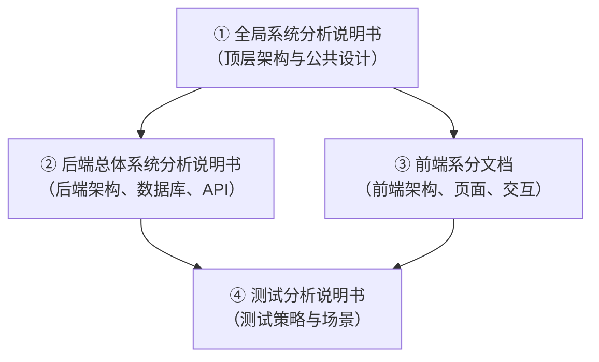
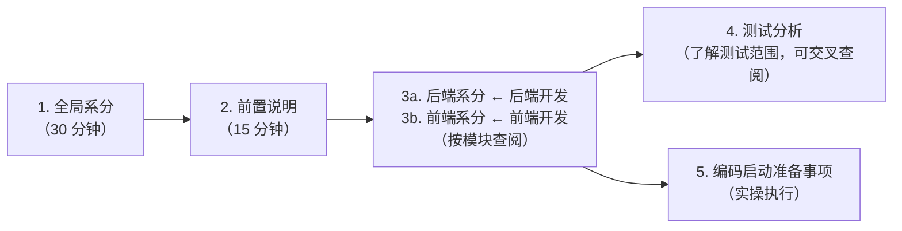

# HRMS 系统分析文档集说明
> 本文档介绍 HRMS 人资管理系统的四份核心系分文档，说明各自的定位、内容范围、读者对象和阅读顺序，方便团队快速上手。
>

---

## 一、文档全景
HRMS 系统分析阶段共输出 **4 份核心文档**，构成「全局统领 → 后端细化 → 前端细化 → 测试保障」的完整系分体系：

| 文档 | 定位 | 核心产出 |
| :--- | :--- | :--- |
| ① 全局系统分析说明书 | **顶层设计** | 模块划分、技术选型、架构图、公共技术设计、非功能性设计 |
| ② 后端总体系统分析说明书 | **后端执行蓝图** | 数据库 DDL、API 接口定义、模块间服务契约、中间件配置 |
| ③ 前端系分文档 | **前端执行蓝图** | 页面结构、组件树、路由设计、API 对接说明、权限菜单映射 |
| ④ 测试分析说明书 | **测试策略** | 测试维度、异常场景矩阵、审批链/薪资规则专项测试分析 |

---

## 二、各文档详细说明
### ① 全局系统分析说明书
**定位**：系统分析的纲领性文档，定义 HRMS 的整体架构和公共设计，是所有其他系分文档的上位指导。

**核心内容**：

+ 系统模块划分（M1~M9 共 9 个业务模块 + 系统底座）
+ 技术选型与架构图（单体 Spring Boot + React 前后端分离）
+ 公共技术设计（认证鉴权 JWT+RBAC、数据权限拦截器、全局异常处理、统一返回格式）
+ 非功能性设计（性能、安全、可用性、日志审计）
+ ADR（架构决策记录）附录

**适用读者**：全体开发人员、架构师、项目管理

---

### ② 后端总体系统分析说明书
**定位**：后端开发的执行蓝图，是团队中后端开发人员最常查阅的文档。

**核心内容**：

+ **M1~M9 每个模块**：功能说明 → 领域模型 → 数据库表设计（完整 DDL） → RESTful API 定义（请求/响应 JSON 示例）
+ 后端公共技术（认证流程、数据权限过滤 SQL、异常码 20000~50002 体系、定时任务、消息通知）
+ 附录 A：各模块导航索引表（快速定位）

**数据量**：约 30+ 张表 DDL、100+ API 接口定义

**适用读者**：后端开发人员（4 人分工依据此文档）

---

### ③ 前端系分文档
**定位**：前端开发的执行蓝图，定义 HRMS 的页面结构、交互逻辑和 API 对接方式。

**核心内容**：

+ 前端整体架构（Umi Max + Ant Design 5 + React 18）
+ **M1~M9 每个模块**：页面功能说明 → 页面布局 → 组件树 → 交互流程 → API 对接表
+ 前端路由设计、权限菜单树映射
+ 请求拦截器与错误处理（`code !== 20000` 判断）

**适用读者**：前端开发人员

---

### ④ 测试分析说明书
**定位**：测试策略文档，基于 PRD 和三份系分文档输出测试要点，是后续测试用例设计的输入依据。

**核心内容**：

+ 测试方法论（理解产品 → 识别范围 → 分析特点 → 细化场景 → 输出要点）
+ 9 个模块的测试维度与异常场景（正常流程、边界值、权限、并发、数据一致性等）
+ 审批链专项测试矩阵（3 步审批 + 3 个边界：多人审批、会签/或签、驳回/撤回）
+ 请假审批规则测试矩阵（5 种请假规则 + 6 个异常边界）
+ 薪资异常检测测试矩阵（5 种检测规则 + 6 个异常边界）
+ 非功能性测试要点（性能、安全、兼容性）

**适用读者**：测试人员、质量保障人员

---

## 三、配套辅助文档
除上述 4 份核心系分文档外，还有 2 份辅助文档配合使用：

| 文档 | 说明 |
| :--- | :--- |
| **前置说明.md** | 编码规范约束，统一实体命名、错误码体系、数据权限值等编码规范，各开发者编码前必读 |
| **编码启动前准备事项.md** | 编码前的实操清单，含建表脚本、种子数据、项目骨架搭建、配置文件等 5 项准备任务 |

---

## 四、推荐阅读顺序

> **建议**：团队先集体通读全局系分和前置说明，对齐架构认知和编码规范；后端/前端人员按分工阅读对应模块的后端/前端系分内容；测试人员以测试分析说明书为主线，交叉引用后端系分中的 API 定义。
>

---

## 五、版本说明
| 文档 | 当前版本 | 日期 |
| :--- | :---: | :---: |
| 全局系统分析说明书 | V1.0 | 2026-07-11 |
| 后端总体系统分析说明书 | V1.0 | 2026-07-11 |
| 前端系分文档 | v1.0 | 2026-07-10 |
| 测试分析说明书 | v1.0 | 2026-07-11 |

---

_本文档由系统分析员维护，随系分文档版本更新同步修订。_

